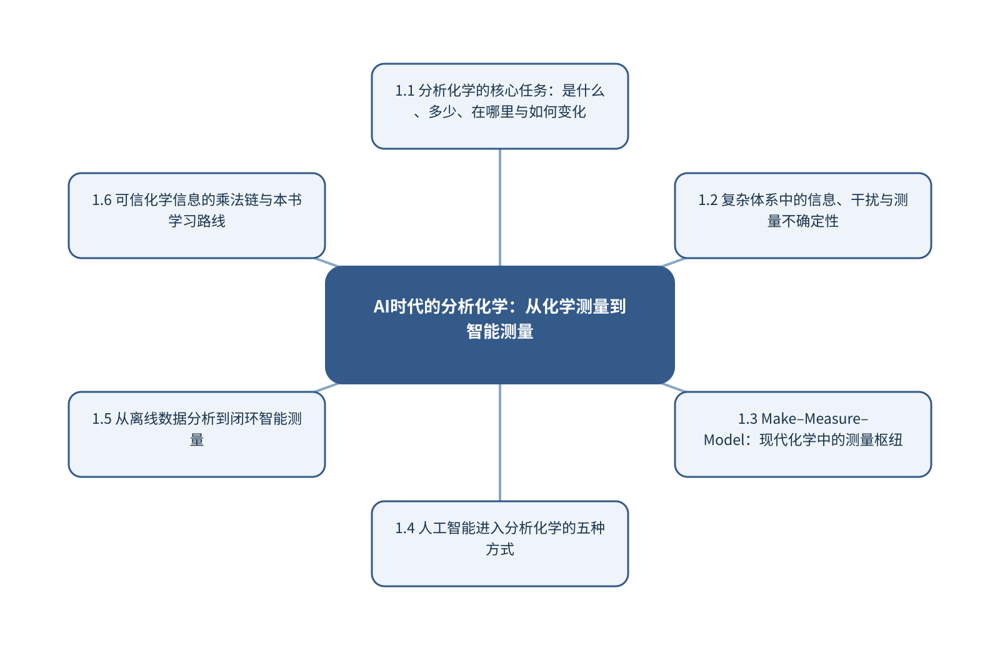

# 第1章 AI时代的分析化学：从化学测量到智能测量

> 第1篇 分析化学的新范式与测量基础

## 章首导引

人工智能究竟改变了分析化学的哪一部分，又有哪些问题仍必须由测量学回答？ 本章的回答是：以“样品—测量—信号—数据—模型—决策”闭环界定全书范围。全章以复杂样品的可信化学信息为对象，坚持“以测量链而不是算法名称界定问题”，并通过“将模糊的谱图识别需求改写为可验证任务”把概念、计算和分析决策连为一体。

## 学习目标

- 能够说明复杂样品的可信化学信息在本章中的数据结构与主要信息来源。
- 能够解释本章关键方法的输入、输出、参数、假设和失效条件。
- 能够以“以测量链而不是算法名称界定问题”设计训练、验证和独立测试。
- 能够完成“将模糊的谱图识别需求改写为可验证任务”的最小代码实验并分析失败样本。

## 本章知识图谱

## 1.1 分析化学的核心任务：是什么、多少、在哪里与如何变化

本节围绕“分析化学的核心任务：是什么、多少、在哪里与如何变化”展开。分析对象是复杂样品的可信化学信息，核心不是罗列名词，而是说明定性分析：物质身份与组成、定量分析：含量、浓度与总量、结构、空间、时间和机制信息、分析结论与实际决策怎样进入同一条测量与推断链。读者首先要辨认哪些量来自真实样品，哪些量由仪器转换得到，哪些量由算法估计；三类量若混在一起，模型精度就很难被解释。

在“分析化学的核心任务：是什么、多少、在哪里与如何变化”中，技术路线遵循“以测量链而不是算法名称界定问题”。具体计算从可诊断的经典基线开始，再增加本节所需的非线性、结构先验或不确定度组件。新增组件必须回答一个明确问题，并在相同数据边界下与基线比较；只有平均分提高而误差结构没有改善，不能构成采用复杂模型的充分理由。

本节把“将模糊的谱图识别需求改写为可验证任务”落实到分析结论与实际决策这一检查点。验证时保留与未来使用条件一致的独立对象，检查坐标轴、单位、样品身份、批次、参数来源和失败样本。由此得到的结论才可用于下一步测量或实验，而不是停留在一张看似分离良好的图上。

### 1.1.1 定性分析：物质身份与组成

就“定性分析：物质身份与组成”而言，定性分析：物质身份与组成的目标是判断样品中存在什么，而不是仅把信号分到一个已知类别。可靠识别至少需要选择性响应、参照物或谱库、相似干扰物以及库外样品；若候选集合不完整，最高匹配分只能表示‘在当前库中最相似’，不能等同于身份确认。

把“定性分析：物质身份与组成”用于“分析化学的核心任务：是什么、多少、在哪里与如何变化”时，定性流程应把检出、候选筛选和确证分开。检出阶段控制空白和假阳性，筛选阶段报告Top-k候选及分数差，确证阶段依靠保留信息、互补谱学或标准物质。模型还应设置拒识阈值，避免对训练分布之外的样品强行命名。若该步骤改变了样品单位、统计独立性或物理峰形，必须在独立数据上重新证明其有效性。

### 1.1.2 定量分析：含量、浓度与总量

就“定量分析：含量、浓度与总量”而言，定量分析：含量、浓度与总量要求把仪器响应连接到可溯源的量值。校准曲线不仅是一条拟合线，还隐含标准物质、基质、量程、样品前处理和响应稳定性；斜率反映灵敏度，截距与残差可暴露空白、背景和模型失配。

把“定量分析：含量、浓度与总量”用于“分析化学的核心任务：是什么、多少、在哪里与如何变化”时，定量结果至少同时检查偏差、精密度、线性或适用范围、检出限、定量限和回收率。多元模型同样要用独立样品验证，并报告浓度外推、基质变化和仪器漂移下的误差；小数位不能超过参照值和不确定度所支持的精度。读图或读指标时应返回原始数据抽查，避免把表示空间中的几何关系直接当成化学机制。

### 1.1.3 结构、空间、时间和机制信息

就“结构、空间、时间和机制信息”而言，结构、空间、时间和机制信息要求测量时间尺度快于被研究过程的关键变化。采样、传质、仪器响应和数据处理都可能造成时间延迟；若响应时间与反应时间相当，记录到的曲线是系统动力学与仪器核的卷积。

把“结构、空间、时间和机制信息”用于“分析化学的核心任务：是什么、多少、在哪里与如何变化”时，建模时应保存真实时间戳、同步误差和操作事件，避免把等间隔文件序号当作真实时间。对于在线控制，还要区分毫秒级设备反馈与分钟级科学决策，并用状态估计处理不可直接观察的化学状态。最终报告需要给出适用范围和拒绝条件，使方法在证据不足时能够停止输出。

### 1.1.4 分析结论与实际决策

就“分析结论与实际决策”而言，分析结论与实际决策把分析结果转成实际行动。阈值不是模型内部的固定常数，而应由漏检、误报、复检成本和样品基准发生率共同确定；同一预测概率在筛查与确证场景中可对应不同决策。

把“分析结论与实际决策”用于“分析化学的核心任务：是什么、多少、在哪里与如何变化”时，决策系统应允许三种输出：接受、拒绝和请求补充测量。每次行动保留输入版本、置信区间、适用域状态和人工复核点；若信息价值不足以抵消额外实验成本，系统也应能够停止。教学上应把该概念落实为可观察变量、可运行程序和可反驳检验三层。

## 1.2 复杂体系中的信息、干扰与测量不确定性

本节围绕“复杂体系中的信息、干扰与测量不确定性”展开。分析对象是复杂样品的可信化学信息，核心不是罗列名词，而是说明低丰度目标与高背景、多组分重叠与非特异响应、动态体系和非平衡过程、采样偏差与样品异质性怎样进入同一条测量与推断链。读者首先要辨认哪些量来自真实样品，哪些量由仪器转换得到，哪些量由算法估计；三类量若混在一起，模型精度就很难被解释。

在“复杂体系中的信息、干扰与测量不确定性”中，技术路线遵循“以测量链而不是算法名称界定问题”。具体计算从可诊断的经典基线开始，再增加本节所需的非线性、结构先验或不确定度组件。新增组件必须回答一个明确问题，并在相同数据边界下与基线比较；只有平均分提高而误差结构没有改善，不能构成采用复杂模型的充分理由。

本节把“将模糊的谱图识别需求改写为可验证任务”落实到准确度、精密度、选择性、灵敏度和稳健性这一检查点。验证时保留与未来使用条件一致的独立对象，检查坐标轴、单位、样品身份、批次、参数来源和失败样本。由此得到的结论才可用于下一步测量或实验，而不是停留在一张看似分离良好的图上。

### 1.2.1 低丰度目标与高背景

就“低丰度目标与高背景”而言，低丰度目标与高背景把分析难度集中到信号与背景的可分辨性。低丰度并不只意味着峰低，还可能伴随基质抑制、非特异吸附、暗电流和空白污染。提高积分时间只能降低部分随机噪声，不能消除随时间变化的系统背景。

把“低丰度目标与高背景”用于“复杂体系中的信息、干扰与测量不确定性”时，设计上应同时使用程序空白、基质空白、加标样和重复测量，区分检出、鉴别和准确定量三个层次。数字去噪若改变峰面积或制造窄峰，会改善视觉效果却破坏量值；因此必须用已知加入量或独立高灵敏方法核验。若该步骤改变了样品单位、统计独立性或物理峰形，必须在独立数据上重新证明其有效性。

### 1.2.2 多组分重叠与非特异响应

就“多组分重叠与非特异响应”而言，多组分重叠与非特异响应意味着一个观测变量可能同时响应多个化学组分。单波长或单峰规则在选择性不足时会产生不可辨识问题；多元分辨能够利用全谱协方差，但只有当校准样品覆盖实际组分组合和干扰范围时才可靠。

把“多组分重叠与非特异响应”用于“复杂体系中的信息、干扰与测量不确定性”时，应通过纯组分谱、混合设计、加标回收和残差结构检查模型是否真正分离了贡献。若目标与干扰在训练数据中始终同步变化，任何回归器都可能利用这种相关性，外部样品一旦打破关系便会失效。读图或读指标时应返回原始数据抽查，避免把表示空间中的几何关系直接当成化学机制。

### 1.2.3 动态体系和非平衡过程

就“动态体系和非平衡过程”而言，动态体系和非平衡过程要求测量时间尺度快于被研究过程的关键变化。采样、传质、仪器响应和数据处理都可能造成时间延迟；若响应时间与反应时间相当，记录到的曲线是系统动力学与仪器核的卷积。

把“动态体系和非平衡过程”用于“复杂体系中的信息、干扰与测量不确定性”时，建模时应保存真实时间戳、同步误差和操作事件，避免把等间隔文件序号当作真实时间。对于在线控制，还要区分毫秒级设备反馈与分钟级科学决策，并用状态估计处理不可直接观察的化学状态。最终报告需要给出适用范围和拒绝条件，使方法在证据不足时能够停止输出。

### 1.2.4 采样偏差与样品异质性

就“采样偏差与样品异质性”而言，围绕“采样偏差与样品异质性”，随机误差反映重复测量的波动，系统偏差使结果稳定地偏离参照，不确定度则量化在现有知识下结果可能处于的范围。三者属于不同概念。高重复性不代表无偏，模型测试误差很低也不代表参照标签准确。

把“采样偏差与样品异质性”用于“复杂体系中的信息、干扰与测量不确定性”时，在“复杂体系中的信息、干扰与测量不确定性”的语境下，不确定度应沿采样、制样、校准、仪器、预处理和模型逐步传播。对于线性关系可使用一阶误差传播，对于明显非线性或参数相关的系统可使用蒙特卡洛抽样。报告时应给出覆盖概率、区间构造方法和适用条件，而不是只给一个小数位很多的点估计。教学上应把该概念落实为可观察变量、可运行程序和可反驳检验三层。

### 1.2.5 准确度、精密度、选择性、灵敏度和稳健性

就“准确度、精密度、选择性、灵敏度和稳健性”而言，在“复杂体系中的信息、干扰与测量不确定性”中，准确度、精密度、选择性、灵敏度和稳健性具体限定了复杂样品的可信化学信息的一个技术接口。它必须被写成可检查的输入、变换和输出：输入保留样品与仪器条件，变换说明参数从何处估计，输出对应可观察量或候选判断；缺少任何一层，概念就无法进入实验和代码。

把“准确度、精密度、选择性、灵敏度和稳健性”用于“复杂体系中的信息、干扰与测量不确定性”时，本书用“将模糊的谱图识别需求改写为可验证任务”检验准确度、精密度、选择性、灵敏度和稳健性。实现时遵循“以测量链而不是算法名称界定问题”，先建立经典基线，再对参数敏感性、独立样品和失败对象进行检查。若结果只能在同批数据或单次划分中成立，应把它视为探索性现象而非稳定规律。在真实项目中，还应保存参数、软件版本和输入校验结果，以便定位变化来自样品还是计算。

## 1.3 Make–Measure–Model：现代化学中的测量枢纽

本节围绕“Make–Measure–Model：现代化学中的测量枢纽”展开。分析对象是复杂样品的可信化学信息，核心不是罗列名词，而是说明Make：合成、制备与候选空间、Measure：对象到观测的物理接口、Model：解释、预测与反演、测量连接实验世界和计算世界怎样进入同一条测量与推断链。读者首先要辨认哪些量来自真实样品，哪些量由仪器转换得到，哪些量由算法估计；三类量若混在一起，模型精度就很难被解释。

在“Make–Measure–Model：现代化学中的测量枢纽”中，技术路线遵循“以测量链而不是算法名称界定问题”。具体计算从可诊断的经典基线开始，再增加本节所需的非线性、结构先验或不确定度组件。新增组件必须回答一个明确问题，并在相同数据边界下与基线比较；只有平均分提高而误差结构没有改善，不能构成采用复杂模型的充分理由。

本节把“将模糊的谱图识别需求改写为可验证任务”落实到三者之间的反馈迭代这一检查点。验证时保留与未来使用条件一致的独立对象，检查坐标轴、单位、样品身份、批次、参数来源和失败样本。由此得到的结论才可用于下一步测量或实验，而不是停留在一张看似分离良好的图上。

### 1.3.1 Make：合成、制备与候选空间

就“Make：合成、制备与候选空间”而言，Make：合成、制备与候选空间属于从观测反推对象的逆问题，常存在多解性。同一峰可由多个结构片段贡献，同一空间热点也可能受厚度、照明或离子抑制影响；因此模型输出首先是候选解释，而不是自动成立的机制。

把“Make：合成、制备与候选空间”用于“Make–Measure–Model：现代化学中的测量枢纽”时，可信解释需要至少一条独立证据链：改变实验条件观察可预测响应、使用互补仪器验证候选，或以标准物质复现特征。显著性图、注意力和SHAP可定位模型依赖，却不能替代干预和机理实验。若该步骤改变了样品单位、统计独立性或物理峰形，必须在独立数据上重新证明其有效性。

### 1.3.2 Measure：对象到观测的物理接口

就“Measure：对象到观测的物理接口”而言，在“Make–Measure–Model：现代化学中的测量枢纽”中，Measure：对象到观测的物理接口具体限定了复杂样品的可信化学信息的一个技术接口。它必须被写成可检查的输入、变换和输出：输入保留样品与仪器条件，变换说明参数从何处估计，输出对应可观察量或候选判断；缺少任何一层，概念就无法进入实验和代码。

把“Measure：对象到观测的物理接口”用于“Make–Measure–Model：现代化学中的测量枢纽”时，本书用“将模糊的谱图识别需求改写为可验证任务”检验Measure：对象到观测的物理接口。实现时遵循“以测量链而不是算法名称界定问题”，先建立经典基线，再对参数敏感性、独立样品和失败对象进行检查。若结果只能在同批数据或单次划分中成立，应把它视为探索性现象而非稳定规律。读图或读指标时应返回原始数据抽查，避免把表示空间中的几何关系直接当成化学机制。

### 1.3.3 Model：解释、预测与反演

就“Model：解释、预测与反演”而言，在“Make–Measure–Model：现代化学中的测量枢纽”中，Model：解释、预测与反演具体限定了复杂样品的可信化学信息的一个技术接口。它必须被写成可检查的输入、变换和输出：输入保留样品与仪器条件，变换说明参数从何处估计，输出对应可观察量或候选判断；缺少任何一层，概念就无法进入实验和代码。

把“Model：解释、预测与反演”用于“Make–Measure–Model：现代化学中的测量枢纽”时，本书用“将模糊的谱图识别需求改写为可验证任务”检验Model：解释、预测与反演。实现时遵循“以测量链而不是算法名称界定问题”，先建立经典基线，再对参数敏感性、独立样品和失败对象进行检查。若结果只能在同批数据或单次划分中成立，应把它视为探索性现象而非稳定规律。最终报告需要给出适用范围和拒绝条件，使方法在证据不足时能够停止输出。

### 1.3.4 测量连接实验世界和计算世界

就“测量连接实验世界和计算世界”而言，在“Make–Measure–Model：现代化学中的测量枢纽”中，测量连接实验世界和计算世界具体限定了复杂样品的可信化学信息的一个技术接口。它必须被写成可检查的输入、变换和输出：输入保留样品与仪器条件，变换说明参数从何处估计，输出对应可观察量或候选判断；缺少任何一层，概念就无法进入实验和代码。

把“测量连接实验世界和计算世界”用于“Make–Measure–Model：现代化学中的测量枢纽”时，本书用“将模糊的谱图识别需求改写为可验证任务”检验测量连接实验世界和计算世界。实现时遵循“以测量链而不是算法名称界定问题”，先建立经典基线，再对参数敏感性、独立样品和失败对象进行检查。若结果只能在同批数据或单次划分中成立，应把它视为探索性现象而非稳定规律。教学上应把该概念落实为可观察变量、可运行程序和可反驳检验三层。

### 1.3.5 三者之间的反馈迭代

就“三者之间的反馈迭代”而言，在“Make–Measure–Model：现代化学中的测量枢纽”中，三者之间的反馈迭代具体限定了复杂样品的可信化学信息的一个技术接口。它必须被写成可检查的输入、变换和输出：输入保留样品与仪器条件，变换说明参数从何处估计，输出对应可观察量或候选判断；缺少任何一层，概念就无法进入实验和代码。

把“三者之间的反馈迭代”用于“Make–Measure–Model：现代化学中的测量枢纽”时，本书用“将模糊的谱图识别需求改写为可验证任务”检验三者之间的反馈迭代。实现时遵循“以测量链而不是算法名称界定问题”，先建立经典基线，再对参数敏感性、独立样品和失败对象进行检查。若结果只能在同批数据或单次划分中成立，应把它视为探索性现象而非稳定规律。在真实项目中，还应保存参数、软件版本和输入校验结果，以便定位变化来自样品还是计算。

## 1.4 人工智能进入分析化学的五种方式

本节围绕“人工智能进入分析化学的五种方式”展开。分析对象是复杂样品的可信化学信息，核心不是罗列名词，而是说明自动化实验与标准化数据生产、数据科学与信号信息提取、机器学习与数据驱动特征、大模型与任务编排怎样进入同一条测量与推断链。读者首先要辨认哪些量来自真实样品，哪些量由仪器转换得到，哪些量由算法估计；三类量若混在一起，模型精度就很难被解释。

在“人工智能进入分析化学的五种方式”中，技术路线遵循“以测量链而不是算法名称界定问题”。具体计算从可诊断的经典基线开始，再增加本节所需的非线性、结构先验或不确定度组件。新增组件必须回答一个明确问题，并在相同数据边界下与基线比较；只有平均分提高而误差结构没有改善，不能构成采用复杂模型的充分理由。

本节把“将模糊的谱图识别需求改写为可验证任务”落实到多模态融合与知识增强这一检查点。验证时保留与未来使用条件一致的独立对象，检查坐标轴、单位、样品身份、批次、参数来源和失败样本。由此得到的结论才可用于下一步测量或实验，而不是停留在一张看似分离良好的图上。

### 1.4.1 自动化实验与标准化数据生产

就“自动化实验与标准化数据生产”而言，围绕“自动化实验与标准化数据生产”，中心化和尺度变换改变变量在距离、协方差和损失函数中的权重。标准化适合量纲和方差差异显著的变量；SNV对每条光谱独立中心化并按其标准差缩放；MSC则用参照光谱估计加性和乘性散射。它们解决的问题不同，不能作为无条件的默认步骤。

把“自动化实验与标准化数据生产”用于“人工智能进入分析化学的五种方式”时，在“人工智能进入分析化学的五种方式”的语境下，所有缩放参数必须只在训练数据上估计，再应用到验证和测试数据。否则测试集均值、方差或参照谱会进入训练过程，造成信息泄漏。处理效果应同时检查模型误差、峰形变化和跨批次稳定性。若该步骤改变了样品单位、统计独立性或物理峰形，必须在独立数据上重新证明其有效性。

### 1.4.2 数据科学与信号信息提取

就“数据科学与信号信息提取”而言，数据科学与信号信息提取决定数字能否被重新解释。仅保存强度矩阵会丢失坐标轴、单位、采样间隔、样品身份、仪器参数和校准状态；这些信息一旦脱离原始信号，后续很难判断变化来自化学对象还是采集条件。

把“数据科学与信号信息提取”用于“人工智能进入分析化学的五种方式”时，推荐把原始文件设为只读，以持久样品标识连接实验表和信号文件，并为每次转换记录脚本版本、参数和校验码。单位转换、重采样与轴反向属于会改变数值含义的操作，必须在数据进入模型前自动检查。读图或读指标时应返回原始数据抽查，避免把表示空间中的几何关系直接当成化学机制。

### 1.4.3 机器学习与数据驱动特征

就“机器学习与数据驱动特征”而言，机器学习与数据驱动特征决定数字能否被重新解释。仅保存强度矩阵会丢失坐标轴、单位、采样间隔、样品身份、仪器参数和校准状态；这些信息一旦脱离原始信号，后续很难判断变化来自化学对象还是采集条件。

把“机器学习与数据驱动特征”用于“人工智能进入分析化学的五种方式”时，推荐把原始文件设为只读，以持久样品标识连接实验表和信号文件，并为每次转换记录脚本版本、参数和校验码。单位转换、重采样与轴反向属于会改变数值含义的操作，必须在数据进入模型前自动检查。最终报告需要给出适用范围和拒绝条件，使方法在证据不足时能够停止输出。

### 1.4.4 大模型与任务编排

就“大模型与任务编排”而言，大模型与任务编排适合处理跨文档、跨工具的任务分解，但语言生成概率不等于化学事实。标准方法和仪器说明书应通过检索提供来源，数值拟合交给确定性程序，谱库和分子操作交给专用工具，模型只负责组织步骤和解释返回状态。

把“大模型与任务编排”用于“人工智能进入分析化学的五种方式”时，一个可用工作流需要结构化参数、工具白名单、异常返回、关键数值复算和完整日志。输出应明确区分来源事实、计算结果、模型推断与待验证假设；涉及设备动作时还需权限、审批点和可恢复终止条件。教学上应把该概念落实为可观察变量、可运行程序和可反驳检验三层。

### 1.4.5 多模态融合与知识增强

就“多模态融合与知识增强”而言，围绕“多模态融合与知识增强”，多模态学习把结构、谱图、图像、文本和实验条件作为互补观测。早期融合在输入或浅层表示处拼接，要求严格对齐；晚期融合组合独立模型输出，更容易处理缺失模态；联合表示学习则直接优化跨模态对应关系。

把“多模态融合与知识增强”用于“人工智能进入分析化学的五种方式”时，在“人工智能进入分析化学的五种方式”的语境下，对比学习拉近匹配样本的表示并推远不匹配样本。负样本若包含实际相似或同一对象的不同观测，会向模型提供错误监督。评价除下游性能外，还应检查检索、缺失模态稳健性和批次独立性。在真实项目中，还应保存参数、软件版本和输入校验结果，以便定位变化来自样品还是计算。

## 1.5 从离线数据分析到闭环智能测量

本节围绕“从离线数据分析到闭环智能测量”展开。分析对象是复杂样品的可信化学信息，核心不是罗列名词，而是说明样品和测量策略选择、仪器参数与数据采集、信号处理和质量判断、模型推断与不确定度怎样进入同一条测量与推断链。读者首先要辨认哪些量来自真实样品，哪些量由仪器转换得到，哪些量由算法估计；三类量若混在一起，模型精度就很难被解释。

在“从离线数据分析到闭环智能测量”中，技术路线遵循“以测量链而不是算法名称界定问题”。具体计算从可诊断的经典基线开始，再增加本节所需的非线性、结构先验或不确定度组件。新增组件必须回答一个明确问题，并在相同数据边界下与基线比较；只有平均分提高而误差结构没有改善，不能构成采用复杂模型的充分理由。

本节把“将模糊的谱图识别需求改写为可验证任务”落实到化学解释和下一步决策这一检查点。验证时保留与未来使用条件一致的独立对象，检查坐标轴、单位、样品身份、批次、参数来源和失败样本。由此得到的结论才可用于下一步测量或实验，而不是停留在一张看似分离良好的图上。

### 1.5.1 样品和测量策略选择

就“样品和测量策略选择”而言，在“从离线数据分析到闭环智能测量”中，样品和测量策略选择具体限定了复杂样品的可信化学信息的一个技术接口。它必须被写成可检查的输入、变换和输出：输入保留样品与仪器条件，变换说明参数从何处估计，输出对应可观察量或候选判断；缺少任何一层，概念就无法进入实验和代码。

把“样品和测量策略选择”用于“从离线数据分析到闭环智能测量”时，本书用“将模糊的谱图识别需求改写为可验证任务”检验样品和测量策略选择。实现时遵循“以测量链而不是算法名称界定问题”，先建立经典基线，再对参数敏感性、独立样品和失败对象进行检查。若结果只能在同批数据或单次划分中成立，应把它视为探索性现象而非稳定规律。若该步骤改变了样品单位、统计独立性或物理峰形，必须在独立数据上重新证明其有效性。

### 1.5.2 仪器参数与数据采集

就“仪器参数与数据采集”而言，仪器参数与数据采集决定数字能否被重新解释。仅保存强度矩阵会丢失坐标轴、单位、采样间隔、样品身份、仪器参数和校准状态；这些信息一旦脱离原始信号，后续很难判断变化来自化学对象还是采集条件。

把“仪器参数与数据采集”用于“从离线数据分析到闭环智能测量”时，推荐把原始文件设为只读，以持久样品标识连接实验表和信号文件，并为每次转换记录脚本版本、参数和校验码。单位转换、重采样与轴反向属于会改变数值含义的操作，必须在数据进入模型前自动检查。读图或读指标时应返回原始数据抽查，避免把表示空间中的几何关系直接当成化学机制。

### 1.5.3 信号处理和质量判断

就“信号处理和质量判断”而言，在“从离线数据分析到闭环智能测量”中，信号处理和质量判断具体限定了复杂样品的可信化学信息的一个技术接口。它必须被写成可检查的输入、变换和输出：输入保留样品与仪器条件，变换说明参数从何处估计，输出对应可观察量或候选判断；缺少任何一层，概念就无法进入实验和代码。

把“信号处理和质量判断”用于“从离线数据分析到闭环智能测量”时，本书用“将模糊的谱图识别需求改写为可验证任务”检验信号处理和质量判断。实现时遵循“以测量链而不是算法名称界定问题”，先建立经典基线，再对参数敏感性、独立样品和失败对象进行检查。若结果只能在同批数据或单次划分中成立，应把它视为探索性现象而非稳定规律。最终报告需要给出适用范围和拒绝条件，使方法在证据不足时能够停止输出。

### 1.5.4 模型推断与不确定度

就“模型推断与不确定度”而言，围绕“模型推断与不确定度”，随机误差反映重复测量的波动，系统偏差使结果稳定地偏离参照，不确定度则量化在现有知识下结果可能处于的范围。三者属于不同概念。高重复性不代表无偏，模型测试误差很低也不代表参照标签准确。

把“模型推断与不确定度”用于“从离线数据分析到闭环智能测量”时，在“从离线数据分析到闭环智能测量”的语境下，不确定度应沿采样、制样、校准、仪器、预处理和模型逐步传播。对于线性关系可使用一阶误差传播，对于明显非线性或参数相关的系统可使用蒙特卡洛抽样。报告时应给出覆盖概率、区间构造方法和适用条件，而不是只给一个小数位很多的点估计。教学上应把该概念落实为可观察变量、可运行程序和可反驳检验三层。

### 1.5.5 化学解释和下一步决策

就“化学解释和下一步决策”而言，化学解释和下一步决策属于从观测反推对象的逆问题，常存在多解性。同一峰可由多个结构片段贡献，同一空间热点也可能受厚度、照明或离子抑制影响；因此模型输出首先是候选解释，而不是自动成立的机制。

把“化学解释和下一步决策”用于“从离线数据分析到闭环智能测量”时，可信解释需要至少一条独立证据链：改变实验条件观察可预测响应、使用互补仪器验证候选，或以标准物质复现特征。显著性图、注意力和SHAP可定位模型依赖，却不能替代干预和机理实验。在真实项目中，还应保存参数、软件版本和输入校验结果，以便定位变化来自样品还是计算。

## 1.6 可信化学信息的乘法链与本书学习路线

本节围绕“可信化学信息的乘法链与本书学习路线”展开。分析对象是复杂样品的可信化学信息，核心不是罗列名词，而是说明可信化学信息的乘法链、为什么不能只学算法、为什么不能只学仪器原理、问题驱动、案例驱动和代码实践怎样进入同一条测量与推断链。读者首先要辨认哪些量来自真实样品，哪些量由仪器转换得到，哪些量由算法估计；三类量若混在一起，模型精度就很难被解释。

在“可信化学信息的乘法链与本书学习路线”中，技术路线遵循“以测量链而不是算法名称界定问题”。具体计算从可诊断的经典基线开始，再增加本节所需的非线性、结构先验或不确定度组件。新增组件必须回答一个明确问题，并在相同数据边界下与基线比较；只有平均分提高而误差结构没有改善，不能构成采用复杂模型的充分理由。

本节把“将模糊的谱图识别需求改写为可验证任务”落实到全书五篇结构及能力递进这一检查点。验证时保留与未来使用条件一致的独立对象，检查坐标轴、单位、样品身份、批次、参数来源和失败样本。由此得到的结论才可用于下一步测量或实验，而不是停留在一张看似分离良好的图上。

### 1.6.1 可信化学信息的乘法链

就“可信化学信息的乘法链”而言，在“可信化学信息的乘法链与本书学习路线”中，可信化学信息的乘法链具体限定了复杂样品的可信化学信息的一个技术接口。它必须被写成可检查的输入、变换和输出：输入保留样品与仪器条件，变换说明参数从何处估计，输出对应可观察量或候选判断；缺少任何一层，概念就无法进入实验和代码。

把“可信化学信息的乘法链”用于“可信化学信息的乘法链与本书学习路线”时，本书用“将模糊的谱图识别需求改写为可验证任务”检验可信化学信息的乘法链。实现时遵循“以测量链而不是算法名称界定问题”，先建立经典基线，再对参数敏感性、独立样品和失败对象进行检查。若结果只能在同批数据或单次划分中成立，应把它视为探索性现象而非稳定规律。若该步骤改变了样品单位、统计独立性或物理峰形，必须在独立数据上重新证明其有效性。

### 1.6.2 为什么不能只学算法

就“为什么不能只学算法”而言，在“可信化学信息的乘法链与本书学习路线”中，为什么不能只学算法具体限定了复杂样品的可信化学信息的一个技术接口。它必须被写成可检查的输入、变换和输出：输入保留样品与仪器条件，变换说明参数从何处估计，输出对应可观察量或候选判断；缺少任何一层，概念就无法进入实验和代码。

把“为什么不能只学算法”用于“可信化学信息的乘法链与本书学习路线”时，本书用“将模糊的谱图识别需求改写为可验证任务”检验为什么不能只学算法。实现时遵循“以测量链而不是算法名称界定问题”，先建立经典基线，再对参数敏感性、独立样品和失败对象进行检查。若结果只能在同批数据或单次划分中成立，应把它视为探索性现象而非稳定规律。读图或读指标时应返回原始数据抽查，避免把表示空间中的几何关系直接当成化学机制。

### 1.6.3 为什么不能只学仪器原理

就“为什么不能只学仪器原理”而言，在“可信化学信息的乘法链与本书学习路线”中，为什么不能只学仪器原理具体限定了复杂样品的可信化学信息的一个技术接口。它必须被写成可检查的输入、变换和输出：输入保留样品与仪器条件，变换说明参数从何处估计，输出对应可观察量或候选判断；缺少任何一层，概念就无法进入实验和代码。

把“为什么不能只学仪器原理”用于“可信化学信息的乘法链与本书学习路线”时，本书用“将模糊的谱图识别需求改写为可验证任务”检验为什么不能只学仪器原理。实现时遵循“以测量链而不是算法名称界定问题”，先建立经典基线，再对参数敏感性、独立样品和失败对象进行检查。若结果只能在同批数据或单次划分中成立，应把它视为探索性现象而非稳定规律。最终报告需要给出适用范围和拒绝条件，使方法在证据不足时能够停止输出。

### 1.6.4 问题驱动、案例驱动和代码实践

就“问题驱动、案例驱动和代码实践”而言，在“可信化学信息的乘法链与本书学习路线”中，问题驱动、案例驱动和代码实践具体限定了复杂样品的可信化学信息的一个技术接口。它必须被写成可检查的输入、变换和输出：输入保留样品与仪器条件，变换说明参数从何处估计，输出对应可观察量或候选判断；缺少任何一层，概念就无法进入实验和代码。

把“问题驱动、案例驱动和代码实践”用于“可信化学信息的乘法链与本书学习路线”时，本书用“将模糊的谱图识别需求改写为可验证任务”检验问题驱动、案例驱动和代码实践。实现时遵循“以测量链而不是算法名称界定问题”，先建立经典基线，再对参数敏感性、独立样品和失败对象进行检查。若结果只能在同批数据或单次划分中成立，应把它视为探索性现象而非稳定规律。教学上应把该概念落实为可观察变量、可运行程序和可反驳检验三层。

### 1.6.5 全书五篇结构及能力递进

就“全书五篇结构及能力递进”而言，全书五篇结构及能力递进属于从观测反推对象的逆问题，常存在多解性。同一峰可由多个结构片段贡献，同一空间热点也可能受厚度、照明或离子抑制影响；因此模型输出首先是候选解释，而不是自动成立的机制。

把“全书五篇结构及能力递进”用于“可信化学信息的乘法链与本书学习路线”时，可信解释需要至少一条独立证据链：改变实验条件观察可预测响应、使用互补仪器验证候选，或以标准物质复现特征。显著性图、注意力和SHAP可定位模型依赖，却不能替代干预和机理实验。在真实项目中，还应保存参数、软件版本和输入校验结果，以便定位变化来自样品还是计算。

## 关键关系与计算抓手

- `y=f(x,z;θ)+ε`

- `可信信息≈代表性×稳定测量×信号质量×合理模型×适用域`

## 本章综合案例

本章案例：将模糊的谱图识别需求改写为可验证任务。先明确样品单位、测量协议和数据结构，建立最简单且可诊断的基线；再加入本章核心方法，并在同一独立测试边界下比较。结果至少按批次、信号强弱和适用域分层，给出错误对象而非只报告总体平均数。

完成案例时，应提交问题卡、数据字典、运行日志、关键图表、失败样本清单和可运行程序。任何由模型提出的解释都要能被互补测量或后续实验检验。

## 代码实践

- 任务：将一个模糊的‘AI识别谱图’需求改写为机器可读的问题卡和测量链。
- 代码：[chapter_exercise.py](../code/ch01.py)

## 本章小结

本章以复杂样品的可信化学信息为对象，把“AI时代的分析化学：从化学测量到智能测量”组织为测量、表示、推断和行动的连续过程。复习时应能解释数据如何生成、方法为何适用、性能如何验证，以及证据不足时何时拒绝输出。

## 思考题与计算题

1. 为“将模糊的谱图识别需求改写为可验证任务”画出样品—仪器—数据—模型—结论链，并标出三处可能失真位置。
2. 从本章选择一个方法，写出输入、输出、关键参数、基本假设和至少两个失效条件。
3. 建立一个经典基线，并说明复杂模型必须在哪些独立指标上超过它。
4. 把随机划分改为符合未来使用条件的分组或外推划分，比较结果并解释差异。
5. 完成配套代码，增加一个单元测试和一个失败样本可视化。
6. 设计一个能够区分“模型学到化学信息”和“模型学到批次捷径”的对照实验。

## 下载本章资源

<a href="./downloads/word/ch01.docx" download>Word出版稿</a>　·　<a href="./code/ch01.py" download>Python代码</a>　·　<a href="./assets/graphs/ch01.svg" download>SVG知识图谱</a>

## 年度课程资源、传承题与更新引文

本章的稳定教材内容与逐年更新的教学资源分开维护。维护组须在年度归档中同步补入课件链接、可传承的题目和有来源链接的前沿引文。

- [本学年课程 PPT（PDF）](#/resources/annual/2026-2027/ppt/README?id=ch01)
- [留给下一届的本章传承题](#/resources/annual/2026-2027/questions/README?id=ch01)

### 本章首批可点击引文

- Butler, K. T. *et al.* [Machine learning for molecular and materials science](https://doi.org/10.1038/s41586-018-0337-2). *Nature* **559**, 547–555 (2018).
- [查看本章 2026–2027 学年完整引文与后续更新](#/resources/annual/2026-2027/references/README?id=ch01)

---

## 本章共建记录与致谢

| 学年 | 贡献者 | 工作内容 | 关联PR |
|---|---|---|---|
| 待本学年维护组补充 | — | — | — |
