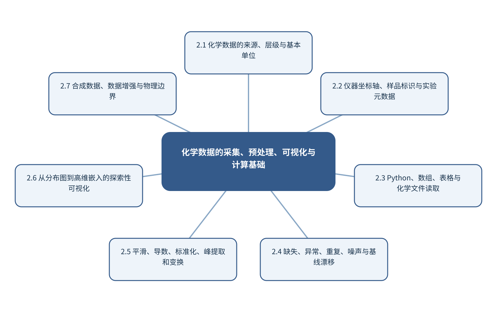

# 第2章 化学数据的采集、预处理、可视化与计算基础

> 第1篇 分析化学的新范式与测量基础　·　建议出版篇幅：24页

## 章首导引

怎样把仪器文件变成不丢失化学语境、可供模型使用的数据对象？ 本章的回答是：承接课程的数据与Python内容，强调数据结构、处理边界和可复算流水线。全章以带有坐标轴、单位和批次结构的化学数据为对象，坚持“保持原始数据只读并把预处理放入训练流水线”，并通过“建立一套可复算的拉曼光谱清洗与可视化流程”把概念、计算和分析决策连为一体。

## 学习目标

- 能够说明带有坐标轴、单位和批次结构的化学数据在本章中的数据结构与主要信息来源。
- 能够解释本章关键方法的输入、输出、参数、假设和失效条件。
- 能够以“保持原始数据只读并把预处理放入训练流水线”设计训练、验证和独立测试。
- 能够完成“建立一套可复算的拉曼光谱清洗与可视化流程”的最小代码实验并分析失败样本。

## 本章知识图谱

## 2.1 化学数据的来源、层级与基本单位

本节围绕“化学数据的来源、层级与基本单位”展开。分析对象是带有坐标轴、单位和批次结构的化学数据，核心不是罗列名词，而是说明光谱、质谱、色谱和电化学信号、图像、光谱立方体与时序数据、实验条件、样品和批次记录、分子结构、文本和模拟数据怎样进入同一条测量与推断链。读者首先要辨认哪些量来自真实样品，哪些量由仪器转换得到，哪些量由算法估计；三类量若混在一起，模型精度就很难被解释。

在“化学数据的来源、层级与基本单位”中，技术路线遵循“保持原始数据只读并把预处理放入训练流水线”。具体计算从可诊断的经典基线开始，再增加本节所需的非线性、结构先验或不确定度组件。新增组件必须回答一个明确问题，并在相同数据边界下与基线比较；只有平均分提高而误差结构没有改善，不能构成采用复杂模型的充分理由。

本节把“建立一套可复算的拉曼光谱清洗与可视化流程”落实到多模态数据的对象对齐这一检查点。验证时保留与未来使用条件一致的独立对象，检查坐标轴、单位、样品身份、批次、参数来源和失败样本。由此得到的结论才可用于下一步测量或实验，而不是停留在一张看似分离良好的图上。

### 2.1.1 光谱、质谱、色谱和电化学信号

就“光谱、质谱、色谱和电化学信号”而言，在“化学数据的来源、层级与基本单位”中，光谱、质谱、色谱和电化学信号具体限定了带有坐标轴、单位和批次结构的化学数据的一个技术接口。它必须被写成可检查的输入、变换和输出：输入保留样品与仪器条件，变换说明参数从何处估计，输出对应可观察量或候选判断；缺少任何一层，概念就无法进入实验和代码。

把“光谱、质谱、色谱和电化学信号”用于“化学数据的来源、层级与基本单位”时，本书用“建立一套可复算的拉曼光谱清洗与可视化流程”检验光谱、质谱、色谱和电化学信号。实现时遵循“保持原始数据只读并把预处理放入训练流水线”，先建立经典基线，再对参数敏感性、独立样品和失败对象进行检查。若结果只能在同批数据或单次划分中成立，应把它视为探索性现象而非稳定规律。读图或读指标时应返回原始数据抽查，避免把表示空间中的几何关系直接当成化学机制。

### 2.1.2 图像、光谱立方体与时序数据

就“图像、光谱立方体与时序数据”而言，围绕“图像、光谱立方体与时序数据”，分子图以原子为节点、化学键为空间关系。消息传递网络在每一层聚合邻居信息并更新节点表示，多层传播扩大感受野。全局池化把节点表示汇总为分子级向量。

把“图像、光谱立方体与时序数据”用于“化学数据的来源、层级与基本单位”时，在“化学数据的来源、层级与基本单位”的语境下，二维图不能完整表达构象和空间相互作用。使用距离、角度或等变网络可以处理三维几何；SE(3)等变性要求模型输出随旋转和平移按物理规律变化。构象生成、温度和质子化态仍是输入不确定性的来源。最终报告需要给出适用范围和拒绝条件，使方法在证据不足时能够停止输出。

### 2.1.3 实验条件、样品和批次记录

就“实验条件、样品和批次记录”而言，实验条件、样品和批次记录决定数字能否被重新解释。仅保存强度矩阵会丢失坐标轴、单位、采样间隔、样品身份、仪器参数和校准状态；这些信息一旦脱离原始信号，后续很难判断变化来自化学对象还是采集条件。

把“实验条件、样品和批次记录”用于“化学数据的来源、层级与基本单位”时，推荐把原始文件设为只读，以持久样品标识连接实验表和信号文件，并为每次转换记录脚本版本、参数和校验码。单位转换、重采样与轴反向属于会改变数值含义的操作，必须在数据进入模型前自动检查。教学上应把该概念落实为可观察变量、可运行程序和可反驳检验三层。

### 2.1.4 分子结构、文本和模拟数据

就“分子结构、文本和模拟数据”而言，分子结构、文本和模拟数据属于从观测反推对象的逆问题，常存在多解性。同一峰可由多个结构片段贡献，同一空间热点也可能受厚度、照明或离子抑制影响；因此模型输出首先是候选解释，而不是自动成立的机制。

把“分子结构、文本和模拟数据”用于“化学数据的来源、层级与基本单位”时，可信解释需要至少一条独立证据链：改变实验条件观察可预测响应、使用互补仪器验证候选，或以标准物质复现特征。显著性图、注意力和SHAP可定位模型依赖，却不能替代干预和机理实验。在真实项目中，还应保存参数、软件版本和输入校验结果，以便定位变化来自样品还是计算。

### 2.1.5 多模态数据的对象对齐

就“多模态数据的对象对齐”而言，围绕“多模态数据的对象对齐”，多模态学习把结构、谱图、图像、文本和实验条件作为互补观测。早期融合在输入或浅层表示处拼接，要求严格对齐；晚期融合组合独立模型输出，更容易处理缺失模态；联合表示学习则直接优化跨模态对应关系。

把“多模态数据的对象对齐”用于“化学数据的来源、层级与基本单位”时，在“化学数据的来源、层级与基本单位”的语境下，对比学习拉近匹配样本的表示并推远不匹配样本。负样本若包含实际相似或同一对象的不同观测，会向模型提供错误监督。评价除下游性能外，还应检查检索、缺失模态稳健性和批次独立性。若该步骤改变了样品单位、统计独立性或物理峰形，必须在独立数据上重新证明其有效性。

## 2.2 仪器坐标轴、样品标识与实验元数据

本节围绕“仪器坐标轴、样品标识与实验元数据”展开。分析对象是带有坐标轴、单位和批次结构的化学数据，核心不是罗列名词，而是说明坐标轴、单位与采样间隔、样品、重复和批次标识、仪器型号、参数和校准状态、操作者、环境与时间信息怎样进入同一条测量与推断链。读者首先要辨认哪些量来自真实样品，哪些量由仪器转换得到，哪些量由算法估计；三类量若混在一起，模型精度就很难被解释。

在“仪器坐标轴、样品标识与实验元数据”中，技术路线遵循“保持原始数据只读并把预处理放入训练流水线”。具体计算从可诊断的经典基线开始，再增加本节所需的非线性、结构先验或不确定度组件。新增组件必须回答一个明确问题，并在相同数据边界下与基线比较；只有平均分提高而误差结构没有改善，不能构成采用复杂模型的充分理由。

本节把“建立一套可复算的拉曼光谱清洗与可视化流程”落实到原始数据只读与版本标识这一检查点。验证时保留与未来使用条件一致的独立对象，检查坐标轴、单位、样品身份、批次、参数来源和失败样本。由此得到的结论才可用于下一步测量或实验，而不是停留在一张看似分离良好的图上。

### 2.2.1 坐标轴、单位与采样间隔

就“坐标轴、单位与采样间隔”而言，坐标轴、单位与采样间隔决定数据能否代表待回答的总体。分析试份通常只占原始对象极小比例，空间异质、颗粒尺寸、相分布和批次结构会使制样误差大于仪器重复误差；增加同一试份的重复扫描不能弥补缺乏独立取样。

把“坐标轴、单位与采样间隔”用于“仪器坐标轴、样品标识与实验元数据”时，应先定义总体、初级采样单元、实验样品和分析试份，再配置分层或随机取样、混匀和独立重复。训练/测试划分也必须以真正独立的样品单位为边界，否则模型会因伪重复获得虚高性能。读图或读指标时应返回原始数据抽查，避免把表示空间中的几何关系直接当成化学机制。

### 2.2.2 样品、重复和批次标识

就“样品、重复和批次标识”而言，样品、重复和批次标识决定数字能否被重新解释。仅保存强度矩阵会丢失坐标轴、单位、采样间隔、样品身份、仪器参数和校准状态；这些信息一旦脱离原始信号，后续很难判断变化来自化学对象还是采集条件。

把“样品、重复和批次标识”用于“仪器坐标轴、样品标识与实验元数据”时，推荐把原始文件设为只读，以持久样品标识连接实验表和信号文件，并为每次转换记录脚本版本、参数和校验码。单位转换、重采样与轴反向属于会改变数值含义的操作，必须在数据进入模型前自动检查。最终报告需要给出适用范围和拒绝条件，使方法在证据不足时能够停止输出。

### 2.2.3 仪器型号、参数和校准状态

就“仪器型号、参数和校准状态”而言，围绕“仪器型号、参数和校准状态”，精确率关注预测为阳性的样品中有多少真正阳性，召回率关注真正阳性中有多少被检出，F1是二者的调和平均。类别极不平衡时，PR曲线比ROC曲线更能反映少数类识别的实际难度。

把“仪器型号、参数和校准状态”用于“仪器坐标轴、样品标识与实验元数据”时，在“仪器坐标轴、样品标识与实验元数据”的语境下，概率校准回答预测概率是否与实际发生率一致。Brier分数同时受到判别和校准影响；可靠性图可显示模型过度自信或过度保守。阈值应根据漏检和误报代价确定，而不是固定在0.5。教学上应把该概念落实为可观察变量、可运行程序和可反驳检验三层。

### 2.2.4 操作者、环境与时间信息

就“操作者、环境与时间信息”而言，操作者、环境与时间信息要求测量时间尺度快于被研究过程的关键变化。采样、传质、仪器响应和数据处理都可能造成时间延迟；若响应时间与反应时间相当，记录到的曲线是系统动力学与仪器核的卷积。

把“操作者、环境与时间信息”用于“仪器坐标轴、样品标识与实验元数据”时，建模时应保存真实时间戳、同步误差和操作事件，避免把等间隔文件序号当作真实时间。对于在线控制，还要区分毫秒级设备反馈与分钟级科学决策，并用状态估计处理不可直接观察的化学状态。在真实项目中，还应保存参数、软件版本和输入校验结果，以便定位变化来自样品还是计算。

### 2.2.5 原始数据只读与版本标识

就“原始数据只读与版本标识”而言，原始数据只读与版本标识决定数字能否被重新解释。仅保存强度矩阵会丢失坐标轴、单位、采样间隔、样品身份、仪器参数和校准状态；这些信息一旦脱离原始信号，后续很难判断变化来自化学对象还是采集条件。

把“原始数据只读与版本标识”用于“仪器坐标轴、样品标识与实验元数据”时，推荐把原始文件设为只读，以持久样品标识连接实验表和信号文件，并为每次转换记录脚本版本、参数和校验码。单位转换、重采样与轴反向属于会改变数值含义的操作，必须在数据进入模型前自动检查。若该步骤改变了样品单位、统计独立性或物理峰形，必须在独立数据上重新证明其有效性。

## 2.3 Python、数组、表格与化学文件读取

本节围绕“Python、数组、表格与化学文件读取”展开。分析对象是带有坐标轴、单位和批次结构的化学数据，核心不是罗列名词，而是说明Python环境、解释器和包管理、NumPy数组及轴的含义、Pandas表格与元数据连接、Matplotlib/Seaborn基础绘图怎样进入同一条测量与推断链。读者首先要辨认哪些量来自真实样品，哪些量由仪器转换得到，哪些量由算法估计；三类量若混在一起，模型精度就很难被解释。

在“Python、数组、表格与化学文件读取”中，技术路线遵循“保持原始数据只读并把预处理放入训练流水线”。具体计算从可诊断的经典基线开始，再增加本节所需的非线性、结构先验或不确定度组件。新增组件必须回答一个明确问题，并在相同数据边界下与基线比较；只有平均分提高而误差结构没有改善，不能构成采用复杂模型的充分理由。

本节把“建立一套可复算的拉曼光谱清洗与可视化流程”落实到Jupyter与脚本化流程的分工这一检查点。验证时保留与未来使用条件一致的独立对象，检查坐标轴、单位、样品身份、批次、参数来源和失败样本。由此得到的结论才可用于下一步测量或实验，而不是停留在一张看似分离良好的图上。

### 2.3.1 Python环境、解释器和包管理

就“Python环境、解释器和包管理”而言，在“Python、数组、表格与化学文件读取”中，Python环境、解释器和包管理具体限定了带有坐标轴、单位和批次结构的化学数据的一个技术接口。它必须被写成可检查的输入、变换和输出：输入保留样品与仪器条件，变换说明参数从何处估计，输出对应可观察量或候选判断；缺少任何一层，概念就无法进入实验和代码。

把“Python环境、解释器和包管理”用于“Python、数组、表格与化学文件读取”时，本书用“建立一套可复算的拉曼光谱清洗与可视化流程”检验Python环境、解释器和包管理。实现时遵循“保持原始数据只读并把预处理放入训练流水线”，先建立经典基线，再对参数敏感性、独立样品和失败对象进行检查。若结果只能在同批数据或单次划分中成立，应把它视为探索性现象而非稳定规律。读图或读指标时应返回原始数据抽查，避免把表示空间中的几何关系直接当成化学机制。

### 2.3.2 NumPy数组及轴的含义

就“NumPy数组及轴的含义”而言，在“Python、数组、表格与化学文件读取”中，NumPy数组及轴的含义具体限定了带有坐标轴、单位和批次结构的化学数据的一个技术接口。它必须被写成可检查的输入、变换和输出：输入保留样品与仪器条件，变换说明参数从何处估计，输出对应可观察量或候选判断；缺少任何一层，概念就无法进入实验和代码。

把“NumPy数组及轴的含义”用于“Python、数组、表格与化学文件读取”时，本书用“建立一套可复算的拉曼光谱清洗与可视化流程”检验NumPy数组及轴的含义。实现时遵循“保持原始数据只读并把预处理放入训练流水线”，先建立经典基线，再对参数敏感性、独立样品和失败对象进行检查。若结果只能在同批数据或单次划分中成立，应把它视为探索性现象而非稳定规律。最终报告需要给出适用范围和拒绝条件，使方法在证据不足时能够停止输出。

### 2.3.3 Pandas表格与元数据连接

就“Pandas表格与元数据连接”而言，Pandas表格与元数据连接决定数字能否被重新解释。仅保存强度矩阵会丢失坐标轴、单位、采样间隔、样品身份、仪器参数和校准状态；这些信息一旦脱离原始信号，后续很难判断变化来自化学对象还是采集条件。

把“Pandas表格与元数据连接”用于“Python、数组、表格与化学文件读取”时，推荐把原始文件设为只读，以持久样品标识连接实验表和信号文件，并为每次转换记录脚本版本、参数和校验码。单位转换、重采样与轴反向属于会改变数值含义的操作，必须在数据进入模型前自动检查。教学上应把该概念落实为可观察变量、可运行程序和可反驳检验三层。

### 2.3.4 Matplotlib/Seaborn基础绘图

就“Matplotlib/Seaborn基础绘图”而言，围绕“Matplotlib/Seaborn基础绘图”，分子图以原子为节点、化学键为空间关系。消息传递网络在每一层聚合邻居信息并更新节点表示，多层传播扩大感受野。全局池化把节点表示汇总为分子级向量。

把“Matplotlib/Seaborn基础绘图”用于“Python、数组、表格与化学文件读取”时，在“Python、数组、表格与化学文件读取”的语境下，二维图不能完整表达构象和空间相互作用。使用距离、角度或等变网络可以处理三维几何；SE(3)等变性要求模型输出随旋转和平移按物理规律变化。构象生成、温度和质子化态仍是输入不确定性的来源。在真实项目中，还应保存参数、软件版本和输入校验结果，以便定位变化来自样品还是计算。

### 2.3.5 常见化学文件读取与转换

就“常见化学文件读取与转换”而言，在“Python、数组、表格与化学文件读取”中，常见化学文件读取与转换具体限定了带有坐标轴、单位和批次结构的化学数据的一个技术接口。它必须被写成可检查的输入、变换和输出：输入保留样品与仪器条件，变换说明参数从何处估计，输出对应可观察量或候选判断；缺少任何一层，概念就无法进入实验和代码。

把“常见化学文件读取与转换”用于“Python、数组、表格与化学文件读取”时，本书用“建立一套可复算的拉曼光谱清洗与可视化流程”检验常见化学文件读取与转换。实现时遵循“保持原始数据只读并把预处理放入训练流水线”，先建立经典基线，再对参数敏感性、独立样品和失败对象进行检查。若结果只能在同批数据或单次划分中成立，应把它视为探索性现象而非稳定规律。若该步骤改变了样品单位、统计独立性或物理峰形，必须在独立数据上重新证明其有效性。

### 2.3.6 Jupyter与脚本化流程的分工

就“Jupyter与脚本化流程的分工”而言，在“Python、数组、表格与化学文件读取”中，Jupyter与脚本化流程的分工具体限定了带有坐标轴、单位和批次结构的化学数据的一个技术接口。它必须被写成可检查的输入、变换和输出：输入保留样品与仪器条件，变换说明参数从何处估计，输出对应可观察量或候选判断；缺少任何一层，概念就无法进入实验和代码。

把“Jupyter与脚本化流程的分工”用于“Python、数组、表格与化学文件读取”时，本书用“建立一套可复算的拉曼光谱清洗与可视化流程”检验Jupyter与脚本化流程的分工。实现时遵循“保持原始数据只读并把预处理放入训练流水线”，先建立经典基线，再对参数敏感性、独立样品和失败对象进行检查。若结果只能在同批数据或单次划分中成立，应把它视为探索性现象而非稳定规律。读图或读指标时应返回原始数据抽查，避免把表示空间中的几何关系直接当成化学机制。

## 2.4 缺失、异常、重复、噪声与基线漂移

本节围绕“缺失、异常、重复、噪声与基线漂移”展开。分析对象是带有坐标轴、单位和批次结构的化学数据，核心不是罗列名词，而是说明缺失值的类型与处理、重复记录和伪重复、离群值、异常信号与真实稀有样品、噪声、尖峰和饱和怎样进入同一条测量与推断链。读者首先要辨认哪些量来自真实样品，哪些量由仪器转换得到，哪些量由算法估计；三类量若混在一起，模型精度就很难被解释。

在“缺失、异常、重复、噪声与基线漂移”中，技术路线遵循“保持原始数据只读并把预处理放入训练流水线”。具体计算从可诊断的经典基线开始，再增加本节所需的非线性、结构先验或不确定度组件。新增组件必须回答一个明确问题，并在相同数据边界下与基线比较；只有平均分提高而误差结构没有改善，不能构成采用复杂模型的充分理由。

本节把“建立一套可复算的拉曼光谱清洗与可视化流程”落实到基线漂移、仪器背景和批次漂移这一检查点。验证时保留与未来使用条件一致的独立对象，检查坐标轴、单位、样品身份、批次、参数来源和失败样本。由此得到的结论才可用于下一步测量或实验，而不是停留在一张看似分离良好的图上。

### 2.4.1 缺失值的类型与处理

就“缺失值的类型与处理”而言，在“缺失、异常、重复、噪声与基线漂移”中，缺失值的类型与处理具体限定了带有坐标轴、单位和批次结构的化学数据的一个技术接口。它必须被写成可检查的输入、变换和输出：输入保留样品与仪器条件，变换说明参数从何处估计，输出对应可观察量或候选判断；缺少任何一层，概念就无法进入实验和代码。

把“缺失值的类型与处理”用于“缺失、异常、重复、噪声与基线漂移”时，本书用“建立一套可复算的拉曼光谱清洗与可视化流程”检验缺失值的类型与处理。实现时遵循“保持原始数据只读并把预处理放入训练流水线”，先建立经典基线，再对参数敏感性、独立样品和失败对象进行检查。若结果只能在同批数据或单次划分中成立，应把它视为探索性现象而非稳定规律。读图或读指标时应返回原始数据抽查，避免把表示空间中的几何关系直接当成化学机制。

### 2.4.2 重复记录和伪重复

就“重复记录和伪重复”而言，重复记录和伪重复决定数字能否被重新解释。仅保存强度矩阵会丢失坐标轴、单位、采样间隔、样品身份、仪器参数和校准状态；这些信息一旦脱离原始信号，后续很难判断变化来自化学对象还是采集条件。

把“重复记录和伪重复”用于“缺失、异常、重复、噪声与基线漂移”时，推荐把原始文件设为只读，以持久样品标识连接实验表和信号文件，并为每次转换记录脚本版本、参数和校验码。单位转换、重采样与轴反向属于会改变数值含义的操作，必须在数据进入模型前自动检查。最终报告需要给出适用范围和拒绝条件，使方法在证据不足时能够停止输出。

### 2.4.3 离群值、异常信号与真实稀有样品

就“离群值、异常信号与真实稀有样品”而言，在“缺失、异常、重复、噪声与基线漂移”中，离群值、异常信号与真实稀有样品具体限定了带有坐标轴、单位和批次结构的化学数据的一个技术接口。它必须被写成可检查的输入、变换和输出：输入保留样品与仪器条件，变换说明参数从何处估计，输出对应可观察量或候选判断；缺少任何一层，概念就无法进入实验和代码。

把“离群值、异常信号与真实稀有样品”用于“缺失、异常、重复、噪声与基线漂移”时，本书用“建立一套可复算的拉曼光谱清洗与可视化流程”检验离群值、异常信号与真实稀有样品。实现时遵循“保持原始数据只读并把预处理放入训练流水线”，先建立经典基线，再对参数敏感性、独立样品和失败对象进行检查。若结果只能在同批数据或单次划分中成立，应把它视为探索性现象而非稳定规律。教学上应把该概念落实为可观察变量、可运行程序和可反驳检验三层。

### 2.4.4 噪声、尖峰和饱和

就“噪声、尖峰和饱和”而言，在“缺失、异常、重复、噪声与基线漂移”中，噪声、尖峰和饱和具体限定了带有坐标轴、单位和批次结构的化学数据的一个技术接口。它必须被写成可检查的输入、变换和输出：输入保留样品与仪器条件，变换说明参数从何处估计，输出对应可观察量或候选判断；缺少任何一层，概念就无法进入实验和代码。

把“噪声、尖峰和饱和”用于“缺失、异常、重复、噪声与基线漂移”时，本书用“建立一套可复算的拉曼光谱清洗与可视化流程”检验噪声、尖峰和饱和。实现时遵循“保持原始数据只读并把预处理放入训练流水线”，先建立经典基线，再对参数敏感性、独立样品和失败对象进行检查。若结果只能在同批数据或单次划分中成立，应把它视为探索性现象而非稳定规律。在真实项目中，还应保存参数、软件版本和输入校验结果，以便定位变化来自样品还是计算。

### 2.4.5 基线漂移、仪器背景和批次漂移

就“基线漂移、仪器背景和批次漂移”而言，围绕“基线漂移、仪器背景和批次漂移”，Savitzky-Golay方法在滑动窗口内拟合低阶多项式，可同时实现平滑和导数估计。窗口过短会保留噪声，过长会压低窄峰；多项式阶数过高则增加振荡。参数应根据仪器分辨率、最窄有效峰宽和下游任务共同确定。

把“基线漂移、仪器背景和批次漂移”用于“缺失、异常、重复、噪声与基线漂移”时，在“缺失、异常、重复、噪声与基线漂移”的语境下，基线校正实质上是在区分慢变化背景与分析信号。多项式、非对称最小二乘和形态学方法对应不同的背景假设。校正后不仅要看曲线是否平直，还要比较峰位、峰宽、峰面积、空白残差和定量偏差。若该步骤改变了样品单位、统计独立性或物理峰形，必须在独立数据上重新证明其有效性。

## 2.5 平滑、导数、标准化、峰提取和变换

本节围绕“平滑、导数、标准化、峰提取和变换”展开。分析对象是带有坐标轴、单位和批次结构的化学数据，核心不是罗列名词，而是说明归一化、中心化和标准化、平滑、滤波与Savitzky–Golay方法、一阶/二阶导数和小波变换、基线估计与背景扣除怎样进入同一条测量与推断链。读者首先要辨认哪些量来自真实样品，哪些量由仪器转换得到，哪些量由算法估计；三类量若混在一起，模型精度就很难被解释。

在“平滑、导数、标准化、峰提取和变换”中，技术路线遵循“保持原始数据只读并把预处理放入训练流水线”。具体计算从可诊断的经典基线开始，再增加本节所需的非线性、结构先验或不确定度组件。新增组件必须回答一个明确问题，并在相同数据边界下与基线比较；只有平均分提高而误差结构没有改善，不能构成采用复杂模型的充分理由。

本节把“建立一套可复算的拉曼光谱清洗与可视化流程”落实到预处理参数的训练—测试边界这一检查点。验证时保留与未来使用条件一致的独立对象，检查坐标轴、单位、样品身份、批次、参数来源和失败样本。由此得到的结论才可用于下一步测量或实验，而不是停留在一张看似分离良好的图上。

### 2.5.1 归一化、中心化和标准化

就“归一化、中心化和标准化”而言，围绕“归一化、中心化和标准化”，中心化和尺度变换改变变量在距离、协方差和损失函数中的权重。标准化适合量纲和方差差异显著的变量；SNV对每条光谱独立中心化并按其标准差缩放；MSC则用参照光谱估计加性和乘性散射。它们解决的问题不同，不能作为无条件的默认步骤。

把“归一化、中心化和标准化”用于“平滑、导数、标准化、峰提取和变换”时，在“平滑、导数、标准化、峰提取和变换”的语境下，所有缩放参数必须只在训练数据上估计，再应用到验证和测试数据。否则测试集均值、方差或参照谱会进入训练过程，造成信息泄漏。处理效果应同时检查模型误差、峰形变化和跨批次稳定性。读图或读指标时应返回原始数据抽查，避免把表示空间中的几何关系直接当成化学机制。

### 2.5.2 平滑、滤波与Savitzky–Golay方法

就“平滑、滤波与Savitzky–Golay方法”而言，围绕“平滑、滤波与Savitzky–Golay方法”，Savitzky-Golay方法在滑动窗口内拟合低阶多项式，可同时实现平滑和导数估计。窗口过短会保留噪声，过长会压低窄峰；多项式阶数过高则增加振荡。参数应根据仪器分辨率、最窄有效峰宽和下游任务共同确定。

把“平滑、滤波与Savitzky–Golay方法”用于“平滑、导数、标准化、峰提取和变换”时，在“平滑、导数、标准化、峰提取和变换”的语境下，基线校正实质上是在区分慢变化背景与分析信号。多项式、非对称最小二乘和形态学方法对应不同的背景假设。校正后不仅要看曲线是否平直，还要比较峰位、峰宽、峰面积、空白残差和定量偏差。最终报告需要给出适用范围和拒绝条件，使方法在证据不足时能够停止输出。

### 2.5.3 一阶/二阶导数和小波变换

就“一阶/二阶导数和小波变换”而言，围绕“一阶/二阶导数和小波变换”，Savitzky-Golay方法在滑动窗口内拟合低阶多项式，可同时实现平滑和导数估计。窗口过短会保留噪声，过长会压低窄峰；多项式阶数过高则增加振荡。参数应根据仪器分辨率、最窄有效峰宽和下游任务共同确定。

把“一阶/二阶导数和小波变换”用于“平滑、导数、标准化、峰提取和变换”时，在“平滑、导数、标准化、峰提取和变换”的语境下，基线校正实质上是在区分慢变化背景与分析信号。多项式、非对称最小二乘和形态学方法对应不同的背景假设。校正后不仅要看曲线是否平直，还要比较峰位、峰宽、峰面积、空白残差和定量偏差。教学上应把该概念落实为可观察变量、可运行程序和可反驳检验三层。

### 2.5.4 基线估计与背景扣除

就“基线估计与背景扣除”而言，围绕“基线估计与背景扣除”，Savitzky-Golay方法在滑动窗口内拟合低阶多项式，可同时实现平滑和导数估计。窗口过短会保留噪声，过长会压低窄峰；多项式阶数过高则增加振荡。参数应根据仪器分辨率、最窄有效峰宽和下游任务共同确定。

把“基线估计与背景扣除”用于“平滑、导数、标准化、峰提取和变换”时，在“平滑、导数、标准化、峰提取和变换”的语境下，基线校正实质上是在区分慢变化背景与分析信号。多项式、非对称最小二乘和形态学方法对应不同的背景假设。校正后不仅要看曲线是否平直，还要比较峰位、峰宽、峰面积、空白残差和定量偏差。在真实项目中，还应保存参数、软件版本和输入校验结果，以便定位变化来自样品还是计算。

### 2.5.5 峰检测、峰位、峰宽和峰面积

就“峰检测、峰位、峰宽和峰面积”而言，在“平滑、导数、标准化、峰提取和变换”中，峰检测、峰位、峰宽和峰面积具体限定了带有坐标轴、单位和批次结构的化学数据的一个技术接口。它必须被写成可检查的输入、变换和输出：输入保留样品与仪器条件，变换说明参数从何处估计，输出对应可观察量或候选判断；缺少任何一层，概念就无法进入实验和代码。

把“峰检测、峰位、峰宽和峰面积”用于“平滑、导数、标准化、峰提取和变换”时，本书用“建立一套可复算的拉曼光谱清洗与可视化流程”检验峰检测、峰位、峰宽和峰面积。实现时遵循“保持原始数据只读并把预处理放入训练流水线”，先建立经典基线，再对参数敏感性、独立样品和失败对象进行检查。若结果只能在同批数据或单次划分中成立，应把它视为探索性现象而非稳定规律。若该步骤改变了样品单位、统计独立性或物理峰形，必须在独立数据上重新证明其有效性。

### 2.5.6 预处理参数的训练—测试边界

就“预处理参数的训练—测试边界”而言，在“平滑、导数、标准化、峰提取和变换”中，预处理参数的训练—测试边界具体限定了带有坐标轴、单位和批次结构的化学数据的一个技术接口。它必须被写成可检查的输入、变换和输出：输入保留样品与仪器条件，变换说明参数从何处估计，输出对应可观察量或候选判断；缺少任何一层，概念就无法进入实验和代码。

把“预处理参数的训练—测试边界”用于“平滑、导数、标准化、峰提取和变换”时，本书用“建立一套可复算的拉曼光谱清洗与可视化流程”检验预处理参数的训练—测试边界。实现时遵循“保持原始数据只读并把预处理放入训练流水线”，先建立经典基线，再对参数敏感性、独立样品和失败对象进行检查。若结果只能在同批数据或单次划分中成立，应把它视为探索性现象而非稳定规律。读图或读指标时应返回原始数据抽查，避免把表示空间中的几何关系直接当成化学机制。

## 2.6 从分布图到高维嵌入的探索性可视化

本节围绕“从分布图到高维嵌入的探索性可视化”展开。分析对象是带有坐标轴、单位和批次结构的化学数据，核心不是罗列名词，而是说明分布图、箱线图和小提琴图、谱图叠加、热图和二维谱、变量相关性与共线性、PCA得分/载荷的联合阅读怎样进入同一条测量与推断链。读者首先要辨认哪些量来自真实样品，哪些量由仪器转换得到，哪些量由算法估计；三类量若混在一起，模型精度就很难被解释。

在“从分布图到高维嵌入的探索性可视化”中，技术路线遵循“保持原始数据只读并把预处理放入训练流水线”。具体计算从可诊断的经典基线开始，再增加本节所需的非线性、结构先验或不确定度组件。新增组件必须回答一个明确问题，并在相同数据边界下与基线比较；只有平均分提高而误差结构没有改善，不能构成采用复杂模型的充分理由。

本节把“建立一套可复算的拉曼光谱清洗与可视化流程”落实到错误样本与残差可视化这一检查点。验证时保留与未来使用条件一致的独立对象，检查坐标轴、单位、样品身份、批次、参数来源和失败样本。由此得到的结论才可用于下一步测量或实验，而不是停留在一张看似分离良好的图上。

### 2.6.1 分布图、箱线图和小提琴图

就“分布图、箱线图和小提琴图”而言，围绕“分布图、箱线图和小提琴图”，分子图以原子为节点、化学键为空间关系。消息传递网络在每一层聚合邻居信息并更新节点表示，多层传播扩大感受野。全局池化把节点表示汇总为分子级向量。

把“分布图、箱线图和小提琴图”用于“从分布图到高维嵌入的探索性可视化”时，在“从分布图到高维嵌入的探索性可视化”的语境下，二维图不能完整表达构象和空间相互作用。使用距离、角度或等变网络可以处理三维几何；SE(3)等变性要求模型输出随旋转和平移按物理规律变化。构象生成、温度和质子化态仍是输入不确定性的来源。读图或读指标时应返回原始数据抽查，避免把表示空间中的几何关系直接当成化学机制。

### 2.6.2 谱图叠加、热图和二维谱

就“谱图叠加、热图和二维谱”而言，围绕“谱图叠加、热图和二维谱”，分子图以原子为节点、化学键为空间关系。消息传递网络在每一层聚合邻居信息并更新节点表示，多层传播扩大感受野。全局池化把节点表示汇总为分子级向量。

把“谱图叠加、热图和二维谱”用于“从分布图到高维嵌入的探索性可视化”时，在“从分布图到高维嵌入的探索性可视化”的语境下，二维图不能完整表达构象和空间相互作用。使用距离、角度或等变网络可以处理三维几何；SE(3)等变性要求模型输出随旋转和平移按物理规律变化。构象生成、温度和质子化态仍是输入不确定性的来源。最终报告需要给出适用范围和拒绝条件，使方法在证据不足时能够停止输出。

### 2.6.3 变量相关性与共线性

就“变量相关性与共线性”而言，在“从分布图到高维嵌入的探索性可视化”中，变量相关性与共线性具体限定了带有坐标轴、单位和批次结构的化学数据的一个技术接口。它必须被写成可检查的输入、变换和输出：输入保留样品与仪器条件，变换说明参数从何处估计，输出对应可观察量或候选判断；缺少任何一层，概念就无法进入实验和代码。

把“变量相关性与共线性”用于“从分布图到高维嵌入的探索性可视化”时，本书用“建立一套可复算的拉曼光谱清洗与可视化流程”检验变量相关性与共线性。实现时遵循“保持原始数据只读并把预处理放入训练流水线”，先建立经典基线，再对参数敏感性、独立样品和失败对象进行检查。若结果只能在同批数据或单次划分中成立，应把它视为探索性现象而非稳定规律。教学上应把该概念落实为可观察变量、可运行程序和可反驳检验三层。

### 2.6.4 PCA得分/载荷的联合阅读

就“PCA得分/载荷的联合阅读”而言，围绕“PCA得分/载荷的联合阅读”，奇异值分解将中心化矩阵写为X=UΣVᵀ。右奇异向量给出变量空间的正交方向，奇异值刻画每个方向承载的变化，UΣ形成样品得分。PCA可视为保留最大方差方向的低秩近似，但最大方差不一定等于与目标最相关的化学变化。

把“PCA得分/载荷的联合阅读”用于“从分布图到高维嵌入的探索性可视化”时，在“从分布图到高维嵌入的探索性可视化”的语境下，解释PCA必须同时阅读得分、载荷和残差。得分显示样品在潜变量空间的位置，载荷提示变量对方向的贡献，Q残差反映模型未解释的结构。任何聚类或分离都应回到原始谱图、批次和样品信息验证。在真实项目中，还应保存参数、软件版本和输入校验结果，以便定位变化来自样品还是计算。

### 2.6.5 t-SNE与UMAP的用途和误读

就“t-SNE与UMAP的用途和误读”而言，在“从分布图到高维嵌入的探索性可视化”中，t-SNE与UMAP的用途和误读具体限定了带有坐标轴、单位和批次结构的化学数据的一个技术接口。它必须被写成可检查的输入、变换和输出：输入保留样品与仪器条件，变换说明参数从何处估计，输出对应可观察量或候选判断；缺少任何一层，概念就无法进入实验和代码。

把“t-SNE与UMAP的用途和误读”用于“从分布图到高维嵌入的探索性可视化”时，本书用“建立一套可复算的拉曼光谱清洗与可视化流程”检验t-SNE与UMAP的用途和误读。实现时遵循“保持原始数据只读并把预处理放入训练流水线”，先建立经典基线，再对参数敏感性、独立样品和失败对象进行检查。若结果只能在同批数据或单次划分中成立，应把它视为探索性现象而非稳定规律。若该步骤改变了样品单位、统计独立性或物理峰形，必须在独立数据上重新证明其有效性。

### 2.6.6 错误样本与残差可视化

就“错误样本与残差可视化”而言，在“从分布图到高维嵌入的探索性可视化”中，错误样本与残差可视化具体限定了带有坐标轴、单位和批次结构的化学数据的一个技术接口。它必须被写成可检查的输入、变换和输出：输入保留样品与仪器条件，变换说明参数从何处估计，输出对应可观察量或候选判断；缺少任何一层，概念就无法进入实验和代码。

把“错误样本与残差可视化”用于“从分布图到高维嵌入的探索性可视化”时，本书用“建立一套可复算的拉曼光谱清洗与可视化流程”检验错误样本与残差可视化。实现时遵循“保持原始数据只读并把预处理放入训练流水线”，先建立经典基线，再对参数敏感性、独立样品和失败对象进行检查。若结果只能在同批数据或单次划分中成立，应把它视为探索性现象而非稳定规律。读图或读指标时应返回原始数据抽查，避免把表示空间中的几何关系直接当成化学机制。

## 2.7 合成数据、数据增强与物理边界

本节围绕“合成数据、数据增强与物理边界”展开。分析对象是带有坐标轴、单位和批次结构的化学数据，核心不是罗列名词，而是说明合成数据用于维度与接口测试、噪声、漂移和缺失的模拟、光谱增强的峰形约束、图像增强的空间约束怎样进入同一条测量与推断链。读者首先要辨认哪些量来自真实样品，哪些量由仪器转换得到，哪些量由算法估计；三类量若混在一起，模型精度就很难被解释。

在“合成数据、数据增强与物理边界”中，技术路线遵循“保持原始数据只读并把预处理放入训练流水线”。具体计算从可诊断的经典基线开始，再增加本节所需的非线性、结构先验或不确定度组件。新增组件必须回答一个明确问题，并在相同数据边界下与基线比较；只有平均分提高而误差结构没有改善，不能构成采用复杂模型的充分理由。

本节把“建立一套可复算的拉曼光谱清洗与可视化流程”落实到数据增强与真实独立样品的区别这一检查点。验证时保留与未来使用条件一致的独立对象，检查坐标轴、单位、样品身份、批次、参数来源和失败样本。由此得到的结论才可用于下一步测量或实验，而不是停留在一张看似分离良好的图上。

### 2.7.1 合成数据用于维度与接口测试

就“合成数据用于维度与接口测试”而言，合成数据用于维度与接口测试决定数字能否被重新解释。仅保存强度矩阵会丢失坐标轴、单位、采样间隔、样品身份、仪器参数和校准状态；这些信息一旦脱离原始信号，后续很难判断变化来自化学对象还是采集条件。

把“合成数据用于维度与接口测试”用于“合成数据、数据增强与物理边界”时，推荐把原始文件设为只读，以持久样品标识连接实验表和信号文件，并为每次转换记录脚本版本、参数和校验码。单位转换、重采样与轴反向属于会改变数值含义的操作，必须在数据进入模型前自动检查。读图或读指标时应返回原始数据抽查，避免把表示空间中的几何关系直接当成化学机制。

### 2.7.2 噪声、漂移和缺失的模拟

就“噪声、漂移和缺失的模拟”而言，在“合成数据、数据增强与物理边界”中，噪声、漂移和缺失的模拟具体限定了带有坐标轴、单位和批次结构的化学数据的一个技术接口。它必须被写成可检查的输入、变换和输出：输入保留样品与仪器条件，变换说明参数从何处估计，输出对应可观察量或候选判断；缺少任何一层，概念就无法进入实验和代码。

把“噪声、漂移和缺失的模拟”用于“合成数据、数据增强与物理边界”时，本书用“建立一套可复算的拉曼光谱清洗与可视化流程”检验噪声、漂移和缺失的模拟。实现时遵循“保持原始数据只读并把预处理放入训练流水线”，先建立经典基线，再对参数敏感性、独立样品和失败对象进行检查。若结果只能在同批数据或单次划分中成立，应把它视为探索性现象而非稳定规律。最终报告需要给出适用范围和拒绝条件，使方法在证据不足时能够停止输出。

### 2.7.3 光谱增强的峰形约束

就“光谱增强的峰形约束”而言，在“合成数据、数据增强与物理边界”中，光谱增强的峰形约束具体限定了带有坐标轴、单位和批次结构的化学数据的一个技术接口。它必须被写成可检查的输入、变换和输出：输入保留样品与仪器条件，变换说明参数从何处估计，输出对应可观察量或候选判断；缺少任何一层，概念就无法进入实验和代码。

把“光谱增强的峰形约束”用于“合成数据、数据增强与物理边界”时，本书用“建立一套可复算的拉曼光谱清洗与可视化流程”检验光谱增强的峰形约束。实现时遵循“保持原始数据只读并把预处理放入训练流水线”，先建立经典基线，再对参数敏感性、独立样品和失败对象进行检查。若结果只能在同批数据或单次划分中成立，应把它视为探索性现象而非稳定规律。教学上应把该概念落实为可观察变量、可运行程序和可反驳检验三层。

### 2.7.4 图像增强的空间约束

就“图像增强的空间约束”而言，围绕“图像增强的空间约束”，分子图以原子为节点、化学键为空间关系。消息传递网络在每一层聚合邻居信息并更新节点表示，多层传播扩大感受野。全局池化把节点表示汇总为分子级向量。

把“图像增强的空间约束”用于“合成数据、数据增强与物理边界”时，在“合成数据、数据增强与物理边界”的语境下，二维图不能完整表达构象和空间相互作用。使用距离、角度或等变网络可以处理三维几何；SE(3)等变性要求模型输出随旋转和平移按物理规律变化。构象生成、温度和质子化态仍是输入不确定性的来源。在真实项目中，还应保存参数、软件版本和输入校验结果，以便定位变化来自样品还是计算。

### 2.7.5 数据增强与真实独立样品的区别

就“数据增强与真实独立样品的区别”而言，数据增强与真实独立样品的区别决定数字能否被重新解释。仅保存强度矩阵会丢失坐标轴、单位、采样间隔、样品身份、仪器参数和校准状态；这些信息一旦脱离原始信号，后续很难判断变化来自化学对象还是采集条件。

把“数据增强与真实独立样品的区别”用于“合成数据、数据增强与物理边界”时，推荐把原始文件设为只读，以持久样品标识连接实验表和信号文件，并为每次转换记录脚本版本、参数和校验码。单位转换、重采样与轴反向属于会改变数值含义的操作，必须在数据进入模型前自动检查。若该步骤改变了样品单位、统计独立性或物理峰形，必须在独立数据上重新证明其有效性。

## 关键关系与计算抓手

- `z=(x−μ)/σ`

- `SNR=μ_signal/σ_noise`

## 本章综合案例

本章案例：建立一套可复算的拉曼光谱清洗与可视化流程。先明确样品单位、测量协议和数据结构，建立最简单且可诊断的基线；再加入本章核心方法，并在同一独立测试边界下比较。结果至少按批次、信号强弱和适用域分层，给出错误对象而非只报告总体平均数。

完成案例时，应提交问题卡、数据字典、运行日志、关键图表、失败样本清单和可运行程序。任何由模型提出的解释都要能被互补测量或后续实验检验。

## 代码实践

- 任务：建立带fit/transform边界的光谱预处理流水线并比较处理前后峰形。
- 代码：[chapter_exercise.py](../code/ch02.py)

## 本章小结

本章以带有坐标轴、单位和批次结构的化学数据为对象，把“化学数据的采集、预处理、可视化与计算基础”组织为测量、表示、推断和行动的连续过程。复习时应能解释数据如何生成、方法为何适用、性能如何验证，以及证据不足时何时拒绝输出。

## 思考题与计算题

1. 为“建立一套可复算的拉曼光谱清洗与可视化流程”画出样品—仪器—数据—模型—结论链，并标出三处可能失真位置。
2. 从本章选择一个方法，写出输入、输出、关键参数、基本假设和至少两个失效条件。
3. 建立一个经典基线，并说明复杂模型必须在哪些独立指标上超过它。
4. 把随机划分改为符合未来使用条件的分组或外推划分，比较结果并解释差异。
5. 完成配套代码，增加一个单元测试和一个失败样本可视化。
6. 设计一个能够区分“模型学到化学信息”和“模型学到批次捷径”的对照实验。

## 下载本章资源

<a href="./downloads/word/ch02.docx" download>Word出版稿</a>　·　<a href="./code/ch02.py" download>Python代码</a>　·　<a href="./assets/graphs/ch02.svg" download>SVG知识图谱</a>
