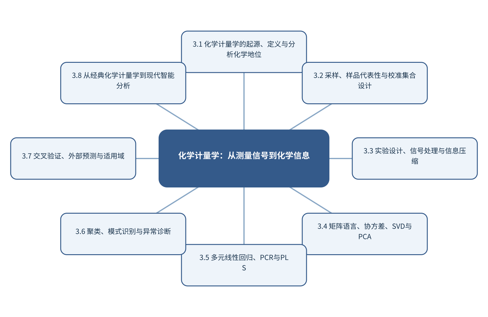

# 第3章 化学计量学：从测量信号到化学信息

> 第1篇 分析化学的新范式与测量基础　·　建议出版篇幅：32页

## 章首导引

怎样用数学、统计和计算设计测量，并从多变量信号中提取最大可信信息？ 本章的回答是：作为全书理论骨架，连接传统多元分析与现代机器学习。全章以样品—变量矩阵及参照值为对象，坚持“先用潜变量模型分解变化、残差和适用域”，并通过“比较MLR、PCR和PLS的外部定量性能”把概念、计算和分析决策连为一体。

## 学习目标

- 能够说明样品—变量矩阵及参照值在本章中的数据结构与主要信息来源。
- 能够解释本章关键方法的输入、输出、参数、假设和失效条件。
- 能够以“先用潜变量模型分解变化、残差和适用域”设计训练、验证和独立测试。
- 能够完成“比较MLR、PCR和PLS的外部定量性能”的最小代码实验并分析失败样本。

## 本章知识图谱

## 3.1 化学计量学的起源、定义与分析化学地位

本节围绕“化学计量学的起源、定义与分析化学地位”展开。分析对象是样品—变量矩阵及参照值，核心不是罗列名词，而是说明化学计量学的产生背景、数学、统计与计算机的交汇、最佳测量程序与最大信息、与传统分析化学和机器学习的关系怎样进入同一条测量与推断链。读者首先要辨认哪些量来自真实样品，哪些量由仪器转换得到，哪些量由算法估计；三类量若混在一起，模型精度就很难被解释。

在“化学计量学的起源、定义与分析化学地位”中，技术路线遵循“先用潜变量模型分解变化、残差和适用域”。具体计算从可诊断的经典基线开始，再增加本节所需的非线性、结构先验或不确定度组件。新增组件必须回答一个明确问题，并在相同数据边界下与基线比较；只有平均分提高而误差结构没有改善，不能构成采用复杂模型的充分理由。

本节把“比较MLR、PCR和PLS的外部定量性能”落实到与传统分析化学和机器学习的关系这一检查点。验证时保留与未来使用条件一致的独立对象，检查坐标轴、单位、样品身份、批次、参数来源和失败样本。由此得到的结论才可用于下一步测量或实验，而不是停留在一张看似分离良好的图上。

### 3.1.1 化学计量学的产生背景

就“化学计量学的产生背景”而言，在“化学计量学的起源、定义与分析化学地位”中，化学计量学的产生背景具体限定了样品—变量矩阵及参照值的一个技术接口。它必须被写成可检查的输入、变换和输出：输入保留样品与仪器条件，变换说明参数从何处估计，输出对应可观察量或候选判断；缺少任何一层，概念就无法进入实验和代码。

把“化学计量学的产生背景”用于“化学计量学的起源、定义与分析化学地位”时，本书用“比较MLR、PCR和PLS的外部定量性能”检验化学计量学的产生背景。实现时遵循“先用潜变量模型分解变化、残差和适用域”，先建立经典基线，再对参数敏感性、独立样品和失败对象进行检查。若结果只能在同批数据或单次划分中成立，应把它视为探索性现象而非稳定规律。最终报告需要给出适用范围和拒绝条件，使方法在证据不足时能够停止输出。

### 3.1.2 数学、统计与计算机的交汇

就“数学、统计与计算机的交汇”而言，在“化学计量学的起源、定义与分析化学地位”中，数学、统计与计算机的交汇具体限定了样品—变量矩阵及参照值的一个技术接口。它必须被写成可检查的输入、变换和输出：输入保留样品与仪器条件，变换说明参数从何处估计，输出对应可观察量或候选判断；缺少任何一层，概念就无法进入实验和代码。

把“数学、统计与计算机的交汇”用于“化学计量学的起源、定义与分析化学地位”时，本书用“比较MLR、PCR和PLS的外部定量性能”检验数学、统计与计算机的交汇。实现时遵循“先用潜变量模型分解变化、残差和适用域”，先建立经典基线，再对参数敏感性、独立样品和失败对象进行检查。若结果只能在同批数据或单次划分中成立，应把它视为探索性现象而非稳定规律。教学上应把该概念落实为可观察变量、可运行程序和可反驳检验三层。

### 3.1.3 最佳测量程序与最大信息

就“最佳测量程序与最大信息”而言，在“化学计量学的起源、定义与分析化学地位”中，最佳测量程序与最大信息具体限定了样品—变量矩阵及参照值的一个技术接口。它必须被写成可检查的输入、变换和输出：输入保留样品与仪器条件，变换说明参数从何处估计，输出对应可观察量或候选判断；缺少任何一层，概念就无法进入实验和代码。

把“最佳测量程序与最大信息”用于“化学计量学的起源、定义与分析化学地位”时，本书用“比较MLR、PCR和PLS的外部定量性能”检验最佳测量程序与最大信息。实现时遵循“先用潜变量模型分解变化、残差和适用域”，先建立经典基线，再对参数敏感性、独立样品和失败对象进行检查。若结果只能在同批数据或单次划分中成立，应把它视为探索性现象而非稳定规律。在真实项目中，还应保存参数、软件版本和输入校验结果，以便定位变化来自样品还是计算。

### 3.1.4 与传统分析化学和机器学习的关系

就“与传统分析化学和机器学习的关系”而言，在“化学计量学的起源、定义与分析化学地位”中，与传统分析化学和机器学习的关系具体限定了样品—变量矩阵及参照值的一个技术接口。它必须被写成可检查的输入、变换和输出：输入保留样品与仪器条件，变换说明参数从何处估计，输出对应可观察量或候选判断；缺少任何一层，概念就无法进入实验和代码。

把“与传统分析化学和机器学习的关系”用于“化学计量学的起源、定义与分析化学地位”时，本书用“比较MLR、PCR和PLS的外部定量性能”检验与传统分析化学和机器学习的关系。实现时遵循“先用潜变量模型分解变化、残差和适用域”，先建立经典基线，再对参数敏感性、独立样品和失败对象进行检查。若结果只能在同批数据或单次划分中成立，应把它视为探索性现象而非稳定规律。若该步骤改变了样品单位、统计独立性或物理峰形，必须在独立数据上重新证明其有效性。

## 3.2 采样、样品代表性与校准集合设计

本节围绕“采样、样品代表性与校准集合设计”展开。分析对象是样品—变量矩阵及参照值，核心不是罗列名词，而是说明总体、批次、样品与分析试份、校准样品、验证样品和未知样品、覆盖范围、密度和代表性、Kennard–Stone与SPXY怎样进入同一条测量与推断链。读者首先要辨认哪些量来自真实样品，哪些量由仪器转换得到，哪些量由算法估计；三类量若混在一起，模型精度就很难被解释。

在“采样、样品代表性与校准集合设计”中，技术路线遵循“先用潜变量模型分解变化、残差和适用域”。具体计算从可诊断的经典基线开始，再增加本节所需的非线性、结构先验或不确定度组件。新增组件必须回答一个明确问题，并在相同数据边界下与基线比较；只有平均分提高而误差结构没有改善，不能构成采用复杂模型的充分理由。

本节把“比较MLR、PCR和PLS的外部定量性能”落实到异常样品与模型边界这一检查点。验证时保留与未来使用条件一致的独立对象，检查坐标轴、单位、样品身份、批次、参数来源和失败样本。由此得到的结论才可用于下一步测量或实验，而不是停留在一张看似分离良好的图上。

### 3.2.1 总体、批次、样品与分析试份

就“总体、批次、样品与分析试份”而言，总体、批次、样品与分析试份决定数据能否代表待回答的总体。分析试份通常只占原始对象极小比例，空间异质、颗粒尺寸、相分布和批次结构会使制样误差大于仪器重复误差；增加同一试份的重复扫描不能弥补缺乏独立取样。

把“总体、批次、样品与分析试份”用于“采样、样品代表性与校准集合设计”时，应先定义总体、初级采样单元、实验样品和分析试份，再配置分层或随机取样、混匀和独立重复。训练/测试划分也必须以真正独立的样品单位为边界，否则模型会因伪重复获得虚高性能。最终报告需要给出适用范围和拒绝条件，使方法在证据不足时能够停止输出。

### 3.2.2 校准样品、验证样品和未知样品

就“校准样品、验证样品和未知样品”而言，围绕“校准样品、验证样品和未知样品”，精确率关注预测为阳性的样品中有多少真正阳性，召回率关注真正阳性中有多少被检出，F1是二者的调和平均。类别极不平衡时，PR曲线比ROC曲线更能反映少数类识别的实际难度。

把“校准样品、验证样品和未知样品”用于“采样、样品代表性与校准集合设计”时，在“采样、样品代表性与校准集合设计”的语境下，概率校准回答预测概率是否与实际发生率一致。Brier分数同时受到判别和校准影响；可靠性图可显示模型过度自信或过度保守。阈值应根据漏检和误报代价确定，而不是固定在0.5。教学上应把该概念落实为可观察变量、可运行程序和可反驳检验三层。

### 3.2.3 覆盖范围、密度和代表性

就“覆盖范围、密度和代表性”而言，覆盖范围、密度和代表性决定数据能否代表待回答的总体。分析试份通常只占原始对象极小比例，空间异质、颗粒尺寸、相分布和批次结构会使制样误差大于仪器重复误差；增加同一试份的重复扫描不能弥补缺乏独立取样。

把“覆盖范围、密度和代表性”用于“采样、样品代表性与校准集合设计”时，应先定义总体、初级采样单元、实验样品和分析试份，再配置分层或随机取样、混匀和独立重复。训练/测试划分也必须以真正独立的样品单位为边界，否则模型会因伪重复获得虚高性能。在真实项目中，还应保存参数、软件版本和输入校验结果，以便定位变化来自样品还是计算。

### 3.2.4 Kennard–Stone与SPXY

就“Kennard–Stone与SPXY”而言，在“采样、样品代表性与校准集合设计”中，Kennard–Stone与SPXY具体限定了样品—变量矩阵及参照值的一个技术接口。它必须被写成可检查的输入、变换和输出：输入保留样品与仪器条件，变换说明参数从何处估计，输出对应可观察量或候选判断；缺少任何一层，概念就无法进入实验和代码。

把“Kennard–Stone与SPXY”用于“采样、样品代表性与校准集合设计”时，本书用“比较MLR、PCR和PLS的外部定量性能”检验Kennard–Stone与SPXY。实现时遵循“先用潜变量模型分解变化、残差和适用域”，先建立经典基线，再对参数敏感性、独立样品和失败对象进行检查。若结果只能在同批数据或单次划分中成立，应把它视为探索性现象而非稳定规律。若该步骤改变了样品单位、统计独立性或物理峰形，必须在独立数据上重新证明其有效性。

### 3.2.5 异常样品与模型边界

就“异常样品与模型边界”而言，在“采样、样品代表性与校准集合设计”中，异常样品与模型边界具体限定了样品—变量矩阵及参照值的一个技术接口。它必须被写成可检查的输入、变换和输出：输入保留样品与仪器条件，变换说明参数从何处估计，输出对应可观察量或候选判断；缺少任何一层，概念就无法进入实验和代码。

把“异常样品与模型边界”用于“采样、样品代表性与校准集合设计”时，本书用“比较MLR、PCR和PLS的外部定量性能”检验异常样品与模型边界。实现时遵循“先用潜变量模型分解变化、残差和适用域”，先建立经典基线，再对参数敏感性、独立样品和失败对象进行检查。若结果只能在同批数据或单次划分中成立，应把它视为探索性现象而非稳定规律。读图或读指标时应返回原始数据抽查，避免把表示空间中的几何关系直接当成化学机制。

## 3.3 实验设计、信号处理与信息压缩

本节围绕“实验设计、信号处理与信息压缩”展开。分析对象是样品—变量矩阵及参照值，核心不是罗列名词，而是说明因素、水平、响应和实验误差、正交设计、区组与随机化、噪声、干扰和信噪比、平滑、滤波、导数和变换怎样进入同一条测量与推断链。读者首先要辨认哪些量来自真实样品，哪些量由仪器转换得到，哪些量由算法估计；三类量若混在一起，模型精度就很难被解释。

在“实验设计、信号处理与信息压缩”中，技术路线遵循“先用潜变量模型分解变化、残差和适用域”。具体计算从可诊断的经典基线开始，再增加本节所需的非线性、结构先验或不确定度组件。新增组件必须回答一个明确问题，并在相同数据边界下与基线比较；只有平均分提高而误差结构没有改善，不能构成采用复杂模型的充分理由。

本节把“比较MLR、PCR和PLS的外部定量性能”落实到峰分离、拟合、积分与信息压缩这一检查点。验证时保留与未来使用条件一致的独立对象，检查坐标轴、单位、样品身份、批次、参数来源和失败样本。由此得到的结论才可用于下一步测量或实验，而不是停留在一张看似分离良好的图上。

### 3.3.1 因素、水平、响应和实验误差

就“因素、水平、响应和实验误差”而言，围绕“因素、水平、响应和实验误差”，随机误差反映重复测量的波动，系统偏差使结果稳定地偏离参照，不确定度则量化在现有知识下结果可能处于的范围。三者属于不同概念。高重复性不代表无偏，模型测试误差很低也不代表参照标签准确。

把“因素、水平、响应和实验误差”用于“实验设计、信号处理与信息压缩”时，在“实验设计、信号处理与信息压缩”的语境下，不确定度应沿采样、制样、校准、仪器、预处理和模型逐步传播。对于线性关系可使用一阶误差传播，对于明显非线性或参数相关的系统可使用蒙特卡洛抽样。报告时应给出覆盖概率、区间构造方法和适用条件，而不是只给一个小数位很多的点估计。最终报告需要给出适用范围和拒绝条件，使方法在证据不足时能够停止输出。

### 3.3.2 正交设计、区组与随机化

就“正交设计、区组与随机化”而言，在“实验设计、信号处理与信息压缩”中，正交设计、区组与随机化具体限定了样品—变量矩阵及参照值的一个技术接口。它必须被写成可检查的输入、变换和输出：输入保留样品与仪器条件，变换说明参数从何处估计，输出对应可观察量或候选判断；缺少任何一层，概念就无法进入实验和代码。

把“正交设计、区组与随机化”用于“实验设计、信号处理与信息压缩”时，本书用“比较MLR、PCR和PLS的外部定量性能”检验正交设计、区组与随机化。实现时遵循“先用潜变量模型分解变化、残差和适用域”，先建立经典基线，再对参数敏感性、独立样品和失败对象进行检查。若结果只能在同批数据或单次划分中成立，应把它视为探索性现象而非稳定规律。教学上应把该概念落实为可观察变量、可运行程序和可反驳检验三层。

### 3.3.3 噪声、干扰和信噪比

就“噪声、干扰和信噪比”而言，围绕“噪声、干扰和信噪比”，信噪比必须连同信号和噪声的定义给出。以峰高、峰面积或均值作为信号，以空白标准差、基线残差或重复测量波动作为噪声，会得到不同数值。只有定义与分析任务一致，SNR才具有比较意义。

把“噪声、干扰和信噪比”用于“实验设计、信号处理与信息压缩”时，在“实验设计、信号处理与信息压缩”的语境下，重复平均可降低独立随机噪声，但不能消除系统漂移；平滑可压低高频波动，却可能同时改变窄峰。提高SNR的优先顺序通常是改进采样与仪器、使用参比和内标、优化制样，最后才是数字滤波。在真实项目中，还应保存参数、软件版本和输入校验结果，以便定位变化来自样品还是计算。

### 3.3.4 平滑、滤波、导数和变换

就“平滑、滤波、导数和变换”而言，围绕“平滑、滤波、导数和变换”，Savitzky-Golay方法在滑动窗口内拟合低阶多项式，可同时实现平滑和导数估计。窗口过短会保留噪声，过长会压低窄峰；多项式阶数过高则增加振荡。参数应根据仪器分辨率、最窄有效峰宽和下游任务共同确定。

把“平滑、滤波、导数和变换”用于“实验设计、信号处理与信息压缩”时，在“实验设计、信号处理与信息压缩”的语境下，基线校正实质上是在区分慢变化背景与分析信号。多项式、非对称最小二乘和形态学方法对应不同的背景假设。校正后不仅要看曲线是否平直，还要比较峰位、峰宽、峰面积、空白残差和定量偏差。若该步骤改变了样品单位、统计独立性或物理峰形，必须在独立数据上重新证明其有效性。

### 3.3.5 峰分离、拟合、积分与信息压缩

就“峰分离、拟合、积分与信息压缩”而言，在“实验设计、信号处理与信息压缩”中，峰分离、拟合、积分与信息压缩具体限定了样品—变量矩阵及参照值的一个技术接口。它必须被写成可检查的输入、变换和输出：输入保留样品与仪器条件，变换说明参数从何处估计，输出对应可观察量或候选判断；缺少任何一层，概念就无法进入实验和代码。

把“峰分离、拟合、积分与信息压缩”用于“实验设计、信号处理与信息压缩”时，本书用“比较MLR、PCR和PLS的外部定量性能”检验峰分离、拟合、积分与信息压缩。实现时遵循“先用潜变量模型分解变化、残差和适用域”，先建立经典基线，再对参数敏感性、独立样品和失败对象进行检查。若结果只能在同批数据或单次划分中成立，应把它视为探索性现象而非稳定规律。读图或读指标时应返回原始数据抽查，避免把表示空间中的几何关系直接当成化学机制。

## 3.4 矩阵语言、协方差、SVD与PCA

本节围绕“矩阵语言、协方差、SVD与PCA”展开。分析对象是样品—变量矩阵及参照值，核心不是罗列名词，而是说明样品—变量矩阵、均值、方差、协方差与相关、矩阵秩、投影和正交分解、奇异值分解SVD怎样进入同一条测量与推断链。读者首先要辨认哪些量来自真实样品，哪些量由仪器转换得到，哪些量由算法估计；三类量若混在一起，模型精度就很难被解释。

在“矩阵语言、协方差、SVD与PCA”中，技术路线遵循“先用潜变量模型分解变化、残差和适用域”。具体计算从可诊断的经典基线开始，再增加本节所需的非线性、结构先验或不确定度组件。新增组件必须回答一个明确问题，并在相同数据边界下与基线比较；只有平均分提高而误差结构没有改善，不能构成采用复杂模型的充分理由。

本节把“比较MLR、PCR和PLS的外部定量性能”落实到Hotelling T²与Q残差这一检查点。验证时保留与未来使用条件一致的独立对象，检查坐标轴、单位、样品身份、批次、参数来源和失败样本。由此得到的结论才可用于下一步测量或实验，而不是停留在一张看似分离良好的图上。

### 3.4.1 样品—变量矩阵

就“样品—变量矩阵”而言，在“矩阵语言、协方差、SVD与PCA”中，样品—变量矩阵具体限定了样品—变量矩阵及参照值的一个技术接口。它必须被写成可检查的输入、变换和输出：输入保留样品与仪器条件，变换说明参数从何处估计，输出对应可观察量或候选判断；缺少任何一层，概念就无法进入实验和代码。

把“样品—变量矩阵”用于“矩阵语言、协方差、SVD与PCA”时，本书用“比较MLR、PCR和PLS的外部定量性能”检验样品—变量矩阵。实现时遵循“先用潜变量模型分解变化、残差和适用域”，先建立经典基线，再对参数敏感性、独立样品和失败对象进行检查。若结果只能在同批数据或单次划分中成立，应把它视为探索性现象而非稳定规律。最终报告需要给出适用范围和拒绝条件，使方法在证据不足时能够停止输出。

### 3.4.2 均值、方差、协方差与相关

就“均值、方差、协方差与相关”而言，在“矩阵语言、协方差、SVD与PCA”中，均值、方差、协方差与相关具体限定了样品—变量矩阵及参照值的一个技术接口。它必须被写成可检查的输入、变换和输出：输入保留样品与仪器条件，变换说明参数从何处估计，输出对应可观察量或候选判断；缺少任何一层，概念就无法进入实验和代码。

把“均值、方差、协方差与相关”用于“矩阵语言、协方差、SVD与PCA”时，本书用“比较MLR、PCR和PLS的外部定量性能”检验均值、方差、协方差与相关。实现时遵循“先用潜变量模型分解变化、残差和适用域”，先建立经典基线，再对参数敏感性、独立样品和失败对象进行检查。若结果只能在同批数据或单次划分中成立，应把它视为探索性现象而非稳定规律。教学上应把该概念落实为可观察变量、可运行程序和可反驳检验三层。

### 3.4.3 矩阵秩、投影和正交分解

就“矩阵秩、投影和正交分解”而言，在“矩阵语言、协方差、SVD与PCA”中，矩阵秩、投影和正交分解具体限定了样品—变量矩阵及参照值的一个技术接口。它必须被写成可检查的输入、变换和输出：输入保留样品与仪器条件，变换说明参数从何处估计，输出对应可观察量或候选判断；缺少任何一层，概念就无法进入实验和代码。

把“矩阵秩、投影和正交分解”用于“矩阵语言、协方差、SVD与PCA”时，本书用“比较MLR、PCR和PLS的外部定量性能”检验矩阵秩、投影和正交分解。实现时遵循“先用潜变量模型分解变化、残差和适用域”，先建立经典基线，再对参数敏感性、独立样品和失败对象进行检查。若结果只能在同批数据或单次划分中成立，应把它视为探索性现象而非稳定规律。在真实项目中，还应保存参数、软件版本和输入校验结果，以便定位变化来自样品还是计算。

### 3.4.4 奇异值分解SVD

就“奇异值分解SVD”而言，围绕“奇异值分解SVD”，奇异值分解将中心化矩阵写为X=UΣVᵀ。右奇异向量给出变量空间的正交方向，奇异值刻画每个方向承载的变化，UΣ形成样品得分。PCA可视为保留最大方差方向的低秩近似，但最大方差不一定等于与目标最相关的化学变化。

把“奇异值分解SVD”用于“矩阵语言、协方差、SVD与PCA”时，在“矩阵语言、协方差、SVD与PCA”的语境下，解释PCA必须同时阅读得分、载荷和残差。得分显示样品在潜变量空间的位置，载荷提示变量对方向的贡献，Q残差反映模型未解释的结构。任何聚类或分离都应回到原始谱图、批次和样品信息验证。若该步骤改变了样品单位、统计独立性或物理峰形，必须在独立数据上重新证明其有效性。

### 3.4.5 PCA得分、载荷和解释方差

就“PCA得分、载荷和解释方差”而言，围绕“PCA得分、载荷和解释方差”，奇异值分解将中心化矩阵写为X=UΣVᵀ。右奇异向量给出变量空间的正交方向，奇异值刻画每个方向承载的变化，UΣ形成样品得分。PCA可视为保留最大方差方向的低秩近似，但最大方差不一定等于与目标最相关的化学变化。

把“PCA得分、载荷和解释方差”用于“矩阵语言、协方差、SVD与PCA”时，在“矩阵语言、协方差、SVD与PCA”的语境下，解释PCA必须同时阅读得分、载荷和残差。得分显示样品在潜变量空间的位置，载荷提示变量对方向的贡献，Q残差反映模型未解释的结构。任何聚类或分离都应回到原始谱图、批次和样品信息验证。读图或读指标时应返回原始数据抽查，避免把表示空间中的几何关系直接当成化学机制。

### 3.4.6 Hotelling T²与Q残差

就“Hotelling T²与Q残差”而言，围绕“Hotelling T²与Q残差”，RMSE对大误差更敏感，MAE更接近典型绝对偏差；偏差则显示预测是否系统性高估或低估。单一指标会隐藏误差结构，因此还需绘制预测—参照图、残差—浓度图，并按批次、浓度和样品类型分层。

把“Hotelling T²与Q残差”用于“矩阵语言、协方差、SVD与PCA”时，在“矩阵语言、协方差、SVD与PCA”的语境下，Hotelling T²描述样品在模型潜空间内的杠杆程度，Q残差描述样品不能被模型子空间解释的部分。二者结合可区分“位于已知方向的极端样品”和“具有新型结构的样品”，是建立适用域和异常诊断的重要工具。最终报告需要给出适用范围和拒绝条件，使方法在证据不足时能够停止输出。

## 3.5 多元线性回归、PCR与PLS

本节围绕“多元线性回归、PCR与PLS”展开。分析对象是样品—变量矩阵及参照值，核心不是罗列名词，而是说明单变量和多元校正、多元线性回归及共线性、主成分回归PCR、偏最小二乘PLS怎样进入同一条测量与推断链。读者首先要辨认哪些量来自真实样品，哪些量由仪器转换得到，哪些量由算法估计；三类量若混在一起，模型精度就很难被解释。

在“多元线性回归、PCR与PLS”中，技术路线遵循“先用潜变量模型分解变化、残差和适用域”。具体计算从可诊断的经典基线开始，再增加本节所需的非线性、结构先验或不确定度组件。新增组件必须回答一个明确问题，并在相同数据边界下与基线比较；只有平均分提高而误差结构没有改善，不能构成采用复杂模型的充分理由。

本节把“比较MLR、PCR和PLS的外部定量性能”落实到RMSEC、RMSECV与RMSEP这一检查点。验证时保留与未来使用条件一致的独立对象，检查坐标轴、单位、样品身份、批次、参数来源和失败样本。由此得到的结论才可用于下一步测量或实验，而不是停留在一张看似分离良好的图上。

### 3.5.1 单变量和多元校正

就“单变量和多元校正”而言，在“多元线性回归、PCR与PLS”中，单变量和多元校正具体限定了样品—变量矩阵及参照值的一个技术接口。它必须被写成可检查的输入、变换和输出：输入保留样品与仪器条件，变换说明参数从何处估计，输出对应可观察量或候选判断；缺少任何一层，概念就无法进入实验和代码。

把“单变量和多元校正”用于“多元线性回归、PCR与PLS”时，本书用“比较MLR、PCR和PLS的外部定量性能”检验单变量和多元校正。实现时遵循“先用潜变量模型分解变化、残差和适用域”，先建立经典基线，再对参数敏感性、独立样品和失败对象进行检查。若结果只能在同批数据或单次划分中成立，应把它视为探索性现象而非稳定规律。最终报告需要给出适用范围和拒绝条件，使方法在证据不足时能够停止输出。

### 3.5.2 多元线性回归及共线性

就“多元线性回归及共线性”而言，在“多元线性回归、PCR与PLS”中，多元线性回归及共线性具体限定了样品—变量矩阵及参照值的一个技术接口。它必须被写成可检查的输入、变换和输出：输入保留样品与仪器条件，变换说明参数从何处估计，输出对应可观察量或候选判断；缺少任何一层，概念就无法进入实验和代码。

把“多元线性回归及共线性”用于“多元线性回归、PCR与PLS”时，本书用“比较MLR、PCR和PLS的外部定量性能”检验多元线性回归及共线性。实现时遵循“先用潜变量模型分解变化、残差和适用域”，先建立经典基线，再对参数敏感性、独立样品和失败对象进行检查。若结果只能在同批数据或单次划分中成立，应把它视为探索性现象而非稳定规律。教学上应把该概念落实为可观察变量、可运行程序和可反驳检验三层。

### 3.5.3 主成分回归PCR

就“主成分回归PCR”而言，围绕“主成分回归PCR”，PCR先对X进行PCA，再用选定主成分预测y；PLS则在构造潜变量时同时考虑X的变化和X与y的协方差。因此，当与y有关的方向并非X中方差最大的方向时，PLS可能使用更少潜变量获得较好预测。

把“主成分回归PCR”用于“多元线性回归、PCR与PLS”时，在“多元线性回归、PCR与PLS”的语境下，潜变量数必须通过交叉验证选择。数量不足会遗漏有效关系，数量过多会把噪声和批次差异吸收进模型。报告时应区分校准误差、交叉验证误差和独立预测误差，并检查载荷和回归系数是否具有稳定的化学含义。在真实项目中，还应保存参数、软件版本和输入校验结果，以便定位变化来自样品还是计算。

### 3.5.4 偏最小二乘PLS

就“偏最小二乘PLS”而言，围绕“偏最小二乘PLS”，PCR先对X进行PCA，再用选定主成分预测y；PLS则在构造潜变量时同时考虑X的变化和X与y的协方差。因此，当与y有关的方向并非X中方差最大的方向时，PLS可能使用更少潜变量获得较好预测。

把“偏最小二乘PLS”用于“多元线性回归、PCR与PLS”时，在“多元线性回归、PCR与PLS”的语境下，潜变量数必须通过交叉验证选择。数量不足会遗漏有效关系，数量过多会把噪声和批次差异吸收进模型。报告时应区分校准误差、交叉验证误差和独立预测误差，并检查载荷和回归系数是否具有稳定的化学含义。若该步骤改变了样品单位、统计独立性或物理峰形，必须在独立数据上重新证明其有效性。

### 3.5.5 潜变量数的选择

就“潜变量数的选择”而言，在“多元线性回归、PCR与PLS”中，潜变量数的选择具体限定了样品—变量矩阵及参照值的一个技术接口。它必须被写成可检查的输入、变换和输出：输入保留样品与仪器条件，变换说明参数从何处估计，输出对应可观察量或候选判断；缺少任何一层，概念就无法进入实验和代码。

把“潜变量数的选择”用于“多元线性回归、PCR与PLS”时，本书用“比较MLR、PCR和PLS的外部定量性能”检验潜变量数的选择。实现时遵循“先用潜变量模型分解变化、残差和适用域”，先建立经典基线，再对参数敏感性、独立样品和失败对象进行检查。若结果只能在同批数据或单次划分中成立，应把它视为探索性现象而非稳定规律。读图或读指标时应返回原始数据抽查，避免把表示空间中的几何关系直接当成化学机制。

### 3.5.6 RMSEC、RMSECV与RMSEP

就“RMSEC、RMSECV与RMSEP”而言，围绕“RMSEC、RMSECV与RMSEP”，RMSE对大误差更敏感，MAE更接近典型绝对偏差；偏差则显示预测是否系统性高估或低估。单一指标会隐藏误差结构，因此还需绘制预测—参照图、残差—浓度图，并按批次、浓度和样品类型分层。

把“RMSEC、RMSECV与RMSEP”用于“多元线性回归、PCR与PLS”时，在“多元线性回归、PCR与PLS”的语境下，Hotelling T²描述样品在模型潜空间内的杠杆程度，Q残差描述样品不能被模型子空间解释的部分。二者结合可区分“位于已知方向的极端样品”和“具有新型结构的样品”，是建立适用域和异常诊断的重要工具。最终报告需要给出适用范围和拒绝条件，使方法在证据不足时能够停止输出。

## 3.6 聚类、模式识别与异常诊断

本节围绕“聚类、模式识别与异常诊断”展开。分析对象是样品—变量矩阵及参照值，核心不是罗列名词，而是说明距离、相似度和数据尺度、层次聚类与K-means、无监督结构与监督判别、SIMCA、LDA与PLS-DA怎样进入同一条测量与推断链。读者首先要辨认哪些量来自真实样品，哪些量由仪器转换得到，哪些量由算法估计；三类量若混在一起，模型精度就很难被解释。

在“聚类、模式识别与异常诊断”中，技术路线遵循“先用潜变量模型分解变化、残差和适用域”。具体计算从可诊断的经典基线开始，再增加本节所需的非线性、结构先验或不确定度组件。新增组件必须回答一个明确问题，并在相同数据边界下与基线比较；只有平均分提高而误差结构没有改善，不能构成采用复杂模型的充分理由。

本节把“比较MLR、PCR和PLS的外部定量性能”落实到异常检测和类别边界这一检查点。验证时保留与未来使用条件一致的独立对象，检查坐标轴、单位、样品身份、批次、参数来源和失败样本。由此得到的结论才可用于下一步测量或实验，而不是停留在一张看似分离良好的图上。

### 3.6.1 距离、相似度和数据尺度

就“距离、相似度和数据尺度”而言，距离、相似度和数据尺度决定数字能否被重新解释。仅保存强度矩阵会丢失坐标轴、单位、采样间隔、样品身份、仪器参数和校准状态；这些信息一旦脱离原始信号，后续很难判断变化来自化学对象还是采集条件。

把“距离、相似度和数据尺度”用于“聚类、模式识别与异常诊断”时，推荐把原始文件设为只读，以持久样品标识连接实验表和信号文件，并为每次转换记录脚本版本、参数和校验码。单位转换、重采样与轴反向属于会改变数值含义的操作，必须在数据进入模型前自动检查。最终报告需要给出适用范围和拒绝条件，使方法在证据不足时能够停止输出。

### 3.6.2 层次聚类与K-means

就“层次聚类与K-means”而言，在“聚类、模式识别与异常诊断”中，层次聚类与K-means具体限定了样品—变量矩阵及参照值的一个技术接口。它必须被写成可检查的输入、变换和输出：输入保留样品与仪器条件，变换说明参数从何处估计，输出对应可观察量或候选判断；缺少任何一层，概念就无法进入实验和代码。

把“层次聚类与K-means”用于“聚类、模式识别与异常诊断”时，本书用“比较MLR、PCR和PLS的外部定量性能”检验层次聚类与K-means。实现时遵循“先用潜变量模型分解变化、残差和适用域”，先建立经典基线，再对参数敏感性、独立样品和失败对象进行检查。若结果只能在同批数据或单次划分中成立，应把它视为探索性现象而非稳定规律。教学上应把该概念落实为可观察变量、可运行程序和可反驳检验三层。

### 3.6.3 无监督结构与监督判别

就“无监督结构与监督判别”而言，无监督结构与监督判别属于从观测反推对象的逆问题，常存在多解性。同一峰可由多个结构片段贡献，同一空间热点也可能受厚度、照明或离子抑制影响；因此模型输出首先是候选解释，而不是自动成立的机制。

把“无监督结构与监督判别”用于“聚类、模式识别与异常诊断”时，可信解释需要至少一条独立证据链：改变实验条件观察可预测响应、使用互补仪器验证候选，或以标准物质复现特征。显著性图、注意力和SHAP可定位模型依赖，却不能替代干预和机理实验。在真实项目中，还应保存参数、软件版本和输入校验结果，以便定位变化来自样品还是计算。

### 3.6.4 SIMCA、LDA与PLS-DA

就“SIMCA、LDA与PLS-DA”而言，围绕“SIMCA、LDA与PLS-DA”，PCR先对X进行PCA，再用选定主成分预测y；PLS则在构造潜变量时同时考虑X的变化和X与y的协方差。因此，当与y有关的方向并非X中方差最大的方向时，PLS可能使用更少潜变量获得较好预测。

把“SIMCA、LDA与PLS-DA”用于“聚类、模式识别与异常诊断”时，在“聚类、模式识别与异常诊断”的语境下，潜变量数必须通过交叉验证选择。数量不足会遗漏有效关系，数量过多会把噪声和批次差异吸收进模型。报告时应区分校准误差、交叉验证误差和独立预测误差，并检查载荷和回归系数是否具有稳定的化学含义。若该步骤改变了样品单位、统计独立性或物理峰形，必须在独立数据上重新证明其有效性。

### 3.6.5 异常检测和类别边界

就“异常检测和类别边界”而言，在“聚类、模式识别与异常诊断”中，异常检测和类别边界具体限定了样品—变量矩阵及参照值的一个技术接口。它必须被写成可检查的输入、变换和输出：输入保留样品与仪器条件，变换说明参数从何处估计，输出对应可观察量或候选判断；缺少任何一层，概念就无法进入实验和代码。

把“异常检测和类别边界”用于“聚类、模式识别与异常诊断”时，本书用“比较MLR、PCR和PLS的外部定量性能”检验异常检测和类别边界。实现时遵循“先用潜变量模型分解变化、残差和适用域”，先建立经典基线，再对参数敏感性、独立样品和失败对象进行检查。若结果只能在同批数据或单次划分中成立，应把它视为探索性现象而非稳定规律。读图或读指标时应返回原始数据抽查，避免把表示空间中的几何关系直接当成化学机制。

## 3.7 交叉验证、外部预测与适用域

本节围绕“交叉验证、外部预测与适用域”展开。分析对象是样品—变量矩阵及参照值，核心不是罗列名词，而是说明训练集、验证集和独立测试集、交叉验证与分组交叉验证、准确度、偏差、RMSE和R²、灵敏度、特异度与混淆矩阵怎样进入同一条测量与推断链。读者首先要辨认哪些量来自真实样品，哪些量由仪器转换得到，哪些量由算法估计；三类量若混在一起，模型精度就很难被解释。

在“交叉验证、外部预测与适用域”中，技术路线遵循“先用潜变量模型分解变化、残差和适用域”。具体计算从可诊断的经典基线开始，再增加本节所需的非线性、结构先验或不确定度组件。新增组件必须回答一个明确问题，并在相同数据边界下与基线比较；只有平均分提高而误差结构没有改善，不能构成采用复杂模型的充分理由。

本节把“比较MLR、PCR和PLS的外部定量性能”落实到适用域与拒绝预测这一检查点。验证时保留与未来使用条件一致的独立对象，检查坐标轴、单位、样品身份、批次、参数来源和失败样本。由此得到的结论才可用于下一步测量或实验，而不是停留在一张看似分离良好的图上。

### 3.7.1 训练集、验证集和独立测试集

就“训练集、验证集和独立测试集”而言，在“交叉验证、外部预测与适用域”中，训练集、验证集和独立测试集具体限定了样品—变量矩阵及参照值的一个技术接口。它必须被写成可检查的输入、变换和输出：输入保留样品与仪器条件，变换说明参数从何处估计，输出对应可观察量或候选判断；缺少任何一层，概念就无法进入实验和代码。

把“训练集、验证集和独立测试集”用于“交叉验证、外部预测与适用域”时，本书用“比较MLR、PCR和PLS的外部定量性能”检验训练集、验证集和独立测试集。实现时遵循“先用潜变量模型分解变化、残差和适用域”，先建立经典基线，再对参数敏感性、独立样品和失败对象进行检查。若结果只能在同批数据或单次划分中成立，应把它视为探索性现象而非稳定规律。最终报告需要给出适用范围和拒绝条件，使方法在证据不足时能够停止输出。

### 3.7.2 交叉验证与分组交叉验证

就“交叉验证与分组交叉验证”而言，围绕“交叉验证与分组交叉验证”，数据划分单位必须对应未来真正的新对象。重复谱、同一化合物的多个构象、同一患者的多个视野或同一批次的多次测量不能跨越训练集和测试集。GroupKFold用组标签保证同源对象整体进入同一折。

把“交叉验证与分组交叉验证”用于“交叉验证、外部预测与适用域”时，在“交叉验证、外部预测与适用域”的语境下，嵌套交叉验证用内层选择预处理、特征和超参数，用外层估计选择完成后的泛化误差。若同一测试折反复参与调参，最终分数会产生乐观偏差。锁定测试集只能在整个流程冻结后使用一次。教学上应把该概念落实为可观察变量、可运行程序和可反驳检验三层。

### 3.7.3 准确度、偏差、RMSE和R²

就“准确度、偏差、RMSE和R²”而言，围绕“准确度、偏差、RMSE和R²”，随机误差反映重复测量的波动，系统偏差使结果稳定地偏离参照，不确定度则量化在现有知识下结果可能处于的范围。三者属于不同概念。高重复性不代表无偏，模型测试误差很低也不代表参照标签准确。

把“准确度、偏差、RMSE和R²”用于“交叉验证、外部预测与适用域”时，在“交叉验证、外部预测与适用域”的语境下，不确定度应沿采样、制样、校准、仪器、预处理和模型逐步传播。对于线性关系可使用一阶误差传播，对于明显非线性或参数相关的系统可使用蒙特卡洛抽样。报告时应给出覆盖概率、区间构造方法和适用条件，而不是只给一个小数位很多的点估计。在真实项目中，还应保存参数、软件版本和输入校验结果，以便定位变化来自样品还是计算。

### 3.7.4 灵敏度、特异度与混淆矩阵

就“灵敏度、特异度与混淆矩阵”而言，在“交叉验证、外部预测与适用域”中，灵敏度、特异度与混淆矩阵具体限定了样品—变量矩阵及参照值的一个技术接口。它必须被写成可检查的输入、变换和输出：输入保留样品与仪器条件，变换说明参数从何处估计，输出对应可观察量或候选判断；缺少任何一层，概念就无法进入实验和代码。

把“灵敏度、特异度与混淆矩阵”用于“交叉验证、外部预测与适用域”时，本书用“比较MLR、PCR和PLS的外部定量性能”检验灵敏度、特异度与混淆矩阵。实现时遵循“先用潜变量模型分解变化、残差和适用域”，先建立经典基线，再对参数敏感性、独立样品和失败对象进行检查。若结果只能在同批数据或单次划分中成立，应把它视为探索性现象而非稳定规律。若该步骤改变了样品单位、统计独立性或物理峰形，必须在独立数据上重新证明其有效性。

### 3.7.5 稳健性、转移性和模型更新

就“稳健性、转移性和模型更新”而言，在“交叉验证、外部预测与适用域”中，稳健性、转移性和模型更新具体限定了样品—变量矩阵及参照值的一个技术接口。它必须被写成可检查的输入、变换和输出：输入保留样品与仪器条件，变换说明参数从何处估计，输出对应可观察量或候选判断；缺少任何一层，概念就无法进入实验和代码。

把“稳健性、转移性和模型更新”用于“交叉验证、外部预测与适用域”时，本书用“比较MLR、PCR和PLS的外部定量性能”检验稳健性、转移性和模型更新。实现时遵循“先用潜变量模型分解变化、残差和适用域”，先建立经典基线，再对参数敏感性、独立样品和失败对象进行检查。若结果只能在同批数据或单次划分中成立，应把它视为探索性现象而非稳定规律。读图或读指标时应返回原始数据抽查，避免把表示空间中的几何关系直接当成化学机制。

### 3.7.6 适用域与拒绝预测

就“适用域与拒绝预测”而言，围绕“适用域与拒绝预测”，RMSE对大误差更敏感，MAE更接近典型绝对偏差；偏差则显示预测是否系统性高估或低估。单一指标会隐藏误差结构，因此还需绘制预测—参照图、残差—浓度图，并按批次、浓度和样品类型分层。

把“适用域与拒绝预测”用于“交叉验证、外部预测与适用域”时，在“交叉验证、外部预测与适用域”的语境下，Hotelling T²描述样品在模型潜空间内的杠杆程度，Q残差描述样品不能被模型子空间解释的部分。二者结合可区分“位于已知方向的极端样品”和“具有新型结构的样品”，是建立适用域和异常诊断的重要工具。最终报告需要给出适用范围和拒绝条件，使方法在证据不足时能够停止输出。

## 3.8 从经典化学计量学到现代智能分析

本节围绕“从经典化学计量学到现代智能分析”展开。分析对象是样品—变量矩阵及参照值，核心不是罗列名词，而是说明经典潜变量模型作为可诊断基线、非线性学习的增益与代价、现代OOD与传统残差诊断、化学计量学在智能测量闭环中的位置怎样进入同一条测量与推断链。读者首先要辨认哪些量来自真实样品，哪些量由仪器转换得到，哪些量由算法估计；三类量若混在一起，模型精度就很难被解释。

在“从经典化学计量学到现代智能分析”中，技术路线遵循“先用潜变量模型分解变化、残差和适用域”。具体计算从可诊断的经典基线开始，再增加本节所需的非线性、结构先验或不确定度组件。新增组件必须回答一个明确问题，并在相同数据边界下与基线比较；只有平均分提高而误差结构没有改善，不能构成采用复杂模型的充分理由。

本节把“比较MLR、PCR和PLS的外部定量性能”落实到化学计量学在智能测量闭环中的位置这一检查点。验证时保留与未来使用条件一致的独立对象，检查坐标轴、单位、样品身份、批次、参数来源和失败样本。由此得到的结论才可用于下一步测量或实验，而不是停留在一张看似分离良好的图上。

### 3.8.1 经典潜变量模型作为可诊断基线

就“经典潜变量模型作为可诊断基线”而言，围绕“经典潜变量模型作为可诊断基线”，Savitzky-Golay方法在滑动窗口内拟合低阶多项式，可同时实现平滑和导数估计。窗口过短会保留噪声，过长会压低窄峰；多项式阶数过高则增加振荡。参数应根据仪器分辨率、最窄有效峰宽和下游任务共同确定。

把“经典潜变量模型作为可诊断基线”用于“从经典化学计量学到现代智能分析”时，在“从经典化学计量学到现代智能分析”的语境下，基线校正实质上是在区分慢变化背景与分析信号。多项式、非对称最小二乘和形态学方法对应不同的背景假设。校正后不仅要看曲线是否平直，还要比较峰位、峰宽、峰面积、空白残差和定量偏差。最终报告需要给出适用范围和拒绝条件，使方法在证据不足时能够停止输出。

### 3.8.2 非线性学习的增益与代价

就“非线性学习的增益与代价”而言，在“从经典化学计量学到现代智能分析”中，非线性学习的增益与代价具体限定了样品—变量矩阵及参照值的一个技术接口。它必须被写成可检查的输入、变换和输出：输入保留样品与仪器条件，变换说明参数从何处估计，输出对应可观察量或候选判断；缺少任何一层，概念就无法进入实验和代码。

把“非线性学习的增益与代价”用于“从经典化学计量学到现代智能分析”时，本书用“比较MLR、PCR和PLS的外部定量性能”检验非线性学习的增益与代价。实现时遵循“先用潜变量模型分解变化、残差和适用域”，先建立经典基线，再对参数敏感性、独立样品和失败对象进行检查。若结果只能在同批数据或单次划分中成立，应把它视为探索性现象而非稳定规律。教学上应把该概念落实为可观察变量、可运行程序和可反驳检验三层。

### 3.8.3 现代OOD与传统残差诊断

就“现代OOD与传统残差诊断”而言，在“从经典化学计量学到现代智能分析”中，现代OOD与传统残差诊断具体限定了样品—变量矩阵及参照值的一个技术接口。它必须被写成可检查的输入、变换和输出：输入保留样品与仪器条件，变换说明参数从何处估计，输出对应可观察量或候选判断；缺少任何一层，概念就无法进入实验和代码。

把“现代OOD与传统残差诊断”用于“从经典化学计量学到现代智能分析”时，本书用“比较MLR、PCR和PLS的外部定量性能”检验现代OOD与传统残差诊断。实现时遵循“先用潜变量模型分解变化、残差和适用域”，先建立经典基线，再对参数敏感性、独立样品和失败对象进行检查。若结果只能在同批数据或单次划分中成立，应把它视为探索性现象而非稳定规律。在真实项目中，还应保存参数、软件版本和输入校验结果，以便定位变化来自样品还是计算。

### 3.8.4 化学计量学在智能测量闭环中的位置

就“化学计量学在智能测量闭环中的位置”而言，在“从经典化学计量学到现代智能分析”中，化学计量学在智能测量闭环中的位置具体限定了样品—变量矩阵及参照值的一个技术接口。它必须被写成可检查的输入、变换和输出：输入保留样品与仪器条件，变换说明参数从何处估计，输出对应可观察量或候选判断；缺少任何一层，概念就无法进入实验和代码。

把“化学计量学在智能测量闭环中的位置”用于“从经典化学计量学到现代智能分析”时，本书用“比较MLR、PCR和PLS的外部定量性能”检验化学计量学在智能测量闭环中的位置。实现时遵循“先用潜变量模型分解变化、残差和适用域”，先建立经典基线，再对参数敏感性、独立样品和失败对象进行检查。若结果只能在同批数据或单次划分中成立，应把它视为探索性现象而非稳定规律。若该步骤改变了样品单位、统计独立性或物理峰形，必须在独立数据上重新证明其有效性。

## 关键关系与计算抓手

- `X=TPᵀ+E`

- `RMSE=√[Σ(y−ŷ)²/n]`

## 本章综合案例

本章案例：比较MLR、PCR和PLS的外部定量性能。先明确样品单位、测量协议和数据结构，建立最简单且可诊断的基线；再加入本章核心方法，并在同一独立测试边界下比较。结果至少按批次、信号强弱和适用域分层，给出错误对象而非只报告总体平均数。

完成案例时，应提交问题卡、数据字典、运行日志、关键图表、失败样本清单和可运行程序。任何由模型提出的解释都要能被互补测量或后续实验检验。

## 代码实践

- 任务：从SVD实现PCA，比较MLR、PCR与PLS的校准、交叉验证和外部预测误差。
- 代码：[chapter_exercise.py](../code/ch03.py)

## 本章小结

本章以样品—变量矩阵及参照值为对象，把“化学计量学：从测量信号到化学信息”组织为测量、表示、推断和行动的连续过程。复习时应能解释数据如何生成、方法为何适用、性能如何验证，以及证据不足时何时拒绝输出。

## 思考题与计算题

1. 为“比较MLR、PCR和PLS的外部定量性能”画出样品—仪器—数据—模型—结论链，并标出三处可能失真位置。
2. 从本章选择一个方法，写出输入、输出、关键参数、基本假设和至少两个失效条件。
3. 建立一个经典基线，并说明复杂模型必须在哪些独立指标上超过它。
4. 把随机划分改为符合未来使用条件的分组或外推划分，比较结果并解释差异。
5. 完成配套代码，增加一个单元测试和一个失败样本可视化。
6. 设计一个能够区分“模型学到化学信息”和“模型学到批次捷径”的对照实验。

## 下载本章资源

<a href="./downloads/word/ch03.docx" download>Word出版稿</a>　·　<a href="./code/ch03.py" download>Python代码</a>　·　<a href="./assets/graphs/ch03.svg" download>SVG知识图谱</a>
