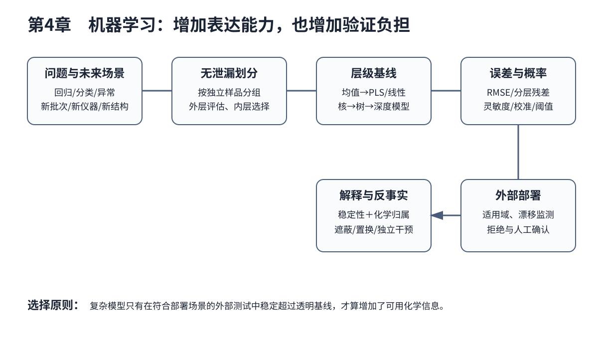

# 第4章 机器学习基础：任务、模型、泛化与解释

> 第2篇 化学数据的模型、表示与生成　·　建议出版篇幅：28页

## 章首导引

模型在什么条件下学到可迁移的化学关系，而不是批次、重复和背景差异？ 本章的回答是：系统讲清回归、分类、聚类、异常检测与严格验证，不按算法名堆砌。全章以具有重复、批次和化学空间结构的学习样本为对象，坚持“以独立对象划分和朴素基线约束复杂模型”，并通过“比较随机划分与按化合物分组划分的性能差异”把概念、计算和分析决策连为一体。

## 学习目标

- 能够说明具有重复、批次和化学空间结构的学习样本在本章中的数据结构与主要信息来源。
- 能够解释本章关键方法的输入、输出、参数、假设和失效条件。
- 能够以“以独立对象划分和朴素基线约束复杂模型”设计训练、验证和独立测试。
- 能够完成“比较随机划分与按化合物分组划分的性能差异”的最小代码实验并分析失败样本。

## 本章知识图谱

## 4.1 统计学习的任务、经验、参数与泛化

本节围绕“统计学习的任务、经验、参数与泛化”展开。分析对象是具有重复、批次和化学空间结构的学习样本，核心不是罗列名词，而是说明任务、经验和性能的定义、统计推断与预测建模、模型参数和超参数、偏差—方差权衡怎样进入同一条测量与推断链。读者首先要辨认哪些量来自真实样品，哪些量由仪器转换得到，哪些量由算法估计；三类量若混在一起，模型精度就很难被解释。

在“统计学习的任务、经验、参数与泛化”中，技术路线遵循“以独立对象划分和朴素基线约束复杂模型”。具体计算从可诊断的经典基线开始，再增加本节所需的非线性、结构先验或不确定度组件。新增组件必须回答一个明确问题，并在相同数据边界下与基线比较；只有平均分提高而误差结构没有改善，不能构成采用复杂模型的充分理由。

本节把“比较随机划分与按化合物分组划分的性能差异”落实到训练误差与泛化误差这一检查点。验证时保留与未来使用条件一致的独立对象，检查坐标轴、单位、样品身份、批次、参数来源和失败样本。由此得到的结论才可用于下一步测量或实验，而不是停留在一张看似分离良好的图上。

### 4.1.1 任务、经验和性能的定义

就“任务、经验和性能的定义”而言，在“统计学习的任务、经验、参数与泛化”中，任务、经验和性能的定义具体限定了具有重复、批次和化学空间结构的学习样本的一个技术接口。它必须被写成可检查的输入、变换和输出：输入保留样品与仪器条件，变换说明参数从何处估计，输出对应可观察量或候选判断；缺少任何一层，概念就无法进入实验和代码。

把“任务、经验和性能的定义”用于“统计学习的任务、经验、参数与泛化”时，本书用“比较随机划分与按化合物分组划分的性能差异”检验任务、经验和性能的定义。实现时遵循“以独立对象划分和朴素基线约束复杂模型”，先建立经典基线，再对参数敏感性、独立样品和失败对象进行检查。若结果只能在同批数据或单次划分中成立，应把它视为探索性现象而非稳定规律。教学上应把该概念落实为可观察变量、可运行程序和可反驳检验三层。

### 4.1.2 统计推断与预测建模

就“统计推断与预测建模”而言，在“统计学习的任务、经验、参数与泛化”中，统计推断与预测建模具体限定了具有重复、批次和化学空间结构的学习样本的一个技术接口。它必须被写成可检查的输入、变换和输出：输入保留样品与仪器条件，变换说明参数从何处估计，输出对应可观察量或候选判断；缺少任何一层，概念就无法进入实验和代码。

把“统计推断与预测建模”用于“统计学习的任务、经验、参数与泛化”时，本书用“比较随机划分与按化合物分组划分的性能差异”检验统计推断与预测建模。实现时遵循“以独立对象划分和朴素基线约束复杂模型”，先建立经典基线，再对参数敏感性、独立样品和失败对象进行检查。若结果只能在同批数据或单次划分中成立，应把它视为探索性现象而非稳定规律。在真实项目中，还应保存参数、软件版本和输入校验结果，以便定位变化来自样品还是计算。

### 4.1.3 模型参数和超参数

就“模型参数和超参数”而言，在“统计学习的任务、经验、参数与泛化”中，模型参数和超参数具体限定了具有重复、批次和化学空间结构的学习样本的一个技术接口。它必须被写成可检查的输入、变换和输出：输入保留样品与仪器条件，变换说明参数从何处估计，输出对应可观察量或候选判断；缺少任何一层，概念就无法进入实验和代码。

把“模型参数和超参数”用于“统计学习的任务、经验、参数与泛化”时，本书用“比较随机划分与按化合物分组划分的性能差异”检验模型参数和超参数。实现时遵循“以独立对象划分和朴素基线约束复杂模型”，先建立经典基线，再对参数敏感性、独立样品和失败对象进行检查。若结果只能在同批数据或单次划分中成立，应把它视为探索性现象而非稳定规律。若该步骤改变了样品单位、统计独立性或物理峰形，必须在独立数据上重新证明其有效性。

### 4.1.4 偏差—方差权衡

就“偏差—方差权衡”而言，围绕“偏差—方差权衡”，随机误差反映重复测量的波动，系统偏差使结果稳定地偏离参照，不确定度则量化在现有知识下结果可能处于的范围。三者属于不同概念。高重复性不代表无偏，模型测试误差很低也不代表参照标签准确。

把“偏差—方差权衡”用于“统计学习的任务、经验、参数与泛化”时，在“统计学习的任务、经验、参数与泛化”的语境下，不确定度应沿采样、制样、校准、仪器、预处理和模型逐步传播。对于线性关系可使用一阶误差传播，对于明显非线性或参数相关的系统可使用蒙特卡洛抽样。报告时应给出覆盖概率、区间构造方法和适用条件，而不是只给一个小数位很多的点估计。读图或读指标时应返回原始数据抽查，避免把表示空间中的几何关系直接当成化学机制。

### 4.1.5 训练误差与泛化误差

就“训练误差与泛化误差”而言，围绕“训练误差与泛化误差”，随机误差反映重复测量的波动，系统偏差使结果稳定地偏离参照，不确定度则量化在现有知识下结果可能处于的范围。三者属于不同概念。高重复性不代表无偏，模型测试误差很低也不代表参照标签准确。

把“训练误差与泛化误差”用于“统计学习的任务、经验、参数与泛化”时，在“统计学习的任务、经验、参数与泛化”的语境下，不确定度应沿采样、制样、校准、仪器、预处理和模型逐步传播。对于线性关系可使用一阶误差传播，对于明显非线性或参数相关的系统可使用蒙特卡洛抽样。报告时应给出覆盖概率、区间构造方法和适用条件，而不是只给一个小数位很多的点估计。最终报告需要给出适用范围和拒绝条件，使方法在证据不足时能够停止输出。

## 4.2 监督、无监督、半监督与自监督学习

本节围绕“监督、无监督、半监督与自监督学习”展开。分析对象是具有重复、批次和化学空间结构的学习样本，核心不是罗列名词，而是说明监督学习：分类与回归、无监督学习：聚类与降维、半监督与弱监督学习、自监督表示学习怎样进入同一条测量与推断链。读者首先要辨认哪些量来自真实样品，哪些量由仪器转换得到，哪些量由算法估计；三类量若混在一起，模型精度就很难被解释。

在“监督、无监督、半监督与自监督学习”中，技术路线遵循“以独立对象划分和朴素基线约束复杂模型”。具体计算从可诊断的经典基线开始，再增加本节所需的非线性、结构先验或不确定度组件。新增组件必须回答一个明确问题，并在相同数据边界下与基线比较；只有平均分提高而误差结构没有改善，不能构成采用复杂模型的充分理由。

本节把“比较随机划分与按化合物分组划分的性能差异”落实到迁移、少样本和在线学习这一检查点。验证时保留与未来使用条件一致的独立对象，检查坐标轴、单位、样品身份、批次、参数来源和失败样本。由此得到的结论才可用于下一步测量或实验，而不是停留在一张看似分离良好的图上。

### 4.2.1 监督学习：分类与回归

就“监督学习：分类与回归”而言，在“监督、无监督、半监督与自监督学习”中，监督学习：分类与回归具体限定了具有重复、批次和化学空间结构的学习样本的一个技术接口。它必须被写成可检查的输入、变换和输出：输入保留样品与仪器条件，变换说明参数从何处估计，输出对应可观察量或候选判断；缺少任何一层，概念就无法进入实验和代码。

把“监督学习：分类与回归”用于“监督、无监督、半监督与自监督学习”时，本书用“比较随机划分与按化合物分组划分的性能差异”检验监督学习：分类与回归。实现时遵循“以独立对象划分和朴素基线约束复杂模型”，先建立经典基线，再对参数敏感性、独立样品和失败对象进行检查。若结果只能在同批数据或单次划分中成立，应把它视为探索性现象而非稳定规律。教学上应把该概念落实为可观察变量、可运行程序和可反驳检验三层。

### 4.2.2 无监督学习：聚类与降维

就“无监督学习：聚类与降维”而言，在“监督、无监督、半监督与自监督学习”中，无监督学习：聚类与降维具体限定了具有重复、批次和化学空间结构的学习样本的一个技术接口。它必须被写成可检查的输入、变换和输出：输入保留样品与仪器条件，变换说明参数从何处估计，输出对应可观察量或候选判断；缺少任何一层，概念就无法进入实验和代码。

把“无监督学习：聚类与降维”用于“监督、无监督、半监督与自监督学习”时，本书用“比较随机划分与按化合物分组划分的性能差异”检验无监督学习：聚类与降维。实现时遵循“以独立对象划分和朴素基线约束复杂模型”，先建立经典基线，再对参数敏感性、独立样品和失败对象进行检查。若结果只能在同批数据或单次划分中成立，应把它视为探索性现象而非稳定规律。在真实项目中，还应保存参数、软件版本和输入校验结果，以便定位变化来自样品还是计算。

### 4.2.3 半监督与弱监督学习

就“半监督与弱监督学习”而言，在“监督、无监督、半监督与自监督学习”中，半监督与弱监督学习具体限定了具有重复、批次和化学空间结构的学习样本的一个技术接口。它必须被写成可检查的输入、变换和输出：输入保留样品与仪器条件，变换说明参数从何处估计，输出对应可观察量或候选判断；缺少任何一层，概念就无法进入实验和代码。

把“半监督与弱监督学习”用于“监督、无监督、半监督与自监督学习”时，本书用“比较随机划分与按化合物分组划分的性能差异”检验半监督与弱监督学习。实现时遵循“以独立对象划分和朴素基线约束复杂模型”，先建立经典基线，再对参数敏感性、独立样品和失败对象进行检查。若结果只能在同批数据或单次划分中成立，应把它视为探索性现象而非稳定规律。若该步骤改变了样品单位、统计独立性或物理峰形，必须在独立数据上重新证明其有效性。

### 4.2.4 自监督表示学习

就“自监督表示学习”而言，在“监督、无监督、半监督与自监督学习”中，自监督表示学习具体限定了具有重复、批次和化学空间结构的学习样本的一个技术接口。它必须被写成可检查的输入、变换和输出：输入保留样品与仪器条件，变换说明参数从何处估计，输出对应可观察量或候选判断；缺少任何一层，概念就无法进入实验和代码。

把“自监督表示学习”用于“监督、无监督、半监督与自监督学习”时，本书用“比较随机划分与按化合物分组划分的性能差异”检验自监督表示学习。实现时遵循“以独立对象划分和朴素基线约束复杂模型”，先建立经典基线，再对参数敏感性、独立样品和失败对象进行检查。若结果只能在同批数据或单次划分中成立，应把它视为探索性现象而非稳定规律。读图或读指标时应返回原始数据抽查，避免把表示空间中的几何关系直接当成化学机制。

### 4.2.5 迁移、少样本和在线学习

就“迁移、少样本和在线学习”而言，迁移、少样本和在线学习要求测量时间尺度快于被研究过程的关键变化。采样、传质、仪器响应和数据处理都可能造成时间延迟；若响应时间与反应时间相当，记录到的曲线是系统动力学与仪器核的卷积。

把“迁移、少样本和在线学习”用于“监督、无监督、半监督与自监督学习”时，建模时应保存真实时间戳、同步误差和操作事件，避免把等间隔文件序号当作真实时间。对于在线控制，还要区分毫秒级设备反馈与分钟级科学决策，并用状态估计处理不可直接观察的化学状态。最终报告需要给出适用范围和拒绝条件，使方法在证据不足时能够停止输出。

## 4.3 数据划分、同源泄漏与未来应用边界

本节围绕“数据划分、同源泄漏与未来应用边界”展开。分析对象是具有重复、批次和化学空间结构的学习样本，核心不是罗列名词，而是说明样品单位与独立性、随机划分的适用条件、同一样品、同源结构和重复谱泄漏、按批次、仪器、时间和个体分组怎样进入同一条测量与推断链。读者首先要辨认哪些量来自真实样品，哪些量由仪器转换得到，哪些量由算法估计；三类量若混在一起，模型精度就很难被解释。

在“数据划分、同源泄漏与未来应用边界”中，技术路线遵循“以独立对象划分和朴素基线约束复杂模型”。具体计算从可诊断的经典基线开始，再增加本节所需的非线性、结构先验或不确定度组件。新增组件必须回答一个明确问题，并在相同数据边界下与基线比较；只有平均分提高而误差结构没有改善，不能构成采用复杂模型的充分理由。

本节把“比较随机划分与按化合物分组划分的性能差异”落实到scaffold split与化学空间外推这一检查点。验证时保留与未来使用条件一致的独立对象，检查坐标轴、单位、样品身份、批次、参数来源和失败样本。由此得到的结论才可用于下一步测量或实验，而不是停留在一张看似分离良好的图上。

### 4.3.1 样品单位与独立性

就“样品单位与独立性”而言，样品单位与独立性决定数字能否被重新解释。仅保存强度矩阵会丢失坐标轴、单位、采样间隔、样品身份、仪器参数和校准状态；这些信息一旦脱离原始信号，后续很难判断变化来自化学对象还是采集条件。

把“样品单位与独立性”用于“数据划分、同源泄漏与未来应用边界”时，推荐把原始文件设为只读，以持久样品标识连接实验表和信号文件，并为每次转换记录脚本版本、参数和校验码。单位转换、重采样与轴反向属于会改变数值含义的操作，必须在数据进入模型前自动检查。教学上应把该概念落实为可观察变量、可运行程序和可反驳检验三层。

### 4.3.2 随机划分的适用条件

就“随机划分的适用条件”而言，在“数据划分、同源泄漏与未来应用边界”中，随机划分的适用条件具体限定了具有重复、批次和化学空间结构的学习样本的一个技术接口。它必须被写成可检查的输入、变换和输出：输入保留样品与仪器条件，变换说明参数从何处估计，输出对应可观察量或候选判断；缺少任何一层，概念就无法进入实验和代码。

把“随机划分的适用条件”用于“数据划分、同源泄漏与未来应用边界”时，本书用“比较随机划分与按化合物分组划分的性能差异”检验随机划分的适用条件。实现时遵循“以独立对象划分和朴素基线约束复杂模型”，先建立经典基线，再对参数敏感性、独立样品和失败对象进行检查。若结果只能在同批数据或单次划分中成立，应把它视为探索性现象而非稳定规律。在真实项目中，还应保存参数、软件版本和输入校验结果，以便定位变化来自样品还是计算。

### 4.3.3 同一样品、同源结构和重复谱泄漏

就“同一样品、同源结构和重复谱泄漏”而言，同一样品、同源结构和重复谱泄漏属于从观测反推对象的逆问题，常存在多解性。同一峰可由多个结构片段贡献，同一空间热点也可能受厚度、照明或离子抑制影响；因此模型输出首先是候选解释，而不是自动成立的机制。

把“同一样品、同源结构和重复谱泄漏”用于“数据划分、同源泄漏与未来应用边界”时，可信解释需要至少一条独立证据链：改变实验条件观察可预测响应、使用互补仪器验证候选，或以标准物质复现特征。显著性图、注意力和SHAP可定位模型依赖，却不能替代干预和机理实验。若该步骤改变了样品单位、统计独立性或物理峰形，必须在独立数据上重新证明其有效性。

### 4.3.4 按批次、仪器、时间和个体分组

就“按批次、仪器、时间和个体分组”而言，按批次、仪器、时间和个体分组要求测量时间尺度快于被研究过程的关键变化。采样、传质、仪器响应和数据处理都可能造成时间延迟；若响应时间与反应时间相当，记录到的曲线是系统动力学与仪器核的卷积。

把“按批次、仪器、时间和个体分组”用于“数据划分、同源泄漏与未来应用边界”时，建模时应保存真实时间戳、同步误差和操作事件，避免把等间隔文件序号当作真实时间。对于在线控制，还要区分毫秒级设备反馈与分钟级科学决策，并用状态估计处理不可直接观察的化学状态。读图或读指标时应返回原始数据抽查，避免把表示空间中的几何关系直接当成化学机制。

### 4.3.5 scaffold split与化学空间外推

就“scaffold split与化学空间外推”而言，scaffold split与化学空间外推属于从观测反推对象的逆问题，常存在多解性。同一峰可由多个结构片段贡献，同一空间热点也可能受厚度、照明或离子抑制影响；因此模型输出首先是候选解释，而不是自动成立的机制。

把“scaffold split与化学空间外推”用于“数据划分、同源泄漏与未来应用边界”时，可信解释需要至少一条独立证据链：改变实验条件观察可预测响应、使用互补仪器验证候选，或以标准物质复现特征。显著性图、注意力和SHAP可定位模型依赖，却不能替代干预和机理实验。最终报告需要给出适用范围和拒绝条件，使方法在证据不足时能够停止输出。

## 4.4 线性模型、正则化与核方法

本节围绕“线性模型、正则化与核方法”展开。分析对象是具有重复、批次和化学空间结构的学习样本，核心不是罗列名词，而是说明线性回归和逻辑回归、L1/L2正则化、支持向量机与最大间隔、核函数与非线性映射怎样进入同一条测量与推断链。读者首先要辨认哪些量来自真实样品，哪些量由仪器转换得到，哪些量由算法估计；三类量若混在一起，模型精度就很难被解释。

在“线性模型、正则化与核方法”中，技术路线遵循“以独立对象划分和朴素基线约束复杂模型”。具体计算从可诊断的经典基线开始，再增加本节所需的非线性、结构先验或不确定度组件。新增组件必须回答一个明确问题，并在相同数据边界下与基线比较；只有平均分提高而误差结构没有改善，不能构成采用复杂模型的充分理由。

本节把“比较随机划分与按化合物分组划分的性能差异”落实到KNN和朴素贝叶斯这一检查点。验证时保留与未来使用条件一致的独立对象，检查坐标轴、单位、样品身份、批次、参数来源和失败样本。由此得到的结论才可用于下一步测量或实验，而不是停留在一张看似分离良好的图上。

### 4.4.1 线性回归和逻辑回归

就“线性回归和逻辑回归”而言，在“线性模型、正则化与核方法”中，线性回归和逻辑回归具体限定了具有重复、批次和化学空间结构的学习样本的一个技术接口。它必须被写成可检查的输入、变换和输出：输入保留样品与仪器条件，变换说明参数从何处估计，输出对应可观察量或候选判断；缺少任何一层，概念就无法进入实验和代码。

把“线性回归和逻辑回归”用于“线性模型、正则化与核方法”时，本书用“比较随机划分与按化合物分组划分的性能差异”检验线性回归和逻辑回归。实现时遵循“以独立对象划分和朴素基线约束复杂模型”，先建立经典基线，再对参数敏感性、独立样品和失败对象进行检查。若结果只能在同批数据或单次划分中成立，应把它视为探索性现象而非稳定规律。教学上应把该概念落实为可观察变量、可运行程序和可反驳检验三层。

### 4.4.2 L1/L2正则化

就“L1/L2正则化”而言，围绕“L1/L2正则化”，经验风险最小化在有限训练样本上优化平均损失。模型容量过高时，训练风险可以继续下降而真实风险上升。正则化通过限制参数、特征或函数复杂度，换取更稳定的外部性能。

把“L1/L2正则化”用于“线性模型、正则化与核方法”时，在“线性模型、正则化与核方法”的语境下，L1正则倾向产生稀疏系数，L2正则平滑地收缩全部系数。正则化强度属于超参数，必须在训练折内部选择。化学解释不能简单等同于非零系数，因为相关变量之间的权重可能不稳定。在真实项目中，还应保存参数、软件版本和输入校验结果，以便定位变化来自样品还是计算。

### 4.4.3 支持向量机与最大间隔

就“支持向量机与最大间隔”而言，在“线性模型、正则化与核方法”中，支持向量机与最大间隔具体限定了具有重复、批次和化学空间结构的学习样本的一个技术接口。它必须被写成可检查的输入、变换和输出：输入保留样品与仪器条件，变换说明参数从何处估计，输出对应可观察量或候选判断；缺少任何一层，概念就无法进入实验和代码。

把“支持向量机与最大间隔”用于“线性模型、正则化与核方法”时，本书用“比较随机划分与按化合物分组划分的性能差异”检验支持向量机与最大间隔。实现时遵循“以独立对象划分和朴素基线约束复杂模型”，先建立经典基线，再对参数敏感性、独立样品和失败对象进行检查。若结果只能在同批数据或单次划分中成立，应把它视为探索性现象而非稳定规律。若该步骤改变了样品单位、统计独立性或物理峰形，必须在独立数据上重新证明其有效性。

### 4.4.4 核函数与非线性映射

就“核函数与非线性映射”而言，围绕“核函数与非线性映射”，核方法用样品间相似度隐式构造高维特征空间。线性核对应内积，RBF核根据距离产生局部相似性，多项式核引入特征交互。核函数及其参数共同定义模型对“相似”的判断。

把“核函数与非线性映射”用于“线性模型、正则化与核方法”时，在“线性模型、正则化与核方法”的语境下，在光谱或分子任务中，距离度量常受缩放和表示影响。RBF核宽度过小会形成高度局部的决策边界，过大则接近线性模型。核参数应通过嵌套验证选择，并用外部样品检验。读图或读指标时应返回原始数据抽查，避免把表示空间中的几何关系直接当成化学机制。

### 4.4.5 KNN和朴素贝叶斯

就“KNN和朴素贝叶斯”而言，围绕“KNN和朴素贝叶斯”，贝叶斯公式描述证据如何更新对假设的信念。先验p(H)表示观察数据前的知识，似然p(D|H)表示假设成立时数据出现的概率，证据p(D)负责归一化，后验p(H|D)则是数据到来后的判断。分析化学中的峰位变化、碎片匹配或阳性检测均是间接证据，必须与基准发生率共同解释。

把“KNN和朴素贝叶斯”用于“线性模型、正则化与核方法”时，在“线性模型、正则化与核方法”的语境下，贝叶斯推断的关键不是给每个结论强行标一个精确概率，而是保持推理方向正确：数据增强或削弱某个假设，而不是自动证明机制。先验应来自明确的文献、历史数据或物理约束，并进行敏感性分析；当后验强烈依赖先验时，应诚实报告数据仍不足。最终报告需要给出适用范围和拒绝条件，使方法在证据不足时能够停止输出。

## 4.5 树模型、集成学习与高斯过程

本节围绕“树模型、集成学习与高斯过程”展开。分析对象是具有重复、批次和化学空间结构的学习样本，核心不是罗列名词，而是说明决策树与划分准则、随机森林与Bagging、Boosting、XGBoost与LightGBM、高斯过程回归怎样进入同一条测量与推断链。读者首先要辨认哪些量来自真实样品，哪些量由仪器转换得到，哪些量由算法估计；三类量若混在一起，模型精度就很难被解释。

在“树模型、集成学习与高斯过程”中，技术路线遵循“以独立对象划分和朴素基线约束复杂模型”。具体计算从可诊断的经典基线开始，再增加本节所需的非线性、结构先验或不确定度组件。新增组件必须回答一个明确问题，并在相同数据边界下与基线比较；只有平均分提高而误差结构没有改善，不能构成采用复杂模型的充分理由。

本节把“比较随机划分与按化合物分组划分的性能差异”落实到模型复杂度和小样本适配这一检查点。验证时保留与未来使用条件一致的独立对象，检查坐标轴、单位、样品身份、批次、参数来源和失败样本。由此得到的结论才可用于下一步测量或实验，而不是停留在一张看似分离良好的图上。

### 4.5.1 决策树与划分准则

就“决策树与划分准则”而言，围绕“决策树与划分准则”，决策树通过递归划分特征空间降低节点不纯度。单棵树易受数据扰动影响；Bagging在重采样数据上训练多棵树并平均，主要降低方差；Boosting按序训练弱学习器，后续模型重点修正前一轮残差。

把“决策树与划分准则”用于“树模型、集成学习与高斯过程”时，在“树模型、集成学习与高斯过程”的语境下，集成模型常具有优良预测性能，但特征重要性可能受到变量尺度、类别数和相关性的影响。解释时应使用置换重要性、稳定性分析和化学对照，而不是把一次训练得到的排名视为机制。教学上应把该概念落实为可观察变量、可运行程序和可反驳检验三层。

### 4.5.2 随机森林与Bagging

就“随机森林与Bagging”而言，围绕“随机森林与Bagging”，决策树通过递归划分特征空间降低节点不纯度。单棵树易受数据扰动影响；Bagging在重采样数据上训练多棵树并平均，主要降低方差；Boosting按序训练弱学习器，后续模型重点修正前一轮残差。

把“随机森林与Bagging”用于“树模型、集成学习与高斯过程”时，在“树模型、集成学习与高斯过程”的语境下，集成模型常具有优良预测性能，但特征重要性可能受到变量尺度、类别数和相关性的影响。解释时应使用置换重要性、稳定性分析和化学对照，而不是把一次训练得到的排名视为机制。在真实项目中，还应保存参数、软件版本和输入校验结果，以便定位变化来自样品还是计算。

### 4.5.3 Boosting、XGBoost与LightGBM

就“Boosting、XGBoost与LightGBM”而言，围绕“Boosting、XGBoost与LightGBM”，决策树通过递归划分特征空间降低节点不纯度。单棵树易受数据扰动影响；Bagging在重采样数据上训练多棵树并平均，主要降低方差；Boosting按序训练弱学习器，后续模型重点修正前一轮残差。

把“Boosting、XGBoost与LightGBM”用于“树模型、集成学习与高斯过程”时，在“树模型、集成学习与高斯过程”的语境下，集成模型常具有优良预测性能，但特征重要性可能受到变量尺度、类别数和相关性的影响。解释时应使用置换重要性、稳定性分析和化学对照，而不是把一次训练得到的排名视为机制。若该步骤改变了样品单位、统计独立性或物理峰形，必须在独立数据上重新证明其有效性。

### 4.5.4 高斯过程回归

就“高斯过程回归”而言，围绕“高斯过程回归”，高斯过程用均值函数和核函数定义函数值之间的联合分布。给定观测后，可解析得到新点的后验均值和方差。均值用于预测，方差表达由数据覆盖和核假设共同决定的认知不确定性。

把“高斯过程回归”用于“树模型、集成学习与高斯过程”时，在“树模型、集成学习与高斯过程”的语境下，获取函数把预测分布转为下一次实验的选择标准。UCB以μ+κσ权衡高预测值和高不确定性；期望改进计算相对当前最优值的期望收益。安全约束、可合成性和仪器范围必须先过滤候选，再进行获取函数排序。读图或读指标时应返回原始数据抽查，避免把表示空间中的几何关系直接当成化学机制。

### 4.5.5 模型复杂度和小样本适配

就“模型复杂度和小样本适配”而言，在“树模型、集成学习与高斯过程”中，模型复杂度和小样本适配具体限定了具有重复、批次和化学空间结构的学习样本的一个技术接口。它必须被写成可检查的输入、变换和输出：输入保留样品与仪器条件，变换说明参数从何处估计，输出对应可观察量或候选判断；缺少任何一层，概念就无法进入实验和代码。

把“模型复杂度和小样本适配”用于“树模型、集成学习与高斯过程”时，本书用“比较随机划分与按化合物分组划分的性能差异”检验模型复杂度和小样本适配。实现时遵循“以独立对象划分和朴素基线约束复杂模型”，先建立经典基线，再对参数敏感性、独立样品和失败对象进行检查。若结果只能在同批数据或单次划分中成立，应把它视为探索性现象而非稳定规律。最终报告需要给出适用范围和拒绝条件，使方法在证据不足时能够停止输出。

## 4.6 分类、回归和概率校准指标

本节围绕“分类、回归和概率校准指标”展开。分析对象是具有重复、批次和化学空间结构的学习样本，核心不是罗列名词，而是说明MSE、MAE和RMSE、准确率、精确率、召回率和F1、ROC-AUC与PR-AUC、Brier分数与可靠性图怎样进入同一条测量与推断链。读者首先要辨认哪些量来自真实样品，哪些量由仪器转换得到，哪些量由算法估计；三类量若混在一起，模型精度就很难被解释。

在“分类、回归和概率校准指标”中，技术路线遵循“以独立对象划分和朴素基线约束复杂模型”。具体计算从可诊断的经典基线开始，再增加本节所需的非线性、结构先验或不确定度组件。新增组件必须回答一个明确问题，并在相同数据边界下与基线比较；只有平均分提高而误差结构没有改善，不能构成采用复杂模型的充分理由。

本节把“比较随机划分与按化合物分组划分的性能差异”落实到阈值选择和错误代价这一检查点。验证时保留与未来使用条件一致的独立对象，检查坐标轴、单位、样品身份、批次、参数来源和失败样本。由此得到的结论才可用于下一步测量或实验，而不是停留在一张看似分离良好的图上。

### 4.6.1 MSE、MAE和RMSE

就“MSE、MAE和RMSE”而言，围绕“MSE、MAE和RMSE”，RMSE对大误差更敏感，MAE更接近典型绝对偏差；偏差则显示预测是否系统性高估或低估。单一指标会隐藏误差结构，因此还需绘制预测—参照图、残差—浓度图，并按批次、浓度和样品类型分层。

把“MSE、MAE和RMSE”用于“分类、回归和概率校准指标”时，在“分类、回归和概率校准指标”的语境下，Hotelling T²描述样品在模型潜空间内的杠杆程度，Q残差描述样品不能被模型子空间解释的部分。二者结合可区分“位于已知方向的极端样品”和“具有新型结构的样品”，是建立适用域和异常诊断的重要工具。教学上应把该概念落实为可观察变量、可运行程序和可反驳检验三层。

### 4.6.2 准确率、精确率、召回率和F1

就“准确率、精确率、召回率和F1”而言，围绕“准确率、精确率、召回率和F1”，精确率关注预测为阳性的样品中有多少真正阳性，召回率关注真正阳性中有多少被检出，F1是二者的调和平均。类别极不平衡时，PR曲线比ROC曲线更能反映少数类识别的实际难度。

把“准确率、精确率、召回率和F1”用于“分类、回归和概率校准指标”时，在“分类、回归和概率校准指标”的语境下，概率校准回答预测概率是否与实际发生率一致。Brier分数同时受到判别和校准影响；可靠性图可显示模型过度自信或过度保守。阈值应根据漏检和误报代价确定，而不是固定在0.5。在真实项目中，还应保存参数、软件版本和输入校验结果，以便定位变化来自样品还是计算。

### 4.6.3 ROC-AUC与PR-AUC

就“ROC-AUC与PR-AUC”而言，围绕“ROC-AUC与PR-AUC”，精确率关注预测为阳性的样品中有多少真正阳性，召回率关注真正阳性中有多少被检出，F1是二者的调和平均。类别极不平衡时，PR曲线比ROC曲线更能反映少数类识别的实际难度。

把“ROC-AUC与PR-AUC”用于“分类、回归和概率校准指标”时，在“分类、回归和概率校准指标”的语境下，概率校准回答预测概率是否与实际发生率一致。Brier分数同时受到判别和校准影响；可靠性图可显示模型过度自信或过度保守。阈值应根据漏检和误报代价确定，而不是固定在0.5。若该步骤改变了样品单位、统计独立性或物理峰形，必须在独立数据上重新证明其有效性。

### 4.6.4 Brier分数与可靠性图

就“Brier分数与可靠性图”而言，围绕“Brier分数与可靠性图”，精确率关注预测为阳性的样品中有多少真正阳性，召回率关注真正阳性中有多少被检出，F1是二者的调和平均。类别极不平衡时，PR曲线比ROC曲线更能反映少数类识别的实际难度。

把“Brier分数与可靠性图”用于“分类、回归和概率校准指标”时，在“分类、回归和概率校准指标”的语境下，概率校准回答预测概率是否与实际发生率一致。Brier分数同时受到判别和校准影响；可靠性图可显示模型过度自信或过度保守。阈值应根据漏检和误报代价确定，而不是固定在0.5。读图或读指标时应返回原始数据抽查，避免把表示空间中的几何关系直接当成化学机制。

### 4.6.5 阈值选择和错误代价

就“阈值选择和错误代价”而言，阈值选择和错误代价把分析结果转成实际行动。阈值不是模型内部的固定常数，而应由漏检、误报、复检成本和样品基准发生率共同确定；同一预测概率在筛查与确证场景中可对应不同决策。

把“阈值选择和错误代价”用于“分类、回归和概率校准指标”时，决策系统应允许三种输出：接受、拒绝和请求补充测量。每次行动保留输入版本、置信区间、适用域状态和人工复核点；若信息价值不足以抵消额外实验成本，系统也应能够停止。最终报告需要给出适用范围和拒绝条件，使方法在证据不足时能够停止输出。

## 4.7 嵌套验证、基线、消融与失败样本

本节围绕“嵌套验证、基线、消融与失败样本”展开。分析对象是具有重复、批次和化学空间结构的学习样本，核心不是罗列名词，而是说明朴素基线和经典方法基线、嵌套交叉验证、超参数搜索的边界、消融、置换和随机标签基线怎样进入同一条测量与推断链。读者首先要辨认哪些量来自真实样品，哪些量由仪器转换得到，哪些量由算法估计；三类量若混在一起，模型精度就很难被解释。

在“嵌套验证、基线、消融与失败样本”中，技术路线遵循“以独立对象划分和朴素基线约束复杂模型”。具体计算从可诊断的经典基线开始，再增加本节所需的非线性、结构先验或不确定度组件。新增组件必须回答一个明确问题，并在相同数据边界下与基线比较；只有平均分提高而误差结构没有改善，不能构成采用复杂模型的充分理由。

本节把“比较随机划分与按化合物分组划分的性能差异”落实到外部测试和失败样本分层这一检查点。验证时保留与未来使用条件一致的独立对象，检查坐标轴、单位、样品身份、批次、参数来源和失败样本。由此得到的结论才可用于下一步测量或实验，而不是停留在一张看似分离良好的图上。

### 4.7.1 朴素基线和经典方法基线

就“朴素基线和经典方法基线”而言，围绕“朴素基线和经典方法基线”，Savitzky-Golay方法在滑动窗口内拟合低阶多项式，可同时实现平滑和导数估计。窗口过短会保留噪声，过长会压低窄峰；多项式阶数过高则增加振荡。参数应根据仪器分辨率、最窄有效峰宽和下游任务共同确定。

把“朴素基线和经典方法基线”用于“嵌套验证、基线、消融与失败样本”时，在“嵌套验证、基线、消融与失败样本”的语境下，基线校正实质上是在区分慢变化背景与分析信号。多项式、非对称最小二乘和形态学方法对应不同的背景假设。校正后不仅要看曲线是否平直，还要比较峰位、峰宽、峰面积、空白残差和定量偏差。教学上应把该概念落实为可观察变量、可运行程序和可反驳检验三层。

### 4.7.2 嵌套交叉验证

就“嵌套交叉验证”而言，围绕“嵌套交叉验证”，数据划分单位必须对应未来真正的新对象。重复谱、同一化合物的多个构象、同一患者的多个视野或同一批次的多次测量不能跨越训练集和测试集。GroupKFold用组标签保证同源对象整体进入同一折。

把“嵌套交叉验证”用于“嵌套验证、基线、消融与失败样本”时，在“嵌套验证、基线、消融与失败样本”的语境下，嵌套交叉验证用内层选择预处理、特征和超参数，用外层估计选择完成后的泛化误差。若同一测试折反复参与调参，最终分数会产生乐观偏差。锁定测试集只能在整个流程冻结后使用一次。在真实项目中，还应保存参数、软件版本和输入校验结果，以便定位变化来自样品还是计算。

### 4.7.3 超参数搜索的边界

就“超参数搜索的边界”而言，在“嵌套验证、基线、消融与失败样本”中，超参数搜索的边界具体限定了具有重复、批次和化学空间结构的学习样本的一个技术接口。它必须被写成可检查的输入、变换和输出：输入保留样品与仪器条件，变换说明参数从何处估计，输出对应可观察量或候选判断；缺少任何一层，概念就无法进入实验和代码。

把“超参数搜索的边界”用于“嵌套验证、基线、消融与失败样本”时，本书用“比较随机划分与按化合物分组划分的性能差异”检验超参数搜索的边界。实现时遵循“以独立对象划分和朴素基线约束复杂模型”，先建立经典基线，再对参数敏感性、独立样品和失败对象进行检查。若结果只能在同批数据或单次划分中成立，应把它视为探索性现象而非稳定规律。若该步骤改变了样品单位、统计独立性或物理峰形，必须在独立数据上重新证明其有效性。

### 4.7.4 消融、置换和随机标签基线

就“消融、置换和随机标签基线”而言，围绕“消融、置换和随机标签基线”，Savitzky-Golay方法在滑动窗口内拟合低阶多项式，可同时实现平滑和导数估计。窗口过短会保留噪声，过长会压低窄峰；多项式阶数过高则增加振荡。参数应根据仪器分辨率、最窄有效峰宽和下游任务共同确定。

把“消融、置换和随机标签基线”用于“嵌套验证、基线、消融与失败样本”时，在“嵌套验证、基线、消融与失败样本”的语境下，基线校正实质上是在区分慢变化背景与分析信号。多项式、非对称最小二乘和形态学方法对应不同的背景假设。校正后不仅要看曲线是否平直，还要比较峰位、峰宽、峰面积、空白残差和定量偏差。读图或读指标时应返回原始数据抽查，避免把表示空间中的几何关系直接当成化学机制。

### 4.7.5 外部测试和失败样本分层

就“外部测试和失败样本分层”而言，在“嵌套验证、基线、消融与失败样本”中，外部测试和失败样本分层具体限定了具有重复、批次和化学空间结构的学习样本的一个技术接口。它必须被写成可检查的输入、变换和输出：输入保留样品与仪器条件，变换说明参数从何处估计，输出对应可观察量或候选判断；缺少任何一层，概念就无法进入实验和代码。

把“外部测试和失败样本分层”用于“嵌套验证、基线、消融与失败样本”时，本书用“比较随机划分与按化合物分组划分的性能差异”检验外部测试和失败样本分层。实现时遵循“以独立对象划分和朴素基线约束复杂模型”，先建立经典基线，再对参数敏感性、独立样品和失败对象进行检查。若结果只能在同批数据或单次划分中成立，应把它视为探索性现象而非稳定规律。最终报告需要给出适用范围和拒绝条件，使方法在证据不足时能够停止输出。

## 4.8 特征归因、反事实与解释的边界

本节围绕“特征归因、反事实与解释的边界”展开。分析对象是具有重复、批次和化学空间结构的学习样本，核心不是罗列名词，而是说明系数、载荷与特征重要性、置换重要性与相关变量、SHAP及其条件假设、注意力和显著图不等于机制怎样进入同一条测量与推断链。读者首先要辨认哪些量来自真实样品，哪些量由仪器转换得到，哪些量由算法估计；三类量若混在一起，模型精度就很难被解释。

在“特征归因、反事实与解释的边界”中，技术路线遵循“以独立对象划分和朴素基线约束复杂模型”。具体计算从可诊断的经典基线开始，再增加本节所需的非线性、结构先验或不确定度组件。新增组件必须回答一个明确问题，并在相同数据边界下与基线比较；只有平均分提高而误差结构没有改善，不能构成采用复杂模型的充分理由。

本节把“比较随机划分与按化合物分组划分的性能差异”落实到反事实与实验验证这一检查点。验证时保留与未来使用条件一致的独立对象，检查坐标轴、单位、样品身份、批次、参数来源和失败样本。由此得到的结论才可用于下一步测量或实验，而不是停留在一张看似分离良好的图上。

### 4.8.1 系数、载荷与特征重要性

就“系数、载荷与特征重要性”而言，在“特征归因、反事实与解释的边界”中，系数、载荷与特征重要性具体限定了具有重复、批次和化学空间结构的学习样本的一个技术接口。它必须被写成可检查的输入、变换和输出：输入保留样品与仪器条件，变换说明参数从何处估计，输出对应可观察量或候选判断；缺少任何一层，概念就无法进入实验和代码。

把“系数、载荷与特征重要性”用于“特征归因、反事实与解释的边界”时，本书用“比较随机划分与按化合物分组划分的性能差异”检验系数、载荷与特征重要性。实现时遵循“以独立对象划分和朴素基线约束复杂模型”，先建立经典基线，再对参数敏感性、独立样品和失败对象进行检查。若结果只能在同批数据或单次划分中成立，应把它视为探索性现象而非稳定规律。教学上应把该概念落实为可观察变量、可运行程序和可反驳检验三层。

### 4.8.2 置换重要性与相关变量

就“置换重要性与相关变量”而言，在“特征归因、反事实与解释的边界”中，置换重要性与相关变量具体限定了具有重复、批次和化学空间结构的学习样本的一个技术接口。它必须被写成可检查的输入、变换和输出：输入保留样品与仪器条件，变换说明参数从何处估计，输出对应可观察量或候选判断；缺少任何一层，概念就无法进入实验和代码。

把“置换重要性与相关变量”用于“特征归因、反事实与解释的边界”时，本书用“比较随机划分与按化合物分组划分的性能差异”检验置换重要性与相关变量。实现时遵循“以独立对象划分和朴素基线约束复杂模型”，先建立经典基线，再对参数敏感性、独立样品和失败对象进行检查。若结果只能在同批数据或单次划分中成立，应把它视为探索性现象而非稳定规律。在真实项目中，还应保存参数、软件版本和输入校验结果，以便定位变化来自样品还是计算。

### 4.8.3 SHAP及其条件假设

就“SHAP及其条件假设”而言，在“特征归因、反事实与解释的边界”中，SHAP及其条件假设具体限定了具有重复、批次和化学空间结构的学习样本的一个技术接口。它必须被写成可检查的输入、变换和输出：输入保留样品与仪器条件，变换说明参数从何处估计，输出对应可观察量或候选判断；缺少任何一层，概念就无法进入实验和代码。

把“SHAP及其条件假设”用于“特征归因、反事实与解释的边界”时，本书用“比较随机划分与按化合物分组划分的性能差异”检验SHAP及其条件假设。实现时遵循“以独立对象划分和朴素基线约束复杂模型”，先建立经典基线，再对参数敏感性、独立样品和失败对象进行检查。若结果只能在同批数据或单次划分中成立，应把它视为探索性现象而非稳定规律。若该步骤改变了样品单位、统计独立性或物理峰形，必须在独立数据上重新证明其有效性。

### 4.8.4 注意力和显著图不等于机制

就“注意力和显著图不等于机制”而言，围绕“注意力和显著图不等于机制”，分子图以原子为节点、化学键为空间关系。消息传递网络在每一层聚合邻居信息并更新节点表示，多层传播扩大感受野。全局池化把节点表示汇总为分子级向量。

把“注意力和显著图不等于机制”用于“特征归因、反事实与解释的边界”时，在“特征归因、反事实与解释的边界”的语境下，二维图不能完整表达构象和空间相互作用。使用距离、角度或等变网络可以处理三维几何；SE(3)等变性要求模型输出随旋转和平移按物理规律变化。构象生成、温度和质子化态仍是输入不确定性的来源。读图或读指标时应返回原始数据抽查，避免把表示空间中的几何关系直接当成化学机制。

### 4.8.5 反事实与实验验证

就“反事实与实验验证”而言，在“特征归因、反事实与解释的边界”中，反事实与实验验证具体限定了具有重复、批次和化学空间结构的学习样本的一个技术接口。它必须被写成可检查的输入、变换和输出：输入保留样品与仪器条件，变换说明参数从何处估计，输出对应可观察量或候选判断；缺少任何一层，概念就无法进入实验和代码。

把“反事实与实验验证”用于“特征归因、反事实与解释的边界”时，本书用“比较随机划分与按化合物分组划分的性能差异”检验反事实与实验验证。实现时遵循“以独立对象划分和朴素基线约束复杂模型”，先建立经典基线，再对参数敏感性、独立样品和失败对象进行检查。若结果只能在同批数据或单次划分中成立，应把它视为探索性现象而非稳定规律。最终报告需要给出适用范围和拒绝条件，使方法在证据不足时能够停止输出。

## 关键关系与计算抓手

- `R̂(f)=n⁻¹ΣL(yᵢ,f(xᵢ))`

- `F1=2PR/(P+R)`

## 本章综合案例

本章案例：比较随机划分与按化合物分组划分的性能差异。先明确样品单位、测量协议和数据结构，建立最简单且可诊断的基线；再加入本章核心方法，并在同一独立测试边界下比较。结果至少按批次、信号强弱和适用域分层，给出错误对象而非只报告总体平均数。

完成案例时，应提交问题卡、数据字典、运行日志、关键图表、失败样本清单和可运行程序。任何由模型提出的解释都要能被互补测量或后续实验检验。

## 代码实践

- 任务：构造含重复样品和批次的数据，对比随机划分、GroupKFold与时间外推。
- 代码：[chapter_exercise.py](../code/ch04.py)

## 本章小结

本章以具有重复、批次和化学空间结构的学习样本为对象，把“机器学习基础：任务、模型、泛化与解释”组织为测量、表示、推断和行动的连续过程。复习时应能解释数据如何生成、方法为何适用、性能如何验证，以及证据不足时何时拒绝输出。

## 思考题与计算题

1. 为“比较随机划分与按化合物分组划分的性能差异”画出样品—仪器—数据—模型—结论链，并标出三处可能失真位置。
2. 从本章选择一个方法，写出输入、输出、关键参数、基本假设和至少两个失效条件。
3. 建立一个经典基线，并说明复杂模型必须在哪些独立指标上超过它。
4. 把随机划分改为符合未来使用条件的分组或外推划分，比较结果并解释差异。
5. 完成配套代码，增加一个单元测试和一个失败样本可视化。
6. 设计一个能够区分“模型学到化学信息”和“模型学到批次捷径”的对照实验。

## 下载本章资源

<a href="./downloads/word/ch04.docx" download>Word出版稿</a>　·　<a href="./code/ch04.py" download>Python代码</a>　·　<a href="./assets/graphs/ch04.svg" download>SVG知识图谱</a>
