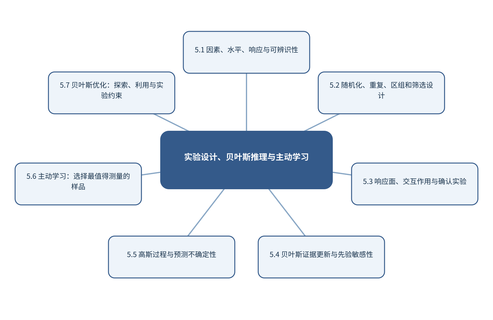

# 第5章 实验设计、贝叶斯推理与主动学习

> 第2篇 化学数据的模型、表示与生成　·　建议出版篇幅：24页

## 章首导引

当实验昂贵、样品有限时，怎样用最少测量获得最多信息？ 本章的回答是：把经典实验设计、概率更新、主动学习和贝叶斯优化放在同一实验决策框架内。全章以昂贵、受约束且可序贯执行的实验条件为对象，坚持“把实验设计、不确定度和下一次选点连接起来”，并通过“在有限次数内优化反应响应并保留确认实验”把概念、计算和分析决策连为一体。

## 学习目标

- 能够说明昂贵、受约束且可序贯执行的实验条件在本章中的数据结构与主要信息来源。
- 能够解释本章关键方法的输入、输出、参数、假设和失效条件。
- 能够以“把实验设计、不确定度和下一次选点连接起来”设计训练、验证和独立测试。
- 能够完成“在有限次数内优化反应响应并保留确认实验”的最小代码实验并分析失败样本。

## 本章知识图谱

## 5.1 因素、水平、响应与可辨识性

本节围绕“因素、水平、响应与可辨识性”展开。分析对象是昂贵、受约束且可序贯执行的实验条件，核心不是罗列名词，而是说明因素、水平、响应和约束、主效应、交互作用和曲率、可辨识性与实验范围、分析目标和错误代价怎样进入同一条测量与推断链。读者首先要辨认哪些量来自真实样品，哪些量由仪器转换得到，哪些量由算法估计；三类量若混在一起，模型精度就很难被解释。

在“因素、水平、响应与可辨识性”中，技术路线遵循“把实验设计、不确定度和下一次选点连接起来”。具体计算从可诊断的经典基线开始，再增加本节所需的非线性、结构先验或不确定度组件。新增组件必须回答一个明确问题，并在相同数据边界下与基线比较；只有平均分提高而误差结构没有改善，不能构成采用复杂模型的充分理由。

本节把“在有限次数内优化反应响应并保留确认实验”落实到分析目标和错误代价这一检查点。验证时保留与未来使用条件一致的独立对象，检查坐标轴、单位、样品身份、批次、参数来源和失败样本。由此得到的结论才可用于下一步测量或实验，而不是停留在一张看似分离良好的图上。

### 5.1.1 因素、水平、响应和约束

就“因素、水平、响应和约束”而言，在“因素、水平、响应与可辨识性”中，因素、水平、响应和约束具体限定了昂贵、受约束且可序贯执行的实验条件的一个技术接口。它必须被写成可检查的输入、变换和输出：输入保留样品与仪器条件，变换说明参数从何处估计，输出对应可观察量或候选判断；缺少任何一层，概念就无法进入实验和代码。

把“因素、水平、响应和约束”用于“因素、水平、响应与可辨识性”时，本书用“在有限次数内优化反应响应并保留确认实验”检验因素、水平、响应和约束。实现时遵循“把实验设计、不确定度和下一次选点连接起来”，先建立经典基线，再对参数敏感性、独立样品和失败对象进行检查。若结果只能在同批数据或单次划分中成立，应把它视为探索性现象而非稳定规律。在真实项目中，还应保存参数、软件版本和输入校验结果，以便定位变化来自样品还是计算。

### 5.1.2 主效应、交互作用和曲率

就“主效应、交互作用和曲率”而言，围绕“主效应、交互作用和曲率”，实验设计通过有结构地选择因子组合，使主效应、交互作用和曲率可被估计。随机化抵御时间漂移，重复估计实验误差，区组隔离已知批次。筛选设计适合找出重要因素，响应面设计则用于局部优化。

把“主效应、交互作用和曲率”用于“因素、水平、响应与可辨识性”时，在“因素、水平、响应与可辨识性”的语境下，二次响应面包含线性项、交互项和平方项。因子范围过窄无法识别曲率，过宽则可能跨越不同机理或安全区域。模型得到的数学最优点还需通过确认实验和稳健性试验验证。若该步骤改变了样品单位、统计独立性或物理峰形，必须在独立数据上重新证明其有效性。

### 5.1.3 可辨识性与实验范围

就“可辨识性与实验范围”而言，在“因素、水平、响应与可辨识性”中，可辨识性与实验范围具体限定了昂贵、受约束且可序贯执行的实验条件的一个技术接口。它必须被写成可检查的输入、变换和输出：输入保留样品与仪器条件，变换说明参数从何处估计，输出对应可观察量或候选判断；缺少任何一层，概念就无法进入实验和代码。

把“可辨识性与实验范围”用于“因素、水平、响应与可辨识性”时，本书用“在有限次数内优化反应响应并保留确认实验”检验可辨识性与实验范围。实现时遵循“把实验设计、不确定度和下一次选点连接起来”，先建立经典基线，再对参数敏感性、独立样品和失败对象进行检查。若结果只能在同批数据或单次划分中成立，应把它视为探索性现象而非稳定规律。读图或读指标时应返回原始数据抽查，避免把表示空间中的几何关系直接当成化学机制。

### 5.1.4 分析目标和错误代价

就“分析目标和错误代价”而言，在“因素、水平、响应与可辨识性”中，分析目标和错误代价具体限定了昂贵、受约束且可序贯执行的实验条件的一个技术接口。它必须被写成可检查的输入、变换和输出：输入保留样品与仪器条件，变换说明参数从何处估计，输出对应可观察量或候选判断；缺少任何一层，概念就无法进入实验和代码。

把“分析目标和错误代价”用于“因素、水平、响应与可辨识性”时，本书用“在有限次数内优化反应响应并保留确认实验”检验分析目标和错误代价。实现时遵循“把实验设计、不确定度和下一次选点连接起来”，先建立经典基线，再对参数敏感性、独立样品和失败对象进行检查。若结果只能在同批数据或单次划分中成立，应把它视为探索性现象而非稳定规律。最终报告需要给出适用范围和拒绝条件，使方法在证据不足时能够停止输出。

## 5.2 随机化、重复、区组和筛选设计

本节围绕“随机化、重复、区组和筛选设计”展开。分析对象是昂贵、受约束且可序贯执行的实验条件，核心不是罗列名词，而是说明完全随机设计与区组设计、全因子与部分因子设计、正交设计和筛选设计、重复、随机化和中心点怎样进入同一条测量与推断链。读者首先要辨认哪些量来自真实样品，哪些量由仪器转换得到，哪些量由算法估计；三类量若混在一起，模型精度就很难被解释。

在“随机化、重复、区组和筛选设计”中，技术路线遵循“把实验设计、不确定度和下一次选点连接起来”。具体计算从可诊断的经典基线开始，再增加本节所需的非线性、结构先验或不确定度组件。新增组件必须回答一个明确问题，并在相同数据边界下与基线比较；只有平均分提高而误差结构没有改善，不能构成采用复杂模型的充分理由。

本节把“在有限次数内优化反应响应并保留确认实验”落实到重复、随机化和中心点这一检查点。验证时保留与未来使用条件一致的独立对象，检查坐标轴、单位、样品身份、批次、参数来源和失败样本。由此得到的结论才可用于下一步测量或实验，而不是停留在一张看似分离良好的图上。

### 5.2.1 完全随机设计与区组设计

就“完全随机设计与区组设计”而言，在“随机化、重复、区组和筛选设计”中，完全随机设计与区组设计具体限定了昂贵、受约束且可序贯执行的实验条件的一个技术接口。它必须被写成可检查的输入、变换和输出：输入保留样品与仪器条件，变换说明参数从何处估计，输出对应可观察量或候选判断；缺少任何一层，概念就无法进入实验和代码。

把“完全随机设计与区组设计”用于“随机化、重复、区组和筛选设计”时，本书用“在有限次数内优化反应响应并保留确认实验”检验完全随机设计与区组设计。实现时遵循“把实验设计、不确定度和下一次选点连接起来”，先建立经典基线，再对参数敏感性、独立样品和失败对象进行检查。若结果只能在同批数据或单次划分中成立，应把它视为探索性现象而非稳定规律。在真实项目中，还应保存参数、软件版本和输入校验结果，以便定位变化来自样品还是计算。

### 5.2.2 全因子与部分因子设计

就“全因子与部分因子设计”而言，围绕“全因子与部分因子设计”，实验设计通过有结构地选择因子组合，使主效应、交互作用和曲率可被估计。随机化抵御时间漂移，重复估计实验误差，区组隔离已知批次。筛选设计适合找出重要因素，响应面设计则用于局部优化。

把“全因子与部分因子设计”用于“随机化、重复、区组和筛选设计”时，在“随机化、重复、区组和筛选设计”的语境下，二次响应面包含线性项、交互项和平方项。因子范围过窄无法识别曲率，过宽则可能跨越不同机理或安全区域。模型得到的数学最优点还需通过确认实验和稳健性试验验证。若该步骤改变了样品单位、统计独立性或物理峰形，必须在独立数据上重新证明其有效性。

### 5.2.3 正交设计和筛选设计

就“正交设计和筛选设计”而言，在“随机化、重复、区组和筛选设计”中，正交设计和筛选设计具体限定了昂贵、受约束且可序贯执行的实验条件的一个技术接口。它必须被写成可检查的输入、变换和输出：输入保留样品与仪器条件，变换说明参数从何处估计，输出对应可观察量或候选判断；缺少任何一层，概念就无法进入实验和代码。

把“正交设计和筛选设计”用于“随机化、重复、区组和筛选设计”时，本书用“在有限次数内优化反应响应并保留确认实验”检验正交设计和筛选设计。实现时遵循“把实验设计、不确定度和下一次选点连接起来”，先建立经典基线，再对参数敏感性、独立样品和失败对象进行检查。若结果只能在同批数据或单次划分中成立，应把它视为探索性现象而非稳定规律。读图或读指标时应返回原始数据抽查，避免把表示空间中的几何关系直接当成化学机制。

### 5.2.4 重复、随机化和中心点

就“重复、随机化和中心点”而言，在“随机化、重复、区组和筛选设计”中，重复、随机化和中心点具体限定了昂贵、受约束且可序贯执行的实验条件的一个技术接口。它必须被写成可检查的输入、变换和输出：输入保留样品与仪器条件，变换说明参数从何处估计，输出对应可观察量或候选判断；缺少任何一层，概念就无法进入实验和代码。

把“重复、随机化和中心点”用于“随机化、重复、区组和筛选设计”时，本书用“在有限次数内优化反应响应并保留确认实验”检验重复、随机化和中心点。实现时遵循“把实验设计、不确定度和下一次选点连接起来”，先建立经典基线，再对参数敏感性、独立样品和失败对象进行检查。若结果只能在同批数据或单次划分中成立，应把它视为探索性现象而非稳定规律。最终报告需要给出适用范围和拒绝条件，使方法在证据不足时能够停止输出。

## 5.3 响应面、交互作用与确认实验

本节围绕“响应面、交互作用与确认实验”展开。分析对象是昂贵、受约束且可序贯执行的实验条件，核心不是罗列名词，而是说明一阶和二阶响应面、中心复合与Box–Behnken设计、交互项和平方项、最优点、确认实验和稳健性怎样进入同一条测量与推断链。读者首先要辨认哪些量来自真实样品，哪些量由仪器转换得到，哪些量由算法估计；三类量若混在一起，模型精度就很难被解释。

在“响应面、交互作用与确认实验”中，技术路线遵循“把实验设计、不确定度和下一次选点连接起来”。具体计算从可诊断的经典基线开始，再增加本节所需的非线性、结构先验或不确定度组件。新增组件必须回答一个明确问题，并在相同数据边界下与基线比较；只有平均分提高而误差结构没有改善，不能构成采用复杂模型的充分理由。

本节把“在有限次数内优化反应响应并保留确认实验”落实到最优点、确认实验和稳健性这一检查点。验证时保留与未来使用条件一致的独立对象，检查坐标轴、单位、样品身份、批次、参数来源和失败样本。由此得到的结论才可用于下一步测量或实验，而不是停留在一张看似分离良好的图上。

### 5.3.1 一阶和二阶响应面

就“一阶和二阶响应面”而言，围绕“一阶和二阶响应面”，实验设计通过有结构地选择因子组合，使主效应、交互作用和曲率可被估计。随机化抵御时间漂移，重复估计实验误差，区组隔离已知批次。筛选设计适合找出重要因素，响应面设计则用于局部优化。

把“一阶和二阶响应面”用于“响应面、交互作用与确认实验”时，在“响应面、交互作用与确认实验”的语境下，二次响应面包含线性项、交互项和平方项。因子范围过窄无法识别曲率，过宽则可能跨越不同机理或安全区域。模型得到的数学最优点还需通过确认实验和稳健性试验验证。在真实项目中，还应保存参数、软件版本和输入校验结果，以便定位变化来自样品还是计算。

### 5.3.2 中心复合与Box–Behnken设计

就“中心复合与Box–Behnken设计”而言，围绕“中心复合与Box–Behnken设计”，实验设计通过有结构地选择因子组合，使主效应、交互作用和曲率可被估计。随机化抵御时间漂移，重复估计实验误差，区组隔离已知批次。筛选设计适合找出重要因素，响应面设计则用于局部优化。

把“中心复合与Box–Behnken设计”用于“响应面、交互作用与确认实验”时，在“响应面、交互作用与确认实验”的语境下，二次响应面包含线性项、交互项和平方项。因子范围过窄无法识别曲率，过宽则可能跨越不同机理或安全区域。模型得到的数学最优点还需通过确认实验和稳健性试验验证。若该步骤改变了样品单位、统计独立性或物理峰形，必须在独立数据上重新证明其有效性。

### 5.3.3 交互项和平方项

就“交互项和平方项”而言，在“响应面、交互作用与确认实验”中，交互项和平方项具体限定了昂贵、受约束且可序贯执行的实验条件的一个技术接口。它必须被写成可检查的输入、变换和输出：输入保留样品与仪器条件，变换说明参数从何处估计，输出对应可观察量或候选判断；缺少任何一层，概念就无法进入实验和代码。

把“交互项和平方项”用于“响应面、交互作用与确认实验”时，本书用“在有限次数内优化反应响应并保留确认实验”检验交互项和平方项。实现时遵循“把实验设计、不确定度和下一次选点连接起来”，先建立经典基线，再对参数敏感性、独立样品和失败对象进行检查。若结果只能在同批数据或单次划分中成立，应把它视为探索性现象而非稳定规律。读图或读指标时应返回原始数据抽查，避免把表示空间中的几何关系直接当成化学机制。

### 5.3.4 最优点、确认实验和稳健性

就“最优点、确认实验和稳健性”而言，在“响应面、交互作用与确认实验”中，最优点、确认实验和稳健性具体限定了昂贵、受约束且可序贯执行的实验条件的一个技术接口。它必须被写成可检查的输入、变换和输出：输入保留样品与仪器条件，变换说明参数从何处估计，输出对应可观察量或候选判断；缺少任何一层，概念就无法进入实验和代码。

把“最优点、确认实验和稳健性”用于“响应面、交互作用与确认实验”时，本书用“在有限次数内优化反应响应并保留确认实验”检验最优点、确认实验和稳健性。实现时遵循“把实验设计、不确定度和下一次选点连接起来”，先建立经典基线，再对参数敏感性、独立样品和失败对象进行检查。若结果只能在同批数据或单次划分中成立，应把它视为探索性现象而非稳定规律。最终报告需要给出适用范围和拒绝条件，使方法在证据不足时能够停止输出。

## 5.4 贝叶斯证据更新与先验敏感性

本节围绕“贝叶斯证据更新与先验敏感性”展开。分析对象是昂贵、受约束且可序贯执行的实验条件，核心不是罗列名词，而是说明先验、似然、证据和后验、共轭更新和数值推断、可信区间与预测分布、先验敏感性和模型比较怎样进入同一条测量与推断链。读者首先要辨认哪些量来自真实样品，哪些量由仪器转换得到，哪些量由算法估计；三类量若混在一起，模型精度就很难被解释。

在“贝叶斯证据更新与先验敏感性”中，技术路线遵循“把实验设计、不确定度和下一次选点连接起来”。具体计算从可诊断的经典基线开始，再增加本节所需的非线性、结构先验或不确定度组件。新增组件必须回答一个明确问题，并在相同数据边界下与基线比较；只有平均分提高而误差结构没有改善，不能构成采用复杂模型的充分理由。

本节把“在有限次数内优化反应响应并保留确认实验”落实到先验敏感性和模型比较这一检查点。验证时保留与未来使用条件一致的独立对象，检查坐标轴、单位、样品身份、批次、参数来源和失败样本。由此得到的结论才可用于下一步测量或实验，而不是停留在一张看似分离良好的图上。

### 5.4.1 先验、似然、证据和后验

就“先验、似然、证据和后验”而言，在“贝叶斯证据更新与先验敏感性”中，先验、似然、证据和后验具体限定了昂贵、受约束且可序贯执行的实验条件的一个技术接口。它必须被写成可检查的输入、变换和输出：输入保留样品与仪器条件，变换说明参数从何处估计，输出对应可观察量或候选判断；缺少任何一层，概念就无法进入实验和代码。

把“先验、似然、证据和后验”用于“贝叶斯证据更新与先验敏感性”时，本书用“在有限次数内优化反应响应并保留确认实验”检验先验、似然、证据和后验。实现时遵循“把实验设计、不确定度和下一次选点连接起来”，先建立经典基线，再对参数敏感性、独立样品和失败对象进行检查。若结果只能在同批数据或单次划分中成立，应把它视为探索性现象而非稳定规律。在真实项目中，还应保存参数、软件版本和输入校验结果，以便定位变化来自样品还是计算。

### 5.4.2 共轭更新和数值推断

就“共轭更新和数值推断”而言，在“贝叶斯证据更新与先验敏感性”中，共轭更新和数值推断具体限定了昂贵、受约束且可序贯执行的实验条件的一个技术接口。它必须被写成可检查的输入、变换和输出：输入保留样品与仪器条件，变换说明参数从何处估计，输出对应可观察量或候选判断；缺少任何一层，概念就无法进入实验和代码。

把“共轭更新和数值推断”用于“贝叶斯证据更新与先验敏感性”时，本书用“在有限次数内优化反应响应并保留确认实验”检验共轭更新和数值推断。实现时遵循“把实验设计、不确定度和下一次选点连接起来”，先建立经典基线，再对参数敏感性、独立样品和失败对象进行检查。若结果只能在同批数据或单次划分中成立，应把它视为探索性现象而非稳定规律。若该步骤改变了样品单位、统计独立性或物理峰形，必须在独立数据上重新证明其有效性。

### 5.4.3 可信区间与预测分布

就“可信区间与预测分布”而言，在“贝叶斯证据更新与先验敏感性”中，可信区间与预测分布具体限定了昂贵、受约束且可序贯执行的实验条件的一个技术接口。它必须被写成可检查的输入、变换和输出：输入保留样品与仪器条件，变换说明参数从何处估计，输出对应可观察量或候选判断；缺少任何一层，概念就无法进入实验和代码。

把“可信区间与预测分布”用于“贝叶斯证据更新与先验敏感性”时，本书用“在有限次数内优化反应响应并保留确认实验”检验可信区间与预测分布。实现时遵循“把实验设计、不确定度和下一次选点连接起来”，先建立经典基线，再对参数敏感性、独立样品和失败对象进行检查。若结果只能在同批数据或单次划分中成立，应把它视为探索性现象而非稳定规律。读图或读指标时应返回原始数据抽查，避免把表示空间中的几何关系直接当成化学机制。

### 5.4.4 先验敏感性和模型比较

就“先验敏感性和模型比较”而言，在“贝叶斯证据更新与先验敏感性”中，先验敏感性和模型比较具体限定了昂贵、受约束且可序贯执行的实验条件的一个技术接口。它必须被写成可检查的输入、变换和输出：输入保留样品与仪器条件，变换说明参数从何处估计，输出对应可观察量或候选判断；缺少任何一层，概念就无法进入实验和代码。

把“先验敏感性和模型比较”用于“贝叶斯证据更新与先验敏感性”时，本书用“在有限次数内优化反应响应并保留确认实验”检验先验敏感性和模型比较。实现时遵循“把实验设计、不确定度和下一次选点连接起来”，先建立经典基线，再对参数敏感性、独立样品和失败对象进行检查。若结果只能在同批数据或单次划分中成立，应把它视为探索性现象而非稳定规律。最终报告需要给出适用范围和拒绝条件，使方法在证据不足时能够停止输出。

## 5.5 高斯过程与预测不确定性

本节围绕“高斯过程与预测不确定性”展开。分析对象是昂贵、受约束且可序贯执行的实验条件，核心不是罗列名词，而是说明均值函数和核函数、后验均值与后验方差、长度尺度和噪声参数、小样本不确定性和外推怎样进入同一条测量与推断链。读者首先要辨认哪些量来自真实样品，哪些量由仪器转换得到，哪些量由算法估计；三类量若混在一起，模型精度就很难被解释。

在“高斯过程与预测不确定性”中，技术路线遵循“把实验设计、不确定度和下一次选点连接起来”。具体计算从可诊断的经典基线开始，再增加本节所需的非线性、结构先验或不确定度组件。新增组件必须回答一个明确问题，并在相同数据边界下与基线比较；只有平均分提高而误差结构没有改善，不能构成采用复杂模型的充分理由。

本节把“在有限次数内优化反应响应并保留确认实验”落实到小样本不确定性和外推这一检查点。验证时保留与未来使用条件一致的独立对象，检查坐标轴、单位、样品身份、批次、参数来源和失败样本。由此得到的结论才可用于下一步测量或实验，而不是停留在一张看似分离良好的图上。

### 5.5.1 均值函数和核函数

就“均值函数和核函数”而言，围绕“均值函数和核函数”，核方法用样品间相似度隐式构造高维特征空间。线性核对应内积，RBF核根据距离产生局部相似性，多项式核引入特征交互。核函数及其参数共同定义模型对“相似”的判断。

把“均值函数和核函数”用于“高斯过程与预测不确定性”时，在“高斯过程与预测不确定性”的语境下，在光谱或分子任务中，距离度量常受缩放和表示影响。RBF核宽度过小会形成高度局部的决策边界，过大则接近线性模型。核参数应通过嵌套验证选择，并用外部样品检验。在真实项目中，还应保存参数、软件版本和输入校验结果，以便定位变化来自样品还是计算。

### 5.5.2 后验均值与后验方差

就“后验均值与后验方差”而言，在“高斯过程与预测不确定性”中，后验均值与后验方差具体限定了昂贵、受约束且可序贯执行的实验条件的一个技术接口。它必须被写成可检查的输入、变换和输出：输入保留样品与仪器条件，变换说明参数从何处估计，输出对应可观察量或候选判断；缺少任何一层，概念就无法进入实验和代码。

把“后验均值与后验方差”用于“高斯过程与预测不确定性”时，本书用“在有限次数内优化反应响应并保留确认实验”检验后验均值与后验方差。实现时遵循“把实验设计、不确定度和下一次选点连接起来”，先建立经典基线，再对参数敏感性、独立样品和失败对象进行检查。若结果只能在同批数据或单次划分中成立，应把它视为探索性现象而非稳定规律。若该步骤改变了样品单位、统计独立性或物理峰形，必须在独立数据上重新证明其有效性。

### 5.5.3 长度尺度和噪声参数

就“长度尺度和噪声参数”而言，在“高斯过程与预测不确定性”中，长度尺度和噪声参数具体限定了昂贵、受约束且可序贯执行的实验条件的一个技术接口。它必须被写成可检查的输入、变换和输出：输入保留样品与仪器条件，变换说明参数从何处估计，输出对应可观察量或候选判断；缺少任何一层，概念就无法进入实验和代码。

把“长度尺度和噪声参数”用于“高斯过程与预测不确定性”时，本书用“在有限次数内优化反应响应并保留确认实验”检验长度尺度和噪声参数。实现时遵循“把实验设计、不确定度和下一次选点连接起来”，先建立经典基线，再对参数敏感性、独立样品和失败对象进行检查。若结果只能在同批数据或单次划分中成立，应把它视为探索性现象而非稳定规律。读图或读指标时应返回原始数据抽查，避免把表示空间中的几何关系直接当成化学机制。

### 5.5.4 小样本不确定性和外推

就“小样本不确定性和外推”而言，围绕“小样本不确定性和外推”，随机误差反映重复测量的波动，系统偏差使结果稳定地偏离参照，不确定度则量化在现有知识下结果可能处于的范围。三者属于不同概念。高重复性不代表无偏，模型测试误差很低也不代表参照标签准确。

把“小样本不确定性和外推”用于“高斯过程与预测不确定性”时，在“高斯过程与预测不确定性”的语境下，不确定度应沿采样、制样、校准、仪器、预处理和模型逐步传播。对于线性关系可使用一阶误差传播，对于明显非线性或参数相关的系统可使用蒙特卡洛抽样。报告时应给出覆盖概率、区间构造方法和适用条件，而不是只给一个小数位很多的点估计。最终报告需要给出适用范围和拒绝条件，使方法在证据不足时能够停止输出。

## 5.6 主动学习：选择最值得测量的样品

本节围绕“主动学习：选择最值得测量的样品”展开。分析对象是昂贵、受约束且可序贯执行的实验条件，核心不是罗列名词，而是说明查询策略与信息价值、不确定性采样、委员会分歧和期望模型变化、样品选择与标签成本怎样进入同一条测量与推断链。读者首先要辨认哪些量来自真实样品，哪些量由仪器转换得到，哪些量由算法估计；三类量若混在一起，模型精度就很难被解释。

在“主动学习：选择最值得测量的样品”中，技术路线遵循“把实验设计、不确定度和下一次选点连接起来”。具体计算从可诊断的经典基线开始，再增加本节所需的非线性、结构先验或不确定度组件。新增组件必须回答一个明确问题，并在相同数据边界下与基线比较；只有平均分提高而误差结构没有改善，不能构成采用复杂模型的充分理由。

本节把“在有限次数内优化反应响应并保留确认实验”落实到样品选择与标签成本这一检查点。验证时保留与未来使用条件一致的独立对象，检查坐标轴、单位、样品身份、批次、参数来源和失败样本。由此得到的结论才可用于下一步测量或实验，而不是停留在一张看似分离良好的图上。

### 5.6.1 查询策略与信息价值

就“查询策略与信息价值”而言，在“主动学习：选择最值得测量的样品”中，查询策略与信息价值具体限定了昂贵、受约束且可序贯执行的实验条件的一个技术接口。它必须被写成可检查的输入、变换和输出：输入保留样品与仪器条件，变换说明参数从何处估计，输出对应可观察量或候选判断；缺少任何一层，概念就无法进入实验和代码。

把“查询策略与信息价值”用于“主动学习：选择最值得测量的样品”时，本书用“在有限次数内优化反应响应并保留确认实验”检验查询策略与信息价值。实现时遵循“把实验设计、不确定度和下一次选点连接起来”，先建立经典基线，再对参数敏感性、独立样品和失败对象进行检查。若结果只能在同批数据或单次划分中成立，应把它视为探索性现象而非稳定规律。在真实项目中，还应保存参数、软件版本和输入校验结果，以便定位变化来自样品还是计算。

### 5.6.2 不确定性采样

就“不确定性采样”而言，围绕“不确定性采样”，随机误差反映重复测量的波动，系统偏差使结果稳定地偏离参照，不确定度则量化在现有知识下结果可能处于的范围。三者属于不同概念。高重复性不代表无偏，模型测试误差很低也不代表参照标签准确。

把“不确定性采样”用于“主动学习：选择最值得测量的样品”时，在“主动学习：选择最值得测量的样品”的语境下，不确定度应沿采样、制样、校准、仪器、预处理和模型逐步传播。对于线性关系可使用一阶误差传播，对于明显非线性或参数相关的系统可使用蒙特卡洛抽样。报告时应给出覆盖概率、区间构造方法和适用条件，而不是只给一个小数位很多的点估计。若该步骤改变了样品单位、统计独立性或物理峰形，必须在独立数据上重新证明其有效性。

### 5.6.3 委员会分歧和期望模型变化

就“委员会分歧和期望模型变化”而言，在“主动学习：选择最值得测量的样品”中，委员会分歧和期望模型变化具体限定了昂贵、受约束且可序贯执行的实验条件的一个技术接口。它必须被写成可检查的输入、变换和输出：输入保留样品与仪器条件，变换说明参数从何处估计，输出对应可观察量或候选判断；缺少任何一层，概念就无法进入实验和代码。

把“委员会分歧和期望模型变化”用于“主动学习：选择最值得测量的样品”时，本书用“在有限次数内优化反应响应并保留确认实验”检验委员会分歧和期望模型变化。实现时遵循“把实验设计、不确定度和下一次选点连接起来”，先建立经典基线，再对参数敏感性、独立样品和失败对象进行检查。若结果只能在同批数据或单次划分中成立，应把它视为探索性现象而非稳定规律。读图或读指标时应返回原始数据抽查，避免把表示空间中的几何关系直接当成化学机制。

### 5.6.4 样品选择与标签成本

就“样品选择与标签成本”而言，在“主动学习：选择最值得测量的样品”中，样品选择与标签成本具体限定了昂贵、受约束且可序贯执行的实验条件的一个技术接口。它必须被写成可检查的输入、变换和输出：输入保留样品与仪器条件，变换说明参数从何处估计，输出对应可观察量或候选判断；缺少任何一层，概念就无法进入实验和代码。

把“样品选择与标签成本”用于“主动学习：选择最值得测量的样品”时，本书用“在有限次数内优化反应响应并保留确认实验”检验样品选择与标签成本。实现时遵循“把实验设计、不确定度和下一次选点连接起来”，先建立经典基线，再对参数敏感性、独立样品和失败对象进行检查。若结果只能在同批数据或单次划分中成立，应把它视为探索性现象而非稳定规律。最终报告需要给出适用范围和拒绝条件，使方法在证据不足时能够停止输出。

## 5.7 贝叶斯优化：探索、利用与实验约束

本节围绕“贝叶斯优化：探索、利用与实验约束”展开。分析对象是昂贵、受约束且可序贯执行的实验条件，核心不是罗列名词，而是说明代理模型和昂贵目标函数、Expected Improvement与UCB、探索—利用平衡、安全、可行性和资源约束怎样进入同一条测量与推断链。读者首先要辨认哪些量来自真实样品，哪些量由仪器转换得到，哪些量由算法估计；三类量若混在一起，模型精度就很难被解释。

在“贝叶斯优化：探索、利用与实验约束”中，技术路线遵循“把实验设计、不确定度和下一次选点连接起来”。具体计算从可诊断的经典基线开始，再增加本节所需的非线性、结构先验或不确定度组件。新增组件必须回答一个明确问题，并在相同数据边界下与基线比较；只有平均分提高而误差结构没有改善，不能构成采用复杂模型的充分理由。

本节把“在有限次数内优化反应响应并保留确认实验”落实到多目标优化与停止条件这一检查点。验证时保留与未来使用条件一致的独立对象，检查坐标轴、单位、样品身份、批次、参数来源和失败样本。由此得到的结论才可用于下一步测量或实验，而不是停留在一张看似分离良好的图上。

### 5.7.1 代理模型和昂贵目标函数

就“代理模型和昂贵目标函数”而言，在“贝叶斯优化：探索、利用与实验约束”中，代理模型和昂贵目标函数具体限定了昂贵、受约束且可序贯执行的实验条件的一个技术接口。它必须被写成可检查的输入、变换和输出：输入保留样品与仪器条件，变换说明参数从何处估计，输出对应可观察量或候选判断；缺少任何一层，概念就无法进入实验和代码。

把“代理模型和昂贵目标函数”用于“贝叶斯优化：探索、利用与实验约束”时，本书用“在有限次数内优化反应响应并保留确认实验”检验代理模型和昂贵目标函数。实现时遵循“把实验设计、不确定度和下一次选点连接起来”，先建立经典基线，再对参数敏感性、独立样品和失败对象进行检查。若结果只能在同批数据或单次划分中成立，应把它视为探索性现象而非稳定规律。在真实项目中，还应保存参数、软件版本和输入校验结果，以便定位变化来自样品还是计算。

### 5.7.2 Expected Improvement与UCB

就“Expected Improvement与UCB”而言，围绕“Expected Improvement与UCB”，高斯过程用均值函数和核函数定义函数值之间的联合分布。给定观测后，可解析得到新点的后验均值和方差。均值用于预测，方差表达由数据覆盖和核假设共同决定的认知不确定性。

把“Expected Improvement与UCB”用于“贝叶斯优化：探索、利用与实验约束”时，在“贝叶斯优化：探索、利用与实验约束”的语境下，获取函数把预测分布转为下一次实验的选择标准。UCB以μ+κσ权衡高预测值和高不确定性；期望改进计算相对当前最优值的期望收益。安全约束、可合成性和仪器范围必须先过滤候选，再进行获取函数排序。若该步骤改变了样品单位、统计独立性或物理峰形，必须在独立数据上重新证明其有效性。

### 5.7.3 探索—利用平衡

就“探索—利用平衡”而言，在“贝叶斯优化：探索、利用与实验约束”中，探索—利用平衡具体限定了昂贵、受约束且可序贯执行的实验条件的一个技术接口。它必须被写成可检查的输入、变换和输出：输入保留样品与仪器条件，变换说明参数从何处估计，输出对应可观察量或候选判断；缺少任何一层，概念就无法进入实验和代码。

把“探索—利用平衡”用于“贝叶斯优化：探索、利用与实验约束”时，本书用“在有限次数内优化反应响应并保留确认实验”检验探索—利用平衡。实现时遵循“把实验设计、不确定度和下一次选点连接起来”，先建立经典基线，再对参数敏感性、独立样品和失败对象进行检查。若结果只能在同批数据或单次划分中成立，应把它视为探索性现象而非稳定规律。读图或读指标时应返回原始数据抽查，避免把表示空间中的几何关系直接当成化学机制。

### 5.7.4 安全、可行性和资源约束

就“安全、可行性和资源约束”而言，在“贝叶斯优化：探索、利用与实验约束”中，安全、可行性和资源约束具体限定了昂贵、受约束且可序贯执行的实验条件的一个技术接口。它必须被写成可检查的输入、变换和输出：输入保留样品与仪器条件，变换说明参数从何处估计，输出对应可观察量或候选判断；缺少任何一层，概念就无法进入实验和代码。

把“安全、可行性和资源约束”用于“贝叶斯优化：探索、利用与实验约束”时，本书用“在有限次数内优化反应响应并保留确认实验”检验安全、可行性和资源约束。实现时遵循“把实验设计、不确定度和下一次选点连接起来”，先建立经典基线，再对参数敏感性、独立样品和失败对象进行检查。若结果只能在同批数据或单次划分中成立，应把它视为探索性现象而非稳定规律。最终报告需要给出适用范围和拒绝条件，使方法在证据不足时能够停止输出。

### 5.7.5 多目标优化与停止条件

就“多目标优化与停止条件”而言，在“贝叶斯优化：探索、利用与实验约束”中，多目标优化与停止条件具体限定了昂贵、受约束且可序贯执行的实验条件的一个技术接口。它必须被写成可检查的输入、变换和输出：输入保留样品与仪器条件，变换说明参数从何处估计，输出对应可观察量或候选判断；缺少任何一层，概念就无法进入实验和代码。

把“多目标优化与停止条件”用于“贝叶斯优化：探索、利用与实验约束”时，本书用“在有限次数内优化反应响应并保留确认实验”检验多目标优化与停止条件。实现时遵循“把实验设计、不确定度和下一次选点连接起来”，先建立经典基线，再对参数敏感性、独立样品和失败对象进行检查。若结果只能在同批数据或单次划分中成立，应把它视为探索性现象而非稳定规律。教学上应把该概念落实为可观察变量、可运行程序和可反驳检验三层。

## 关键关系与计算抓手

- `p(θ|D)∝p(D|θ)p(θ)`

- `UCB(x)=μ(x)+κσ(x)`

## 本章综合案例

本章案例：在有限次数内优化反应响应并保留确认实验。先明确样品单位、测量协议和数据结构，建立最简单且可诊断的基线；再加入本章核心方法，并在同一独立测试边界下比较。结果至少按批次、信号强弱和适用域分层，给出错误对象而非只报告总体平均数。

完成案例时，应提交问题卡、数据字典、运行日志、关键图表、失败样本清单和可运行程序。任何由模型提出的解释都要能被互补测量或后续实验检验。

## 代码实践

- 任务：实现高斯过程与EI/UCB，记录每轮候选、实验结果和后验变化。
- 代码：[chapter_exercise.py](../code/ch05.py)

## 本章小结

本章以昂贵、受约束且可序贯执行的实验条件为对象，把“实验设计、贝叶斯推理与主动学习”组织为测量、表示、推断和行动的连续过程。复习时应能解释数据如何生成、方法为何适用、性能如何验证，以及证据不足时何时拒绝输出。

## 思考题与计算题

1. 为“在有限次数内优化反应响应并保留确认实验”画出样品—仪器—数据—模型—结论链，并标出三处可能失真位置。
2. 从本章选择一个方法，写出输入、输出、关键参数、基本假设和至少两个失效条件。
3. 建立一个经典基线，并说明复杂模型必须在哪些独立指标上超过它。
4. 把随机划分改为符合未来使用条件的分组或外推划分，比较结果并解释差异。
5. 完成配套代码，增加一个单元测试和一个失败样本可视化。
6. 设计一个能够区分“模型学到化学信息”和“模型学到批次捷径”的对照实验。

## 下载本章资源

<a href="./downloads/word/ch05.docx" download>Word出版稿</a>　·　<a href="./code/ch05.py" download>Python代码</a>　·　<a href="./assets/graphs/ch05.svg" download>SVG知识图谱</a>
