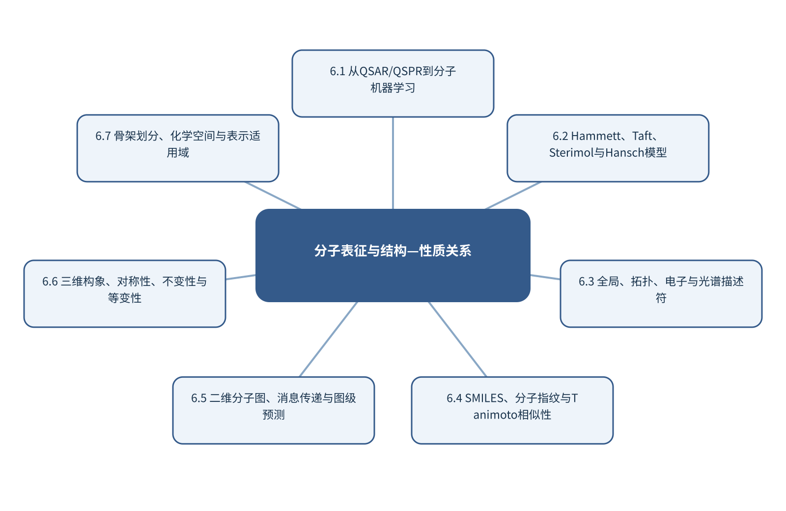

# 第6章 分子表征与结构—性质关系

> 第2篇 化学数据的模型、表示与生成

## 章首导引

怎样把分子结构编码成既可计算、又保留任务相关化学信息的表示？ 本章的回答是：保留QSAR/QSPR和物理有机化学经典知识，并连接现代分子学习。全章以分子结构、构象与性质终点为对象，坚持“让表示保留任务所需信息并用结构外推检验”，并通过“比较异构体在描述符、指纹、分子图和三维表示中的差异”把概念、计算和分析决策连为一体。

## 学习目标

- 能够说明分子结构、构象与性质终点在本章中的数据结构与主要信息来源。
- 能够解释本章关键方法的输入、输出、参数、假设和失效条件。
- 能够以“让表示保留任务所需信息并用结构外推检验”设计训练、验证和独立测试。
- 能够完成“比较异构体在描述符、指纹、分子图和三维表示中的差异”的最小代码实验并分析失败样本。

## 本章知识图谱

## 6.1 从QSAR/QSPR到分子机器学习

本节围绕“从QSAR/QSPR到分子机器学习”展开。分析对象是分子结构、构象与性质终点，核心不是罗列名词，而是说明QSAR/QSPR的问题定义、终点、分子集合和建模流程、经典物理有机化学到现代AI、相关性、预测性和机制怎样进入同一条测量与推断链。读者首先要辨认哪些量来自真实样品，哪些量由仪器转换得到，哪些量由算法估计；三类量若混在一起，模型精度就很难被解释。

在“从QSAR/QSPR到分子机器学习”中，技术路线遵循“让表示保留任务所需信息并用结构外推检验”。具体计算从可诊断的经典基线开始，再增加本节所需的非线性、结构先验或不确定度组件。新增组件必须回答一个明确问题，并在相同数据边界下与基线比较；只有平均分提高而误差结构没有改善，不能构成采用复杂模型的充分理由。

本节把“比较异构体在描述符、指纹、分子图和三维表示中的差异”落实到相关性、预测性和机制这一检查点。验证时保留与未来使用条件一致的独立对象，检查坐标轴、单位、样品身份、批次、参数来源和失败样本。由此得到的结论才可用于下一步测量或实验，而不是停留在一张看似分离良好的图上。

### 6.1.1 QSAR/QSPR的问题定义

就“QSAR/QSPR的问题定义”而言，围绕“QSAR/QSPR的问题定义”，分子指纹把局部子结构或拓扑环境编码为位向量。Tanimoto系数用交集位数除以并集位数衡量相似性。它适合库检索和邻域分析，但相似度数值依赖指纹类型、半径和位长。

把“QSAR/QSPR的问题定义”用于“从QSAR/QSPR到分子机器学习”时，在“从QSAR/QSPR到分子机器学习”的语境下，QSAR/QSPR的核心不是选择最复杂回归器，而是保证分子身份标准化、表示保留目标相关信息、划分能够检验结构外推。随机划分常把相似骨架分散到两侧，骨架或时间划分更接近真实发现任务。若该步骤改变了样品单位、统计独立性或物理峰形，必须在独立数据上重新证明其有效性。

### 6.1.2 终点、分子集合和建模流程

就“终点、分子集合和建模流程”而言，在“从QSAR/QSPR到分子机器学习”中，终点、分子集合和建模流程具体限定了分子结构、构象与性质终点的一个技术接口。它必须被写成可检查的输入、变换和输出：输入保留样品与仪器条件，变换说明参数从何处估计，输出对应可观察量或候选判断；缺少任何一层，概念就无法进入实验和代码。

把“终点、分子集合和建模流程”用于“从QSAR/QSPR到分子机器学习”时，本书用“比较异构体在描述符、指纹、分子图和三维表示中的差异”检验终点、分子集合和建模流程。实现时遵循“让表示保留任务所需信息并用结构外推检验”，先建立经典基线，再对参数敏感性、独立样品和失败对象进行检查。若结果只能在同批数据或单次划分中成立，应把它视为探索性现象而非稳定规律。读图或读指标时应返回原始数据抽查，避免把表示空间中的几何关系直接当成化学机制。

### 6.1.3 经典物理有机化学到现代AI

就“经典物理有机化学到现代AI”而言，在“从QSAR/QSPR到分子机器学习”中，经典物理有机化学到现代AI具体限定了分子结构、构象与性质终点的一个技术接口。它必须被写成可检查的输入、变换和输出：输入保留样品与仪器条件，变换说明参数从何处估计，输出对应可观察量或候选判断；缺少任何一层，概念就无法进入实验和代码。

把“经典物理有机化学到现代AI”用于“从QSAR/QSPR到分子机器学习”时，本书用“比较异构体在描述符、指纹、分子图和三维表示中的差异”检验经典物理有机化学到现代AI。实现时遵循“让表示保留任务所需信息并用结构外推检验”，先建立经典基线，再对参数敏感性、独立样品和失败对象进行检查。若结果只能在同批数据或单次划分中成立，应把它视为探索性现象而非稳定规律。最终报告需要给出适用范围和拒绝条件，使方法在证据不足时能够停止输出。

### 6.1.4 相关性、预测性和机制

就“相关性、预测性和机制”而言，相关性、预测性和机制属于从观测反推对象的逆问题，常存在多解性。同一峰可由多个结构片段贡献，同一空间热点也可能受厚度、照明或离子抑制影响；因此模型输出首先是候选解释，而不是自动成立的机制。

把“相关性、预测性和机制”用于“从QSAR/QSPR到分子机器学习”时，可信解释需要至少一条独立证据链：改变实验条件观察可预测响应、使用互补仪器验证候选，或以标准物质复现特征。显著性图、注意力和SHAP可定位模型依赖，却不能替代干预和机理实验。教学上应把该概念落实为可观察变量、可运行程序和可反驳检验三层。

## 6.2 Hammett、Taft、Sterimol与Hansch模型

本节围绕“Hammett、Taft、Sterimol与Hansch模型”展开。分析对象是分子结构、构象与性质终点，核心不是罗列名词，而是说明Hammett方程、σ与ρ、Taft极性和位阻参数、Sterimol几何参数、Hansch疏水—电子—位阻模型怎样进入同一条测量与推断链。读者首先要辨认哪些量来自真实样品，哪些量由仪器转换得到，哪些量由算法估计；三类量若混在一起，模型精度就很难被解释。

在“Hammett、Taft、Sterimol与Hansch模型”中，技术路线遵循“让表示保留任务所需信息并用结构外推检验”。具体计算从可诊断的经典基线开始，再增加本节所需的非线性、结构先验或不确定度组件。新增组件必须回答一个明确问题，并在相同数据边界下与基线比较；只有平均分提高而误差结构没有改善，不能构成采用复杂模型的充分理由。

本节把“比较异构体在描述符、指纹、分子图和三维表示中的差异”落实到线性自由能关系的适用边界这一检查点。验证时保留与未来使用条件一致的独立对象，检查坐标轴、单位、样品身份、批次、参数来源和失败样本。由此得到的结论才可用于下一步测量或实验，而不是停留在一张看似分离良好的图上。

### 6.2.1 Hammett方程、σ与ρ

就“Hammett方程、σ与ρ”而言，在“Hammett、Taft、Sterimol与Hansch模型”中，Hammett方程、σ与ρ具体限定了分子结构、构象与性质终点的一个技术接口。它必须被写成可检查的输入、变换和输出：输入保留样品与仪器条件，变换说明参数从何处估计，输出对应可观察量或候选判断；缺少任何一层，概念就无法进入实验和代码。

把“Hammett方程、σ与ρ”用于“Hammett、Taft、Sterimol与Hansch模型”时，本书用“比较异构体在描述符、指纹、分子图和三维表示中的差异”检验Hammett方程、σ与ρ。实现时遵循“让表示保留任务所需信息并用结构外推检验”，先建立经典基线，再对参数敏感性、独立样品和失败对象进行检查。若结果只能在同批数据或单次划分中成立，应把它视为探索性现象而非稳定规律。若该步骤改变了样品单位、统计独立性或物理峰形，必须在独立数据上重新证明其有效性。

### 6.2.2 Taft极性和位阻参数

就“Taft极性和位阻参数”而言，在“Hammett、Taft、Sterimol与Hansch模型”中，Taft极性和位阻参数具体限定了分子结构、构象与性质终点的一个技术接口。它必须被写成可检查的输入、变换和输出：输入保留样品与仪器条件，变换说明参数从何处估计，输出对应可观察量或候选判断；缺少任何一层，概念就无法进入实验和代码。

把“Taft极性和位阻参数”用于“Hammett、Taft、Sterimol与Hansch模型”时，本书用“比较异构体在描述符、指纹、分子图和三维表示中的差异”检验Taft极性和位阻参数。实现时遵循“让表示保留任务所需信息并用结构外推检验”，先建立经典基线，再对参数敏感性、独立样品和失败对象进行检查。若结果只能在同批数据或单次划分中成立，应把它视为探索性现象而非稳定规律。读图或读指标时应返回原始数据抽查，避免把表示空间中的几何关系直接当成化学机制。

### 6.2.3 Sterimol几何参数

就“Sterimol几何参数”而言，在“Hammett、Taft、Sterimol与Hansch模型”中，Sterimol几何参数具体限定了分子结构、构象与性质终点的一个技术接口。它必须被写成可检查的输入、变换和输出：输入保留样品与仪器条件，变换说明参数从何处估计，输出对应可观察量或候选判断；缺少任何一层，概念就无法进入实验和代码。

把“Sterimol几何参数”用于“Hammett、Taft、Sterimol与Hansch模型”时，本书用“比较异构体在描述符、指纹、分子图和三维表示中的差异”检验Sterimol几何参数。实现时遵循“让表示保留任务所需信息并用结构外推检验”，先建立经典基线，再对参数敏感性、独立样品和失败对象进行检查。若结果只能在同批数据或单次划分中成立，应把它视为探索性现象而非稳定规律。最终报告需要给出适用范围和拒绝条件，使方法在证据不足时能够停止输出。

### 6.2.4 Hansch疏水—电子—位阻模型

就“Hansch疏水—电子—位阻模型”而言，在“Hammett、Taft、Sterimol与Hansch模型”中，Hansch疏水—电子—位阻模型具体限定了分子结构、构象与性质终点的一个技术接口。它必须被写成可检查的输入、变换和输出：输入保留样品与仪器条件，变换说明参数从何处估计，输出对应可观察量或候选判断；缺少任何一层，概念就无法进入实验和代码。

把“Hansch疏水—电子—位阻模型”用于“Hammett、Taft、Sterimol与Hansch模型”时，本书用“比较异构体在描述符、指纹、分子图和三维表示中的差异”检验Hansch疏水—电子—位阻模型。实现时遵循“让表示保留任务所需信息并用结构外推检验”，先建立经典基线，再对参数敏感性、独立样品和失败对象进行检查。若结果只能在同批数据或单次划分中成立，应把它视为探索性现象而非稳定规律。教学上应把该概念落实为可观察变量、可运行程序和可反驳检验三层。

### 6.2.5 线性自由能关系的适用边界

就“线性自由能关系的适用边界”而言，在“Hammett、Taft、Sterimol与Hansch模型”中，线性自由能关系的适用边界具体限定了分子结构、构象与性质终点的一个技术接口。它必须被写成可检查的输入、变换和输出：输入保留样品与仪器条件，变换说明参数从何处估计，输出对应可观察量或候选判断；缺少任何一层，概念就无法进入实验和代码。

把“线性自由能关系的适用边界”用于“Hammett、Taft、Sterimol与Hansch模型”时，本书用“比较异构体在描述符、指纹、分子图和三维表示中的差异”检验线性自由能关系的适用边界。实现时遵循“让表示保留任务所需信息并用结构外推检验”，先建立经典基线，再对参数敏感性、独立样品和失败对象进行检查。若结果只能在同批数据或单次划分中成立，应把它视为探索性现象而非稳定规律。在真实项目中，还应保存参数、软件版本和输入校验结果，以便定位变化来自样品还是计算。

## 6.3 全局、拓扑、电子与光谱描述符

本节围绕“全局、拓扑、电子与光谱描述符”展开。分析对象是分子结构、构象与性质终点，核心不是罗列名词，而是说明分子量、氢键与极性表面积、LogP、pKa和溶解度、HOMO/LUMO、原子电荷和EState、振动频率与NMR化学位移怎样进入同一条测量与推断链。读者首先要辨认哪些量来自真实样品，哪些量由仪器转换得到，哪些量由算法估计；三类量若混在一起，模型精度就很难被解释。

在“全局、拓扑、电子与光谱描述符”中，技术路线遵循“让表示保留任务所需信息并用结构外推检验”。具体计算从可诊断的经典基线开始，再增加本节所需的非线性、结构先验或不确定度组件。新增组件必须回答一个明确问题，并在相同数据边界下与基线比较；只有平均分提高而误差结构没有改善，不能构成采用复杂模型的充分理由。

本节把“比较异构体在描述符、指纹、分子图和三维表示中的差异”落实到RDKit描述符和量纲检查这一检查点。验证时保留与未来使用条件一致的独立对象，检查坐标轴、单位、样品身份、批次、参数来源和失败样本。由此得到的结论才可用于下一步测量或实验，而不是停留在一张看似分离良好的图上。

### 6.3.1 分子量、氢键与极性表面积

就“分子量、氢键与极性表面积”而言，在“全局、拓扑、电子与光谱描述符”中，分子量、氢键与极性表面积具体限定了分子结构、构象与性质终点的一个技术接口。它必须被写成可检查的输入、变换和输出：输入保留样品与仪器条件，变换说明参数从何处估计，输出对应可观察量或候选判断；缺少任何一层，概念就无法进入实验和代码。

把“分子量、氢键与极性表面积”用于“全局、拓扑、电子与光谱描述符”时，本书用“比较异构体在描述符、指纹、分子图和三维表示中的差异”检验分子量、氢键与极性表面积。实现时遵循“让表示保留任务所需信息并用结构外推检验”，先建立经典基线，再对参数敏感性、独立样品和失败对象进行检查。若结果只能在同批数据或单次划分中成立，应把它视为探索性现象而非稳定规律。若该步骤改变了样品单位、统计独立性或物理峰形，必须在独立数据上重新证明其有效性。

### 6.3.2 LogP、pKa和溶解度

就“LogP、pKa和溶解度”而言，在“全局、拓扑、电子与光谱描述符”中，LogP、pKa和溶解度具体限定了分子结构、构象与性质终点的一个技术接口。它必须被写成可检查的输入、变换和输出：输入保留样品与仪器条件，变换说明参数从何处估计，输出对应可观察量或候选判断；缺少任何一层，概念就无法进入实验和代码。

把“LogP、pKa和溶解度”用于“全局、拓扑、电子与光谱描述符”时，本书用“比较异构体在描述符、指纹、分子图和三维表示中的差异”检验LogP、pKa和溶解度。实现时遵循“让表示保留任务所需信息并用结构外推检验”，先建立经典基线，再对参数敏感性、独立样品和失败对象进行检查。若结果只能在同批数据或单次划分中成立，应把它视为探索性现象而非稳定规律。读图或读指标时应返回原始数据抽查，避免把表示空间中的几何关系直接当成化学机制。

### 6.3.3 HOMO/LUMO、原子电荷和EState

就“HOMO/LUMO、原子电荷和EState”而言，在“全局、拓扑、电子与光谱描述符”中，HOMO/LUMO、原子电荷和EState具体限定了分子结构、构象与性质终点的一个技术接口。它必须被写成可检查的输入、变换和输出：输入保留样品与仪器条件，变换说明参数从何处估计，输出对应可观察量或候选判断；缺少任何一层，概念就无法进入实验和代码。

把“HOMO/LUMO、原子电荷和EState”用于“全局、拓扑、电子与光谱描述符”时，本书用“比较异构体在描述符、指纹、分子图和三维表示中的差异”检验HOMO/LUMO、原子电荷和EState。实现时遵循“让表示保留任务所需信息并用结构外推检验”，先建立经典基线，再对参数敏感性、独立样品和失败对象进行检查。若结果只能在同批数据或单次划分中成立，应把它视为探索性现象而非稳定规律。最终报告需要给出适用范围和拒绝条件，使方法在证据不足时能够停止输出。

### 6.3.4 振动频率与NMR化学位移

就“振动频率与NMR化学位移”而言，围绕“振动频率与NMR化学位移”，NMR化学位移反映局部电子环境，积分与核数相关，裂分和耦合常数提供连接信息。原始自由感应衰减经加窗、零填充、傅里叶变换、相位和基线校正后形成频谱，每一步都会影响峰形与定量。

把“振动频率与NMR化学位移”用于“全局、拓扑、电子与光谱描述符”时，在“全局、拓扑、电子与光谱描述符”的语境下，自动归属应维护候选结构和证据矩阵。模型预测的化学位移误差必须与候选之间的真实差异比较；当多个候选均落在误差范围内，应引入二维NMR、MS或IR证据，而不是强制给出唯一答案。教学上应把该概念落实为可观察变量、可运行程序和可反驳检验三层。

### 6.3.5 RDKit描述符和量纲检查

就“RDKit描述符和量纲检查”而言，在“全局、拓扑、电子与光谱描述符”中，RDKit描述符和量纲检查具体限定了分子结构、构象与性质终点的一个技术接口。它必须被写成可检查的输入、变换和输出：输入保留样品与仪器条件，变换说明参数从何处估计，输出对应可观察量或候选判断；缺少任何一层，概念就无法进入实验和代码。

把“RDKit描述符和量纲检查”用于“全局、拓扑、电子与光谱描述符”时，本书用“比较异构体在描述符、指纹、分子图和三维表示中的差异”检验RDKit描述符和量纲检查。实现时遵循“让表示保留任务所需信息并用结构外推检验”，先建立经典基线，再对参数敏感性、独立样品和失败对象进行检查。若结果只能在同批数据或单次划分中成立，应把它视为探索性现象而非稳定规律。在真实项目中，还应保存参数、软件版本和输入校验结果，以便定位变化来自样品还是计算。

## 6.4 SMILES、分子指纹与Tanimoto相似性

本节围绕“SMILES、分子指纹与Tanimoto相似性”展开。分析对象是分子结构、构象与性质终点，核心不是罗列名词，而是说明SMILES语法、规范化和立体化学、子结构、药效团和拓扑路径、Morgan/ECFP指纹、Tanimoto相似度怎样进入同一条测量与推断链。读者首先要辨认哪些量来自真实样品，哪些量由仪器转换得到，哪些量由算法估计；三类量若混在一起，模型精度就很难被解释。

在“SMILES、分子指纹与Tanimoto相似性”中，技术路线遵循“让表示保留任务所需信息并用结构外推检验”。具体计算从可诊断的经典基线开始，再增加本节所需的非线性、结构先验或不确定度组件。新增组件必须回答一个明确问题，并在相同数据边界下与基线比较；只有平均分提高而误差结构没有改善，不能构成采用复杂模型的充分理由。

本节把“比较异构体在描述符、指纹、分子图和三维表示中的差异”落实到指纹碰撞与异构体区分这一检查点。验证时保留与未来使用条件一致的独立对象，检查坐标轴、单位、样品身份、批次、参数来源和失败样本。由此得到的结论才可用于下一步测量或实验，而不是停留在一张看似分离良好的图上。

### 6.4.1 SMILES语法、规范化和立体化学

就“SMILES语法、规范化和立体化学”而言，在“SMILES、分子指纹与Tanimoto相似性”中，SMILES语法、规范化和立体化学具体限定了分子结构、构象与性质终点的一个技术接口。它必须被写成可检查的输入、变换和输出：输入保留样品与仪器条件，变换说明参数从何处估计，输出对应可观察量或候选判断；缺少任何一层，概念就无法进入实验和代码。

把“SMILES语法、规范化和立体化学”用于“SMILES、分子指纹与Tanimoto相似性”时，本书用“比较异构体在描述符、指纹、分子图和三维表示中的差异”检验SMILES语法、规范化和立体化学。实现时遵循“让表示保留任务所需信息并用结构外推检验”，先建立经典基线，再对参数敏感性、独立样品和失败对象进行检查。若结果只能在同批数据或单次划分中成立，应把它视为探索性现象而非稳定规律。若该步骤改变了样品单位、统计独立性或物理峰形，必须在独立数据上重新证明其有效性。

### 6.4.2 子结构、药效团和拓扑路径

就“子结构、药效团和拓扑路径”而言，子结构、药效团和拓扑路径属于从观测反推对象的逆问题，常存在多解性。同一峰可由多个结构片段贡献，同一空间热点也可能受厚度、照明或离子抑制影响；因此模型输出首先是候选解释，而不是自动成立的机制。

把“子结构、药效团和拓扑路径”用于“SMILES、分子指纹与Tanimoto相似性”时，可信解释需要至少一条独立证据链：改变实验条件观察可预测响应、使用互补仪器验证候选，或以标准物质复现特征。显著性图、注意力和SHAP可定位模型依赖，却不能替代干预和机理实验。读图或读指标时应返回原始数据抽查，避免把表示空间中的几何关系直接当成化学机制。

### 6.4.3 Morgan/ECFP指纹

就“Morgan/ECFP指纹”而言，围绕“Morgan/ECFP指纹”，分子指纹把局部子结构或拓扑环境编码为位向量。Tanimoto系数用交集位数除以并集位数衡量相似性。它适合库检索和邻域分析，但相似度数值依赖指纹类型、半径和位长。

把“Morgan/ECFP指纹”用于“SMILES、分子指纹与Tanimoto相似性”时，在“SMILES、分子指纹与Tanimoto相似性”的语境下，QSAR/QSPR的核心不是选择最复杂回归器，而是保证分子身份标准化、表示保留目标相关信息、划分能够检验结构外推。随机划分常把相似骨架分散到两侧，骨架或时间划分更接近真实发现任务。最终报告需要给出适用范围和拒绝条件，使方法在证据不足时能够停止输出。

### 6.4.4 Tanimoto相似度

就“Tanimoto相似度”而言，围绕“Tanimoto相似度”，分子指纹把局部子结构或拓扑环境编码为位向量。Tanimoto系数用交集位数除以并集位数衡量相似性。它适合库检索和邻域分析，但相似度数值依赖指纹类型、半径和位长。

把“Tanimoto相似度”用于“SMILES、分子指纹与Tanimoto相似性”时，在“SMILES、分子指纹与Tanimoto相似性”的语境下，QSAR/QSPR的核心不是选择最复杂回归器，而是保证分子身份标准化、表示保留目标相关信息、划分能够检验结构外推。随机划分常把相似骨架分散到两侧，骨架或时间划分更接近真实发现任务。教学上应把该概念落实为可观察变量、可运行程序和可反驳检验三层。

### 6.4.5 指纹碰撞与异构体区分

就“指纹碰撞与异构体区分”而言，围绕“指纹碰撞与异构体区分”，分子指纹把局部子结构或拓扑环境编码为位向量。Tanimoto系数用交集位数除以并集位数衡量相似性。它适合库检索和邻域分析，但相似度数值依赖指纹类型、半径和位长。

把“指纹碰撞与异构体区分”用于“SMILES、分子指纹与Tanimoto相似性”时，在“SMILES、分子指纹与Tanimoto相似性”的语境下，QSAR/QSPR的核心不是选择最复杂回归器，而是保证分子身份标准化、表示保留目标相关信息、划分能够检验结构外推。随机划分常把相似骨架分散到两侧，骨架或时间划分更接近真实发现任务。在真实项目中，还应保存参数、软件版本和输入校验结果，以便定位变化来自样品还是计算。

## 6.5 二维分子图、消息传递与图级预测

本节围绕“二维分子图、消息传递与图级预测”展开。分析对象是分子结构、构象与性质终点，核心不是罗列名词，而是说明原子节点、化学键边和邻接矩阵、节点/边特征、消息传递与感受野、池化和分子级预测怎样进入同一条测量与推断链。读者首先要辨认哪些量来自真实样品，哪些量由仪器转换得到，哪些量由算法估计；三类量若混在一起，模型精度就很难被解释。

在“二维分子图、消息传递与图级预测”中，技术路线遵循“让表示保留任务所需信息并用结构外推检验”。具体计算从可诊断的经典基线开始，再增加本节所需的非线性、结构先验或不确定度组件。新增组件必须回答一个明确问题，并在相同数据边界下与基线比较；只有平均分提高而误差结构没有改善，不能构成采用复杂模型的充分理由。

本节把“比较异构体在描述符、指纹、分子图和三维表示中的差异”落实到过平滑和长程关系这一检查点。验证时保留与未来使用条件一致的独立对象，检查坐标轴、单位、样品身份、批次、参数来源和失败样本。由此得到的结论才可用于下一步测量或实验，而不是停留在一张看似分离良好的图上。

### 6.5.1 原子节点、化学键边和邻接矩阵

就“原子节点、化学键边和邻接矩阵”而言，围绕“原子节点、化学键边和邻接矩阵”，分子图以原子为节点、化学键为空间关系。消息传递网络在每一层聚合邻居信息并更新节点表示，多层传播扩大感受野。全局池化把节点表示汇总为分子级向量。

把“原子节点、化学键边和邻接矩阵”用于“二维分子图、消息传递与图级预测”时，在“二维分子图、消息传递与图级预测”的语境下，二维图不能完整表达构象和空间相互作用。使用距离、角度或等变网络可以处理三维几何；SE(3)等变性要求模型输出随旋转和平移按物理规律变化。构象生成、温度和质子化态仍是输入不确定性的来源。若该步骤改变了样品单位、统计独立性或物理峰形，必须在独立数据上重新证明其有效性。

### 6.5.2 节点/边特征

就“节点/边特征”而言，在“二维分子图、消息传递与图级预测”中，节点/边特征具体限定了分子结构、构象与性质终点的一个技术接口。它必须被写成可检查的输入、变换和输出：输入保留样品与仪器条件，变换说明参数从何处估计，输出对应可观察量或候选判断；缺少任何一层，概念就无法进入实验和代码。

把“节点/边特征”用于“二维分子图、消息传递与图级预测”时，本书用“比较异构体在描述符、指纹、分子图和三维表示中的差异”检验节点/边特征。实现时遵循“让表示保留任务所需信息并用结构外推检验”，先建立经典基线，再对参数敏感性、独立样品和失败对象进行检查。若结果只能在同批数据或单次划分中成立，应把它视为探索性现象而非稳定规律。读图或读指标时应返回原始数据抽查，避免把表示空间中的几何关系直接当成化学机制。

### 6.5.3 消息传递与感受野

就“消息传递与感受野”而言，围绕“消息传递与感受野”，分子图以原子为节点、化学键为空间关系。消息传递网络在每一层聚合邻居信息并更新节点表示，多层传播扩大感受野。全局池化把节点表示汇总为分子级向量。

把“消息传递与感受野”用于“二维分子图、消息传递与图级预测”时，在“二维分子图、消息传递与图级预测”的语境下，二维图不能完整表达构象和空间相互作用。使用距离、角度或等变网络可以处理三维几何；SE(3)等变性要求模型输出随旋转和平移按物理规律变化。构象生成、温度和质子化态仍是输入不确定性的来源。最终报告需要给出适用范围和拒绝条件，使方法在证据不足时能够停止输出。

### 6.5.4 池化和分子级预测

就“池化和分子级预测”而言，在“二维分子图、消息传递与图级预测”中，池化和分子级预测具体限定了分子结构、构象与性质终点的一个技术接口。它必须被写成可检查的输入、变换和输出：输入保留样品与仪器条件，变换说明参数从何处估计，输出对应可观察量或候选判断；缺少任何一层，概念就无法进入实验和代码。

把“池化和分子级预测”用于“二维分子图、消息传递与图级预测”时，本书用“比较异构体在描述符、指纹、分子图和三维表示中的差异”检验池化和分子级预测。实现时遵循“让表示保留任务所需信息并用结构外推检验”，先建立经典基线，再对参数敏感性、独立样品和失败对象进行检查。若结果只能在同批数据或单次划分中成立，应把它视为探索性现象而非稳定规律。教学上应把该概念落实为可观察变量、可运行程序和可反驳检验三层。

### 6.5.5 过平滑和长程关系

就“过平滑和长程关系”而言，在“二维分子图、消息传递与图级预测”中，过平滑和长程关系具体限定了分子结构、构象与性质终点的一个技术接口。它必须被写成可检查的输入、变换和输出：输入保留样品与仪器条件，变换说明参数从何处估计，输出对应可观察量或候选判断；缺少任何一层，概念就无法进入实验和代码。

把“过平滑和长程关系”用于“二维分子图、消息传递与图级预测”时，本书用“比较异构体在描述符、指纹、分子图和三维表示中的差异”检验过平滑和长程关系。实现时遵循“让表示保留任务所需信息并用结构外推检验”，先建立经典基线，再对参数敏感性、独立样品和失败对象进行检查。若结果只能在同批数据或单次划分中成立，应把它视为探索性现象而非稳定规律。在真实项目中，还应保存参数、软件版本和输入校验结果，以便定位变化来自样品还是计算。

## 6.6 三维构象、对称性、不变性与等变性

本节围绕“三维构象、对称性、不变性与等变性”展开。分析对象是分子结构、构象与性质终点，核心不是罗列名词，而是说明三维构象集合、距离、角度和扭转角、旋转/平移不变性、SE(3)等变模型怎样进入同一条测量与推断链。读者首先要辨认哪些量来自真实样品，哪些量由仪器转换得到，哪些量由算法估计；三类量若混在一起，模型精度就很难被解释。

在“三维构象、对称性、不变性与等变性”中，技术路线遵循“让表示保留任务所需信息并用结构外推检验”。具体计算从可诊断的经典基线开始，再增加本节所需的非线性、结构先验或不确定度组件。新增组件必须回答一个明确问题，并在相同数据边界下与基线比较；只有平均分提高而误差结构没有改善，不能构成采用复杂模型的充分理由。

本节把“比较异构体在描述符、指纹、分子图和三维表示中的差异”落实到构象、质子化态和温度不确定性这一检查点。验证时保留与未来使用条件一致的独立对象，检查坐标轴、单位、样品身份、批次、参数来源和失败样本。由此得到的结论才可用于下一步测量或实验，而不是停留在一张看似分离良好的图上。

### 6.6.1 三维构象集合

就“三维构象集合”而言，在“三维构象、对称性、不变性与等变性”中，三维构象集合具体限定了分子结构、构象与性质终点的一个技术接口。它必须被写成可检查的输入、变换和输出：输入保留样品与仪器条件，变换说明参数从何处估计，输出对应可观察量或候选判断；缺少任何一层，概念就无法进入实验和代码。

把“三维构象集合”用于“三维构象、对称性、不变性与等变性”时，本书用“比较异构体在描述符、指纹、分子图和三维表示中的差异”检验三维构象集合。实现时遵循“让表示保留任务所需信息并用结构外推检验”，先建立经典基线，再对参数敏感性、独立样品和失败对象进行检查。若结果只能在同批数据或单次划分中成立，应把它视为探索性现象而非稳定规律。若该步骤改变了样品单位、统计独立性或物理峰形，必须在独立数据上重新证明其有效性。

### 6.6.2 距离、角度和扭转角

就“距离、角度和扭转角”而言，在“三维构象、对称性、不变性与等变性”中，距离、角度和扭转角具体限定了分子结构、构象与性质终点的一个技术接口。它必须被写成可检查的输入、变换和输出：输入保留样品与仪器条件，变换说明参数从何处估计，输出对应可观察量或候选判断；缺少任何一层，概念就无法进入实验和代码。

把“距离、角度和扭转角”用于“三维构象、对称性、不变性与等变性”时，本书用“比较异构体在描述符、指纹、分子图和三维表示中的差异”检验距离、角度和扭转角。实现时遵循“让表示保留任务所需信息并用结构外推检验”，先建立经典基线，再对参数敏感性、独立样品和失败对象进行检查。若结果只能在同批数据或单次划分中成立，应把它视为探索性现象而非稳定规律。读图或读指标时应返回原始数据抽查，避免把表示空间中的几何关系直接当成化学机制。

### 6.6.3 旋转/平移不变性

就“旋转/平移不变性”而言，在“三维构象、对称性、不变性与等变性”中，旋转/平移不变性具体限定了分子结构、构象与性质终点的一个技术接口。它必须被写成可检查的输入、变换和输出：输入保留样品与仪器条件，变换说明参数从何处估计，输出对应可观察量或候选判断；缺少任何一层，概念就无法进入实验和代码。

把“旋转/平移不变性”用于“三维构象、对称性、不变性与等变性”时，本书用“比较异构体在描述符、指纹、分子图和三维表示中的差异”检验旋转/平移不变性。实现时遵循“让表示保留任务所需信息并用结构外推检验”，先建立经典基线，再对参数敏感性、独立样品和失败对象进行检查。若结果只能在同批数据或单次划分中成立，应把它视为探索性现象而非稳定规律。最终报告需要给出适用范围和拒绝条件，使方法在证据不足时能够停止输出。

### 6.6.4 SE(3)等变模型

就“SE(3)等变模型”而言，围绕“SE(3)等变模型”，分子图以原子为节点、化学键为空间关系。消息传递网络在每一层聚合邻居信息并更新节点表示，多层传播扩大感受野。全局池化把节点表示汇总为分子级向量。

把“SE(3)等变模型”用于“三维构象、对称性、不变性与等变性”时，在“三维构象、对称性、不变性与等变性”的语境下，二维图不能完整表达构象和空间相互作用。使用距离、角度或等变网络可以处理三维几何；SE(3)等变性要求模型输出随旋转和平移按物理规律变化。构象生成、温度和质子化态仍是输入不确定性的来源。教学上应把该概念落实为可观察变量、可运行程序和可反驳检验三层。

### 6.6.5 构象、质子化态和温度不确定性

就“构象、质子化态和温度不确定性”而言，围绕“构象、质子化态和温度不确定性”，随机误差反映重复测量的波动，系统偏差使结果稳定地偏离参照，不确定度则量化在现有知识下结果可能处于的范围。三者属于不同概念。高重复性不代表无偏，模型测试误差很低也不代表参照标签准确。

把“构象、质子化态和温度不确定性”用于“三维构象、对称性、不变性与等变性”时，在“三维构象、对称性、不变性与等变性”的语境下，不确定度应沿采样、制样、校准、仪器、预处理和模型逐步传播。对于线性关系可使用一阶误差传播，对于明显非线性或参数相关的系统可使用蒙特卡洛抽样。报告时应给出覆盖概率、区间构造方法和适用条件，而不是只给一个小数位很多的点估计。在真实项目中，还应保存参数、软件版本和输入校验结果，以便定位变化来自样品还是计算。

## 6.7 骨架划分、化学空间与表示适用域

本节围绕“骨架划分、化学空间与表示适用域”展开。分析对象是分子结构、构象与性质终点，核心不是罗列名词，而是说明随机划分的结构泄漏、骨架、时间和聚类划分、插值和结构外推、杠杆、相似邻域和适用域怎样进入同一条测量与推断链。读者首先要辨认哪些量来自真实样品，哪些量由仪器转换得到，哪些量由算法估计；三类量若混在一起，模型精度就很难被解释。

在“骨架划分、化学空间与表示适用域”中，技术路线遵循“让表示保留任务所需信息并用结构外推检验”。具体计算从可诊断的经典基线开始，再增加本节所需的非线性、结构先验或不确定度组件。新增组件必须回答一个明确问题，并在相同数据边界下与基线比较；只有平均分提高而误差结构没有改善，不能构成采用复杂模型的充分理由。

本节把“比较异构体在描述符、指纹、分子图和三维表示中的差异”落实到分子模型验证原则这一检查点。验证时保留与未来使用条件一致的独立对象，检查坐标轴、单位、样品身份、批次、参数来源和失败样本。由此得到的结论才可用于下一步测量或实验，而不是停留在一张看似分离良好的图上。

### 6.7.1 随机划分的结构泄漏

就“随机划分的结构泄漏”而言，随机划分的结构泄漏属于从观测反推对象的逆问题，常存在多解性。同一峰可由多个结构片段贡献，同一空间热点也可能受厚度、照明或离子抑制影响；因此模型输出首先是候选解释，而不是自动成立的机制。

把“随机划分的结构泄漏”用于“骨架划分、化学空间与表示适用域”时，可信解释需要至少一条独立证据链：改变实验条件观察可预测响应、使用互补仪器验证候选，或以标准物质复现特征。显著性图、注意力和SHAP可定位模型依赖，却不能替代干预和机理实验。若该步骤改变了样品单位、统计独立性或物理峰形，必须在独立数据上重新证明其有效性。

### 6.7.2 骨架、时间和聚类划分

就“骨架、时间和聚类划分”而言，骨架、时间和聚类划分要求测量时间尺度快于被研究过程的关键变化。采样、传质、仪器响应和数据处理都可能造成时间延迟；若响应时间与反应时间相当，记录到的曲线是系统动力学与仪器核的卷积。

把“骨架、时间和聚类划分”用于“骨架划分、化学空间与表示适用域”时，建模时应保存真实时间戳、同步误差和操作事件，避免把等间隔文件序号当作真实时间。对于在线控制，还要区分毫秒级设备反馈与分钟级科学决策，并用状态估计处理不可直接观察的化学状态。读图或读指标时应返回原始数据抽查，避免把表示空间中的几何关系直接当成化学机制。

### 6.7.3 插值和结构外推

就“插值和结构外推”而言，插值和结构外推属于从观测反推对象的逆问题，常存在多解性。同一峰可由多个结构片段贡献，同一空间热点也可能受厚度、照明或离子抑制影响；因此模型输出首先是候选解释，而不是自动成立的机制。

把“插值和结构外推”用于“骨架划分、化学空间与表示适用域”时，可信解释需要至少一条独立证据链：改变实验条件观察可预测响应、使用互补仪器验证候选，或以标准物质复现特征。显著性图、注意力和SHAP可定位模型依赖，却不能替代干预和机理实验。最终报告需要给出适用范围和拒绝条件，使方法在证据不足时能够停止输出。

### 6.7.4 杠杆、相似邻域和适用域

就“杠杆、相似邻域和适用域”而言，围绕“杠杆、相似邻域和适用域”，RMSE对大误差更敏感，MAE更接近典型绝对偏差；偏差则显示预测是否系统性高估或低估。单一指标会隐藏误差结构，因此还需绘制预测—参照图、残差—浓度图，并按批次、浓度和样品类型分层。

把“杠杆、相似邻域和适用域”用于“骨架划分、化学空间与表示适用域”时，在“骨架划分、化学空间与表示适用域”的语境下，Hotelling T²描述样品在模型潜空间内的杠杆程度，Q残差描述样品不能被模型子空间解释的部分。二者结合可区分“位于已知方向的极端样品”和“具有新型结构的样品”，是建立适用域和异常诊断的重要工具。教学上应把该概念落实为可观察变量、可运行程序和可反驳检验三层。

### 6.7.5 分子模型验证原则

就“分子模型验证原则”而言，在“骨架划分、化学空间与表示适用域”中，分子模型验证原则具体限定了分子结构、构象与性质终点的一个技术接口。它必须被写成可检查的输入、变换和输出：输入保留样品与仪器条件，变换说明参数从何处估计，输出对应可观察量或候选判断；缺少任何一层，概念就无法进入实验和代码。

把“分子模型验证原则”用于“骨架划分、化学空间与表示适用域”时，本书用“比较异构体在描述符、指纹、分子图和三维表示中的差异”检验分子模型验证原则。实现时遵循“让表示保留任务所需信息并用结构外推检验”，先建立经典基线，再对参数敏感性、独立样品和失败对象进行检查。若结果只能在同批数据或单次划分中成立，应把它视为探索性现象而非稳定规律。在真实项目中，还应保存参数、软件版本和输入校验结果，以便定位变化来自样品还是计算。

## 关键关系与计算抓手

- `y=f(structure)`

- `T(A,B)=|A∩B|/|A∪B|`

## 本章综合案例

本章案例：比较异构体在描述符、指纹、分子图和三维表示中的差异。先明确样品单位、测量协议和数据结构，建立最简单且可诊断的基线；再加入本章核心方法，并在同一独立测试边界下比较。结果至少按批次、信号强弱和适用域分层，给出错误对象而非只报告总体平均数。

完成案例时，应提交问题卡、数据字典、运行日志、关键图表、失败样本清单和可运行程序。任何由模型提出的解释都要能被互补测量或后续实验检验。

## 代码实践

- 任务：用简化分子图和路径指纹比较异构体，并执行骨架分组验证。
- 代码：[chapter_exercise.py](../code/ch06.py)

## 本章小结

本章以分子结构、构象与性质终点为对象，把“分子表征与结构—性质关系”组织为测量、表示、推断和行动的连续过程。复习时应能解释数据如何生成、方法为何适用、性能如何验证，以及证据不足时何时拒绝输出。

## 思考题与计算题

1. 为“比较异构体在描述符、指纹、分子图和三维表示中的差异”画出样品—仪器—数据—模型—结论链，并标出三处可能失真位置。
2. 从本章选择一个方法，写出输入、输出、关键参数、基本假设和至少两个失效条件。
3. 建立一个经典基线，并说明复杂模型必须在哪些独立指标上超过它。
4. 把随机划分改为符合未来使用条件的分组或外推划分，比较结果并解释差异。
5. 完成配套代码，增加一个单元测试和一个失败样本可视化。
6. 设计一个能够区分“模型学到化学信息”和“模型学到批次捷径”的对照实验。

## 下载本章资源

<a href="./downloads/word/ch06.docx" download>Word出版稿</a>　·　<a href="./code/ch06.py" download>Python代码</a>　·　<a href="./assets/graphs/ch06.svg" download>SVG知识图谱</a>

## 年度课程资源、传承题与更新引文

本章的稳定教材内容与逐年更新的教学资源分开维护。维护组须在年度归档中同步补入课件链接、可传承的题目和有来源链接的前沿引文。

- [本学年课程 PPT（PDF）](#/resources/annual/2026-2027/ppt/README?id=ch06)
- [留给下一届的本章传承题](#/resources/annual/2026-2027/questions/README?id=ch06)
- [本章年度新增与修订引文](#/resources/annual/2026-2027/references/README?id=ch06)

---

## 本章共建记录与致谢

| 学年 | 贡献者 | 工作内容 | 关联PR |
|---|---|---|---|
| 待本学年维护组补充 | — | — | — |
