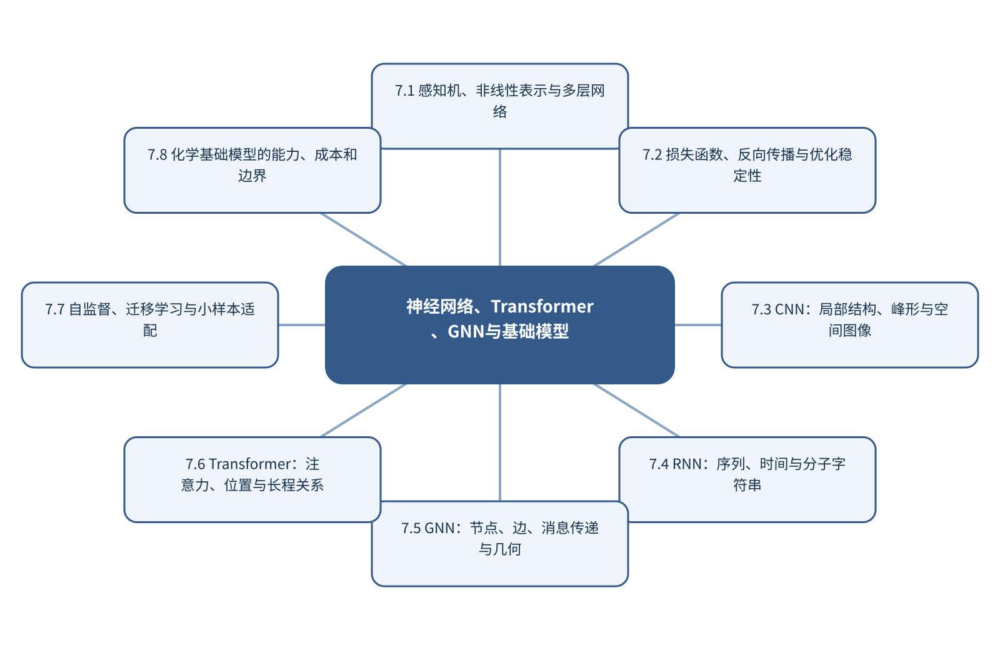

# 第7章 神经网络、Transformer、GNN与基础模型

> 第2篇 化学数据的模型、表示与生成

## 章首导引

不同网络结构的归纳偏置怎样对应谱图、图像、序列和分子图？ 本章的回答是：从训练原理讲到跨模态预训练，避免把模型名称与化学问题脱节。全章以谱图、图像、分子图和序列为对象，坚持“让网络归纳偏置与数据结构匹配”，并通过“对同一光谱比较MLP、1D-CNN和Transformer”把概念、计算和分析决策连为一体。

## 学习目标

- 能够说明谱图、图像、分子图和序列在本章中的数据结构与主要信息来源。
- 能够解释本章关键方法的输入、输出、参数、假设和失效条件。
- 能够以“让网络归纳偏置与数据结构匹配”设计训练、验证和独立测试。
- 能够完成“对同一光谱比较MLP、1D-CNN和Transformer”的最小代码实验并分析失败样本。

## 本章知识图谱

## 7.1 感知机、非线性表示与多层网络

本节围绕“感知机、非线性表示与多层网络”展开。分析对象是谱图、图像、分子图和序列，核心不是罗列名词，而是说明神经元、权重、偏置与激活、隐藏层和非线性表达、前向传播、参数量和模型容量怎样进入同一条测量与推断链。读者首先要辨认哪些量来自真实样品，哪些量由仪器转换得到，哪些量由算法估计；三类量若混在一起，模型精度就很难被解释。

在“感知机、非线性表示与多层网络”中，技术路线遵循“让网络归纳偏置与数据结构匹配”。具体计算从可诊断的经典基线开始，再增加本节所需的非线性、结构先验或不确定度组件。新增组件必须回答一个明确问题，并在相同数据边界下与基线比较；只有平均分提高而误差结构没有改善，不能构成采用复杂模型的充分理由。

本节把“对同一光谱比较MLP、1D-CNN和Transformer”落实到参数量和模型容量这一检查点。验证时保留与未来使用条件一致的独立对象，检查坐标轴、单位、样品身份、批次、参数来源和失败样本。由此得到的结论才可用于下一步测量或实验，而不是停留在一张看似分离良好的图上。

### 7.1.1 神经元、权重、偏置与激活

就“神经元、权重、偏置与激活”而言，在“感知机、非线性表示与多层网络”中，神经元、权重、偏置与激活具体限定了谱图、图像、分子图和序列的一个技术接口。它必须被写成可检查的输入、变换和输出：输入保留样品与仪器条件，变换说明参数从何处估计，输出对应可观察量或候选判断；缺少任何一层，概念就无法进入实验和代码。

把“神经元、权重、偏置与激活”用于“感知机、非线性表示与多层网络”时，本书用“对同一光谱比较MLP、1D-CNN和Transformer”检验神经元、权重、偏置与激活。实现时遵循“让网络归纳偏置与数据结构匹配”，先建立经典基线，再对参数敏感性、独立样品和失败对象进行检查。若结果只能在同批数据或单次划分中成立，应把它视为探索性现象而非稳定规律。读图或读指标时应返回原始数据抽查，避免把表示空间中的几何关系直接当成化学机制。

### 7.1.2 隐藏层和非线性表达

就“隐藏层和非线性表达”而言，在“感知机、非线性表示与多层网络”中，隐藏层和非线性表达具体限定了谱图、图像、分子图和序列的一个技术接口。它必须被写成可检查的输入、变换和输出：输入保留样品与仪器条件，变换说明参数从何处估计，输出对应可观察量或候选判断；缺少任何一层，概念就无法进入实验和代码。

把“隐藏层和非线性表达”用于“感知机、非线性表示与多层网络”时，本书用“对同一光谱比较MLP、1D-CNN和Transformer”检验隐藏层和非线性表达。实现时遵循“让网络归纳偏置与数据结构匹配”，先建立经典基线，再对参数敏感性、独立样品和失败对象进行检查。若结果只能在同批数据或单次划分中成立，应把它视为探索性现象而非稳定规律。最终报告需要给出适用范围和拒绝条件，使方法在证据不足时能够停止输出。

### 7.1.3 前向传播

就“前向传播”而言，在“感知机、非线性表示与多层网络”中，前向传播具体限定了谱图、图像、分子图和序列的一个技术接口。它必须被写成可检查的输入、变换和输出：输入保留样品与仪器条件，变换说明参数从何处估计，输出对应可观察量或候选判断；缺少任何一层，概念就无法进入实验和代码。

把“前向传播”用于“感知机、非线性表示与多层网络”时，本书用“对同一光谱比较MLP、1D-CNN和Transformer”检验前向传播。实现时遵循“让网络归纳偏置与数据结构匹配”，先建立经典基线，再对参数敏感性、独立样品和失败对象进行检查。若结果只能在同批数据或单次划分中成立，应把它视为探索性现象而非稳定规律。教学上应把该概念落实为可观察变量、可运行程序和可反驳检验三层。

### 7.1.4 参数量和模型容量

就“参数量和模型容量”而言，在“感知机、非线性表示与多层网络”中，参数量和模型容量具体限定了谱图、图像、分子图和序列的一个技术接口。它必须被写成可检查的输入、变换和输出：输入保留样品与仪器条件，变换说明参数从何处估计，输出对应可观察量或候选判断；缺少任何一层，概念就无法进入实验和代码。

把“参数量和模型容量”用于“感知机、非线性表示与多层网络”时，本书用“对同一光谱比较MLP、1D-CNN和Transformer”检验参数量和模型容量。实现时遵循“让网络归纳偏置与数据结构匹配”，先建立经典基线，再对参数敏感性、独立样品和失败对象进行检查。若结果只能在同批数据或单次划分中成立，应把它视为探索性现象而非稳定规律。在真实项目中，还应保存参数、软件版本和输入校验结果，以便定位变化来自样品还是计算。

## 7.2 损失函数、反向传播与优化稳定性

本节围绕“损失函数、反向传播与优化稳定性”展开。分析对象是谱图、图像、分子图和序列，核心不是罗列名词，而是说明损失函数与任务目标、反向传播和链式法则、SGD、Adam与学习率、批量、初始化和归一化怎样进入同一条测量与推断链。读者首先要辨认哪些量来自真实样品，哪些量由仪器转换得到，哪些量由算法估计；三类量若混在一起，模型精度就很难被解释。

在“损失函数、反向传播与优化稳定性”中，技术路线遵循“让网络归纳偏置与数据结构匹配”。具体计算从可诊断的经典基线开始，再增加本节所需的非线性、结构先验或不确定度组件。新增组件必须回答一个明确问题，并在相同数据边界下与基线比较；只有平均分提高而误差结构没有改善，不能构成采用复杂模型的充分理由。

本节把“对同一光谱比较MLP、1D-CNN和Transformer”落实到正则化、早停与训练稳定性这一检查点。验证时保留与未来使用条件一致的独立对象，检查坐标轴、单位、样品身份、批次、参数来源和失败样本。由此得到的结论才可用于下一步测量或实验，而不是停留在一张看似分离良好的图上。

### 7.2.1 损失函数与任务目标

就“损失函数与任务目标”而言，在“损失函数、反向传播与优化稳定性”中，损失函数与任务目标具体限定了谱图、图像、分子图和序列的一个技术接口。它必须被写成可检查的输入、变换和输出：输入保留样品与仪器条件，变换说明参数从何处估计，输出对应可观察量或候选判断；缺少任何一层，概念就无法进入实验和代码。

把“损失函数与任务目标”用于“损失函数、反向传播与优化稳定性”时，本书用“对同一光谱比较MLP、1D-CNN和Transformer”检验损失函数与任务目标。实现时遵循“让网络归纳偏置与数据结构匹配”，先建立经典基线，再对参数敏感性、独立样品和失败对象进行检查。若结果只能在同批数据或单次划分中成立，应把它视为探索性现象而非稳定规律。读图或读指标时应返回原始数据抽查，避免把表示空间中的几何关系直接当成化学机制。

### 7.2.2 反向传播和链式法则

就“反向传播和链式法则”而言，在“损失函数、反向传播与优化稳定性”中，反向传播和链式法则具体限定了谱图、图像、分子图和序列的一个技术接口。它必须被写成可检查的输入、变换和输出：输入保留样品与仪器条件，变换说明参数从何处估计，输出对应可观察量或候选判断；缺少任何一层，概念就无法进入实验和代码。

把“反向传播和链式法则”用于“损失函数、反向传播与优化稳定性”时，本书用“对同一光谱比较MLP、1D-CNN和Transformer”检验反向传播和链式法则。实现时遵循“让网络归纳偏置与数据结构匹配”，先建立经典基线，再对参数敏感性、独立样品和失败对象进行检查。若结果只能在同批数据或单次划分中成立，应把它视为探索性现象而非稳定规律。最终报告需要给出适用范围和拒绝条件，使方法在证据不足时能够停止输出。

### 7.2.3 SGD、Adam与学习率

就“SGD、Adam与学习率”而言，在“损失函数、反向传播与优化稳定性”中，SGD、Adam与学习率具体限定了谱图、图像、分子图和序列的一个技术接口。它必须被写成可检查的输入、变换和输出：输入保留样品与仪器条件，变换说明参数从何处估计，输出对应可观察量或候选判断；缺少任何一层，概念就无法进入实验和代码。

把“SGD、Adam与学习率”用于“损失函数、反向传播与优化稳定性”时，本书用“对同一光谱比较MLP、1D-CNN和Transformer”检验SGD、Adam与学习率。实现时遵循“让网络归纳偏置与数据结构匹配”，先建立经典基线，再对参数敏感性、独立样品和失败对象进行检查。若结果只能在同批数据或单次划分中成立，应把它视为探索性现象而非稳定规律。教学上应把该概念落实为可观察变量、可运行程序和可反驳检验三层。

### 7.2.4 批量、初始化和归一化

就“批量、初始化和归一化”而言，在“损失函数、反向传播与优化稳定性”中，批量、初始化和归一化具体限定了谱图、图像、分子图和序列的一个技术接口。它必须被写成可检查的输入、变换和输出：输入保留样品与仪器条件，变换说明参数从何处估计，输出对应可观察量或候选判断；缺少任何一层，概念就无法进入实验和代码。

把“批量、初始化和归一化”用于“损失函数、反向传播与优化稳定性”时，本书用“对同一光谱比较MLP、1D-CNN和Transformer”检验批量、初始化和归一化。实现时遵循“让网络归纳偏置与数据结构匹配”，先建立经典基线，再对参数敏感性、独立样品和失败对象进行检查。若结果只能在同批数据或单次划分中成立，应把它视为探索性现象而非稳定规律。在真实项目中，还应保存参数、软件版本和输入校验结果，以便定位变化来自样品还是计算。

### 7.2.5 正则化、早停与训练稳定性

就“正则化、早停与训练稳定性”而言，围绕“正则化、早停与训练稳定性”，经验风险最小化在有限训练样本上优化平均损失。模型容量过高时，训练风险可以继续下降而真实风险上升。正则化通过限制参数、特征或函数复杂度，换取更稳定的外部性能。

把“正则化、早停与训练稳定性”用于“损失函数、反向传播与优化稳定性”时，在“损失函数、反向传播与优化稳定性”的语境下，L1正则倾向产生稀疏系数，L2正则平滑地收缩全部系数。正则化强度属于超参数，必须在训练折内部选择。化学解释不能简单等同于非零系数，因为相关变量之间的权重可能不稳定。若该步骤改变了样品单位、统计独立性或物理峰形，必须在独立数据上重新证明其有效性。

## 7.3 CNN：局部结构、峰形与空间图像

本节围绕“CNN：局部结构、峰形与空间图像”展开。分析对象是谱图、图像、分子图和序列，核心不是罗列名词，而是说明局部连接和权重共享、一维卷积与谱图、二维卷积与图像、池化、步长和感受野怎样进入同一条测量与推断链。读者首先要辨认哪些量来自真实样品，哪些量由仪器转换得到，哪些量由算法估计；三类量若混在一起，模型精度就很难被解释。

在“CNN：局部结构、峰形与空间图像”中，技术路线遵循“让网络归纳偏置与数据结构匹配”。具体计算从可诊断的经典基线开始，再增加本节所需的非线性、结构先验或不确定度组件。新增组件必须回答一个明确问题，并在相同数据边界下与基线比较；只有平均分提高而误差结构没有改善，不能构成采用复杂模型的充分理由。

本节把“对同一光谱比较MLP、1D-CNN和Transformer”落实到峰宽/对象尺度与卷积核这一检查点。验证时保留与未来使用条件一致的独立对象，检查坐标轴、单位、样品身份、批次、参数来源和失败样本。由此得到的结论才可用于下一步测量或实验，而不是停留在一张看似分离良好的图上。

### 7.3.1 局部连接和权重共享

就“局部连接和权重共享”而言，在“CNN：局部结构、峰形与空间图像”中，局部连接和权重共享具体限定了谱图、图像、分子图和序列的一个技术接口。它必须被写成可检查的输入、变换和输出：输入保留样品与仪器条件，变换说明参数从何处估计，输出对应可观察量或候选判断；缺少任何一层，概念就无法进入实验和代码。

把“局部连接和权重共享”用于“CNN：局部结构、峰形与空间图像”时，本书用“对同一光谱比较MLP、1D-CNN和Transformer”检验局部连接和权重共享。实现时遵循“让网络归纳偏置与数据结构匹配”，先建立经典基线，再对参数敏感性、独立样品和失败对象进行检查。若结果只能在同批数据或单次划分中成立，应把它视为探索性现象而非稳定规律。读图或读指标时应返回原始数据抽查，避免把表示空间中的几何关系直接当成化学机制。

### 7.3.2 一维卷积与谱图

就“一维卷积与谱图”而言，围绕“一维卷积与谱图”，分子图以原子为节点、化学键为空间关系。消息传递网络在每一层聚合邻居信息并更新节点表示，多层传播扩大感受野。全局池化把节点表示汇总为分子级向量。

把“一维卷积与谱图”用于“CNN：局部结构、峰形与空间图像”时，在“CNN：局部结构、峰形与空间图像”的语境下，二维图不能完整表达构象和空间相互作用。使用距离、角度或等变网络可以处理三维几何；SE(3)等变性要求模型输出随旋转和平移按物理规律变化。构象生成、温度和质子化态仍是输入不确定性的来源。最终报告需要给出适用范围和拒绝条件，使方法在证据不足时能够停止输出。

### 7.3.3 二维卷积与图像

就“二维卷积与图像”而言，围绕“二维卷积与图像”，分子图以原子为节点、化学键为空间关系。消息传递网络在每一层聚合邻居信息并更新节点表示，多层传播扩大感受野。全局池化把节点表示汇总为分子级向量。

把“二维卷积与图像”用于“CNN：局部结构、峰形与空间图像”时，在“CNN：局部结构、峰形与空间图像”的语境下，二维图不能完整表达构象和空间相互作用。使用距离、角度或等变网络可以处理三维几何；SE(3)等变性要求模型输出随旋转和平移按物理规律变化。构象生成、温度和质子化态仍是输入不确定性的来源。教学上应把该概念落实为可观察变量、可运行程序和可反驳检验三层。

### 7.3.4 池化、步长和感受野

就“池化、步长和感受野”而言，围绕“池化、步长和感受野”，神经元先计算仿射变换Wx+b，再通过非线性激活构造层级表示。反向传播利用链式法则计算损失对每个参数的梯度，优化器据此更新参数。训练损失下降只说明模型更符合训练目标，不保证科学任务被正确表达。

把“池化、步长和感受野”用于“CNN：局部结构、峰形与空间图像”时，在“CNN：局部结构、峰形与空间图像”的语境下，卷积通过局部连接和权重共享利用相邻变量的结构。一维卷积适合谱图和色谱，二维卷积适合图像。卷积核宽度、层数和步长共同决定感受野，必须与峰宽、空间分辨率或对象尺度匹配。在真实项目中，还应保存参数、软件版本和输入校验结果，以便定位变化来自样品还是计算。

### 7.3.5 峰宽/对象尺度与卷积核

就“峰宽/对象尺度与卷积核”而言，围绕“峰宽/对象尺度与卷积核”，神经元先计算仿射变换Wx+b，再通过非线性激活构造层级表示。反向传播利用链式法则计算损失对每个参数的梯度，优化器据此更新参数。训练损失下降只说明模型更符合训练目标，不保证科学任务被正确表达。

把“峰宽/对象尺度与卷积核”用于“CNN：局部结构、峰形与空间图像”时，在“CNN：局部结构、峰形与空间图像”的语境下，卷积通过局部连接和权重共享利用相邻变量的结构。一维卷积适合谱图和色谱，二维卷积适合图像。卷积核宽度、层数和步长共同决定感受野，必须与峰宽、空间分辨率或对象尺度匹配。若该步骤改变了样品单位、统计独立性或物理峰形，必须在独立数据上重新证明其有效性。

## 7.4 RNN：序列、时间与分子字符串

本节围绕“RNN：序列、时间与分子字符串”展开。分析对象是谱图、图像、分子图和序列，核心不是罗列名词，而是说明序列、时间和隐状态、RNN、LSTM和GRU、SMILES和生物序列、仪器时间序列怎样进入同一条测量与推断链。读者首先要辨认哪些量来自真实样品，哪些量由仪器转换得到，哪些量由算法估计；三类量若混在一起，模型精度就很难被解释。

在“RNN：序列、时间与分子字符串”中，技术路线遵循“让网络归纳偏置与数据结构匹配”。具体计算从可诊断的经典基线开始，再增加本节所需的非线性、结构先验或不确定度组件。新增组件必须回答一个明确问题，并在相同数据边界下与基线比较；只有平均分提高而误差结构没有改善，不能构成采用复杂模型的充分理由。

本节把“对同一光谱比较MLP、1D-CNN和Transformer”落实到长程依赖与并行效率这一检查点。验证时保留与未来使用条件一致的独立对象，检查坐标轴、单位、样品身份、批次、参数来源和失败样本。由此得到的结论才可用于下一步测量或实验，而不是停留在一张看似分离良好的图上。

### 7.4.1 序列、时间和隐状态

就“序列、时间和隐状态”而言，序列、时间和隐状态要求测量时间尺度快于被研究过程的关键变化。采样、传质、仪器响应和数据处理都可能造成时间延迟；若响应时间与反应时间相当，记录到的曲线是系统动力学与仪器核的卷积。

把“序列、时间和隐状态”用于“RNN：序列、时间与分子字符串”时，建模时应保存真实时间戳、同步误差和操作事件，避免把等间隔文件序号当作真实时间。对于在线控制，还要区分毫秒级设备反馈与分钟级科学决策，并用状态估计处理不可直接观察的化学状态。读图或读指标时应返回原始数据抽查，避免把表示空间中的几何关系直接当成化学机制。

### 7.4.2 RNN、LSTM和GRU

就“RNN、LSTM和GRU”而言，在“RNN：序列、时间与分子字符串”中，RNN、LSTM和GRU具体限定了谱图、图像、分子图和序列的一个技术接口。它必须被写成可检查的输入、变换和输出：输入保留样品与仪器条件，变换说明参数从何处估计，输出对应可观察量或候选判断；缺少任何一层，概念就无法进入实验和代码。

把“RNN、LSTM和GRU”用于“RNN：序列、时间与分子字符串”时，本书用“对同一光谱比较MLP、1D-CNN和Transformer”检验RNN、LSTM和GRU。实现时遵循“让网络归纳偏置与数据结构匹配”，先建立经典基线，再对参数敏感性、独立样品和失败对象进行检查。若结果只能在同批数据或单次划分中成立，应把它视为探索性现象而非稳定规律。最终报告需要给出适用范围和拒绝条件，使方法在证据不足时能够停止输出。

### 7.4.3 SMILES和生物序列

就“SMILES和生物序列”而言，在“RNN：序列、时间与分子字符串”中，SMILES和生物序列具体限定了谱图、图像、分子图和序列的一个技术接口。它必须被写成可检查的输入、变换和输出：输入保留样品与仪器条件，变换说明参数从何处估计，输出对应可观察量或候选判断；缺少任何一层，概念就无法进入实验和代码。

把“SMILES和生物序列”用于“RNN：序列、时间与分子字符串”时，本书用“对同一光谱比较MLP、1D-CNN和Transformer”检验SMILES和生物序列。实现时遵循“让网络归纳偏置与数据结构匹配”，先建立经典基线，再对参数敏感性、独立样品和失败对象进行检查。若结果只能在同批数据或单次划分中成立，应把它视为探索性现象而非稳定规律。教学上应把该概念落实为可观察变量、可运行程序和可反驳检验三层。

### 7.4.4 仪器时间序列

就“仪器时间序列”而言，仪器时间序列要求测量时间尺度快于被研究过程的关键变化。采样、传质、仪器响应和数据处理都可能造成时间延迟；若响应时间与反应时间相当，记录到的曲线是系统动力学与仪器核的卷积。

把“仪器时间序列”用于“RNN：序列、时间与分子字符串”时，建模时应保存真实时间戳、同步误差和操作事件，避免把等间隔文件序号当作真实时间。对于在线控制，还要区分毫秒级设备反馈与分钟级科学决策，并用状态估计处理不可直接观察的化学状态。在真实项目中，还应保存参数、软件版本和输入校验结果，以便定位变化来自样品还是计算。

### 7.4.5 长程依赖与并行效率

就“长程依赖与并行效率”而言，在“RNN：序列、时间与分子字符串”中，长程依赖与并行效率具体限定了谱图、图像、分子图和序列的一个技术接口。它必须被写成可检查的输入、变换和输出：输入保留样品与仪器条件，变换说明参数从何处估计，输出对应可观察量或候选判断；缺少任何一层，概念就无法进入实验和代码。

把“长程依赖与并行效率”用于“RNN：序列、时间与分子字符串”时，本书用“对同一光谱比较MLP、1D-CNN和Transformer”检验长程依赖与并行效率。实现时遵循“让网络归纳偏置与数据结构匹配”，先建立经典基线，再对参数敏感性、独立样品和失败对象进行检查。若结果只能在同批数据或单次划分中成立，应把它视为探索性现象而非稳定规律。若该步骤改变了样品单位、统计独立性或物理峰形，必须在独立数据上重新证明其有效性。

## 7.5 GNN：节点、边、消息传递与几何

本节围绕“GNN：节点、边、消息传递与几何”展开。分析对象是谱图、图像、分子图和序列，核心不是罗列名词，而是说明图卷积和消息传递、节点、边和图级任务、分子性质与反应建模、几何图网络怎样进入同一条测量与推断链。读者首先要辨认哪些量来自真实样品，哪些量由仪器转换得到，哪些量由算法估计；三类量若混在一起，模型精度就很难被解释。

在“GNN：节点、边、消息传递与几何”中，技术路线遵循“让网络归纳偏置与数据结构匹配”。具体计算从可诊断的经典基线开始，再增加本节所需的非线性、结构先验或不确定度组件。新增组件必须回答一个明确问题，并在相同数据边界下与基线比较；只有平均分提高而误差结构没有改善，不能构成采用复杂模型的充分理由。

本节把“对同一光谱比较MLP、1D-CNN和Transformer”落实到GNN解释与边界这一检查点。验证时保留与未来使用条件一致的独立对象，检查坐标轴、单位、样品身份、批次、参数来源和失败样本。由此得到的结论才可用于下一步测量或实验，而不是停留在一张看似分离良好的图上。

### 7.5.1 图卷积和消息传递

就“图卷积和消息传递”而言，围绕“图卷积和消息传递”，分子图以原子为节点、化学键为空间关系。消息传递网络在每一层聚合邻居信息并更新节点表示，多层传播扩大感受野。全局池化把节点表示汇总为分子级向量。

把“图卷积和消息传递”用于“GNN：节点、边、消息传递与几何”时，在“GNN：节点、边、消息传递与几何”的语境下，二维图不能完整表达构象和空间相互作用。使用距离、角度或等变网络可以处理三维几何；SE(3)等变性要求模型输出随旋转和平移按物理规律变化。构象生成、温度和质子化态仍是输入不确定性的来源。读图或读指标时应返回原始数据抽查，避免把表示空间中的几何关系直接当成化学机制。

### 7.5.2 节点、边和图级任务

就“节点、边和图级任务”而言，围绕“节点、边和图级任务”，分子图以原子为节点、化学键为空间关系。消息传递网络在每一层聚合邻居信息并更新节点表示，多层传播扩大感受野。全局池化把节点表示汇总为分子级向量。

把“节点、边和图级任务”用于“GNN：节点、边、消息传递与几何”时，在“GNN：节点、边、消息传递与几何”的语境下，二维图不能完整表达构象和空间相互作用。使用距离、角度或等变网络可以处理三维几何；SE(3)等变性要求模型输出随旋转和平移按物理规律变化。构象生成、温度和质子化态仍是输入不确定性的来源。最终报告需要给出适用范围和拒绝条件，使方法在证据不足时能够停止输出。

### 7.5.3 分子性质与反应建模

就“分子性质与反应建模”而言，在“GNN：节点、边、消息传递与几何”中，分子性质与反应建模具体限定了谱图、图像、分子图和序列的一个技术接口。它必须被写成可检查的输入、变换和输出：输入保留样品与仪器条件，变换说明参数从何处估计，输出对应可观察量或候选判断；缺少任何一层，概念就无法进入实验和代码。

把“分子性质与反应建模”用于“GNN：节点、边、消息传递与几何”时，本书用“对同一光谱比较MLP、1D-CNN和Transformer”检验分子性质与反应建模。实现时遵循“让网络归纳偏置与数据结构匹配”，先建立经典基线，再对参数敏感性、独立样品和失败对象进行检查。若结果只能在同批数据或单次划分中成立，应把它视为探索性现象而非稳定规律。教学上应把该概念落实为可观察变量、可运行程序和可反驳检验三层。

### 7.5.4 几何图网络

就“几何图网络”而言，围绕“几何图网络”，分子图以原子为节点、化学键为空间关系。消息传递网络在每一层聚合邻居信息并更新节点表示，多层传播扩大感受野。全局池化把节点表示汇总为分子级向量。

把“几何图网络”用于“GNN：节点、边、消息传递与几何”时，在“GNN：节点、边、消息传递与几何”的语境下，二维图不能完整表达构象和空间相互作用。使用距离、角度或等变网络可以处理三维几何；SE(3)等变性要求模型输出随旋转和平移按物理规律变化。构象生成、温度和质子化态仍是输入不确定性的来源。在真实项目中，还应保存参数、软件版本和输入校验结果，以便定位变化来自样品还是计算。

### 7.5.5 GNN解释与边界

就“GNN解释与边界”而言，在“GNN：节点、边、消息传递与几何”中，GNN解释与边界具体限定了谱图、图像、分子图和序列的一个技术接口。它必须被写成可检查的输入、变换和输出：输入保留样品与仪器条件，变换说明参数从何处估计，输出对应可观察量或候选判断；缺少任何一层，概念就无法进入实验和代码。

把“GNN解释与边界”用于“GNN：节点、边、消息传递与几何”时，本书用“对同一光谱比较MLP、1D-CNN和Transformer”检验GNN解释与边界。实现时遵循“让网络归纳偏置与数据结构匹配”，先建立经典基线，再对参数敏感性、独立样品和失败对象进行检查。若结果只能在同批数据或单次划分中成立，应把它视为探索性现象而非稳定规律。若该步骤改变了样品单位、统计独立性或物理峰形，必须在独立数据上重新证明其有效性。

## 7.6 Transformer：注意力、位置与长程关系

本节围绕“Transformer：注意力、位置与长程关系”展开。分析对象是谱图、图像、分子图和序列，核心不是罗列名词，而是说明Query、Key和Value、缩放点积注意力、位置编码和轴信息、编码器、解码器与掩码怎样进入同一条测量与推断链。读者首先要辨认哪些量来自真实样品，哪些量由仪器转换得到，哪些量由算法估计；三类量若混在一起，模型精度就很难被解释。

在“Transformer：注意力、位置与长程关系”中，技术路线遵循“让网络归纳偏置与数据结构匹配”。具体计算从可诊断的经典基线开始，再增加本节所需的非线性、结构先验或不确定度组件。新增组件必须回答一个明确问题，并在相同数据边界下与基线比较；只有平均分提高而误差结构没有改善，不能构成采用复杂模型的充分理由。

本节把“对同一光谱比较MLP、1D-CNN和Transformer”落实到光谱/分子/多模态Transformer这一检查点。验证时保留与未来使用条件一致的独立对象，检查坐标轴、单位、样品身份、批次、参数来源和失败样本。由此得到的结论才可用于下一步测量或实验，而不是停留在一张看似分离良好的图上。

### 7.6.1 Query、Key和Value

就“Query、Key和Value”而言，在“Transformer：注意力、位置与长程关系”中，Query、Key和Value具体限定了谱图、图像、分子图和序列的一个技术接口。它必须被写成可检查的输入、变换和输出：输入保留样品与仪器条件，变换说明参数从何处估计，输出对应可观察量或候选判断；缺少任何一层，概念就无法进入实验和代码。

把“Query、Key和Value”用于“Transformer：注意力、位置与长程关系”时，本书用“对同一光谱比较MLP、1D-CNN和Transformer”检验Query、Key和Value。实现时遵循“让网络归纳偏置与数据结构匹配”，先建立经典基线，再对参数敏感性、独立样品和失败对象进行检查。若结果只能在同批数据或单次划分中成立，应把它视为探索性现象而非稳定规律。读图或读指标时应返回原始数据抽查，避免把表示空间中的几何关系直接当成化学机制。

### 7.6.2 缩放点积注意力

就“缩放点积注意力”而言，在“Transformer：注意力、位置与长程关系”中，缩放点积注意力具体限定了谱图、图像、分子图和序列的一个技术接口。它必须被写成可检查的输入、变换和输出：输入保留样品与仪器条件，变换说明参数从何处估计，输出对应可观察量或候选判断；缺少任何一层，概念就无法进入实验和代码。

把“缩放点积注意力”用于“Transformer：注意力、位置与长程关系”时，本书用“对同一光谱比较MLP、1D-CNN和Transformer”检验缩放点积注意力。实现时遵循“让网络归纳偏置与数据结构匹配”，先建立经典基线，再对参数敏感性、独立样品和失败对象进行检查。若结果只能在同批数据或单次划分中成立，应把它视为探索性现象而非稳定规律。最终报告需要给出适用范围和拒绝条件，使方法在证据不足时能够停止输出。

### 7.6.3 位置编码和轴信息

就“位置编码和轴信息”而言，在“Transformer：注意力、位置与长程关系”中，位置编码和轴信息具体限定了谱图、图像、分子图和序列的一个技术接口。它必须被写成可检查的输入、变换和输出：输入保留样品与仪器条件，变换说明参数从何处估计，输出对应可观察量或候选判断；缺少任何一层，概念就无法进入实验和代码。

把“位置编码和轴信息”用于“Transformer：注意力、位置与长程关系”时，本书用“对同一光谱比较MLP、1D-CNN和Transformer”检验位置编码和轴信息。实现时遵循“让网络归纳偏置与数据结构匹配”，先建立经典基线，再对参数敏感性、独立样品和失败对象进行检查。若结果只能在同批数据或单次划分中成立，应把它视为探索性现象而非稳定规律。教学上应把该概念落实为可观察变量、可运行程序和可反驳检验三层。

### 7.6.4 编码器、解码器与掩码

就“编码器、解码器与掩码”而言，在“Transformer：注意力、位置与长程关系”中，编码器、解码器与掩码具体限定了谱图、图像、分子图和序列的一个技术接口。它必须被写成可检查的输入、变换和输出：输入保留样品与仪器条件，变换说明参数从何处估计，输出对应可观察量或候选判断；缺少任何一层，概念就无法进入实验和代码。

把“编码器、解码器与掩码”用于“Transformer：注意力、位置与长程关系”时，本书用“对同一光谱比较MLP、1D-CNN和Transformer”检验编码器、解码器与掩码。实现时遵循“让网络归纳偏置与数据结构匹配”，先建立经典基线，再对参数敏感性、独立样品和失败对象进行检查。若结果只能在同批数据或单次划分中成立，应把它视为探索性现象而非稳定规律。在真实项目中，还应保存参数、软件版本和输入校验结果，以便定位变化来自样品还是计算。

### 7.6.5 光谱/分子/多模态Transformer

就“光谱/分子/多模态Transformer”而言，围绕“光谱/分子/多模态Transformer”，缩放点积注意力用QKᵀ/√d计算元素之间的相关分数，经softmax归一化后加权V。查询表示当前元素需要什么信息，键表示其他元素提供什么索引，值表示实际被汇聚的内容。缩放因子防止维度增大后分数过大。

把“光谱/分子/多模态Transformer”用于“Transformer：注意力、位置与长程关系”时，在“Transformer：注意力、位置与长程关系”的语境下，Transformer没有天然顺序概念，必须通过位置编码或结构偏置加入谱轴、序列或实验步骤信息。注意力权重可用于检查模型依赖，但不能直接等同于因果解释；遮挡、反事实和独立实验仍然必要。若该步骤改变了样品单位、统计独立性或物理峰形，必须在独立数据上重新证明其有效性。

## 7.7 自监督、迁移学习与小样本适配

本节围绕“自监督、迁移学习与小样本适配”展开。分析对象是谱图、图像、分子图和序列，核心不是罗列名词，而是说明预文本任务与数据构造、掩码建模和对比学习、迁移学习和微调、Adapter、LoRA和参数高效适配怎样进入同一条测量与推断链。读者首先要辨认哪些量来自真实样品，哪些量由仪器转换得到，哪些量由算法估计；三类量若混在一起，模型精度就很难被解释。

在“自监督、迁移学习与小样本适配”中，技术路线遵循“让网络归纳偏置与数据结构匹配”。具体计算从可诊断的经典基线开始，再增加本节所需的非线性、结构先验或不确定度组件。新增组件必须回答一个明确问题，并在相同数据边界下与基线比较；只有平均分提高而误差结构没有改善，不能构成采用复杂模型的充分理由。

本节把“对同一光谱比较MLP、1D-CNN和Transformer”落实到小样本与域偏移这一检查点。验证时保留与未来使用条件一致的独立对象，检查坐标轴、单位、样品身份、批次、参数来源和失败样本。由此得到的结论才可用于下一步测量或实验，而不是停留在一张看似分离良好的图上。

### 7.7.1 预文本任务与数据构造

就“预文本任务与数据构造”而言，预文本任务与数据构造决定数字能否被重新解释。仅保存强度矩阵会丢失坐标轴、单位、采样间隔、样品身份、仪器参数和校准状态；这些信息一旦脱离原始信号，后续很难判断变化来自化学对象还是采集条件。

把“预文本任务与数据构造”用于“自监督、迁移学习与小样本适配”时，推荐把原始文件设为只读，以持久样品标识连接实验表和信号文件，并为每次转换记录脚本版本、参数和校验码。单位转换、重采样与轴反向属于会改变数值含义的操作，必须在数据进入模型前自动检查。读图或读指标时应返回原始数据抽查，避免把表示空间中的几何关系直接当成化学机制。

### 7.7.2 掩码建模和对比学习

就“掩码建模和对比学习”而言，围绕“掩码建模和对比学习”，多模态学习把结构、谱图、图像、文本和实验条件作为互补观测。早期融合在输入或浅层表示处拼接，要求严格对齐；晚期融合组合独立模型输出，更容易处理缺失模态；联合表示学习则直接优化跨模态对应关系。

把“掩码建模和对比学习”用于“自监督、迁移学习与小样本适配”时，在“自监督、迁移学习与小样本适配”的语境下，对比学习拉近匹配样本的表示并推远不匹配样本。负样本若包含实际相似或同一对象的不同观测，会向模型提供错误监督。评价除下游性能外，还应检查检索、缺失模态稳健性和批次独立性。最终报告需要给出适用范围和拒绝条件，使方法在证据不足时能够停止输出。

### 7.7.3 迁移学习和微调

就“迁移学习和微调”而言，在“自监督、迁移学习与小样本适配”中，迁移学习和微调具体限定了谱图、图像、分子图和序列的一个技术接口。它必须被写成可检查的输入、变换和输出：输入保留样品与仪器条件，变换说明参数从何处估计，输出对应可观察量或候选判断；缺少任何一层，概念就无法进入实验和代码。

把“迁移学习和微调”用于“自监督、迁移学习与小样本适配”时，本书用“对同一光谱比较MLP、1D-CNN和Transformer”检验迁移学习和微调。实现时遵循“让网络归纳偏置与数据结构匹配”，先建立经典基线，再对参数敏感性、独立样品和失败对象进行检查。若结果只能在同批数据或单次划分中成立，应把它视为探索性现象而非稳定规律。教学上应把该概念落实为可观察变量、可运行程序和可反驳检验三层。

### 7.7.4 Adapter、LoRA和参数高效适配

就“Adapter、LoRA和参数高效适配”而言，在“自监督、迁移学习与小样本适配”中，Adapter、LoRA和参数高效适配具体限定了谱图、图像、分子图和序列的一个技术接口。它必须被写成可检查的输入、变换和输出：输入保留样品与仪器条件，变换说明参数从何处估计，输出对应可观察量或候选判断；缺少任何一层，概念就无法进入实验和代码。

把“Adapter、LoRA和参数高效适配”用于“自监督、迁移学习与小样本适配”时，本书用“对同一光谱比较MLP、1D-CNN和Transformer”检验Adapter、LoRA和参数高效适配。实现时遵循“让网络归纳偏置与数据结构匹配”，先建立经典基线，再对参数敏感性、独立样品和失败对象进行检查。若结果只能在同批数据或单次划分中成立，应把它视为探索性现象而非稳定规律。在真实项目中，还应保存参数、软件版本和输入校验结果，以便定位变化来自样品还是计算。

### 7.7.5 小样本与域偏移

就“小样本与域偏移”而言，围绕“小样本与域偏移”，直接标准化学习从从仪器到主仪器的线性映射，使同一标准样品在两个设备上的响应可比较。PDS在局部变量窗口内学习映射，更适合波长相关的差异。传递样品必须覆盖未来样品空间。

把“小样本与域偏移”用于“自监督、迁移学习与小样本适配”时，在“自监督、迁移学习与小样本适配”的语境下，域适应处理训练域与部署域分布不同的问题。MMD比较两个分布在核特征空间中的均值差异，但减小分布距离不保证目标关系保持不变。迁移后必须用独立目标域样品检验定量偏差和失效区域。若该步骤改变了样品单位、统计独立性或物理峰形，必须在独立数据上重新证明其有效性。

## 7.8 化学基础模型的能力、成本和边界

本节围绕“化学基础模型的能力、成本和边界”展开。分析对象是谱图、图像、分子图和序列，核心不是罗列名词，而是说明分子、谱学、图像和生物基础模型、统一表示与任务头、规模、数据质量和计算成本、基准、外推和能力边界怎样进入同一条测量与推断链。读者首先要辨认哪些量来自真实样品，哪些量由仪器转换得到，哪些量由算法估计；三类量若混在一起，模型精度就很难被解释。

在“化学基础模型的能力、成本和边界”中，技术路线遵循“让网络归纳偏置与数据结构匹配”。具体计算从可诊断的经典基线开始，再增加本节所需的非线性、结构先验或不确定度组件。新增组件必须回答一个明确问题，并在相同数据边界下与基线比较；只有平均分提高而误差结构没有改善，不能构成采用复杂模型的充分理由。

本节把“对同一光谱比较MLP、1D-CNN和Transformer”落实到基准、外推和能力边界这一检查点。验证时保留与未来使用条件一致的独立对象，检查坐标轴、单位、样品身份、批次、参数来源和失败样本。由此得到的结论才可用于下一步测量或实验，而不是停留在一张看似分离良好的图上。

### 7.8.1 分子、谱学、图像和生物基础模型

就“分子、谱学、图像和生物基础模型”而言，围绕“分子、谱学、图像和生物基础模型”，分子图以原子为节点、化学键为空间关系。消息传递网络在每一层聚合邻居信息并更新节点表示，多层传播扩大感受野。全局池化把节点表示汇总为分子级向量。

把“分子、谱学、图像和生物基础模型”用于“化学基础模型的能力、成本和边界”时，在“化学基础模型的能力、成本和边界”的语境下，二维图不能完整表达构象和空间相互作用。使用距离、角度或等变网络可以处理三维几何；SE(3)等变性要求模型输出随旋转和平移按物理规律变化。构象生成、温度和质子化态仍是输入不确定性的来源。读图或读指标时应返回原始数据抽查，避免把表示空间中的几何关系直接当成化学机制。

### 7.8.2 统一表示与任务头

就“统一表示与任务头”而言，在“化学基础模型的能力、成本和边界”中，统一表示与任务头具体限定了谱图、图像、分子图和序列的一个技术接口。它必须被写成可检查的输入、变换和输出：输入保留样品与仪器条件，变换说明参数从何处估计，输出对应可观察量或候选判断；缺少任何一层，概念就无法进入实验和代码。

把“统一表示与任务头”用于“化学基础模型的能力、成本和边界”时，本书用“对同一光谱比较MLP、1D-CNN和Transformer”检验统一表示与任务头。实现时遵循“让网络归纳偏置与数据结构匹配”，先建立经典基线，再对参数敏感性、独立样品和失败对象进行检查。若结果只能在同批数据或单次划分中成立，应把它视为探索性现象而非稳定规律。最终报告需要给出适用范围和拒绝条件，使方法在证据不足时能够停止输出。

### 7.8.3 规模、数据质量和计算成本

就“规模、数据质量和计算成本”而言，规模、数据质量和计算成本决定数字能否被重新解释。仅保存强度矩阵会丢失坐标轴、单位、采样间隔、样品身份、仪器参数和校准状态；这些信息一旦脱离原始信号，后续很难判断变化来自化学对象还是采集条件。

把“规模、数据质量和计算成本”用于“化学基础模型的能力、成本和边界”时，推荐把原始文件设为只读，以持久样品标识连接实验表和信号文件，并为每次转换记录脚本版本、参数和校验码。单位转换、重采样与轴反向属于会改变数值含义的操作，必须在数据进入模型前自动检查。教学上应把该概念落实为可观察变量、可运行程序和可反驳检验三层。

### 7.8.4 基准、外推和能力边界

就“基准、外推和能力边界”而言，在“化学基础模型的能力、成本和边界”中，基准、外推和能力边界具体限定了谱图、图像、分子图和序列的一个技术接口。它必须被写成可检查的输入、变换和输出：输入保留样品与仪器条件，变换说明参数从何处估计，输出对应可观察量或候选判断；缺少任何一层，概念就无法进入实验和代码。

把“基准、外推和能力边界”用于“化学基础模型的能力、成本和边界”时，本书用“对同一光谱比较MLP、1D-CNN和Transformer”检验基准、外推和能力边界。实现时遵循“让网络归纳偏置与数据结构匹配”，先建立经典基线，再对参数敏感性、独立样品和失败对象进行检查。若结果只能在同批数据或单次划分中成立，应把它视为探索性现象而非稳定规律。在真实项目中，还应保存参数、软件版本和输入校验结果，以便定位变化来自样品还是计算。

## 关键关系与计算抓手

- `h=σ(Wx+b)`

- `Attention(Q,K,V)=softmax(QKᵀ/√d)V`

## 本章综合案例

本章案例：对同一光谱比较MLP、1D-CNN和Transformer。先明确样品单位、测量协议和数据结构，建立最简单且可诊断的基线；再加入本章核心方法，并在同一独立测试边界下比较。结果至少按批次、信号强弱和适用域分层，给出错误对象而非只报告总体平均数。

完成案例时，应提交问题卡、数据字典、运行日志、关键图表、失败样本清单和可运行程序。任何由模型提出的解释都要能被互补测量或后续实验检验。

## 代码实践

- 任务：用NumPy实现两层网络和缩放点积注意力，并比较MLP、1D-CNN思路。
- 代码：[chapter_exercise.py](../code/ch07.py)

## 本章小结

本章以谱图、图像、分子图和序列为对象，把“神经网络、Transformer、GNN与基础模型”组织为测量、表示、推断和行动的连续过程。复习时应能解释数据如何生成、方法为何适用、性能如何验证，以及证据不足时何时拒绝输出。

## 思考题与计算题

1. 为“对同一光谱比较MLP、1D-CNN和Transformer”画出样品—仪器—数据—模型—结论链，并标出三处可能失真位置。
2. 从本章选择一个方法，写出输入、输出、关键参数、基本假设和至少两个失效条件。
3. 建立一个经典基线，并说明复杂模型必须在哪些独立指标上超过它。
4. 把随机划分改为符合未来使用条件的分组或外推划分，比较结果并解释差异。
5. 完成配套代码，增加一个单元测试和一个失败样本可视化。
6. 设计一个能够区分“模型学到化学信息”和“模型学到批次捷径”的对照实验。

## 下载本章资源

<a href="./downloads/word/ch07.docx" download>Word出版稿</a>　·　<a href="./code/ch07.py" download>Python代码</a>　·　<a href="./assets/graphs/ch07.svg" download>SVG知识图谱</a>

## 年度课程资源、传承题与更新引文

本章的稳定教材内容与逐年更新的教学资源分开维护。维护组须在年度归档中同步补入课件链接、可传承的题目和有来源链接的前沿引文。

- [本学年课程 PPT（PDF）](#/resources/annual/2026-2027/ppt/README?id=ch07)
- [留给下一届的本章传承题](#/resources/annual/2026-2027/questions/README?id=ch07)
- [本章年度新增与修订引文](#/resources/annual/2026-2027/references/README?id=ch07)

---

## 本章共建记录与致谢

| 学年 | 贡献者 | 工作内容 | 关联PR |
|---|---|---|---|
| 待本学年维护组补充 | — | — | — |
