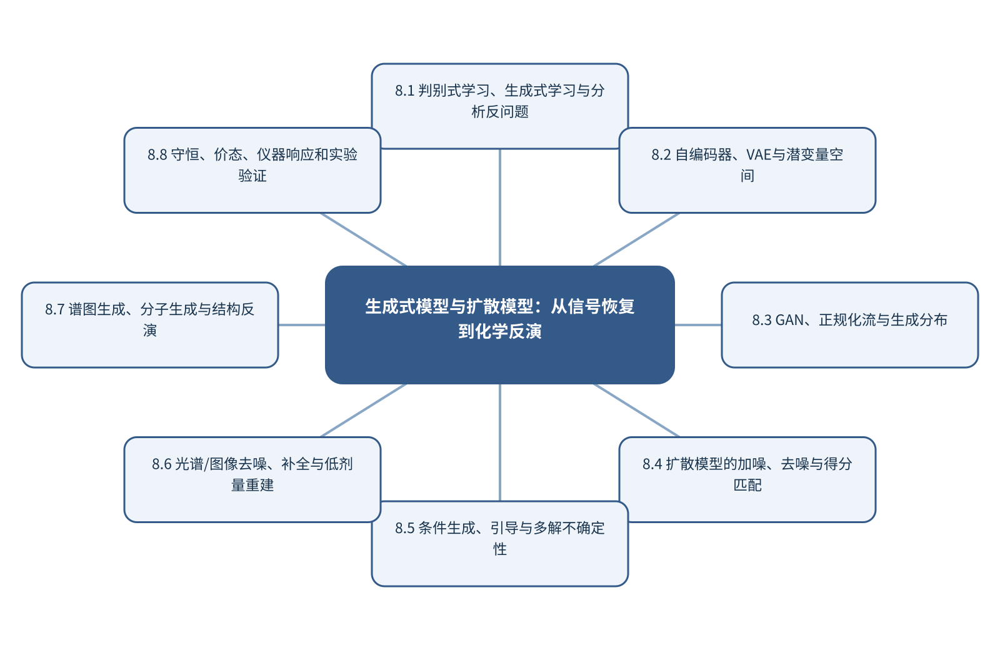

# 第8章 生成式模型与扩散模型：从信号恢复到化学反演

> 第2篇 化学数据的模型、表示与生成　·　建议出版篇幅：24页

## 章首导引

怎样从不完整或低质量观测生成可能的真实信号、结构或状态分布？ 本章的回答是：把生成模型定位为分析化学反问题工具，而不是通用内容生成技术。全章以含噪观测、候选结构与条件分布为对象，坚持“把生成理解为受约束的不确定反演”，并通过“用扩散过程恢复弱光谱并检查峰形是否守恒”把概念、计算和分析决策连为一体。

## 学习目标

- 能够说明含噪观测、候选结构与条件分布在本章中的数据结构与主要信息来源。
- 能够解释本章关键方法的输入、输出、参数、假设和失效条件。
- 能够以“把生成理解为受约束的不确定反演”设计训练、验证和独立测试。
- 能够完成“用扩散过程恢复弱光谱并检查峰形是否守恒”的最小代码实验并分析失败样本。

## 本章知识图谱

## 8.1 判别式学习、生成式学习与分析反问题

本节围绕“判别式学习、生成式学习与分析反问题”展开。分析对象是含噪观测、候选结构与条件分布，核心不是罗列名词，而是说明判别模型与生成模型、概率分布、采样和似然、分析化学中的正问题与反问题、多解性和不确定性怎样进入同一条测量与推断链。读者首先要辨认哪些量来自真实样品，哪些量由仪器转换得到，哪些量由算法估计；三类量若混在一起，模型精度就很难被解释。

在“判别式学习、生成式学习与分析反问题”中，技术路线遵循“把生成理解为受约束的不确定反演”。具体计算从可诊断的经典基线开始，再增加本节所需的非线性、结构先验或不确定度组件。新增组件必须回答一个明确问题，并在相同数据边界下与基线比较；只有平均分提高而误差结构没有改善，不能构成采用复杂模型的充分理由。

本节把“用扩散过程恢复弱光谱并检查峰形是否守恒”落实到多解性和不确定性这一检查点。验证时保留与未来使用条件一致的独立对象，检查坐标轴、单位、样品身份、批次、参数来源和失败样本。由此得到的结论才可用于下一步测量或实验，而不是停留在一张看似分离良好的图上。

### 8.1.1 判别模型与生成模型

就“判别模型与生成模型”而言，在“判别式学习、生成式学习与分析反问题”中，判别模型与生成模型具体限定了含噪观测、候选结构与条件分布的一个技术接口。它必须被写成可检查的输入、变换和输出：输入保留样品与仪器条件，变换说明参数从何处估计，输出对应可观察量或候选判断；缺少任何一层，概念就无法进入实验和代码。

把“判别模型与生成模型”用于“判别式学习、生成式学习与分析反问题”时，本书用“用扩散过程恢复弱光谱并检查峰形是否守恒”检验判别模型与生成模型。实现时遵循“把生成理解为受约束的不确定反演”，先建立经典基线，再对参数敏感性、独立样品和失败对象进行检查。若结果只能在同批数据或单次划分中成立，应把它视为探索性现象而非稳定规律。最终报告需要给出适用范围和拒绝条件，使方法在证据不足时能够停止输出。

### 8.1.2 概率分布、采样和似然

就“概率分布、采样和似然”而言，概率分布、采样和似然决定数据能否代表待回答的总体。分析试份通常只占原始对象极小比例，空间异质、颗粒尺寸、相分布和批次结构会使制样误差大于仪器重复误差；增加同一试份的重复扫描不能弥补缺乏独立取样。

把“概率分布、采样和似然”用于“判别式学习、生成式学习与分析反问题”时，应先定义总体、初级采样单元、实验样品和分析试份，再配置分层或随机取样、混匀和独立重复。训练/测试划分也必须以真正独立的样品单位为边界，否则模型会因伪重复获得虚高性能。教学上应把该概念落实为可观察变量、可运行程序和可反驳检验三层。

### 8.1.3 分析化学中的正问题与反问题

就“分析化学中的正问题与反问题”而言，在“判别式学习、生成式学习与分析反问题”中，分析化学中的正问题与反问题具体限定了含噪观测、候选结构与条件分布的一个技术接口。它必须被写成可检查的输入、变换和输出：输入保留样品与仪器条件，变换说明参数从何处估计，输出对应可观察量或候选判断；缺少任何一层，概念就无法进入实验和代码。

把“分析化学中的正问题与反问题”用于“判别式学习、生成式学习与分析反问题”时，本书用“用扩散过程恢复弱光谱并检查峰形是否守恒”检验分析化学中的正问题与反问题。实现时遵循“把生成理解为受约束的不确定反演”，先建立经典基线，再对参数敏感性、独立样品和失败对象进行检查。若结果只能在同批数据或单次划分中成立，应把它视为探索性现象而非稳定规律。在真实项目中，还应保存参数、软件版本和输入校验结果，以便定位变化来自样品还是计算。

### 8.1.4 多解性和不确定性

就“多解性和不确定性”而言，围绕“多解性和不确定性”，随机误差反映重复测量的波动，系统偏差使结果稳定地偏离参照，不确定度则量化在现有知识下结果可能处于的范围。三者属于不同概念。高重复性不代表无偏，模型测试误差很低也不代表参照标签准确。

把“多解性和不确定性”用于“判别式学习、生成式学习与分析反问题”时，在“判别式学习、生成式学习与分析反问题”的语境下，不确定度应沿采样、制样、校准、仪器、预处理和模型逐步传播。对于线性关系可使用一阶误差传播，对于明显非线性或参数相关的系统可使用蒙特卡洛抽样。报告时应给出覆盖概率、区间构造方法和适用条件，而不是只给一个小数位很多的点估计。若该步骤改变了样品单位、统计独立性或物理峰形，必须在独立数据上重新证明其有效性。

## 8.2 自编码器、VAE与潜变量空间

本节围绕“自编码器、VAE与潜变量空间”展开。分析对象是含噪观测、候选结构与条件分布，核心不是罗列名词，而是说明编码器、潜变量和解码器、重建误差、VAE近似后验和ELBO、KL散度与潜空间连续性怎样进入同一条测量与推断链。读者首先要辨认哪些量来自真实样品，哪些量由仪器转换得到，哪些量由算法估计；三类量若混在一起，模型精度就很难被解释。

在“自编码器、VAE与潜变量空间”中，技术路线遵循“把生成理解为受约束的不确定反演”。具体计算从可诊断的经典基线开始，再增加本节所需的非线性、结构先验或不确定度组件。新增组件必须回答一个明确问题，并在相同数据边界下与基线比较；只有平均分提高而误差结构没有改善，不能构成采用复杂模型的充分理由。

本节把“用扩散过程恢复弱光谱并检查峰形是否守恒”落实到后验坍缩这一检查点。验证时保留与未来使用条件一致的独立对象，检查坐标轴、单位、样品身份、批次、参数来源和失败样本。由此得到的结论才可用于下一步测量或实验，而不是停留在一张看似分离良好的图上。

### 8.2.1 编码器、潜变量和解码器

就“编码器、潜变量和解码器”而言，在“自编码器、VAE与潜变量空间”中，编码器、潜变量和解码器具体限定了含噪观测、候选结构与条件分布的一个技术接口。它必须被写成可检查的输入、变换和输出：输入保留样品与仪器条件，变换说明参数从何处估计，输出对应可观察量或候选判断；缺少任何一层，概念就无法进入实验和代码。

把“编码器、潜变量和解码器”用于“自编码器、VAE与潜变量空间”时，本书用“用扩散过程恢复弱光谱并检查峰形是否守恒”检验编码器、潜变量和解码器。实现时遵循“把生成理解为受约束的不确定反演”，先建立经典基线，再对参数敏感性、独立样品和失败对象进行检查。若结果只能在同批数据或单次划分中成立，应把它视为探索性现象而非稳定规律。最终报告需要给出适用范围和拒绝条件，使方法在证据不足时能够停止输出。

### 8.2.2 重建误差

就“重建误差”而言，围绕“重建误差”，随机误差反映重复测量的波动，系统偏差使结果稳定地偏离参照，不确定度则量化在现有知识下结果可能处于的范围。三者属于不同概念。高重复性不代表无偏，模型测试误差很低也不代表参照标签准确。

把“重建误差”用于“自编码器、VAE与潜变量空间”时，在“自编码器、VAE与潜变量空间”的语境下，不确定度应沿采样、制样、校准、仪器、预处理和模型逐步传播。对于线性关系可使用一阶误差传播，对于明显非线性或参数相关的系统可使用蒙特卡洛抽样。报告时应给出覆盖概率、区间构造方法和适用条件，而不是只给一个小数位很多的点估计。教学上应把该概念落实为可观察变量、可运行程序和可反驳检验三层。

### 8.2.3 VAE近似后验和ELBO

就“VAE近似后验和ELBO”而言，围绕“VAE近似后验和ELBO”，VAE用编码器近似后验q(z|x)，用解码器p(x|z)重建数据。ELBO由重建项和KL散度组成：前者要求潜变量保留数据，后者把近似后验约束到先验附近，使潜空间可采样。

把“VAE近似后验和ELBO”用于“自编码器、VAE与潜变量空间”时，在“自编码器、VAE与潜变量空间”的语境下，重建项过强可能产生不连续潜空间，KL权重过强则导致后验坍缩。化学应用还需在解码阶段检查价态、结构有效性和物理边界，不能只用重建损失判断模型质量。在真实项目中，还应保存参数、软件版本和输入校验结果，以便定位变化来自样品还是计算。

### 8.2.4 KL散度与潜空间连续性

就“KL散度与潜空间连续性”而言，围绕“KL散度与潜空间连续性”，世界模型区分隐藏状态s、观测o、动作a和状态转移。观测只是状态经传感器投影后的结果，智能体需要根据历史观测估计当前状态，再预测候选动作的后果。卡尔曼滤波适合近似线性高斯系统，粒子滤波可表示非线性和多峰分布。

把“KL散度与潜空间连续性”用于“自编码器、VAE与潜变量空间”时，在“自编码器、VAE与潜变量空间”的语境下，MPC在模型中滚动多个动作序列，优化有限时域目标，只执行第一步后便用新观测重新规划。这样可限制长时预测误差。化学世界模型还应满足非负浓度、质量守恒、温压边界和设备约束，并在不确定性过高时请求真实测量。若该步骤改变了样品单位、统计独立性或物理峰形，必须在独立数据上重新证明其有效性。

### 8.2.5 后验坍缩

就“后验坍缩”而言，在“自编码器、VAE与潜变量空间”中，后验坍缩具体限定了含噪观测、候选结构与条件分布的一个技术接口。它必须被写成可检查的输入、变换和输出：输入保留样品与仪器条件，变换说明参数从何处估计，输出对应可观察量或候选判断；缺少任何一层，概念就无法进入实验和代码。

把“后验坍缩”用于“自编码器、VAE与潜变量空间”时，本书用“用扩散过程恢复弱光谱并检查峰形是否守恒”检验后验坍缩。实现时遵循“把生成理解为受约束的不确定反演”，先建立经典基线，再对参数敏感性、独立样品和失败对象进行检查。若结果只能在同批数据或单次划分中成立，应把它视为探索性现象而非稳定规律。读图或读指标时应返回原始数据抽查，避免把表示空间中的几何关系直接当成化学机制。

## 8.3 GAN、正规化流与生成分布

本节围绕“GAN、正规化流与生成分布”展开。分析对象是含噪观测、候选结构与条件分布，核心不是罗列名词，而是说明生成器和判别器、对抗训练与模式坍塌、可逆变换与正规化流、显式似然和采样效率怎样进入同一条测量与推断链。读者首先要辨认哪些量来自真实样品，哪些量由仪器转换得到，哪些量由算法估计；三类量若混在一起，模型精度就很难被解释。

在“GAN、正规化流与生成分布”中，技术路线遵循“把生成理解为受约束的不确定反演”。具体计算从可诊断的经典基线开始，再增加本节所需的非线性、结构先验或不确定度组件。新增组件必须回答一个明确问题，并在相同数据边界下与基线比较；只有平均分提高而误差结构没有改善，不能构成采用复杂模型的充分理由。

本节把“用扩散过程恢复弱光谱并检查峰形是否守恒”落实到显式似然和采样效率这一检查点。验证时保留与未来使用条件一致的独立对象，检查坐标轴、单位、样品身份、批次、参数来源和失败样本。由此得到的结论才可用于下一步测量或实验，而不是停留在一张看似分离良好的图上。

### 8.3.1 生成器和判别器

就“生成器和判别器”而言，在“GAN、正规化流与生成分布”中，生成器和判别器具体限定了含噪观测、候选结构与条件分布的一个技术接口。它必须被写成可检查的输入、变换和输出：输入保留样品与仪器条件，变换说明参数从何处估计，输出对应可观察量或候选判断；缺少任何一层，概念就无法进入实验和代码。

把“生成器和判别器”用于“GAN、正规化流与生成分布”时，本书用“用扩散过程恢复弱光谱并检查峰形是否守恒”检验生成器和判别器。实现时遵循“把生成理解为受约束的不确定反演”，先建立经典基线，再对参数敏感性、独立样品和失败对象进行检查。若结果只能在同批数据或单次划分中成立，应把它视为探索性现象而非稳定规律。最终报告需要给出适用范围和拒绝条件，使方法在证据不足时能够停止输出。

### 8.3.2 对抗训练与模式坍塌

就“对抗训练与模式坍塌”而言，在“GAN、正规化流与生成分布”中，对抗训练与模式坍塌具体限定了含噪观测、候选结构与条件分布的一个技术接口。它必须被写成可检查的输入、变换和输出：输入保留样品与仪器条件，变换说明参数从何处估计，输出对应可观察量或候选判断；缺少任何一层，概念就无法进入实验和代码。

把“对抗训练与模式坍塌”用于“GAN、正规化流与生成分布”时，本书用“用扩散过程恢复弱光谱并检查峰形是否守恒”检验对抗训练与模式坍塌。实现时遵循“把生成理解为受约束的不确定反演”，先建立经典基线，再对参数敏感性、独立样品和失败对象进行检查。若结果只能在同批数据或单次划分中成立，应把它视为探索性现象而非稳定规律。教学上应把该概念落实为可观察变量、可运行程序和可反驳检验三层。

### 8.3.3 可逆变换与正规化流

就“可逆变换与正规化流”而言，在“GAN、正规化流与生成分布”中，可逆变换与正规化流具体限定了含噪观测、候选结构与条件分布的一个技术接口。它必须被写成可检查的输入、变换和输出：输入保留样品与仪器条件，变换说明参数从何处估计，输出对应可观察量或候选判断；缺少任何一层，概念就无法进入实验和代码。

把“可逆变换与正规化流”用于“GAN、正规化流与生成分布”时，本书用“用扩散过程恢复弱光谱并检查峰形是否守恒”检验可逆变换与正规化流。实现时遵循“把生成理解为受约束的不确定反演”，先建立经典基线，再对参数敏感性、独立样品和失败对象进行检查。若结果只能在同批数据或单次划分中成立，应把它视为探索性现象而非稳定规律。在真实项目中，还应保存参数、软件版本和输入校验结果，以便定位变化来自样品还是计算。

### 8.3.4 显式似然和采样效率

就“显式似然和采样效率”而言，显式似然和采样效率决定数据能否代表待回答的总体。分析试份通常只占原始对象极小比例，空间异质、颗粒尺寸、相分布和批次结构会使制样误差大于仪器重复误差；增加同一试份的重复扫描不能弥补缺乏独立取样。

把“显式似然和采样效率”用于“GAN、正规化流与生成分布”时，应先定义总体、初级采样单元、实验样品和分析试份，再配置分层或随机取样、混匀和独立重复。训练/测试划分也必须以真正独立的样品单位为边界，否则模型会因伪重复获得虚高性能。若该步骤改变了样品单位、统计独立性或物理峰形，必须在独立数据上重新证明其有效性。

## 8.4 扩散模型的加噪、去噪与得分匹配

本节围绕“扩散模型的加噪、去噪与得分匹配”展开。分析对象是含噪观测、候选结构与条件分布，核心不是罗列名词，而是说明前向加噪过程、反向去噪过程、噪声预测与score matching、噪声调度怎样进入同一条测量与推断链。读者首先要辨认哪些量来自真实样品，哪些量由仪器转换得到，哪些量由算法估计；三类量若混在一起，模型精度就很难被解释。

在“扩散模型的加噪、去噪与得分匹配”中，技术路线遵循“把生成理解为受约束的不确定反演”。具体计算从可诊断的经典基线开始，再增加本节所需的非线性、结构先验或不确定度组件。新增组件必须回答一个明确问题，并在相同数据边界下与基线比较；只有平均分提高而误差结构没有改善，不能构成采用复杂模型的充分理由。

本节把“用扩散过程恢复弱光谱并检查峰形是否守恒”落实到采样步数与误差这一检查点。验证时保留与未来使用条件一致的独立对象，检查坐标轴、单位、样品身份、批次、参数来源和失败样本。由此得到的结论才可用于下一步测量或实验，而不是停留在一张看似分离良好的图上。

### 8.4.1 前向加噪过程

就“前向加噪过程”而言，在“扩散模型的加噪、去噪与得分匹配”中，前向加噪过程具体限定了含噪观测、候选结构与条件分布的一个技术接口。它必须被写成可检查的输入、变换和输出：输入保留样品与仪器条件，变换说明参数从何处估计，输出对应可观察量或候选判断；缺少任何一层，概念就无法进入实验和代码。

把“前向加噪过程”用于“扩散模型的加噪、去噪与得分匹配”时，本书用“用扩散过程恢复弱光谱并检查峰形是否守恒”检验前向加噪过程。实现时遵循“把生成理解为受约束的不确定反演”，先建立经典基线，再对参数敏感性、独立样品和失败对象进行检查。若结果只能在同批数据或单次划分中成立，应把它视为探索性现象而非稳定规律。最终报告需要给出适用范围和拒绝条件，使方法在证据不足时能够停止输出。

### 8.4.2 反向去噪过程

就“反向去噪过程”而言，围绕“反向去噪过程”，扩散模型的前向过程按预设噪声调度逐步破坏数据，反向模型学习在给定时间步下预测噪声、得分或干净样本。训练可转化为多噪声水平上的去噪回归，采样则从高斯噪声逐步恢复结构。

把“反向去噪过程”用于“扩散模型的加噪、去噪与得分匹配”时，在“扩散模型的加噪、去噪与得分匹配”的语境下，条件扩散把类别、性质、结构或谱图作为控制信号。引导强度过高会牺牲多样性，过低则条件不充分。化学应用必须增加离散结构有效性、守恒关系和正向模拟验证。教学上应把该概念落实为可观察变量、可运行程序和可反驳检验三层。

### 8.4.3 噪声预测与score matching

就“噪声预测与score matching”而言，在“扩散模型的加噪、去噪与得分匹配”中，噪声预测与score matching具体限定了含噪观测、候选结构与条件分布的一个技术接口。它必须被写成可检查的输入、变换和输出：输入保留样品与仪器条件，变换说明参数从何处估计，输出对应可观察量或候选判断；缺少任何一层，概念就无法进入实验和代码。

把“噪声预测与score matching”用于“扩散模型的加噪、去噪与得分匹配”时，本书用“用扩散过程恢复弱光谱并检查峰形是否守恒”检验噪声预测与score matching。实现时遵循“把生成理解为受约束的不确定反演”，先建立经典基线，再对参数敏感性、独立样品和失败对象进行检查。若结果只能在同批数据或单次划分中成立，应把它视为探索性现象而非稳定规律。在真实项目中，还应保存参数、软件版本和输入校验结果，以便定位变化来自样品还是计算。

### 8.4.4 噪声调度

就“噪声调度”而言，在“扩散模型的加噪、去噪与得分匹配”中，噪声调度具体限定了含噪观测、候选结构与条件分布的一个技术接口。它必须被写成可检查的输入、变换和输出：输入保留样品与仪器条件，变换说明参数从何处估计，输出对应可观察量或候选判断；缺少任何一层，概念就无法进入实验和代码。

把“噪声调度”用于“扩散模型的加噪、去噪与得分匹配”时，本书用“用扩散过程恢复弱光谱并检查峰形是否守恒”检验噪声调度。实现时遵循“把生成理解为受约束的不确定反演”，先建立经典基线，再对参数敏感性、独立样品和失败对象进行检查。若结果只能在同批数据或单次划分中成立，应把它视为探索性现象而非稳定规律。若该步骤改变了样品单位、统计独立性或物理峰形，必须在独立数据上重新证明其有效性。

### 8.4.5 采样步数与误差

就“采样步数与误差”而言，围绕“采样步数与误差”，随机误差反映重复测量的波动，系统偏差使结果稳定地偏离参照，不确定度则量化在现有知识下结果可能处于的范围。三者属于不同概念。高重复性不代表无偏，模型测试误差很低也不代表参照标签准确。

把“采样步数与误差”用于“扩散模型的加噪、去噪与得分匹配”时，在“扩散模型的加噪、去噪与得分匹配”的语境下，不确定度应沿采样、制样、校准、仪器、预处理和模型逐步传播。对于线性关系可使用一阶误差传播，对于明显非线性或参数相关的系统可使用蒙特卡洛抽样。报告时应给出覆盖概率、区间构造方法和适用条件，而不是只给一个小数位很多的点估计。读图或读指标时应返回原始数据抽查，避免把表示空间中的几何关系直接当成化学机制。

## 8.5 条件生成、引导与多解不确定性

本节围绕“条件生成、引导与多解不确定性”展开。分析对象是含噪观测、候选结构与条件分布，核心不是罗列名词，而是说明类别、性质和谱图条件、classifier-free guidance、条件强度和多样性、可控生成和约束采样怎样进入同一条测量与推断链。读者首先要辨认哪些量来自真实样品，哪些量由仪器转换得到，哪些量由算法估计；三类量若混在一起，模型精度就很难被解释。

在“条件生成、引导与多解不确定性”中，技术路线遵循“把生成理解为受约束的不确定反演”。具体计算从可诊断的经典基线开始，再增加本节所需的非线性、结构先验或不确定度组件。新增组件必须回答一个明确问题，并在相同数据边界下与基线比较；只有平均分提高而误差结构没有改善，不能构成采用复杂模型的充分理由。

本节把“用扩散过程恢复弱光谱并检查峰形是否守恒”落实到可控生成和约束采样这一检查点。验证时保留与未来使用条件一致的独立对象，检查坐标轴、单位、样品身份、批次、参数来源和失败样本。由此得到的结论才可用于下一步测量或实验，而不是停留在一张看似分离良好的图上。

### 8.5.1 类别、性质和谱图条件

就“类别、性质和谱图条件”而言，围绕“类别、性质和谱图条件”，分子图以原子为节点、化学键为空间关系。消息传递网络在每一层聚合邻居信息并更新节点表示，多层传播扩大感受野。全局池化把节点表示汇总为分子级向量。

把“类别、性质和谱图条件”用于“条件生成、引导与多解不确定性”时，在“条件生成、引导与多解不确定性”的语境下，二维图不能完整表达构象和空间相互作用。使用距离、角度或等变网络可以处理三维几何；SE(3)等变性要求模型输出随旋转和平移按物理规律变化。构象生成、温度和质子化态仍是输入不确定性的来源。最终报告需要给出适用范围和拒绝条件，使方法在证据不足时能够停止输出。

### 8.5.2 classifier-free guidance

就“classifier-free guidance”而言，在“条件生成、引导与多解不确定性”中，classifier-free guidance具体限定了含噪观测、候选结构与条件分布的一个技术接口。它必须被写成可检查的输入、变换和输出：输入保留样品与仪器条件，变换说明参数从何处估计，输出对应可观察量或候选判断；缺少任何一层，概念就无法进入实验和代码。

把“classifier-free guidance”用于“条件生成、引导与多解不确定性”时，本书用“用扩散过程恢复弱光谱并检查峰形是否守恒”检验classifier-free guidance。实现时遵循“把生成理解为受约束的不确定反演”，先建立经典基线，再对参数敏感性、独立样品和失败对象进行检查。若结果只能在同批数据或单次划分中成立，应把它视为探索性现象而非稳定规律。教学上应把该概念落实为可观察变量、可运行程序和可反驳检验三层。

### 8.5.3 条件强度和多样性

就“条件强度和多样性”而言，在“条件生成、引导与多解不确定性”中，条件强度和多样性具体限定了含噪观测、候选结构与条件分布的一个技术接口。它必须被写成可检查的输入、变换和输出：输入保留样品与仪器条件，变换说明参数从何处估计，输出对应可观察量或候选判断；缺少任何一层，概念就无法进入实验和代码。

把“条件强度和多样性”用于“条件生成、引导与多解不确定性”时，本书用“用扩散过程恢复弱光谱并检查峰形是否守恒”检验条件强度和多样性。实现时遵循“把生成理解为受约束的不确定反演”，先建立经典基线，再对参数敏感性、独立样品和失败对象进行检查。若结果只能在同批数据或单次划分中成立，应把它视为探索性现象而非稳定规律。在真实项目中，还应保存参数、软件版本和输入校验结果，以便定位变化来自样品还是计算。

### 8.5.4 可控生成和约束采样

就“可控生成和约束采样”而言，可控生成和约束采样决定数据能否代表待回答的总体。分析试份通常只占原始对象极小比例，空间异质、颗粒尺寸、相分布和批次结构会使制样误差大于仪器重复误差；增加同一试份的重复扫描不能弥补缺乏独立取样。

把“可控生成和约束采样”用于“条件生成、引导与多解不确定性”时，应先定义总体、初级采样单元、实验样品和分析试份，再配置分层或随机取样、混匀和独立重复。训练/测试划分也必须以真正独立的样品单位为边界，否则模型会因伪重复获得虚高性能。若该步骤改变了样品单位、统计独立性或物理峰形，必须在独立数据上重新证明其有效性。

## 8.6 光谱/图像去噪、补全与低剂量重建

本节围绕“光谱/图像去噪、补全与低剂量重建”展开。分析对象是含噪观测、候选结构与条件分布，核心不是罗列名词，而是说明光谱弱信号恢复、谱图补全和超分辨、低光子/低剂量图像重建、基线校正和去卷积怎样进入同一条测量与推断链。读者首先要辨认哪些量来自真实样品，哪些量由仪器转换得到，哪些量由算法估计；三类量若混在一起，模型精度就很难被解释。

在“光谱/图像去噪、补全与低剂量重建”中，技术路线遵循“把生成理解为受约束的不确定反演”。具体计算从可诊断的经典基线开始，再增加本节所需的非线性、结构先验或不确定度组件。新增组件必须回答一个明确问题，并在相同数据边界下与基线比较；只有平均分提高而误差结构没有改善，不能构成采用复杂模型的充分理由。

本节把“用扩散过程恢复弱光谱并检查峰形是否守恒”落实到处理结果的物理核验这一检查点。验证时保留与未来使用条件一致的独立对象，检查坐标轴、单位、样品身份、批次、参数来源和失败样本。由此得到的结论才可用于下一步测量或实验，而不是停留在一张看似分离良好的图上。

### 8.6.1 光谱弱信号恢复

就“光谱弱信号恢复”而言，光谱弱信号恢复把分析难度集中到信号与背景的可分辨性。低丰度并不只意味着峰低，还可能伴随基质抑制、非特异吸附、暗电流和空白污染。提高积分时间只能降低部分随机噪声，不能消除随时间变化的系统背景。

把“光谱弱信号恢复”用于“光谱/图像去噪、补全与低剂量重建”时，设计上应同时使用程序空白、基质空白、加标样和重复测量，区分检出、鉴别和准确定量三个层次。数字去噪若改变峰面积或制造窄峰，会改善视觉效果却破坏量值；因此必须用已知加入量或独立高灵敏方法核验。最终报告需要给出适用范围和拒绝条件，使方法在证据不足时能够停止输出。

### 8.6.2 谱图补全和超分辨

就“谱图补全和超分辨”而言，围绕“谱图补全和超分辨”，分子图以原子为节点、化学键为空间关系。消息传递网络在每一层聚合邻居信息并更新节点表示，多层传播扩大感受野。全局池化把节点表示汇总为分子级向量。

把“谱图补全和超分辨”用于“光谱/图像去噪、补全与低剂量重建”时，在“光谱/图像去噪、补全与低剂量重建”的语境下，二维图不能完整表达构象和空间相互作用。使用距离、角度或等变网络可以处理三维几何；SE(3)等变性要求模型输出随旋转和平移按物理规律变化。构象生成、温度和质子化态仍是输入不确定性的来源。教学上应把该概念落实为可观察变量、可运行程序和可反驳检验三层。

### 8.6.3 低光子/低剂量图像重建

就“低光子/低剂量图像重建”而言，围绕“低光子/低剂量图像重建”，分子图以原子为节点、化学键为空间关系。消息传递网络在每一层聚合邻居信息并更新节点表示，多层传播扩大感受野。全局池化把节点表示汇总为分子级向量。

把“低光子/低剂量图像重建”用于“光谱/图像去噪、补全与低剂量重建”时，在“光谱/图像去噪、补全与低剂量重建”的语境下，二维图不能完整表达构象和空间相互作用。使用距离、角度或等变网络可以处理三维几何；SE(3)等变性要求模型输出随旋转和平移按物理规律变化。构象生成、温度和质子化态仍是输入不确定性的来源。在真实项目中，还应保存参数、软件版本和输入校验结果，以便定位变化来自样品还是计算。

### 8.6.4 基线校正和去卷积

就“基线校正和去卷积”而言，围绕“基线校正和去卷积”，Savitzky-Golay方法在滑动窗口内拟合低阶多项式，可同时实现平滑和导数估计。窗口过短会保留噪声，过长会压低窄峰；多项式阶数过高则增加振荡。参数应根据仪器分辨率、最窄有效峰宽和下游任务共同确定。

把“基线校正和去卷积”用于“光谱/图像去噪、补全与低剂量重建”时，在“光谱/图像去噪、补全与低剂量重建”的语境下，基线校正实质上是在区分慢变化背景与分析信号。多项式、非对称最小二乘和形态学方法对应不同的背景假设。校正后不仅要看曲线是否平直，还要比较峰位、峰宽、峰面积、空白残差和定量偏差。若该步骤改变了样品单位、统计独立性或物理峰形，必须在独立数据上重新证明其有效性。

### 8.6.5 处理结果的物理核验

就“处理结果的物理核验”而言，在“光谱/图像去噪、补全与低剂量重建”中，处理结果的物理核验具体限定了含噪观测、候选结构与条件分布的一个技术接口。它必须被写成可检查的输入、变换和输出：输入保留样品与仪器条件，变换说明参数从何处估计，输出对应可观察量或候选判断；缺少任何一层，概念就无法进入实验和代码。

把“处理结果的物理核验”用于“光谱/图像去噪、补全与低剂量重建”时，本书用“用扩散过程恢复弱光谱并检查峰形是否守恒”检验处理结果的物理核验。实现时遵循“把生成理解为受约束的不确定反演”，先建立经典基线，再对参数敏感性、独立样品和失败对象进行检查。若结果只能在同批数据或单次划分中成立，应把它视为探索性现象而非稳定规律。读图或读指标时应返回原始数据抽查，避免把表示空间中的几何关系直接当成化学机制。

## 8.7 谱图生成、分子生成与结构反演

本节围绕“谱图生成、分子生成与结构反演”展开。分析对象是含噪观测、候选结构与条件分布，核心不是罗列名词，而是说明质谱/红外/NMR正向生成、从谱图到候选结构、分子构象和复合体采样、检索—生成—重排序怎样进入同一条测量与推断链。读者首先要辨认哪些量来自真实样品，哪些量由仪器转换得到，哪些量由算法估计；三类量若混在一起，模型精度就很难被解释。

在“谱图生成、分子生成与结构反演”中，技术路线遵循“把生成理解为受约束的不确定反演”。具体计算从可诊断的经典基线开始，再增加本节所需的非线性、结构先验或不确定度组件。新增组件必须回答一个明确问题，并在相同数据边界下与基线比较；只有平均分提高而误差结构没有改善，不能构成采用复杂模型的充分理由。

本节把“用扩散过程恢复弱光谱并检查峰形是否守恒”落实到训练集记忆与新颖性这一检查点。验证时保留与未来使用条件一致的独立对象，检查坐标轴、单位、样品身份、批次、参数来源和失败样本。由此得到的结论才可用于下一步测量或实验，而不是停留在一张看似分离良好的图上。

### 8.7.1 质谱/红外/NMR正向生成

就“质谱/红外/NMR正向生成”而言，围绕“质谱/红外/NMR正向生成”，NMR化学位移反映局部电子环境，积分与核数相关，裂分和耦合常数提供连接信息。原始自由感应衰减经加窗、零填充、傅里叶变换、相位和基线校正后形成频谱，每一步都会影响峰形与定量。

把“质谱/红外/NMR正向生成”用于“谱图生成、分子生成与结构反演”时，在“谱图生成、分子生成与结构反演”的语境下，自动归属应维护候选结构和证据矩阵。模型预测的化学位移误差必须与候选之间的真实差异比较；当多个候选均落在误差范围内，应引入二维NMR、MS或IR证据，而不是强制给出唯一答案。最终报告需要给出适用范围和拒绝条件，使方法在证据不足时能够停止输出。

### 8.7.2 从谱图到候选结构

就“从谱图到候选结构”而言，围绕“从谱图到候选结构”，分子图以原子为节点、化学键为空间关系。消息传递网络在每一层聚合邻居信息并更新节点表示，多层传播扩大感受野。全局池化把节点表示汇总为分子级向量。

把“从谱图到候选结构”用于“谱图生成、分子生成与结构反演”时，在“谱图生成、分子生成与结构反演”的语境下，二维图不能完整表达构象和空间相互作用。使用距离、角度或等变网络可以处理三维几何；SE(3)等变性要求模型输出随旋转和平移按物理规律变化。构象生成、温度和质子化态仍是输入不确定性的来源。教学上应把该概念落实为可观察变量、可运行程序和可反驳检验三层。

### 8.7.3 分子构象和复合体采样

就“分子构象和复合体采样”而言，分子构象和复合体采样决定数据能否代表待回答的总体。分析试份通常只占原始对象极小比例，空间异质、颗粒尺寸、相分布和批次结构会使制样误差大于仪器重复误差；增加同一试份的重复扫描不能弥补缺乏独立取样。

把“分子构象和复合体采样”用于“谱图生成、分子生成与结构反演”时，应先定义总体、初级采样单元、实验样品和分析试份，再配置分层或随机取样、混匀和独立重复。训练/测试划分也必须以真正独立的样品单位为边界，否则模型会因伪重复获得虚高性能。在真实项目中，还应保存参数、软件版本和输入校验结果，以便定位变化来自样品还是计算。

### 8.7.4 检索—生成—重排序

就“检索—生成—重排序”而言，在“谱图生成、分子生成与结构反演”中，检索—生成—重排序具体限定了含噪观测、候选结构与条件分布的一个技术接口。它必须被写成可检查的输入、变换和输出：输入保留样品与仪器条件，变换说明参数从何处估计，输出对应可观察量或候选判断；缺少任何一层，概念就无法进入实验和代码。

把“检索—生成—重排序”用于“谱图生成、分子生成与结构反演”时，本书用“用扩散过程恢复弱光谱并检查峰形是否守恒”检验检索—生成—重排序。实现时遵循“把生成理解为受约束的不确定反演”，先建立经典基线，再对参数敏感性、独立样品和失败对象进行检查。若结果只能在同批数据或单次划分中成立，应把它视为探索性现象而非稳定规律。若该步骤改变了样品单位、统计独立性或物理峰形，必须在独立数据上重新证明其有效性。

### 8.7.5 训练集记忆与新颖性

就“训练集记忆与新颖性”而言，在“谱图生成、分子生成与结构反演”中，训练集记忆与新颖性具体限定了含噪观测、候选结构与条件分布的一个技术接口。它必须被写成可检查的输入、变换和输出：输入保留样品与仪器条件，变换说明参数从何处估计，输出对应可观察量或候选判断；缺少任何一层，概念就无法进入实验和代码。

把“训练集记忆与新颖性”用于“谱图生成、分子生成与结构反演”时，本书用“用扩散过程恢复弱光谱并检查峰形是否守恒”检验训练集记忆与新颖性。实现时遵循“把生成理解为受约束的不确定反演”，先建立经典基线，再对参数敏感性、独立样品和失败对象进行检查。若结果只能在同批数据或单次划分中成立，应把它视为探索性现象而非稳定规律。读图或读指标时应返回原始数据抽查，避免把表示空间中的几何关系直接当成化学机制。

## 8.8 守恒、价态、仪器响应和实验验证

本节围绕“守恒、价态、仪器响应和实验验证”展开。分析对象是含噪观测、候选结构与条件分布，核心不是罗列名词，而是说明价态、化学计量和质量守恒、峰位、峰宽和仪器响应、可合成性和可测量性、独立正向模型和真实实验验证怎样进入同一条测量与推断链。读者首先要辨认哪些量来自真实样品，哪些量由仪器转换得到，哪些量由算法估计；三类量若混在一起，模型精度就很难被解释。

在“守恒、价态、仪器响应和实验验证”中，技术路线遵循“把生成理解为受约束的不确定反演”。具体计算从可诊断的经典基线开始，再增加本节所需的非线性、结构先验或不确定度组件。新增组件必须回答一个明确问题，并在相同数据边界下与基线比较；只有平均分提高而误差结构没有改善，不能构成采用复杂模型的充分理由。

本节把“用扩散过程恢复弱光谱并检查峰形是否守恒”落实到独立正向模型和真实实验验证这一检查点。验证时保留与未来使用条件一致的独立对象，检查坐标轴、单位、样品身份、批次、参数来源和失败样本。由此得到的结论才可用于下一步测量或实验，而不是停留在一张看似分离良好的图上。

### 8.8.1 价态、化学计量和质量守恒

就“价态、化学计量和质量守恒”而言，在“守恒、价态、仪器响应和实验验证”中，价态、化学计量和质量守恒具体限定了含噪观测、候选结构与条件分布的一个技术接口。它必须被写成可检查的输入、变换和输出：输入保留样品与仪器条件，变换说明参数从何处估计，输出对应可观察量或候选判断；缺少任何一层，概念就无法进入实验和代码。

把“价态、化学计量和质量守恒”用于“守恒、价态、仪器响应和实验验证”时，本书用“用扩散过程恢复弱光谱并检查峰形是否守恒”检验价态、化学计量和质量守恒。实现时遵循“把生成理解为受约束的不确定反演”，先建立经典基线，再对参数敏感性、独立样品和失败对象进行检查。若结果只能在同批数据或单次划分中成立，应把它视为探索性现象而非稳定规律。最终报告需要给出适用范围和拒绝条件，使方法在证据不足时能够停止输出。

### 8.8.2 峰位、峰宽和仪器响应

就“峰位、峰宽和仪器响应”而言，在“守恒、价态、仪器响应和实验验证”中，峰位、峰宽和仪器响应具体限定了含噪观测、候选结构与条件分布的一个技术接口。它必须被写成可检查的输入、变换和输出：输入保留样品与仪器条件，变换说明参数从何处估计，输出对应可观察量或候选判断；缺少任何一层，概念就无法进入实验和代码。

把“峰位、峰宽和仪器响应”用于“守恒、价态、仪器响应和实验验证”时，本书用“用扩散过程恢复弱光谱并检查峰形是否守恒”检验峰位、峰宽和仪器响应。实现时遵循“把生成理解为受约束的不确定反演”，先建立经典基线，再对参数敏感性、独立样品和失败对象进行检查。若结果只能在同批数据或单次划分中成立，应把它视为探索性现象而非稳定规律。教学上应把该概念落实为可观察变量、可运行程序和可反驳检验三层。

### 8.8.3 可合成性和可测量性

就“可合成性和可测量性”而言，在“守恒、价态、仪器响应和实验验证”中，可合成性和可测量性具体限定了含噪观测、候选结构与条件分布的一个技术接口。它必须被写成可检查的输入、变换和输出：输入保留样品与仪器条件，变换说明参数从何处估计，输出对应可观察量或候选判断；缺少任何一层，概念就无法进入实验和代码。

把“可合成性和可测量性”用于“守恒、价态、仪器响应和实验验证”时，本书用“用扩散过程恢复弱光谱并检查峰形是否守恒”检验可合成性和可测量性。实现时遵循“把生成理解为受约束的不确定反演”，先建立经典基线，再对参数敏感性、独立样品和失败对象进行检查。若结果只能在同批数据或单次划分中成立，应把它视为探索性现象而非稳定规律。在真实项目中，还应保存参数、软件版本和输入校验结果，以便定位变化来自样品还是计算。

### 8.8.4 独立正向模型和真实实验验证

就“独立正向模型和真实实验验证”而言，在“守恒、价态、仪器响应和实验验证”中，独立正向模型和真实实验验证具体限定了含噪观测、候选结构与条件分布的一个技术接口。它必须被写成可检查的输入、变换和输出：输入保留样品与仪器条件，变换说明参数从何处估计，输出对应可观察量或候选判断；缺少任何一层，概念就无法进入实验和代码。

把“独立正向模型和真实实验验证”用于“守恒、价态、仪器响应和实验验证”时，本书用“用扩散过程恢复弱光谱并检查峰形是否守恒”检验独立正向模型和真实实验验证。实现时遵循“把生成理解为受约束的不确定反演”，先建立经典基线，再对参数敏感性、独立样品和失败对象进行检查。若结果只能在同批数据或单次划分中成立，应把它视为探索性现象而非稳定规律。若该步骤改变了样品单位、统计独立性或物理峰形，必须在独立数据上重新证明其有效性。

## 关键关系与计算抓手

- `q(x_t|x_0)=N(√ᾱ_t x_0,(1−ᾱ_t)I)`

- `ELBO=E[log p(x|z)]−KL(q(z|x)||p(z))`

## 本章综合案例

本章案例：用扩散过程恢复弱光谱并检查峰形是否守恒。先明确样品单位、测量协议和数据结构，建立最简单且可诊断的基线；再加入本章核心方法，并在同一独立测试边界下比较。结果至少按批次、信号强弱和适用域分层，给出错误对象而非只报告总体平均数。

完成案例时，应提交问题卡、数据字典、运行日志、关键图表、失败样本清单和可运行程序。任何由模型提出的解释都要能被互补测量或后续实验检验。

## 代码实践

- 任务：构造一维光谱扩散过程，比较噪声调度并检查峰位、峰宽和强度守恒。
- 代码：[chapter_exercise.py](../code/ch08.py)

## 本章小结

本章以含噪观测、候选结构与条件分布为对象，把“生成式模型与扩散模型：从信号恢复到化学反演”组织为测量、表示、推断和行动的连续过程。复习时应能解释数据如何生成、方法为何适用、性能如何验证，以及证据不足时何时拒绝输出。

## 思考题与计算题

1. 为“用扩散过程恢复弱光谱并检查峰形是否守恒”画出样品—仪器—数据—模型—结论链，并标出三处可能失真位置。
2. 从本章选择一个方法，写出输入、输出、关键参数、基本假设和至少两个失效条件。
3. 建立一个经典基线，并说明复杂模型必须在哪些独立指标上超过它。
4. 把随机划分改为符合未来使用条件的分组或外推划分，比较结果并解释差异。
5. 完成配套代码，增加一个单元测试和一个失败样本可视化。
6. 设计一个能够区分“模型学到化学信息”和“模型学到批次捷径”的对照实验。

## 下载本章资源

<a href="./downloads/word/ch08.docx" download>Word出版稿</a>　·　<a href="./code/ch08.py" download>Python代码</a>　·　<a href="./assets/graphs/ch08.svg" download>SVG知识图谱</a>
