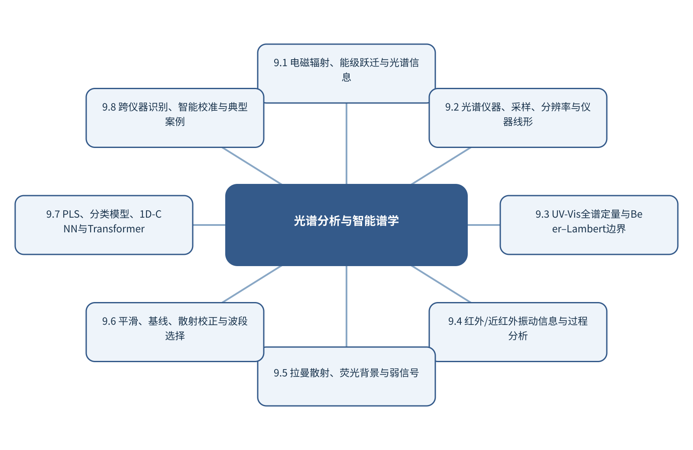

# 第9章 光谱分析与智能谱学

> 第3篇 智能仪器分析与复杂分析对象　·　建议出版篇幅：30页

## 章首导引

不同光谱怎样形成，算法又怎样在不破坏物理信息的前提下增强定性定量？ 本章的回答是：整合UV-Vis、IR/NIR和Raman，以信号形成—预处理—建模—迁移为主线。全章以UV-Vis、红外、近红外和拉曼连续谱为对象，坚持“从光–物质相互作用和仪器响应出发建模”，并通过“跨仪器完成拉曼材料识别与定量”把概念、计算和分析决策连为一体。

## 学习目标

- 能够说明UV-Vis、红外、近红外和拉曼连续谱在本章中的数据结构与主要信息来源。
- 能够解释本章关键方法的输入、输出、参数、假设和失效条件。
- 能够以“从光–物质相互作用和仪器响应出发建模”设计训练、验证和独立测试。
- 能够完成“跨仪器完成拉曼材料识别与定量”的最小代码实验并分析失败样本。

## 本章知识图谱

## 9.1 电磁辐射、能级跃迁与光谱信息

本节围绕“电磁辐射、能级跃迁与光谱信息”展开。分析对象是UV-Vis、红外、近红外和拉曼连续谱，核心不是罗列名词，而是说明电磁波和光–物质相互作用、吸收、发射、散射、反射和透射、能级、跃迁和选择定则、光谱与分子结构信息怎样进入同一条测量与推断链。读者首先要辨认哪些量来自真实样品，哪些量由仪器转换得到，哪些量由算法估计；三类量若混在一起，模型精度就很难被解释。

在“电磁辐射、能级跃迁与光谱信息”中，技术路线遵循“从光–物质相互作用和仪器响应出发建模”。具体计算从可诊断的经典基线开始，再增加本节所需的非线性、结构先验或不确定度组件。新增组件必须回答一个明确问题，并在相同数据边界下与基线比较；只有平均分提高而误差结构没有改善，不能构成采用复杂模型的充分理由。

本节把“跨仪器完成拉曼材料识别与定量”落实到光谱与分子结构信息这一检查点。验证时保留与未来使用条件一致的独立对象，检查坐标轴、单位、样品身份、批次、参数来源和失败样本。由此得到的结论才可用于下一步测量或实验，而不是停留在一张看似分离良好的图上。

### 9.1.1 电磁波和光–物质相互作用

就“电磁波和光–物质相互作用”而言，在“电磁辐射、能级跃迁与光谱信息”中，电磁波和光–物质相互作用具体限定了UV-Vis、红外、近红外和拉曼连续谱的一个技术接口。它必须被写成可检查的输入、变换和输出：输入保留样品与仪器条件，变换说明参数从何处估计，输出对应可观察量或候选判断；缺少任何一层，概念就无法进入实验和代码。

把“电磁波和光–物质相互作用”用于“电磁辐射、能级跃迁与光谱信息”时，本书用“跨仪器完成拉曼材料识别与定量”检验电磁波和光–物质相互作用。实现时遵循“从光–物质相互作用和仪器响应出发建模”，先建立经典基线，再对参数敏感性、独立样品和失败对象进行检查。若结果只能在同批数据或单次划分中成立，应把它视为探索性现象而非稳定规律。教学上应把该概念落实为可观察变量、可运行程序和可反驳检验三层。

### 9.1.2 吸收、发射、散射、反射和透射

就“吸收、发射、散射、反射和透射”而言，在“电磁辐射、能级跃迁与光谱信息”中，吸收、发射、散射、反射和透射具体限定了UV-Vis、红外、近红外和拉曼连续谱的一个技术接口。它必须被写成可检查的输入、变换和输出：输入保留样品与仪器条件，变换说明参数从何处估计，输出对应可观察量或候选判断；缺少任何一层，概念就无法进入实验和代码。

把“吸收、发射、散射、反射和透射”用于“电磁辐射、能级跃迁与光谱信息”时，本书用“跨仪器完成拉曼材料识别与定量”检验吸收、发射、散射、反射和透射。实现时遵循“从光–物质相互作用和仪器响应出发建模”，先建立经典基线，再对参数敏感性、独立样品和失败对象进行检查。若结果只能在同批数据或单次划分中成立，应把它视为探索性现象而非稳定规律。在真实项目中，还应保存参数、软件版本和输入校验结果，以便定位变化来自样品还是计算。

### 9.1.3 能级、跃迁和选择定则

就“能级、跃迁和选择定则”而言，在“电磁辐射、能级跃迁与光谱信息”中，能级、跃迁和选择定则具体限定了UV-Vis、红外、近红外和拉曼连续谱的一个技术接口。它必须被写成可检查的输入、变换和输出：输入保留样品与仪器条件，变换说明参数从何处估计，输出对应可观察量或候选判断；缺少任何一层，概念就无法进入实验和代码。

把“能级、跃迁和选择定则”用于“电磁辐射、能级跃迁与光谱信息”时，本书用“跨仪器完成拉曼材料识别与定量”检验能级、跃迁和选择定则。实现时遵循“从光–物质相互作用和仪器响应出发建模”，先建立经典基线，再对参数敏感性、独立样品和失败对象进行检查。若结果只能在同批数据或单次划分中成立，应把它视为探索性现象而非稳定规律。若该步骤改变了样品单位、统计独立性或物理峰形，必须在独立数据上重新证明其有效性。

### 9.1.4 光谱与分子结构信息

就“光谱与分子结构信息”而言，光谱与分子结构信息属于从观测反推对象的逆问题，常存在多解性。同一峰可由多个结构片段贡献，同一空间热点也可能受厚度、照明或离子抑制影响；因此模型输出首先是候选解释，而不是自动成立的机制。

把“光谱与分子结构信息”用于“电磁辐射、能级跃迁与光谱信息”时，可信解释需要至少一条独立证据链：改变实验条件观察可预测响应、使用互补仪器验证候选，或以标准物质复现特征。显著性图、注意力和SHAP可定位模型依赖，却不能替代干预和机理实验。读图或读指标时应返回原始数据抽查，避免把表示空间中的几何关系直接当成化学机制。

## 9.2 光谱仪器、采样、分辨率与仪器线形

本节围绕“光谱仪器、采样、分辨率与仪器线形”展开。分析对象是UV-Vis、红外、近红外和拉曼连续谱，核心不是罗列名词，而是说明光源、分光系统、样品池和检测器、采样间隔与奈奎斯特条件、分辨率、带宽和仪器线形、波长/波数校准和噪声怎样进入同一条测量与推断链。读者首先要辨认哪些量来自真实样品，哪些量由仪器转换得到，哪些量由算法估计；三类量若混在一起，模型精度就很难被解释。

在“光谱仪器、采样、分辨率与仪器线形”中，技术路线遵循“从光–物质相互作用和仪器响应出发建模”。具体计算从可诊断的经典基线开始，再增加本节所需的非线性、结构先验或不确定度组件。新增组件必须回答一个明确问题，并在相同数据边界下与基线比较；只有平均分提高而误差结构没有改善，不能构成采用复杂模型的充分理由。

本节把“跨仪器完成拉曼材料识别与定量”落实到波长/波数校准和噪声这一检查点。验证时保留与未来使用条件一致的独立对象，检查坐标轴、单位、样品身份、批次、参数来源和失败样本。由此得到的结论才可用于下一步测量或实验，而不是停留在一张看似分离良好的图上。

### 9.2.1 光源、分光系统、样品池和检测器

就“光源、分光系统、样品池和检测器”而言，在“光谱仪器、采样、分辨率与仪器线形”中，光源、分光系统、样品池和检测器具体限定了UV-Vis、红外、近红外和拉曼连续谱的一个技术接口。它必须被写成可检查的输入、变换和输出：输入保留样品与仪器条件，变换说明参数从何处估计，输出对应可观察量或候选判断；缺少任何一层，概念就无法进入实验和代码。

把“光源、分光系统、样品池和检测器”用于“光谱仪器、采样、分辨率与仪器线形”时，本书用“跨仪器完成拉曼材料识别与定量”检验光源、分光系统、样品池和检测器。实现时遵循“从光–物质相互作用和仪器响应出发建模”，先建立经典基线，再对参数敏感性、独立样品和失败对象进行检查。若结果只能在同批数据或单次划分中成立，应把它视为探索性现象而非稳定规律。教学上应把该概念落实为可观察变量、可运行程序和可反驳检验三层。

### 9.2.2 采样间隔与奈奎斯特条件

就“采样间隔与奈奎斯特条件”而言，采样间隔与奈奎斯特条件决定数据能否代表待回答的总体。分析试份通常只占原始对象极小比例，空间异质、颗粒尺寸、相分布和批次结构会使制样误差大于仪器重复误差；增加同一试份的重复扫描不能弥补缺乏独立取样。

把“采样间隔与奈奎斯特条件”用于“光谱仪器、采样、分辨率与仪器线形”时，应先定义总体、初级采样单元、实验样品和分析试份，再配置分层或随机取样、混匀和独立重复。训练/测试划分也必须以真正独立的样品单位为边界，否则模型会因伪重复获得虚高性能。在真实项目中，还应保存参数、软件版本和输入校验结果，以便定位变化来自样品还是计算。

### 9.2.3 分辨率、带宽和仪器线形

就“分辨率、带宽和仪器线形”而言，围绕“分辨率、带宽和仪器线形”，Beer-Lambert定律在理想条件下给出吸光度与浓度、光程和摩尔吸光系数的线性关系。高浓度、化学平衡变化、散射、杂散光和仪器带宽都会破坏线性。机器学习可以拟合非线性，但仍需说明非线性来自化学还是仪器。

把“分辨率、带宽和仪器线形”用于“光谱仪器、采样、分辨率与仪器线形”时，在“光谱仪器、采样、分辨率与仪器线形”的语境下，实际谱图是真实光谱与仪器线形的卷积，并叠加采样和噪声。不同分辨率仪器得到的峰宽和峰高不可直接比较。跨仪器建模前应统一谱轴、分辨率和响应，或显式建立迁移模型。若该步骤改变了样品单位、统计独立性或物理峰形，必须在独立数据上重新证明其有效性。

### 9.2.4 波长/波数校准和噪声

就“波长/波数校准和噪声”而言，围绕“波长/波数校准和噪声”，精确率关注预测为阳性的样品中有多少真正阳性，召回率关注真正阳性中有多少被检出，F1是二者的调和平均。类别极不平衡时，PR曲线比ROC曲线更能反映少数类识别的实际难度。

把“波长/波数校准和噪声”用于“光谱仪器、采样、分辨率与仪器线形”时，在“光谱仪器、采样、分辨率与仪器线形”的语境下，概率校准回答预测概率是否与实际发生率一致。Brier分数同时受到判别和校准影响；可靠性图可显示模型过度自信或过度保守。阈值应根据漏检和误报代价确定，而不是固定在0.5。读图或读指标时应返回原始数据抽查，避免把表示空间中的几何关系直接当成化学机制。

## 9.3 UV-Vis全谱定量与Beer–Lambert边界

本节围绕“UV-Vis全谱定量与Beer–Lambert边界”展开。分析对象是UV-Vis、红外、近红外和拉曼连续谱，核心不是罗列名词，而是说明电子跃迁和吸收带、Beer–Lambert定律、单波长与全谱定量、高浓度、散射和杂散光偏离怎样进入同一条测量与推断链。读者首先要辨认哪些量来自真实样品，哪些量由仪器转换得到，哪些量由算法估计；三类量若混在一起，模型精度就很难被解释。

在“UV-Vis全谱定量与Beer–Lambert边界”中，技术路线遵循“从光–物质相互作用和仪器响应出发建模”。具体计算从可诊断的经典基线开始，再增加本节所需的非线性、结构先验或不确定度组件。新增组件必须回答一个明确问题，并在相同数据边界下与基线比较；只有平均分提高而误差结构没有改善，不能构成采用复杂模型的充分理由。

本节把“跨仪器完成拉曼材料识别与定量”落实到水质与复杂指标案例这一检查点。验证时保留与未来使用条件一致的独立对象，检查坐标轴、单位、样品身份、批次、参数来源和失败样本。由此得到的结论才可用于下一步测量或实验，而不是停留在一张看似分离良好的图上。

### 9.3.1 电子跃迁和吸收带

就“电子跃迁和吸收带”而言，在“UV-Vis全谱定量与Beer–Lambert边界”中，电子跃迁和吸收带具体限定了UV-Vis、红外、近红外和拉曼连续谱的一个技术接口。它必须被写成可检查的输入、变换和输出：输入保留样品与仪器条件，变换说明参数从何处估计，输出对应可观察量或候选判断；缺少任何一层，概念就无法进入实验和代码。

把“电子跃迁和吸收带”用于“UV-Vis全谱定量与Beer–Lambert边界”时，本书用“跨仪器完成拉曼材料识别与定量”检验电子跃迁和吸收带。实现时遵循“从光–物质相互作用和仪器响应出发建模”，先建立经典基线，再对参数敏感性、独立样品和失败对象进行检查。若结果只能在同批数据或单次划分中成立，应把它视为探索性现象而非稳定规律。教学上应把该概念落实为可观察变量、可运行程序和可反驳检验三层。

### 9.3.2 Beer–Lambert定律

就“Beer–Lambert定律”而言，围绕“Beer–Lambert定律”，Beer-Lambert定律在理想条件下给出吸光度与浓度、光程和摩尔吸光系数的线性关系。高浓度、化学平衡变化、散射、杂散光和仪器带宽都会破坏线性。机器学习可以拟合非线性，但仍需说明非线性来自化学还是仪器。

把“Beer–Lambert定律”用于“UV-Vis全谱定量与Beer–Lambert边界”时，在“UV-Vis全谱定量与Beer–Lambert边界”的语境下，实际谱图是真实光谱与仪器线形的卷积，并叠加采样和噪声。不同分辨率仪器得到的峰宽和峰高不可直接比较。跨仪器建模前应统一谱轴、分辨率和响应，或显式建立迁移模型。在真实项目中，还应保存参数、软件版本和输入校验结果，以便定位变化来自样品还是计算。

### 9.3.3 单波长与全谱定量

就“单波长与全谱定量”而言，单波长与全谱定量要求把仪器响应连接到可溯源的量值。校准曲线不仅是一条拟合线，还隐含标准物质、基质、量程、样品前处理和响应稳定性；斜率反映灵敏度，截距与残差可暴露空白、背景和模型失配。

把“单波长与全谱定量”用于“UV-Vis全谱定量与Beer–Lambert边界”时，定量结果至少同时检查偏差、精密度、线性或适用范围、检出限、定量限和回收率。多元模型同样要用独立样品验证，并报告浓度外推、基质变化和仪器漂移下的误差；小数位不能超过参照值和不确定度所支持的精度。若该步骤改变了样品单位、统计独立性或物理峰形，必须在独立数据上重新证明其有效性。

### 9.3.4 高浓度、散射和杂散光偏离

就“高浓度、散射和杂散光偏离”而言，高浓度、散射和杂散光偏离要求把仪器响应连接到可溯源的量值。校准曲线不仅是一条拟合线，还隐含标准物质、基质、量程、样品前处理和响应稳定性；斜率反映灵敏度，截距与残差可暴露空白、背景和模型失配。

把“高浓度、散射和杂散光偏离”用于“UV-Vis全谱定量与Beer–Lambert边界”时，定量结果至少同时检查偏差、精密度、线性或适用范围、检出限、定量限和回收率。多元模型同样要用独立样品验证，并报告浓度外推、基质变化和仪器漂移下的误差；小数位不能超过参照值和不确定度所支持的精度。读图或读指标时应返回原始数据抽查，避免把表示空间中的几何关系直接当成化学机制。

### 9.3.5 水质与复杂指标案例

就“水质与复杂指标案例”而言，在“UV-Vis全谱定量与Beer–Lambert边界”中，水质与复杂指标案例具体限定了UV-Vis、红外、近红外和拉曼连续谱的一个技术接口。它必须被写成可检查的输入、变换和输出：输入保留样品与仪器条件，变换说明参数从何处估计，输出对应可观察量或候选判断；缺少任何一层，概念就无法进入实验和代码。

把“水质与复杂指标案例”用于“UV-Vis全谱定量与Beer–Lambert边界”时，本书用“跨仪器完成拉曼材料识别与定量”检验水质与复杂指标案例。实现时遵循“从光–物质相互作用和仪器响应出发建模”，先建立经典基线，再对参数敏感性、独立样品和失败对象进行检查。若结果只能在同批数据或单次划分中成立，应把它视为探索性现象而非稳定规律。最终报告需要给出适用范围和拒绝条件，使方法在证据不足时能够停止输出。

## 9.4 红外/近红外振动信息与过程分析

本节围绕“红外/近红外振动信息与过程分析”展开。分析对象是UV-Vis、红外、近红外和拉曼连续谱，核心不是罗列名词，而是说明MIR基频和NIR倍频/合频、波长、波数和谱区、官能团、结构与定量信息、过程分析和在线监测怎样进入同一条测量与推断链。读者首先要辨认哪些量来自真实样品，哪些量由仪器转换得到，哪些量由算法估计；三类量若混在一起，模型精度就很难被解释。

在“红外/近红外振动信息与过程分析”中，技术路线遵循“从光–物质相互作用和仪器响应出发建模”。具体计算从可诊断的经典基线开始，再增加本节所需的非线性、结构先验或不确定度组件。新增组件必须回答一个明确问题，并在相同数据边界下与基线比较；只有平均分提高而误差结构没有改善，不能构成采用复杂模型的充分理由。

本节把“跨仪器完成拉曼材料识别与定量”落实到散射和水分影响这一检查点。验证时保留与未来使用条件一致的独立对象，检查坐标轴、单位、样品身份、批次、参数来源和失败样本。由此得到的结论才可用于下一步测量或实验，而不是停留在一张看似分离良好的图上。

### 9.4.1 MIR基频和NIR倍频/合频

就“MIR基频和NIR倍频/合频”而言，在“红外/近红外振动信息与过程分析”中，MIR基频和NIR倍频/合频具体限定了UV-Vis、红外、近红外和拉曼连续谱的一个技术接口。它必须被写成可检查的输入、变换和输出：输入保留样品与仪器条件，变换说明参数从何处估计，输出对应可观察量或候选判断；缺少任何一层，概念就无法进入实验和代码。

把“MIR基频和NIR倍频/合频”用于“红外/近红外振动信息与过程分析”时，本书用“跨仪器完成拉曼材料识别与定量”检验MIR基频和NIR倍频/合频。实现时遵循“从光–物质相互作用和仪器响应出发建模”，先建立经典基线，再对参数敏感性、独立样品和失败对象进行检查。若结果只能在同批数据或单次划分中成立，应把它视为探索性现象而非稳定规律。教学上应把该概念落实为可观察变量、可运行程序和可反驳检验三层。

### 9.4.2 波长、波数和谱区

就“波长、波数和谱区”而言，在“红外/近红外振动信息与过程分析”中，波长、波数和谱区具体限定了UV-Vis、红外、近红外和拉曼连续谱的一个技术接口。它必须被写成可检查的输入、变换和输出：输入保留样品与仪器条件，变换说明参数从何处估计，输出对应可观察量或候选判断；缺少任何一层，概念就无法进入实验和代码。

把“波长、波数和谱区”用于“红外/近红外振动信息与过程分析”时，本书用“跨仪器完成拉曼材料识别与定量”检验波长、波数和谱区。实现时遵循“从光–物质相互作用和仪器响应出发建模”，先建立经典基线，再对参数敏感性、独立样品和失败对象进行检查。若结果只能在同批数据或单次划分中成立，应把它视为探索性现象而非稳定规律。在真实项目中，还应保存参数、软件版本和输入校验结果，以便定位变化来自样品还是计算。

### 9.4.3 官能团、结构与定量信息

就“官能团、结构与定量信息”而言，官能团、结构与定量信息要求把仪器响应连接到可溯源的量值。校准曲线不仅是一条拟合线，还隐含标准物质、基质、量程、样品前处理和响应稳定性；斜率反映灵敏度，截距与残差可暴露空白、背景和模型失配。

把“官能团、结构与定量信息”用于“红外/近红外振动信息与过程分析”时，定量结果至少同时检查偏差、精密度、线性或适用范围、检出限、定量限和回收率。多元模型同样要用独立样品验证，并报告浓度外推、基质变化和仪器漂移下的误差；小数位不能超过参照值和不确定度所支持的精度。若该步骤改变了样品单位、统计独立性或物理峰形，必须在独立数据上重新证明其有效性。

### 9.4.4 过程分析和在线监测

就“过程分析和在线监测”而言，过程分析和在线监测要求测量时间尺度快于被研究过程的关键变化。采样、传质、仪器响应和数据处理都可能造成时间延迟；若响应时间与反应时间相当，记录到的曲线是系统动力学与仪器核的卷积。

把“过程分析和在线监测”用于“红外/近红外振动信息与过程分析”时，建模时应保存真实时间戳、同步误差和操作事件，避免把等间隔文件序号当作真实时间。对于在线控制，还要区分毫秒级设备反馈与分钟级科学决策，并用状态估计处理不可直接观察的化学状态。读图或读指标时应返回原始数据抽查，避免把表示空间中的几何关系直接当成化学机制。

### 9.4.5 散射和水分影响

就“散射和水分影响”而言，在“红外/近红外振动信息与过程分析”中，散射和水分影响具体限定了UV-Vis、红外、近红外和拉曼连续谱的一个技术接口。它必须被写成可检查的输入、变换和输出：输入保留样品与仪器条件，变换说明参数从何处估计，输出对应可观察量或候选判断；缺少任何一层，概念就无法进入实验和代码。

把“散射和水分影响”用于“红外/近红外振动信息与过程分析”时，本书用“跨仪器完成拉曼材料识别与定量”检验散射和水分影响。实现时遵循“从光–物质相互作用和仪器响应出发建模”，先建立经典基线，再对参数敏感性、独立样品和失败对象进行检查。若结果只能在同批数据或单次划分中成立，应把它视为探索性现象而非稳定规律。最终报告需要给出适用范围和拒绝条件，使方法在证据不足时能够停止输出。

## 9.5 拉曼散射、荧光背景与弱信号

本节围绕“拉曼散射、荧光背景与弱信号”展开。分析对象是UV-Vis、红外、近红外和拉曼连续谱，核心不是罗列名词，而是说明Rayleigh、Stokes和anti-Stokes、拉曼位移与强度、荧光背景和宇宙射线尖峰、SERS/TERS增强怎样进入同一条测量与推断链。读者首先要辨认哪些量来自真实样品，哪些量由仪器转换得到，哪些量由算法估计；三类量若混在一起，模型精度就很难被解释。

在“拉曼散射、荧光背景与弱信号”中，技术路线遵循“从光–物质相互作用和仪器响应出发建模”。具体计算从可诊断的经典基线开始，再增加本节所需的非线性、结构先验或不确定度组件。新增组件必须回答一个明确问题，并在相同数据边界下与基线比较；只有平均分提高而误差结构没有改善，不能构成采用复杂模型的充分理由。

本节把“跨仪器完成拉曼材料识别与定量”落实到材料、生物和环境案例这一检查点。验证时保留与未来使用条件一致的独立对象，检查坐标轴、单位、样品身份、批次、参数来源和失败样本。由此得到的结论才可用于下一步测量或实验，而不是停留在一张看似分离良好的图上。

### 9.5.1 Rayleigh、Stokes和anti-Stokes

就“Rayleigh、Stokes和anti-Stokes”而言，围绕“Rayleigh、Stokes和anti-Stokes”，高斯过程用均值函数和核函数定义函数值之间的联合分布。给定观测后，可解析得到新点的后验均值和方差。均值用于预测，方差表达由数据覆盖和核假设共同决定的认知不确定性。

把“Rayleigh、Stokes和anti-Stokes”用于“拉曼散射、荧光背景与弱信号”时，在“拉曼散射、荧光背景与弱信号”的语境下，获取函数把预测分布转为下一次实验的选择标准。UCB以μ+κσ权衡高预测值和高不确定性；期望改进计算相对当前最优值的期望收益。安全约束、可合成性和仪器范围必须先过滤候选，再进行获取函数排序。教学上应把该概念落实为可观察变量、可运行程序和可反驳检验三层。

### 9.5.2 拉曼位移与强度

就“拉曼位移与强度”而言，在“拉曼散射、荧光背景与弱信号”中，拉曼位移与强度具体限定了UV-Vis、红外、近红外和拉曼连续谱的一个技术接口。它必须被写成可检查的输入、变换和输出：输入保留样品与仪器条件，变换说明参数从何处估计，输出对应可观察量或候选判断；缺少任何一层，概念就无法进入实验和代码。

把“拉曼位移与强度”用于“拉曼散射、荧光背景与弱信号”时，本书用“跨仪器完成拉曼材料识别与定量”检验拉曼位移与强度。实现时遵循“从光–物质相互作用和仪器响应出发建模”，先建立经典基线，再对参数敏感性、独立样品和失败对象进行检查。若结果只能在同批数据或单次划分中成立，应把它视为探索性现象而非稳定规律。在真实项目中，还应保存参数、软件版本和输入校验结果，以便定位变化来自样品还是计算。

### 9.5.3 荧光背景和宇宙射线尖峰

就“荧光背景和宇宙射线尖峰”而言，在“拉曼散射、荧光背景与弱信号”中，荧光背景和宇宙射线尖峰具体限定了UV-Vis、红外、近红外和拉曼连续谱的一个技术接口。它必须被写成可检查的输入、变换和输出：输入保留样品与仪器条件，变换说明参数从何处估计，输出对应可观察量或候选判断；缺少任何一层，概念就无法进入实验和代码。

把“荧光背景和宇宙射线尖峰”用于“拉曼散射、荧光背景与弱信号”时，本书用“跨仪器完成拉曼材料识别与定量”检验荧光背景和宇宙射线尖峰。实现时遵循“从光–物质相互作用和仪器响应出发建模”，先建立经典基线，再对参数敏感性、独立样品和失败对象进行检查。若结果只能在同批数据或单次划分中成立，应把它视为探索性现象而非稳定规律。若该步骤改变了样品单位、统计独立性或物理峰形，必须在独立数据上重新证明其有效性。

### 9.5.4 SERS/TERS增强

就“SERS/TERS增强”而言，在“拉曼散射、荧光背景与弱信号”中，SERS/TERS增强具体限定了UV-Vis、红外、近红外和拉曼连续谱的一个技术接口。它必须被写成可检查的输入、变换和输出：输入保留样品与仪器条件，变换说明参数从何处估计，输出对应可观察量或候选判断；缺少任何一层，概念就无法进入实验和代码。

把“SERS/TERS增强”用于“拉曼散射、荧光背景与弱信号”时，本书用“跨仪器完成拉曼材料识别与定量”检验SERS/TERS增强。实现时遵循“从光–物质相互作用和仪器响应出发建模”，先建立经典基线，再对参数敏感性、独立样品和失败对象进行检查。若结果只能在同批数据或单次划分中成立，应把它视为探索性现象而非稳定规律。读图或读指标时应返回原始数据抽查，避免把表示空间中的几何关系直接当成化学机制。

### 9.5.5 材料、生物和环境案例

就“材料、生物和环境案例”而言，在“拉曼散射、荧光背景与弱信号”中，材料、生物和环境案例具体限定了UV-Vis、红外、近红外和拉曼连续谱的一个技术接口。它必须被写成可检查的输入、变换和输出：输入保留样品与仪器条件，变换说明参数从何处估计，输出对应可观察量或候选判断；缺少任何一层，概念就无法进入实验和代码。

把“材料、生物和环境案例”用于“拉曼散射、荧光背景与弱信号”时，本书用“跨仪器完成拉曼材料识别与定量”检验材料、生物和环境案例。实现时遵循“从光–物质相互作用和仪器响应出发建模”，先建立经典基线，再对参数敏感性、独立样品和失败对象进行检查。若结果只能在同批数据或单次划分中成立，应把它视为探索性现象而非稳定规律。最终报告需要给出适用范围和拒绝条件，使方法在证据不足时能够停止输出。

## 9.6 平滑、基线、散射校正与波段选择

本节围绕“平滑、基线、散射校正与波段选择”展开。分析对象是UV-Vis、红外、近红外和拉曼连续谱，核心不是罗列名词，而是说明平滑、导数和基线校正、SNV、MSC和归一化、光谱对齐与分辨率匹配、波段选择和特征提取怎样进入同一条测量与推断链。读者首先要辨认哪些量来自真实样品，哪些量由仪器转换得到，哪些量由算法估计；三类量若混在一起，模型精度就很难被解释。

在“平滑、基线、散射校正与波段选择”中，技术路线遵循“从光–物质相互作用和仪器响应出发建模”。具体计算从可诊断的经典基线开始，再增加本节所需的非线性、结构先验或不确定度组件。新增组件必须回答一个明确问题，并在相同数据边界下与基线比较；只有平均分提高而误差结构没有改善，不能构成采用复杂模型的充分理由。

本节把“跨仪器完成拉曼材料识别与定量”落实到预处理对化学峰的影响这一检查点。验证时保留与未来使用条件一致的独立对象，检查坐标轴、单位、样品身份、批次、参数来源和失败样本。由此得到的结论才可用于下一步测量或实验，而不是停留在一张看似分离良好的图上。

### 9.6.1 平滑、导数和基线校正

就“平滑、导数和基线校正”而言，围绕“平滑、导数和基线校正”，Savitzky-Golay方法在滑动窗口内拟合低阶多项式，可同时实现平滑和导数估计。窗口过短会保留噪声，过长会压低窄峰；多项式阶数过高则增加振荡。参数应根据仪器分辨率、最窄有效峰宽和下游任务共同确定。

把“平滑、导数和基线校正”用于“平滑、基线、散射校正与波段选择”时，在“平滑、基线、散射校正与波段选择”的语境下，基线校正实质上是在区分慢变化背景与分析信号。多项式、非对称最小二乘和形态学方法对应不同的背景假设。校正后不仅要看曲线是否平直，还要比较峰位、峰宽、峰面积、空白残差和定量偏差。教学上应把该概念落实为可观察变量、可运行程序和可反驳检验三层。

### 9.6.2 SNV、MSC和归一化

就“SNV、MSC和归一化”而言，围绕“SNV、MSC和归一化”，中心化和尺度变换改变变量在距离、协方差和损失函数中的权重。标准化适合量纲和方差差异显著的变量；SNV对每条光谱独立中心化并按其标准差缩放；MSC则用参照光谱估计加性和乘性散射。它们解决的问题不同，不能作为无条件的默认步骤。

把“SNV、MSC和归一化”用于“平滑、基线、散射校正与波段选择”时，在“平滑、基线、散射校正与波段选择”的语境下，所有缩放参数必须只在训练数据上估计，再应用到验证和测试数据。否则测试集均值、方差或参照谱会进入训练过程，造成信息泄漏。处理效果应同时检查模型误差、峰形变化和跨批次稳定性。在真实项目中，还应保存参数、软件版本和输入校验结果，以便定位变化来自样品还是计算。

### 9.6.3 光谱对齐与分辨率匹配

就“光谱对齐与分辨率匹配”而言，在“平滑、基线、散射校正与波段选择”中，光谱对齐与分辨率匹配具体限定了UV-Vis、红外、近红外和拉曼连续谱的一个技术接口。它必须被写成可检查的输入、变换和输出：输入保留样品与仪器条件，变换说明参数从何处估计，输出对应可观察量或候选判断；缺少任何一层，概念就无法进入实验和代码。

把“光谱对齐与分辨率匹配”用于“平滑、基线、散射校正与波段选择”时，本书用“跨仪器完成拉曼材料识别与定量”检验光谱对齐与分辨率匹配。实现时遵循“从光–物质相互作用和仪器响应出发建模”，先建立经典基线，再对参数敏感性、独立样品和失败对象进行检查。若结果只能在同批数据或单次划分中成立，应把它视为探索性现象而非稳定规律。若该步骤改变了样品单位、统计独立性或物理峰形，必须在独立数据上重新证明其有效性。

### 9.6.4 波段选择和特征提取

就“波段选择和特征提取”而言，在“平滑、基线、散射校正与波段选择”中，波段选择和特征提取具体限定了UV-Vis、红外、近红外和拉曼连续谱的一个技术接口。它必须被写成可检查的输入、变换和输出：输入保留样品与仪器条件，变换说明参数从何处估计，输出对应可观察量或候选判断；缺少任何一层，概念就无法进入实验和代码。

把“波段选择和特征提取”用于“平滑、基线、散射校正与波段选择”时，本书用“跨仪器完成拉曼材料识别与定量”检验波段选择和特征提取。实现时遵循“从光–物质相互作用和仪器响应出发建模”，先建立经典基线，再对参数敏感性、独立样品和失败对象进行检查。若结果只能在同批数据或单次划分中成立，应把它视为探索性现象而非稳定规律。读图或读指标时应返回原始数据抽查，避免把表示空间中的几何关系直接当成化学机制。

### 9.6.5 预处理对化学峰的影响

就“预处理对化学峰的影响”而言，在“平滑、基线、散射校正与波段选择”中，预处理对化学峰的影响具体限定了UV-Vis、红外、近红外和拉曼连续谱的一个技术接口。它必须被写成可检查的输入、变换和输出：输入保留样品与仪器条件，变换说明参数从何处估计，输出对应可观察量或候选判断；缺少任何一层，概念就无法进入实验和代码。

把“预处理对化学峰的影响”用于“平滑、基线、散射校正与波段选择”时，本书用“跨仪器完成拉曼材料识别与定量”检验预处理对化学峰的影响。实现时遵循“从光–物质相互作用和仪器响应出发建模”，先建立经典基线，再对参数敏感性、独立样品和失败对象进行检查。若结果只能在同批数据或单次划分中成立，应把它视为探索性现象而非稳定规律。最终报告需要给出适用范围和拒绝条件，使方法在证据不足时能够停止输出。

## 9.7 PLS、分类模型、1D-CNN与Transformer

本节围绕“PLS、分类模型、1D-CNN与Transformer”展开。分析对象是UV-Vis、红外、近红外和拉曼连续谱，核心不是罗列名词，而是说明PCA/PLS与PLS-DA、SVM、随机森林和集成学习、1D-CNN与Transformer、自监督光谱表示怎样进入同一条测量与推断链。读者首先要辨认哪些量来自真实样品，哪些量由仪器转换得到，哪些量由算法估计；三类量若混在一起，模型精度就很难被解释。

在“PLS、分类模型、1D-CNN与Transformer”中，技术路线遵循“从光–物质相互作用和仪器响应出发建模”。具体计算从可诊断的经典基线开始，再增加本节所需的非线性、结构先验或不确定度组件。新增组件必须回答一个明确问题，并在相同数据边界下与基线比较；只有平均分提高而误差结构没有改善，不能构成采用复杂模型的充分理由。

本节把“跨仪器完成拉曼材料识别与定量”落实到误差分层和适用域这一检查点。验证时保留与未来使用条件一致的独立对象，检查坐标轴、单位、样品身份、批次、参数来源和失败样本。由此得到的结论才可用于下一步测量或实验，而不是停留在一张看似分离良好的图上。

### 9.7.1 PCA/PLS与PLS-DA

就“PCA/PLS与PLS-DA”而言，围绕“PCA/PLS与PLS-DA”，奇异值分解将中心化矩阵写为X=UΣVᵀ。右奇异向量给出变量空间的正交方向，奇异值刻画每个方向承载的变化，UΣ形成样品得分。PCA可视为保留最大方差方向的低秩近似，但最大方差不一定等于与目标最相关的化学变化。

把“PCA/PLS与PLS-DA”用于“PLS、分类模型、1D-CNN与Transformer”时，在“PLS、分类模型、1D-CNN与Transformer”的语境下，解释PCA必须同时阅读得分、载荷和残差。得分显示样品在潜变量空间的位置，载荷提示变量对方向的贡献，Q残差反映模型未解释的结构。任何聚类或分离都应回到原始谱图、批次和样品信息验证。教学上应把该概念落实为可观察变量、可运行程序和可反驳检验三层。

### 9.7.2 SVM、随机森林和集成学习

就“SVM、随机森林和集成学习”而言，在“PLS、分类模型、1D-CNN与Transformer”中，SVM、随机森林和集成学习具体限定了UV-Vis、红外、近红外和拉曼连续谱的一个技术接口。它必须被写成可检查的输入、变换和输出：输入保留样品与仪器条件，变换说明参数从何处估计，输出对应可观察量或候选判断；缺少任何一层，概念就无法进入实验和代码。

把“SVM、随机森林和集成学习”用于“PLS、分类模型、1D-CNN与Transformer”时，本书用“跨仪器完成拉曼材料识别与定量”检验SVM、随机森林和集成学习。实现时遵循“从光–物质相互作用和仪器响应出发建模”，先建立经典基线，再对参数敏感性、独立样品和失败对象进行检查。若结果只能在同批数据或单次划分中成立，应把它视为探索性现象而非稳定规律。在真实项目中，还应保存参数、软件版本和输入校验结果，以便定位变化来自样品还是计算。

### 9.7.3 1D-CNN与Transformer

就“1D-CNN与Transformer”而言，围绕“1D-CNN与Transformer”，缩放点积注意力用QKᵀ/√d计算元素之间的相关分数，经softmax归一化后加权V。查询表示当前元素需要什么信息，键表示其他元素提供什么索引，值表示实际被汇聚的内容。缩放因子防止维度增大后分数过大。

把“1D-CNN与Transformer”用于“PLS、分类模型、1D-CNN与Transformer”时，在“PLS、分类模型、1D-CNN与Transformer”的语境下，Transformer没有天然顺序概念，必须通过位置编码或结构偏置加入谱轴、序列或实验步骤信息。注意力权重可用于检查模型依赖，但不能直接等同于因果解释；遮挡、反事实和独立实验仍然必要。若该步骤改变了样品单位、统计独立性或物理峰形，必须在独立数据上重新证明其有效性。

### 9.7.4 自监督光谱表示

就“自监督光谱表示”而言，在“PLS、分类模型、1D-CNN与Transformer”中，自监督光谱表示具体限定了UV-Vis、红外、近红外和拉曼连续谱的一个技术接口。它必须被写成可检查的输入、变换和输出：输入保留样品与仪器条件，变换说明参数从何处估计，输出对应可观察量或候选判断；缺少任何一层，概念就无法进入实验和代码。

把“自监督光谱表示”用于“PLS、分类模型、1D-CNN与Transformer”时，本书用“跨仪器完成拉曼材料识别与定量”检验自监督光谱表示。实现时遵循“从光–物质相互作用和仪器响应出发建模”，先建立经典基线，再对参数敏感性、独立样品和失败对象进行检查。若结果只能在同批数据或单次划分中成立，应把它视为探索性现象而非稳定规律。读图或读指标时应返回原始数据抽查，避免把表示空间中的几何关系直接当成化学机制。

### 9.7.5 误差分层和适用域

就“误差分层和适用域”而言，围绕“误差分层和适用域”，随机误差反映重复测量的波动，系统偏差使结果稳定地偏离参照，不确定度则量化在现有知识下结果可能处于的范围。三者属于不同概念。高重复性不代表无偏，模型测试误差很低也不代表参照标签准确。

把“误差分层和适用域”用于“PLS、分类模型、1D-CNN与Transformer”时，在“PLS、分类模型、1D-CNN与Transformer”的语境下，不确定度应沿采样、制样、校准、仪器、预处理和模型逐步传播。对于线性关系可使用一阶误差传播，对于明显非线性或参数相关的系统可使用蒙特卡洛抽样。报告时应给出覆盖概率、区间构造方法和适用条件，而不是只给一个小数位很多的点估计。最终报告需要给出适用范围和拒绝条件，使方法在证据不足时能够停止输出。

## 9.8 跨仪器识别、智能校准与典型案例

本节围绕“跨仪器识别、智能校准与典型案例”展开。分析对象是UV-Vis、红外、近红外和拉曼连续谱，核心不是罗列名词，而是说明仪器自动校准与性能增强、跨仪器识别和校准转移、谱库检索和谱图—结构联系、矿物、食品、药品和水质综合案例怎样进入同一条测量与推断链。读者首先要辨认哪些量来自真实样品，哪些量由仪器转换得到，哪些量由算法估计；三类量若混在一起，模型精度就很难被解释。

在“跨仪器识别、智能校准与典型案例”中，技术路线遵循“从光–物质相互作用和仪器响应出发建模”。具体计算从可诊断的经典基线开始，再增加本节所需的非线性、结构先验或不确定度组件。新增组件必须回答一个明确问题，并在相同数据边界下与基线比较；只有平均分提高而误差结构没有改善，不能构成采用复杂模型的充分理由。

本节把“跨仪器完成拉曼材料识别与定量”落实到矿物、食品、药品和水质综合案例这一检查点。验证时保留与未来使用条件一致的独立对象，检查坐标轴、单位、样品身份、批次、参数来源和失败样本。由此得到的结论才可用于下一步测量或实验，而不是停留在一张看似分离良好的图上。

### 9.8.1 仪器自动校准与性能增强

就“仪器自动校准与性能增强”而言，围绕“仪器自动校准与性能增强”，精确率关注预测为阳性的样品中有多少真正阳性，召回率关注真正阳性中有多少被检出，F1是二者的调和平均。类别极不平衡时，PR曲线比ROC曲线更能反映少数类识别的实际难度。

把“仪器自动校准与性能增强”用于“跨仪器识别、智能校准与典型案例”时，在“跨仪器识别、智能校准与典型案例”的语境下，概率校准回答预测概率是否与实际发生率一致。Brier分数同时受到判别和校准影响；可靠性图可显示模型过度自信或过度保守。阈值应根据漏检和误报代价确定，而不是固定在0.5。教学上应把该概念落实为可观察变量、可运行程序和可反驳检验三层。

### 9.8.2 跨仪器识别和校准转移

就“跨仪器识别和校准转移”而言，围绕“跨仪器识别和校准转移”，精确率关注预测为阳性的样品中有多少真正阳性，召回率关注真正阳性中有多少被检出，F1是二者的调和平均。类别极不平衡时，PR曲线比ROC曲线更能反映少数类识别的实际难度。

把“跨仪器识别和校准转移”用于“跨仪器识别、智能校准与典型案例”时，在“跨仪器识别、智能校准与典型案例”的语境下，概率校准回答预测概率是否与实际发生率一致。Brier分数同时受到判别和校准影响；可靠性图可显示模型过度自信或过度保守。阈值应根据漏检和误报代价确定，而不是固定在0.5。在真实项目中，还应保存参数、软件版本和输入校验结果，以便定位变化来自样品还是计算。

### 9.8.3 谱库检索和谱图—结构联系

就“谱库检索和谱图—结构联系”而言，围绕“谱库检索和谱图—结构联系”，分子图以原子为节点、化学键为空间关系。消息传递网络在每一层聚合邻居信息并更新节点表示，多层传播扩大感受野。全局池化把节点表示汇总为分子级向量。

把“谱库检索和谱图—结构联系”用于“跨仪器识别、智能校准与典型案例”时，在“跨仪器识别、智能校准与典型案例”的语境下，二维图不能完整表达构象和空间相互作用。使用距离、角度或等变网络可以处理三维几何；SE(3)等变性要求模型输出随旋转和平移按物理规律变化。构象生成、温度和质子化态仍是输入不确定性的来源。若该步骤改变了样品单位、统计独立性或物理峰形，必须在独立数据上重新证明其有效性。

### 9.8.4 矿物、食品、药品和水质综合案例

就“矿物、食品、药品和水质综合案例”而言，在“跨仪器识别、智能校准与典型案例”中，矿物、食品、药品和水质综合案例具体限定了UV-Vis、红外、近红外和拉曼连续谱的一个技术接口。它必须被写成可检查的输入、变换和输出：输入保留样品与仪器条件，变换说明参数从何处估计，输出对应可观察量或候选判断；缺少任何一层，概念就无法进入实验和代码。

把“矿物、食品、药品和水质综合案例”用于“跨仪器识别、智能校准与典型案例”时，本书用“跨仪器完成拉曼材料识别与定量”检验矿物、食品、药品和水质综合案例。实现时遵循“从光–物质相互作用和仪器响应出发建模”，先建立经典基线，再对参数敏感性、独立样品和失败对象进行检查。若结果只能在同批数据或单次划分中成立，应把它视为探索性现象而非稳定规律。读图或读指标时应返回原始数据抽查，避免把表示空间中的几何关系直接当成化学机制。

## 关键关系与计算抓手

- `A=εbc`

- `ν̃=1/λ`

## 本章综合案例

本章案例：跨仪器完成拉曼材料识别与定量。先明确样品单位、测量协议和数据结构，建立最简单且可诊断的基线；再加入本章核心方法，并在同一独立测试边界下比较。结果至少按批次、信号强弱和适用域分层，给出错误对象而非只报告总体平均数。

完成案例时，应提交问题卡、数据字典、运行日志、关键图表、失败样本清单和可运行程序。任何由模型提出的解释都要能被互补测量或后续实验检验。

## 代码实践

- 任务：建立跨批次光谱预处理—PLS—一维特征模型流水线。
- 代码：[chapter_exercise.py](../code/ch09.py)

## 本章小结

本章以UV-Vis、红外、近红外和拉曼连续谱为对象，把“光谱分析与智能谱学”组织为测量、表示、推断和行动的连续过程。复习时应能解释数据如何生成、方法为何适用、性能如何验证，以及证据不足时何时拒绝输出。

## 思考题与计算题

1. 为“跨仪器完成拉曼材料识别与定量”画出样品—仪器—数据—模型—结论链，并标出三处可能失真位置。
2. 从本章选择一个方法，写出输入、输出、关键参数、基本假设和至少两个失效条件。
3. 建立一个经典基线，并说明复杂模型必须在哪些独立指标上超过它。
4. 把随机划分改为符合未来使用条件的分组或外推划分，比较结果并解释差异。
5. 完成配套代码，增加一个单元测试和一个失败样本可视化。
6. 设计一个能够区分“模型学到化学信息”和“模型学到批次捷径”的对照实验。

## 下载本章资源

<a href="./downloads/word/ch09.docx" download>Word出版稿</a>　·　<a href="./code/ch09.py" download>Python代码</a>　·　<a href="./assets/graphs/ch09.svg" download>SVG知识图谱</a>
