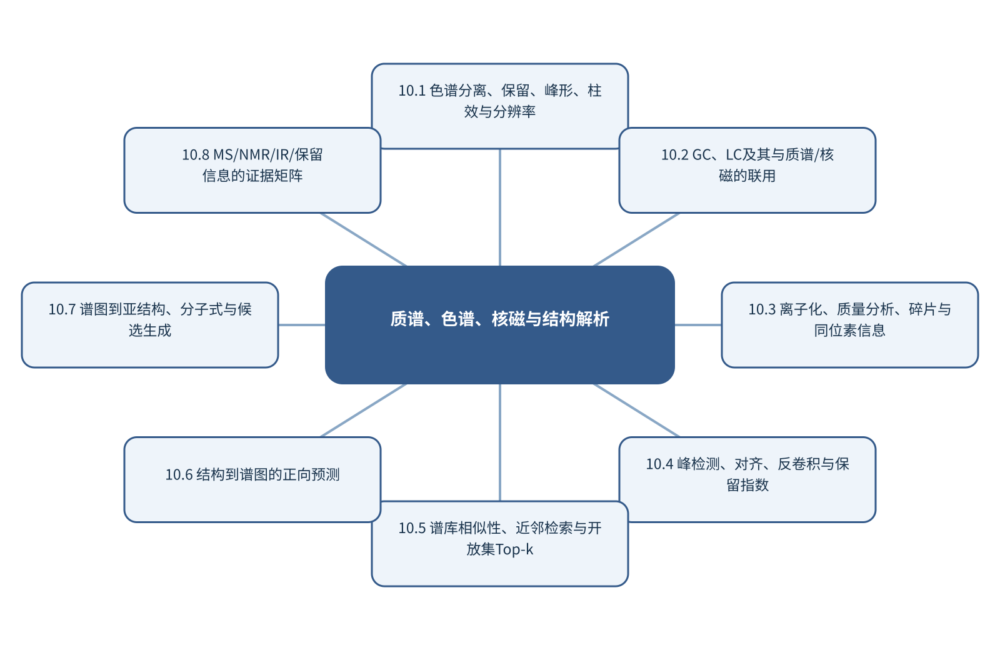

# 第10章 质谱、色谱、核磁与结构解析

> 第3篇 智能仪器分析与复杂分析对象

## 章首导引

复杂混合物如何经过分离和多谱测量转化为可验证的候选结构？ 本章的回答是：以GC/LC分离、MS碎片、NMR局部环境和多证据融合组织结构解析。全章以色谱峰、质谱碎片、NMR和保留信息为对象，坚持“以候选排序和互补证据处理一谱多解”，并通过“联合GC-MS碎片与保留指数解析未知峰”把概念、计算和分析决策连为一体。

## 学习目标

- 能够说明色谱峰、质谱碎片、NMR和保留信息在本章中的数据结构与主要信息来源。
- 能够解释本章关键方法的输入、输出、参数、假设和失效条件。
- 能够以“以候选排序和互补证据处理一谱多解”设计训练、验证和独立测试。
- 能够完成“联合GC-MS碎片与保留指数解析未知峰”的最小代码实验并分析失败样本。

## 本章知识图谱

## 10.1 色谱分离、保留、峰形、柱效与分辨率

本节围绕“色谱分离、保留、峰形、柱效与分辨率”展开。分析对象是色谱峰、质谱碎片、NMR和保留信息，核心不是罗列名词，而是说明分配、吸附和分离选择性、保留时间、保留因子和选择因子、理论塔板、峰宽和分辨率、GC、LC、HPLC和UHPLC怎样进入同一条测量与推断链。读者首先要辨认哪些量来自真实样品，哪些量由仪器转换得到，哪些量由算法估计；三类量若混在一起，模型精度就很难被解释。

在“色谱分离、保留、峰形、柱效与分辨率”中，技术路线遵循“以候选排序和互补证据处理一谱多解”。具体计算从可诊断的经典基线开始，再增加本节所需的非线性、结构先验或不确定度组件。新增组件必须回答一个明确问题，并在相同数据边界下与基线比较；只有平均分提高而误差结构没有改善，不能构成采用复杂模型的充分理由。

本节把“联合GC-MS碎片与保留指数解析未知峰”落实到GC、LC、HPLC和UHPLC这一检查点。验证时保留与未来使用条件一致的独立对象，检查坐标轴、单位、样品身份、批次、参数来源和失败样本。由此得到的结论才可用于下一步测量或实验，而不是停留在一张看似分离良好的图上。

### 10.1.1 分配、吸附和分离选择性

就“分配、吸附和分离选择性”而言，在“色谱分离、保留、峰形、柱效与分辨率”中，分配、吸附和分离选择性具体限定了色谱峰、质谱碎片、NMR和保留信息的一个技术接口。它必须被写成可检查的输入、变换和输出：输入保留样品与仪器条件，变换说明参数从何处估计，输出对应可观察量或候选判断；缺少任何一层，概念就无法进入实验和代码。

把“分配、吸附和分离选择性”用于“色谱分离、保留、峰形、柱效与分辨率”时，本书用“联合GC-MS碎片与保留指数解析未知峰”检验分配、吸附和分离选择性。实现时遵循“以候选排序和互补证据处理一谱多解”，先建立经典基线，再对参数敏感性、独立样品和失败对象进行检查。若结果只能在同批数据或单次划分中成立，应把它视为探索性现象而非稳定规律。在真实项目中，还应保存参数、软件版本和输入校验结果，以便定位变化来自样品还是计算。

### 10.1.2 保留时间、保留因子和选择因子

就“保留时间、保留因子和选择因子”而言，围绕“保留时间、保留因子和选择因子”，实验设计通过有结构地选择因子组合，使主效应、交互作用和曲率可被估计。随机化抵御时间漂移，重复估计实验误差，区组隔离已知批次。筛选设计适合找出重要因素，响应面设计则用于局部优化。

把“保留时间、保留因子和选择因子”用于“色谱分离、保留、峰形、柱效与分辨率”时，在“色谱分离、保留、峰形、柱效与分辨率”的语境下，二次响应面包含线性项、交互项和平方项。因子范围过窄无法识别曲率，过宽则可能跨越不同机理或安全区域。模型得到的数学最优点还需通过确认实验和稳健性试验验证。若该步骤改变了样品单位、统计独立性或物理峰形，必须在独立数据上重新证明其有效性。

### 10.1.3 理论塔板、峰宽和分辨率

就“理论塔板、峰宽和分辨率”而言，在“色谱分离、保留、峰形、柱效与分辨率”中，理论塔板、峰宽和分辨率具体限定了色谱峰、质谱碎片、NMR和保留信息的一个技术接口。它必须被写成可检查的输入、变换和输出：输入保留样品与仪器条件，变换说明参数从何处估计，输出对应可观察量或候选判断；缺少任何一层，概念就无法进入实验和代码。

把“理论塔板、峰宽和分辨率”用于“色谱分离、保留、峰形、柱效与分辨率”时，本书用“联合GC-MS碎片与保留指数解析未知峰”检验理论塔板、峰宽和分辨率。实现时遵循“以候选排序和互补证据处理一谱多解”，先建立经典基线，再对参数敏感性、独立样品和失败对象进行检查。若结果只能在同批数据或单次划分中成立，应把它视为探索性现象而非稳定规律。读图或读指标时应返回原始数据抽查，避免把表示空间中的几何关系直接当成化学机制。

### 10.1.4 GC、LC、HPLC和UHPLC

就“GC、LC、HPLC和UHPLC”而言，在“色谱分离、保留、峰形、柱效与分辨率”中，GC、LC、HPLC和UHPLC具体限定了色谱峰、质谱碎片、NMR和保留信息的一个技术接口。它必须被写成可检查的输入、变换和输出：输入保留样品与仪器条件，变换说明参数从何处估计，输出对应可观察量或候选判断；缺少任何一层，概念就无法进入实验和代码。

把“GC、LC、HPLC和UHPLC”用于“色谱分离、保留、峰形、柱效与分辨率”时，本书用“联合GC-MS碎片与保留指数解析未知峰”检验GC、LC、HPLC和UHPLC。实现时遵循“以候选排序和互补证据处理一谱多解”，先建立经典基线，再对参数敏感性、独立样品和失败对象进行检查。若结果只能在同批数据或单次划分中成立，应把它视为探索性现象而非稳定规律。最终报告需要给出适用范围和拒绝条件，使方法在证据不足时能够停止输出。

## 10.2 GC、LC及其与质谱/核磁的联用

本节围绕“GC、LC及其与质谱/核磁的联用”展开。分析对象是色谱峰、质谱碎片、NMR和保留信息，核心不是罗列名词，而是说明GC-MS和LC-MS、串联质谱和多级碎裂、LC-NMR与互补证据、联用接口、时间轴和数据同步怎样进入同一条测量与推断链。读者首先要辨认哪些量来自真实样品，哪些量由仪器转换得到，哪些量由算法估计；三类量若混在一起，模型精度就很难被解释。

在“GC、LC及其与质谱/核磁的联用”中，技术路线遵循“以候选排序和互补证据处理一谱多解”。具体计算从可诊断的经典基线开始，再增加本节所需的非线性、结构先验或不确定度组件。新增组件必须回答一个明确问题，并在相同数据边界下与基线比较；只有平均分提高而误差结构没有改善，不能构成采用复杂模型的充分理由。

本节把“联合GC-MS碎片与保留指数解析未知峰”落实到联用接口、时间轴和数据同步这一检查点。验证时保留与未来使用条件一致的独立对象，检查坐标轴、单位、样品身份、批次、参数来源和失败样本。由此得到的结论才可用于下一步测量或实验，而不是停留在一张看似分离良好的图上。

### 10.2.1 GC-MS和LC-MS

就“GC-MS和LC-MS”而言，在“GC、LC及其与质谱/核磁的联用”中，GC-MS和LC-MS具体限定了色谱峰、质谱碎片、NMR和保留信息的一个技术接口。它必须被写成可检查的输入、变换和输出：输入保留样品与仪器条件，变换说明参数从何处估计，输出对应可观察量或候选判断；缺少任何一层，概念就无法进入实验和代码。

把“GC-MS和LC-MS”用于“GC、LC及其与质谱/核磁的联用”时，本书用“联合GC-MS碎片与保留指数解析未知峰”检验GC-MS和LC-MS。实现时遵循“以候选排序和互补证据处理一谱多解”，先建立经典基线，再对参数敏感性、独立样品和失败对象进行检查。若结果只能在同批数据或单次划分中成立，应把它视为探索性现象而非稳定规律。在真实项目中，还应保存参数、软件版本和输入校验结果，以便定位变化来自样品还是计算。

### 10.2.2 串联质谱和多级碎裂

就“串联质谱和多级碎裂”而言，在“GC、LC及其与质谱/核磁的联用”中，串联质谱和多级碎裂具体限定了色谱峰、质谱碎片、NMR和保留信息的一个技术接口。它必须被写成可检查的输入、变换和输出：输入保留样品与仪器条件，变换说明参数从何处估计，输出对应可观察量或候选判断；缺少任何一层，概念就无法进入实验和代码。

把“串联质谱和多级碎裂”用于“GC、LC及其与质谱/核磁的联用”时，本书用“联合GC-MS碎片与保留指数解析未知峰”检验串联质谱和多级碎裂。实现时遵循“以候选排序和互补证据处理一谱多解”，先建立经典基线，再对参数敏感性、独立样品和失败对象进行检查。若结果只能在同批数据或单次划分中成立，应把它视为探索性现象而非稳定规律。若该步骤改变了样品单位、统计独立性或物理峰形，必须在独立数据上重新证明其有效性。

### 10.2.3 LC-NMR与互补证据

就“LC-NMR与互补证据”而言，围绕“LC-NMR与互补证据”，NMR化学位移反映局部电子环境，积分与核数相关，裂分和耦合常数提供连接信息。原始自由感应衰减经加窗、零填充、傅里叶变换、相位和基线校正后形成频谱，每一步都会影响峰形与定量。

把“LC-NMR与互补证据”用于“GC、LC及其与质谱/核磁的联用”时，在“GC、LC及其与质谱/核磁的联用”的语境下，自动归属应维护候选结构和证据矩阵。模型预测的化学位移误差必须与候选之间的真实差异比较；当多个候选均落在误差范围内，应引入二维NMR、MS或IR证据，而不是强制给出唯一答案。读图或读指标时应返回原始数据抽查，避免把表示空间中的几何关系直接当成化学机制。

### 10.2.4 联用接口、时间轴和数据同步

就“联用接口、时间轴和数据同步”而言，联用接口、时间轴和数据同步要求测量时间尺度快于被研究过程的关键变化。采样、传质、仪器响应和数据处理都可能造成时间延迟；若响应时间与反应时间相当，记录到的曲线是系统动力学与仪器核的卷积。

把“联用接口、时间轴和数据同步”用于“GC、LC及其与质谱/核磁的联用”时，建模时应保存真实时间戳、同步误差和操作事件，避免把等间隔文件序号当作真实时间。对于在线控制，还要区分毫秒级设备反馈与分钟级科学决策，并用状态估计处理不可直接观察的化学状态。最终报告需要给出适用范围和拒绝条件，使方法在证据不足时能够停止输出。

## 10.3 离子化、质量分析、碎片与同位素信息

本节围绕“离子化、质量分析、碎片与同位素信息”展开。分析对象是色谱峰、质谱碎片、NMR和保留信息，核心不是罗列名词，而是说明EI、ESI和MALDI、质量分析器、分辨率和质量准确度、分子离子、碎片和同位素、小分子、代谢物、肽和蛋白怎样进入同一条测量与推断链。读者首先要辨认哪些量来自真实样品，哪些量由仪器转换得到，哪些量由算法估计；三类量若混在一起，模型精度就很难被解释。

在“离子化、质量分析、碎片与同位素信息”中，技术路线遵循“以候选排序和互补证据处理一谱多解”。具体计算从可诊断的经典基线开始，再增加本节所需的非线性、结构先验或不确定度组件。新增组件必须回答一个明确问题，并在相同数据边界下与基线比较；只有平均分提高而误差结构没有改善，不能构成采用复杂模型的充分理由。

本节把“联合GC-MS碎片与保留指数解析未知峰”落实到小分子、代谢物、肽和蛋白这一检查点。验证时保留与未来使用条件一致的独立对象，检查坐标轴、单位、样品身份、批次、参数来源和失败样本。由此得到的结论才可用于下一步测量或实验，而不是停留在一张看似分离良好的图上。

### 10.3.1 EI、ESI和MALDI

就“EI、ESI和MALDI”而言，围绕“EI、ESI和MALDI”，高斯过程用均值函数和核函数定义函数值之间的联合分布。给定观测后，可解析得到新点的后验均值和方差。均值用于预测，方差表达由数据覆盖和核假设共同决定的认知不确定性。

把“EI、ESI和MALDI”用于“离子化、质量分析、碎片与同位素信息”时，在“离子化、质量分析、碎片与同位素信息”的语境下，获取函数把预测分布转为下一次实验的选择标准。UCB以μ+κσ权衡高预测值和高不确定性；期望改进计算相对当前最优值的期望收益。安全约束、可合成性和仪器范围必须先过滤候选，再进行获取函数排序。在真实项目中，还应保存参数、软件版本和输入校验结果，以便定位变化来自样品还是计算。

### 10.3.2 质量分析器、分辨率和质量准确度

就“质量分析器、分辨率和质量准确度”而言，在“离子化、质量分析、碎片与同位素信息”中，质量分析器、分辨率和质量准确度具体限定了色谱峰、质谱碎片、NMR和保留信息的一个技术接口。它必须被写成可检查的输入、变换和输出：输入保留样品与仪器条件，变换说明参数从何处估计，输出对应可观察量或候选判断；缺少任何一层，概念就无法进入实验和代码。

把“质量分析器、分辨率和质量准确度”用于“离子化、质量分析、碎片与同位素信息”时，本书用“联合GC-MS碎片与保留指数解析未知峰”检验质量分析器、分辨率和质量准确度。实现时遵循“以候选排序和互补证据处理一谱多解”，先建立经典基线，再对参数敏感性、独立样品和失败对象进行检查。若结果只能在同批数据或单次划分中成立，应把它视为探索性现象而非稳定规律。若该步骤改变了样品单位、统计独立性或物理峰形，必须在独立数据上重新证明其有效性。

### 10.3.3 分子离子、碎片和同位素

就“分子离子、碎片和同位素”而言，在“离子化、质量分析、碎片与同位素信息”中，分子离子、碎片和同位素具体限定了色谱峰、质谱碎片、NMR和保留信息的一个技术接口。它必须被写成可检查的输入、变换和输出：输入保留样品与仪器条件，变换说明参数从何处估计，输出对应可观察量或候选判断；缺少任何一层，概念就无法进入实验和代码。

把“分子离子、碎片和同位素”用于“离子化、质量分析、碎片与同位素信息”时，本书用“联合GC-MS碎片与保留指数解析未知峰”检验分子离子、碎片和同位素。实现时遵循“以候选排序和互补证据处理一谱多解”，先建立经典基线，再对参数敏感性、独立样品和失败对象进行检查。若结果只能在同批数据或单次划分中成立，应把它视为探索性现象而非稳定规律。读图或读指标时应返回原始数据抽查，避免把表示空间中的几何关系直接当成化学机制。

### 10.3.4 小分子、代谢物、肽和蛋白

就“小分子、代谢物、肽和蛋白”而言，在“离子化、质量分析、碎片与同位素信息”中，小分子、代谢物、肽和蛋白具体限定了色谱峰、质谱碎片、NMR和保留信息的一个技术接口。它必须被写成可检查的输入、变换和输出：输入保留样品与仪器条件，变换说明参数从何处估计，输出对应可观察量或候选判断；缺少任何一层，概念就无法进入实验和代码。

把“小分子、代谢物、肽和蛋白”用于“离子化、质量分析、碎片与同位素信息”时，本书用“联合GC-MS碎片与保留指数解析未知峰”检验小分子、代谢物、肽和蛋白。实现时遵循“以候选排序和互补证据处理一谱多解”，先建立经典基线，再对参数敏感性、独立样品和失败对象进行检查。若结果只能在同批数据或单次划分中成立，应把它视为探索性现象而非稳定规律。最终报告需要给出适用范围和拒绝条件，使方法在证据不足时能够停止输出。

## 10.4 峰检测、对齐、反卷积与保留指数

本节围绕“峰检测、对齐、反卷积与保留指数”展开。分析对象是色谱峰、质谱碎片、NMR和保留信息，核心不是罗列名词，而是说明峰检测和基线、保留时间对齐、共洗脱和峰反卷积、质量容差和同位素聚类怎样进入同一条测量与推断链。读者首先要辨认哪些量来自真实样品，哪些量由仪器转换得到，哪些量由算法估计；三类量若混在一起，模型精度就很难被解释。

在“峰检测、对齐、反卷积与保留指数”中，技术路线遵循“以候选排序和互补证据处理一谱多解”。具体计算从可诊断的经典基线开始，再增加本节所需的非线性、结构先验或不确定度组件。新增组件必须回答一个明确问题，并在相同数据边界下与基线比较；只有平均分提高而误差结构没有改善，不能构成采用复杂模型的充分理由。

本节把“联合GC-MS碎片与保留指数解析未知峰”落实到保留指数与内标这一检查点。验证时保留与未来使用条件一致的独立对象，检查坐标轴、单位、样品身份、批次、参数来源和失败样本。由此得到的结论才可用于下一步测量或实验，而不是停留在一张看似分离良好的图上。

### 10.4.1 峰检测和基线

就“峰检测和基线”而言，围绕“峰检测和基线”，Savitzky-Golay方法在滑动窗口内拟合低阶多项式，可同时实现平滑和导数估计。窗口过短会保留噪声，过长会压低窄峰；多项式阶数过高则增加振荡。参数应根据仪器分辨率、最窄有效峰宽和下游任务共同确定。

把“峰检测和基线”用于“峰检测、对齐、反卷积与保留指数”时，在“峰检测、对齐、反卷积与保留指数”的语境下，基线校正实质上是在区分慢变化背景与分析信号。多项式、非对称最小二乘和形态学方法对应不同的背景假设。校正后不仅要看曲线是否平直，还要比较峰位、峰宽、峰面积、空白残差和定量偏差。在真实项目中，还应保存参数、软件版本和输入校验结果，以便定位变化来自样品还是计算。

### 10.4.2 保留时间对齐

就“保留时间对齐”而言，保留时间对齐要求测量时间尺度快于被研究过程的关键变化。采样、传质、仪器响应和数据处理都可能造成时间延迟；若响应时间与反应时间相当，记录到的曲线是系统动力学与仪器核的卷积。

把“保留时间对齐”用于“峰检测、对齐、反卷积与保留指数”时，建模时应保存真实时间戳、同步误差和操作事件，避免把等间隔文件序号当作真实时间。对于在线控制，还要区分毫秒级设备反馈与分钟级科学决策，并用状态估计处理不可直接观察的化学状态。若该步骤改变了样品单位、统计独立性或物理峰形，必须在独立数据上重新证明其有效性。

### 10.4.3 共洗脱和峰反卷积

就“共洗脱和峰反卷积”而言，围绕“共洗脱和峰反卷积”，神经元先计算仿射变换Wx+b，再通过非线性激活构造层级表示。反向传播利用链式法则计算损失对每个参数的梯度，优化器据此更新参数。训练损失下降只说明模型更符合训练目标，不保证科学任务被正确表达。

把“共洗脱和峰反卷积”用于“峰检测、对齐、反卷积与保留指数”时，在“峰检测、对齐、反卷积与保留指数”的语境下，卷积通过局部连接和权重共享利用相邻变量的结构。一维卷积适合谱图和色谱，二维卷积适合图像。卷积核宽度、层数和步长共同决定感受野，必须与峰宽、空间分辨率或对象尺度匹配。读图或读指标时应返回原始数据抽查，避免把表示空间中的几何关系直接当成化学机制。

### 10.4.4 质量容差和同位素聚类

就“质量容差和同位素聚类”而言，在“峰检测、对齐、反卷积与保留指数”中，质量容差和同位素聚类具体限定了色谱峰、质谱碎片、NMR和保留信息的一个技术接口。它必须被写成可检查的输入、变换和输出：输入保留样品与仪器条件，变换说明参数从何处估计，输出对应可观察量或候选判断；缺少任何一层，概念就无法进入实验和代码。

把“质量容差和同位素聚类”用于“峰检测、对齐、反卷积与保留指数”时，本书用“联合GC-MS碎片与保留指数解析未知峰”检验质量容差和同位素聚类。实现时遵循“以候选排序和互补证据处理一谱多解”，先建立经典基线，再对参数敏感性、独立样品和失败对象进行检查。若结果只能在同批数据或单次划分中成立，应把它视为探索性现象而非稳定规律。最终报告需要给出适用范围和拒绝条件，使方法在证据不足时能够停止输出。

### 10.4.5 保留指数与内标

就“保留指数与内标”而言，围绕“保留指数与内标”，质谱余弦相似度比较两个峰强向量的方向，对整体强度缩放不敏感。实际检索还需设置质荷比容差、峰权重和缺失峰惩罚。高相似度不保证唯一结构，尤其对同分异构体和共有碎片。

把“保留指数与内标”用于“峰检测、对齐、反卷积与保留指数”时，在“峰检测、对齐、反卷积与保留指数”的语境下，保留时间对仪器和方法敏感，保留指数通过标准物提供更可迁移的尺度。对齐算法应限制允许的时间变形，并用内标或已知峰验证。候选排序可融合碎片相似度、保留指数、分子式和先验，最终报告Top-k覆盖而非只给第一名。教学上应把该概念落实为可观察变量、可运行程序和可反驳检验三层。

## 10.5 谱库相似性、近邻检索与开放集Top-k

本节围绕“谱库相似性、近邻检索与开放集Top-k”展开。分析对象是色谱峰、质谱碎片、NMR和保留信息，核心不是罗列名词，而是说明点积、余弦和复合相似度、峰权重与缺失峰惩罚、HNSW和大规模近邻搜索、Top-k命中和开放集拒识怎样进入同一条测量与推断链。读者首先要辨认哪些量来自真实样品，哪些量由仪器转换得到，哪些量由算法估计；三类量若混在一起，模型精度就很难被解释。

在“谱库相似性、近邻检索与开放集Top-k”中，技术路线遵循“以候选排序和互补证据处理一谱多解”。具体计算从可诊断的经典基线开始，再增加本节所需的非线性、结构先验或不确定度组件。新增组件必须回答一个明确问题，并在相同数据边界下与基线比较；只有平均分提高而误差结构没有改善，不能构成采用复杂模型的充分理由。

本节把“联合GC-MS碎片与保留指数解析未知峰”落实到谱图相似不等于结构唯一这一检查点。验证时保留与未来使用条件一致的独立对象，检查坐标轴、单位、样品身份、批次、参数来源和失败样本。由此得到的结论才可用于下一步测量或实验，而不是停留在一张看似分离良好的图上。

### 10.5.1 点积、余弦和复合相似度

就“点积、余弦和复合相似度”而言，围绕“点积、余弦和复合相似度”，质谱余弦相似度比较两个峰强向量的方向，对整体强度缩放不敏感。实际检索还需设置质荷比容差、峰权重和缺失峰惩罚。高相似度不保证唯一结构，尤其对同分异构体和共有碎片。

把“点积、余弦和复合相似度”用于“谱库相似性、近邻检索与开放集Top-k”时，在“谱库相似性、近邻检索与开放集Top-k”的语境下，保留时间对仪器和方法敏感，保留指数通过标准物提供更可迁移的尺度。对齐算法应限制允许的时间变形，并用内标或已知峰验证。候选排序可融合碎片相似度、保留指数、分子式和先验，最终报告Top-k覆盖而非只给第一名。在真实项目中，还应保存参数、软件版本和输入校验结果，以便定位变化来自样品还是计算。

### 10.5.2 峰权重与缺失峰惩罚

就“峰权重与缺失峰惩罚”而言，在“谱库相似性、近邻检索与开放集Top-k”中，峰权重与缺失峰惩罚具体限定了色谱峰、质谱碎片、NMR和保留信息的一个技术接口。它必须被写成可检查的输入、变换和输出：输入保留样品与仪器条件，变换说明参数从何处估计，输出对应可观察量或候选判断；缺少任何一层，概念就无法进入实验和代码。

把“峰权重与缺失峰惩罚”用于“谱库相似性、近邻检索与开放集Top-k”时，本书用“联合GC-MS碎片与保留指数解析未知峰”检验峰权重与缺失峰惩罚。实现时遵循“以候选排序和互补证据处理一谱多解”，先建立经典基线，再对参数敏感性、独立样品和失败对象进行检查。若结果只能在同批数据或单次划分中成立，应把它视为探索性现象而非稳定规律。若该步骤改变了样品单位、统计独立性或物理峰形，必须在独立数据上重新证明其有效性。

### 10.5.3 HNSW和大规模近邻搜索

就“HNSW和大规模近邻搜索”而言，在“谱库相似性、近邻检索与开放集Top-k”中，HNSW和大规模近邻搜索具体限定了色谱峰、质谱碎片、NMR和保留信息的一个技术接口。它必须被写成可检查的输入、变换和输出：输入保留样品与仪器条件，变换说明参数从何处估计，输出对应可观察量或候选判断；缺少任何一层，概念就无法进入实验和代码。

把“HNSW和大规模近邻搜索”用于“谱库相似性、近邻检索与开放集Top-k”时，本书用“联合GC-MS碎片与保留指数解析未知峰”检验HNSW和大规模近邻搜索。实现时遵循“以候选排序和互补证据处理一谱多解”，先建立经典基线，再对参数敏感性、独立样品和失败对象进行检查。若结果只能在同批数据或单次划分中成立，应把它视为探索性现象而非稳定规律。读图或读指标时应返回原始数据抽查，避免把表示空间中的几何关系直接当成化学机制。

### 10.5.4 Top-k命中和开放集拒识

就“Top-k命中和开放集拒识”而言，围绕“Top-k命中和开放集拒识”，质谱余弦相似度比较两个峰强向量的方向，对整体强度缩放不敏感。实际检索还需设置质荷比容差、峰权重和缺失峰惩罚。高相似度不保证唯一结构，尤其对同分异构体和共有碎片。

把“Top-k命中和开放集拒识”用于“谱库相似性、近邻检索与开放集Top-k”时，在“谱库相似性、近邻检索与开放集Top-k”的语境下，保留时间对仪器和方法敏感，保留指数通过标准物提供更可迁移的尺度。对齐算法应限制允许的时间变形，并用内标或已知峰验证。候选排序可融合碎片相似度、保留指数、分子式和先验，最终报告Top-k覆盖而非只给第一名。最终报告需要给出适用范围和拒绝条件，使方法在证据不足时能够停止输出。

### 10.5.5 谱图相似不等于结构唯一

就“谱图相似不等于结构唯一”而言，围绕“谱图相似不等于结构唯一”，分子图以原子为节点、化学键为空间关系。消息传递网络在每一层聚合邻居信息并更新节点表示，多层传播扩大感受野。全局池化把节点表示汇总为分子级向量。

把“谱图相似不等于结构唯一”用于“谱库相似性、近邻检索与开放集Top-k”时，在“谱库相似性、近邻检索与开放集Top-k”的语境下，二维图不能完整表达构象和空间相互作用。使用距离、角度或等变网络可以处理三维几何；SE(3)等变性要求模型输出随旋转和平移按物理规律变化。构象生成、温度和质子化态仍是输入不确定性的来源。教学上应把该概念落实为可观察变量、可运行程序和可反驳检验三层。

## 10.6 结构到谱图的正向预测

本节围绕“结构到谱图的正向预测”展开。分析对象是色谱峰、质谱碎片、NMR和保留信息，核心不是罗列名词，而是说明碎片规则和in silico fragmentation、结构到质谱强度、NMR化学位移预测、GNN/Transformer谱图生成怎样进入同一条测量与推断链。读者首先要辨认哪些量来自真实样品，哪些量由仪器转换得到，哪些量由算法估计；三类量若混在一起，模型精度就很难被解释。

在“结构到谱图的正向预测”中，技术路线遵循“以候选排序和互补证据处理一谱多解”。具体计算从可诊断的经典基线开始，再增加本节所需的非线性、结构先验或不确定度组件。新增组件必须回答一个明确问题，并在相同数据边界下与基线比较；只有平均分提高而误差结构没有改善，不能构成采用复杂模型的充分理由。

本节把“联合GC-MS碎片与保留指数解析未知峰”落实到预测不确定度这一检查点。验证时保留与未来使用条件一致的独立对象，检查坐标轴、单位、样品身份、批次、参数来源和失败样本。由此得到的结论才可用于下一步测量或实验，而不是停留在一张看似分离良好的图上。

### 10.6.1 碎片规则和in silico fragmentation

就“碎片规则和in silico fragmentation”而言，围绕“碎片规则和in silico fragmentation”，科学智能体把语言模型与检索、代码、数据库和仪器接口连接。RAG提供可追溯资料，工具调用执行确定性计算，状态记录保存中间结果。语言模型负责计划和接口，不应替代数值计算或实验事实。

把“碎片规则和in silico fragmentation”用于“结构到谱图的正向预测”时，在“结构到谱图的正向预测”的语境下，可靠工作流把输出分为来源事实、模型推断和待验证假设。每个工具具有明确函数签名、权限和返回结构；关键数值通过复算或测试核验；危险动作必须经过人工批准。日志保存查询、工具版本、输入和输出。在真实项目中，还应保存参数、软件版本和输入校验结果，以便定位变化来自样品还是计算。

### 10.6.2 结构到质谱强度

就“结构到质谱强度”而言，结构到质谱强度属于从观测反推对象的逆问题，常存在多解性。同一峰可由多个结构片段贡献，同一空间热点也可能受厚度、照明或离子抑制影响；因此模型输出首先是候选解释，而不是自动成立的机制。

把“结构到质谱强度”用于“结构到谱图的正向预测”时，可信解释需要至少一条独立证据链：改变实验条件观察可预测响应、使用互补仪器验证候选，或以标准物质复现特征。显著性图、注意力和SHAP可定位模型依赖，却不能替代干预和机理实验。若该步骤改变了样品单位、统计独立性或物理峰形，必须在独立数据上重新证明其有效性。

### 10.6.3 NMR化学位移预测

就“NMR化学位移预测”而言，围绕“NMR化学位移预测”，NMR化学位移反映局部电子环境，积分与核数相关，裂分和耦合常数提供连接信息。原始自由感应衰减经加窗、零填充、傅里叶变换、相位和基线校正后形成频谱，每一步都会影响峰形与定量。

把“NMR化学位移预测”用于“结构到谱图的正向预测”时，在“结构到谱图的正向预测”的语境下，自动归属应维护候选结构和证据矩阵。模型预测的化学位移误差必须与候选之间的真实差异比较；当多个候选均落在误差范围内，应引入二维NMR、MS或IR证据，而不是强制给出唯一答案。读图或读指标时应返回原始数据抽查，避免把表示空间中的几何关系直接当成化学机制。

### 10.6.4 GNN/Transformer谱图生成

就“GNN/Transformer谱图生成”而言，围绕“GNN/Transformer谱图生成”，分子图以原子为节点、化学键为空间关系。消息传递网络在每一层聚合邻居信息并更新节点表示，多层传播扩大感受野。全局池化把节点表示汇总为分子级向量。

把“GNN/Transformer谱图生成”用于“结构到谱图的正向预测”时，在“结构到谱图的正向预测”的语境下，二维图不能完整表达构象和空间相互作用。使用距离、角度或等变网络可以处理三维几何；SE(3)等变性要求模型输出随旋转和平移按物理规律变化。构象生成、温度和质子化态仍是输入不确定性的来源。最终报告需要给出适用范围和拒绝条件，使方法在证据不足时能够停止输出。

### 10.6.5 预测不确定度

就“预测不确定度”而言，围绕“预测不确定度”，随机误差反映重复测量的波动，系统偏差使结果稳定地偏离参照，不确定度则量化在现有知识下结果可能处于的范围。三者属于不同概念。高重复性不代表无偏，模型测试误差很低也不代表参照标签准确。

把“预测不确定度”用于“结构到谱图的正向预测”时，在“结构到谱图的正向预测”的语境下，不确定度应沿采样、制样、校准、仪器、预处理和模型逐步传播。对于线性关系可使用一阶误差传播，对于明显非线性或参数相关的系统可使用蒙特卡洛抽样。报告时应给出覆盖概率、区间构造方法和适用条件，而不是只给一个小数位很多的点估计。教学上应把该概念落实为可观察变量、可运行程序和可反驳检验三层。

## 10.7 谱图到亚结构、分子式与候选生成

本节围绕“谱图到亚结构、分子式与候选生成”展开。分析对象是色谱峰、质谱碎片、NMR和保留信息，核心不是罗列名词，而是说明分子式和精确质量约束、官能团和亚结构识别、de novo结构生成、候选去重和化学有效性怎样进入同一条测量与推断链。读者首先要辨认哪些量来自真实样品，哪些量由仪器转换得到，哪些量由算法估计；三类量若混在一起，模型精度就很难被解释。

在“谱图到亚结构、分子式与候选生成”中，技术路线遵循“以候选排序和互补证据处理一谱多解”。具体计算从可诊断的经典基线开始，再增加本节所需的非线性、结构先验或不确定度组件。新增组件必须回答一个明确问题，并在相同数据边界下与基线比较；只有平均分提高而误差结构没有改善，不能构成采用复杂模型的充分理由。

本节把“联合GC-MS碎片与保留指数解析未知峰”落实到检索—生成—重排序这一检查点。验证时保留与未来使用条件一致的独立对象，检查坐标轴、单位、样品身份、批次、参数来源和失败样本。由此得到的结论才可用于下一步测量或实验，而不是停留在一张看似分离良好的图上。

### 10.7.1 分子式和精确质量约束

就“分子式和精确质量约束”而言，在“谱图到亚结构、分子式与候选生成”中，分子式和精确质量约束具体限定了色谱峰、质谱碎片、NMR和保留信息的一个技术接口。它必须被写成可检查的输入、变换和输出：输入保留样品与仪器条件，变换说明参数从何处估计，输出对应可观察量或候选判断；缺少任何一层，概念就无法进入实验和代码。

把“分子式和精确质量约束”用于“谱图到亚结构、分子式与候选生成”时，本书用“联合GC-MS碎片与保留指数解析未知峰”检验分子式和精确质量约束。实现时遵循“以候选排序和互补证据处理一谱多解”，先建立经典基线，再对参数敏感性、独立样品和失败对象进行检查。若结果只能在同批数据或单次划分中成立，应把它视为探索性现象而非稳定规律。在真实项目中，还应保存参数、软件版本和输入校验结果，以便定位变化来自样品还是计算。

### 10.7.2 官能团和亚结构识别

就“官能团和亚结构识别”而言，官能团和亚结构识别的目标是判断样品中存在什么，而不是仅把信号分到一个已知类别。可靠识别至少需要选择性响应、参照物或谱库、相似干扰物以及库外样品；若候选集合不完整，最高匹配分只能表示‘在当前库中最相似’，不能等同于身份确认。

把“官能团和亚结构识别”用于“谱图到亚结构、分子式与候选生成”时，定性流程应把检出、候选筛选和确证分开。检出阶段控制空白和假阳性，筛选阶段报告Top-k候选及分数差，确证阶段依靠保留信息、互补谱学或标准物质。模型还应设置拒识阈值，避免对训练分布之外的样品强行命名。若该步骤改变了样品单位、统计独立性或物理峰形，必须在独立数据上重新证明其有效性。

### 10.7.3 de novo结构生成

就“de novo结构生成”而言，de novo结构生成属于从观测反推对象的逆问题，常存在多解性。同一峰可由多个结构片段贡献，同一空间热点也可能受厚度、照明或离子抑制影响；因此模型输出首先是候选解释，而不是自动成立的机制。

把“de novo结构生成”用于“谱图到亚结构、分子式与候选生成”时，可信解释需要至少一条独立证据链：改变实验条件观察可预测响应、使用互补仪器验证候选，或以标准物质复现特征。显著性图、注意力和SHAP可定位模型依赖，却不能替代干预和机理实验。读图或读指标时应返回原始数据抽查，避免把表示空间中的几何关系直接当成化学机制。

### 10.7.4 候选去重和化学有效性

就“候选去重和化学有效性”而言，在“谱图到亚结构、分子式与候选生成”中，候选去重和化学有效性具体限定了色谱峰、质谱碎片、NMR和保留信息的一个技术接口。它必须被写成可检查的输入、变换和输出：输入保留样品与仪器条件，变换说明参数从何处估计，输出对应可观察量或候选判断；缺少任何一层，概念就无法进入实验和代码。

把“候选去重和化学有效性”用于“谱图到亚结构、分子式与候选生成”时，本书用“联合GC-MS碎片与保留指数解析未知峰”检验候选去重和化学有效性。实现时遵循“以候选排序和互补证据处理一谱多解”，先建立经典基线，再对参数敏感性、独立样品和失败对象进行检查。若结果只能在同批数据或单次划分中成立，应把它视为探索性现象而非稳定规律。最终报告需要给出适用范围和拒绝条件，使方法在证据不足时能够停止输出。

### 10.7.5 检索—生成—重排序

就“检索—生成—重排序”而言，在“谱图到亚结构、分子式与候选生成”中，检索—生成—重排序具体限定了色谱峰、质谱碎片、NMR和保留信息的一个技术接口。它必须被写成可检查的输入、变换和输出：输入保留样品与仪器条件，变换说明参数从何处估计，输出对应可观察量或候选判断；缺少任何一层，概念就无法进入实验和代码。

把“检索—生成—重排序”用于“谱图到亚结构、分子式与候选生成”时，本书用“联合GC-MS碎片与保留指数解析未知峰”检验检索—生成—重排序。实现时遵循“以候选排序和互补证据处理一谱多解”，先建立经典基线，再对参数敏感性、独立样品和失败对象进行检查。若结果只能在同批数据或单次划分中成立，应把它视为探索性现象而非稳定规律。教学上应把该概念落实为可观察变量、可运行程序和可反驳检验三层。

## 10.8 MS/NMR/IR/保留信息的证据矩阵

本节围绕“MS/NMR/IR/保留信息的证据矩阵”展开。分析对象是色谱峰、质谱碎片、NMR和保留信息，核心不是罗列名词，而是说明MS、NMR、IR和保留信息、证据矩阵与贝叶斯更新、冲突证据和参照误差、未知GC-MS峰综合解析案例怎样进入同一条测量与推断链。读者首先要辨认哪些量来自真实样品，哪些量由仪器转换得到，哪些量由算法估计；三类量若混在一起，模型精度就很难被解释。

在“MS/NMR/IR/保留信息的证据矩阵”中，技术路线遵循“以候选排序和互补证据处理一谱多解”。具体计算从可诊断的经典基线开始，再增加本节所需的非线性、结构先验或不确定度组件。新增组件必须回答一个明确问题，并在相同数据边界下与基线比较；只有平均分提高而误差结构没有改善，不能构成采用复杂模型的充分理由。

本节把“联合GC-MS碎片与保留指数解析未知峰”落实到未知GC-MS峰综合解析案例这一检查点。验证时保留与未来使用条件一致的独立对象，检查坐标轴、单位、样品身份、批次、参数来源和失败样本。由此得到的结论才可用于下一步测量或实验，而不是停留在一张看似分离良好的图上。

### 10.8.1 MS、NMR、IR和保留信息

就“MS、NMR、IR和保留信息”而言，围绕“MS、NMR、IR和保留信息”，NMR化学位移反映局部电子环境，积分与核数相关，裂分和耦合常数提供连接信息。原始自由感应衰减经加窗、零填充、傅里叶变换、相位和基线校正后形成频谱，每一步都会影响峰形与定量。

把“MS、NMR、IR和保留信息”用于“MS/NMR/IR/保留信息的证据矩阵”时，在“MS/NMR/IR/保留信息的证据矩阵”的语境下，自动归属应维护候选结构和证据矩阵。模型预测的化学位移误差必须与候选之间的真实差异比较；当多个候选均落在误差范围内，应引入二维NMR、MS或IR证据，而不是强制给出唯一答案。在真实项目中，还应保存参数、软件版本和输入校验结果，以便定位变化来自样品还是计算。

### 10.8.2 证据矩阵与贝叶斯更新

就“证据矩阵与贝叶斯更新”而言，围绕“证据矩阵与贝叶斯更新”，贝叶斯公式描述证据如何更新对假设的信念。先验p(H)表示观察数据前的知识，似然p(D|H)表示假设成立时数据出现的概率，证据p(D)负责归一化，后验p(H|D)则是数据到来后的判断。分析化学中的峰位变化、碎片匹配或阳性检测均是间接证据，必须与基准发生率共同解释。

把“证据矩阵与贝叶斯更新”用于“MS/NMR/IR/保留信息的证据矩阵”时，在“MS/NMR/IR/保留信息的证据矩阵”的语境下，贝叶斯推断的关键不是给每个结论强行标一个精确概率，而是保持推理方向正确：数据增强或削弱某个假设，而不是自动证明机制。先验应来自明确的文献、历史数据或物理约束，并进行敏感性分析；当后验强烈依赖先验时，应诚实报告数据仍不足。若该步骤改变了样品单位、统计独立性或物理峰形，必须在独立数据上重新证明其有效性。

### 10.8.3 冲突证据和参照误差

就“冲突证据和参照误差”而言，围绕“冲突证据和参照误差”，随机误差反映重复测量的波动，系统偏差使结果稳定地偏离参照，不确定度则量化在现有知识下结果可能处于的范围。三者属于不同概念。高重复性不代表无偏，模型测试误差很低也不代表参照标签准确。

把“冲突证据和参照误差”用于“MS/NMR/IR/保留信息的证据矩阵”时，在“MS/NMR/IR/保留信息的证据矩阵”的语境下，不确定度应沿采样、制样、校准、仪器、预处理和模型逐步传播。对于线性关系可使用一阶误差传播，对于明显非线性或参数相关的系统可使用蒙特卡洛抽样。报告时应给出覆盖概率、区间构造方法和适用条件，而不是只给一个小数位很多的点估计。读图或读指标时应返回原始数据抽查，避免把表示空间中的几何关系直接当成化学机制。

### 10.8.4 未知GC-MS峰综合解析案例

就“未知GC-MS峰综合解析案例”而言，在“MS/NMR/IR/保留信息的证据矩阵”中，未知GC-MS峰综合解析案例具体限定了色谱峰、质谱碎片、NMR和保留信息的一个技术接口。它必须被写成可检查的输入、变换和输出：输入保留样品与仪器条件，变换说明参数从何处估计，输出对应可观察量或候选判断；缺少任何一层，概念就无法进入实验和代码。

把“未知GC-MS峰综合解析案例”用于“MS/NMR/IR/保留信息的证据矩阵”时，本书用“联合GC-MS碎片与保留指数解析未知峰”检验未知GC-MS峰综合解析案例。实现时遵循“以候选排序和互补证据处理一谱多解”，先建立经典基线，再对参数敏感性、独立样品和失败对象进行检查。若结果只能在同批数据或单次划分中成立，应把它视为探索性现象而非稳定规律。最终报告需要给出适用范围和拒绝条件，使方法在证据不足时能够停止输出。

## 关键关系与计算抓手

- `R_s=2(t_R2−t_R1)/(w_1+w_2)`

- `cos(x,y)=x·y/(||x||||y||)`

## 本章综合案例

本章案例：联合GC-MS碎片与保留指数解析未知峰。先明确样品单位、测量协议和数据结构，建立最简单且可诊断的基线；再加入本章核心方法，并在同一独立测试边界下比较。结果至少按批次、信号强弱和适用域分层，给出错误对象而非只报告总体平均数。

完成案例时，应提交问题卡、数据字典、运行日志、关键图表、失败样本清单和可运行程序。任何由模型提出的解释都要能被互补测量或后续实验检验。

## 代码实践

- 任务：实现质谱余弦检索、保留时间对齐和多证据候选融合。
- 代码：[chapter_exercise.py](../code/ch10.py)

## 本章小结

本章以色谱峰、质谱碎片、NMR和保留信息为对象，把“质谱、色谱、核磁与结构解析”组织为测量、表示、推断和行动的连续过程。复习时应能解释数据如何生成、方法为何适用、性能如何验证，以及证据不足时何时拒绝输出。

## 思考题与计算题

1. 为“联合GC-MS碎片与保留指数解析未知峰”画出样品—仪器—数据—模型—结论链，并标出三处可能失真位置。
2. 从本章选择一个方法，写出输入、输出、关键参数、基本假设和至少两个失效条件。
3. 建立一个经典基线，并说明复杂模型必须在哪些独立指标上超过它。
4. 把随机划分改为符合未来使用条件的分组或外推划分，比较结果并解释差异。
5. 完成配套代码，增加一个单元测试和一个失败样本可视化。
6. 设计一个能够区分“模型学到化学信息”和“模型学到批次捷径”的对照实验。

## 下载本章资源

<a href="./downloads/word/ch10.docx" download>Word出版稿</a>　·　<a href="./code/ch10.py" download>Python代码</a>　·　<a href="./assets/graphs/ch10.svg" download>SVG知识图谱</a>

## 年度课程资源、传承题与更新引文

本章的稳定教材内容与逐年更新的教学资源分开维护。维护组须在年度归档中同步补入课件链接、可传承的题目和有来源链接的前沿引文。

- [本学年课程 PPT（PDF）](#/resources/annual/2026-2027/ppt/README?id=ch10)
- [留给下一届的本章传承题](#/resources/annual/2026-2027/questions/README?id=ch10)
- [本章年度新增与修订引文](#/resources/annual/2026-2027/references/README?id=ch10)

---

## 本章共建记录与致谢

| 学年 | 贡献者 | 工作内容 | 关联PR |
|---|---|---|---|
| 待本学年维护组补充 | — | — | — |
