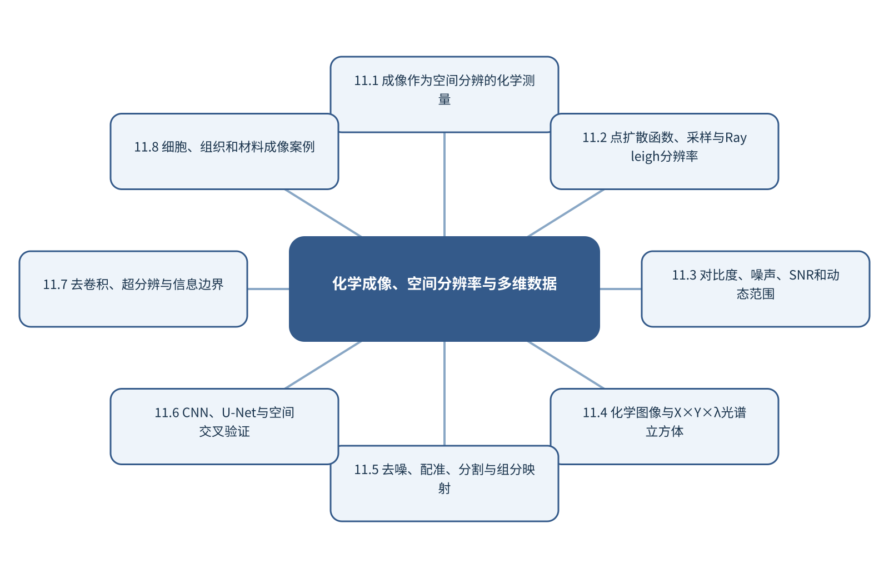

# 第11章 化学成像、空间分辨率与多维数据

> 第3篇 智能仪器分析与复杂分析对象　·　建议出版篇幅：24页

## 章首导引

怎样区分真实空间化学结构、仪器模糊和算法生成的视觉细节？ 本章的回答是：从成像系统和空间分辨测量出发，连接光谱立方体与智能重建。全章以具有空间坐标和谱轴的化学图像为对象，坚持“把分辨率、PSF和空间独立性纳入评价”，并通过“完成拉曼成像分割、组分映射和复原核验”把概念、计算和分析决策连为一体。

## 学习目标

- 能够说明具有空间坐标和谱轴的化学图像在本章中的数据结构与主要信息来源。
- 能够解释本章关键方法的输入、输出、参数、假设和失效条件。
- 能够以“把分辨率、PSF和空间独立性纳入评价”设计训练、验证和独立测试。
- 能够完成“完成拉曼成像分割、组分映射和复原核验”的最小代码实验并分析失败样本。

## 本章知识图谱

## 11.1 成像作为空间分辨的化学测量

本节围绕“成像作为空间分辨的化学测量”展开。分析对象是具有空间坐标和谱轴的化学图像，核心不是罗列名词，而是说明成像的定义和分析对象、视觉成像与科学成像、空间分辨测量、图像、图谱和多维数据怎样进入同一条测量与推断链。读者首先要辨认哪些量来自真实样品，哪些量由仪器转换得到，哪些量由算法估计；三类量若混在一起，模型精度就很难被解释。

在“成像作为空间分辨的化学测量”中，技术路线遵循“把分辨率、PSF和空间独立性纳入评价”。具体计算从可诊断的经典基线开始，再增加本节所需的非线性、结构先验或不确定度组件。新增组件必须回答一个明确问题，并在相同数据边界下与基线比较；只有平均分提高而误差结构没有改善，不能构成采用复杂模型的充分理由。

本节把“完成拉曼成像分割、组分映射和复原核验”落实到图像、图谱和多维数据这一检查点。验证时保留与未来使用条件一致的独立对象，检查坐标轴、单位、样品身份、批次、参数来源和失败样本。由此得到的结论才可用于下一步测量或实验，而不是停留在一张看似分离良好的图上。

### 11.1.1 成像的定义和分析对象

就“成像的定义和分析对象”而言，在“成像作为空间分辨的化学测量”中，成像的定义和分析对象具体限定了具有空间坐标和谱轴的化学图像的一个技术接口。它必须被写成可检查的输入、变换和输出：输入保留样品与仪器条件，变换说明参数从何处估计，输出对应可观察量或候选判断；缺少任何一层，概念就无法进入实验和代码。

把“成像的定义和分析对象”用于“成像作为空间分辨的化学测量”时，本书用“完成拉曼成像分割、组分映射和复原核验”检验成像的定义和分析对象。实现时遵循“把分辨率、PSF和空间独立性纳入评价”，先建立经典基线，再对参数敏感性、独立样品和失败对象进行检查。若结果只能在同批数据或单次划分中成立，应把它视为探索性现象而非稳定规律。若该步骤改变了样品单位、统计独立性或物理峰形，必须在独立数据上重新证明其有效性。

### 11.1.2 视觉成像与科学成像

就“视觉成像与科学成像”而言，在“成像作为空间分辨的化学测量”中，视觉成像与科学成像具体限定了具有空间坐标和谱轴的化学图像的一个技术接口。它必须被写成可检查的输入、变换和输出：输入保留样品与仪器条件，变换说明参数从何处估计，输出对应可观察量或候选判断；缺少任何一层，概念就无法进入实验和代码。

把“视觉成像与科学成像”用于“成像作为空间分辨的化学测量”时，本书用“完成拉曼成像分割、组分映射和复原核验”检验视觉成像与科学成像。实现时遵循“把分辨率、PSF和空间独立性纳入评价”，先建立经典基线，再对参数敏感性、独立样品和失败对象进行检查。若结果只能在同批数据或单次划分中成立，应把它视为探索性现象而非稳定规律。读图或读指标时应返回原始数据抽查，避免把表示空间中的几何关系直接当成化学机制。

### 11.1.3 空间分辨测量

就“空间分辨测量”而言，空间分辨测量属于从观测反推对象的逆问题，常存在多解性。同一峰可由多个结构片段贡献，同一空间热点也可能受厚度、照明或离子抑制影响；因此模型输出首先是候选解释，而不是自动成立的机制。

把“空间分辨测量”用于“成像作为空间分辨的化学测量”时，可信解释需要至少一条独立证据链：改变实验条件观察可预测响应、使用互补仪器验证候选，或以标准物质复现特征。显著性图、注意力和SHAP可定位模型依赖，却不能替代干预和机理实验。最终报告需要给出适用范围和拒绝条件，使方法在证据不足时能够停止输出。

### 11.1.4 图像、图谱和多维数据

就“图像、图谱和多维数据”而言，围绕“图像、图谱和多维数据”，分子图以原子为节点、化学键为空间关系。消息传递网络在每一层聚合邻居信息并更新节点表示，多层传播扩大感受野。全局池化把节点表示汇总为分子级向量。

把“图像、图谱和多维数据”用于“成像作为空间分辨的化学测量”时，在“成像作为空间分辨的化学测量”的语境下，二维图不能完整表达构象和空间相互作用。使用距离、角度或等变网络可以处理三维几何；SE(3)等变性要求模型输出随旋转和平移按物理规律变化。构象生成、温度和质子化态仍是输入不确定性的来源。教学上应把该概念落实为可观察变量、可运行程序和可反驳检验三层。

## 11.2 点扩散函数、采样与Rayleigh分辨率

本节围绕“点扩散函数、采样与Rayleigh分辨率”展开。分析对象是具有空间坐标和谱轴的化学图像，核心不是罗列名词，而是说明点扩散函数PSF、衍射与Rayleigh判据、像素尺寸、采样和视场、光学分辨率与计算分辨率怎样进入同一条测量与推断链。读者首先要辨认哪些量来自真实样品，哪些量由仪器转换得到，哪些量由算法估计；三类量若混在一起，模型精度就很难被解释。

在“点扩散函数、采样与Rayleigh分辨率”中，技术路线遵循“把分辨率、PSF和空间独立性纳入评价”。具体计算从可诊断的经典基线开始，再增加本节所需的非线性、结构先验或不确定度组件。新增组件必须回答一个明确问题，并在相同数据边界下与基线比较；只有平均分提高而误差结构没有改善，不能构成采用复杂模型的充分理由。

本节把“完成拉曼成像分割、组分映射和复原核验”落实到光学分辨率与计算分辨率这一检查点。验证时保留与未来使用条件一致的独立对象，检查坐标轴、单位、样品身份、批次、参数来源和失败样本。由此得到的结论才可用于下一步测量或实验，而不是停留在一张看似分离良好的图上。

### 11.2.1 点扩散函数PSF

就“点扩散函数PSF”而言，围绕“点扩散函数PSF”，扩散模型的前向过程按预设噪声调度逐步破坏数据，反向模型学习在给定时间步下预测噪声、得分或干净样本。训练可转化为多噪声水平上的去噪回归，采样则从高斯噪声逐步恢复结构。

把“点扩散函数PSF”用于“点扩散函数、采样与Rayleigh分辨率”时，在“点扩散函数、采样与Rayleigh分辨率”的语境下，条件扩散把类别、性质、结构或谱图作为控制信号。引导强度过高会牺牲多样性，过低则条件不充分。化学应用必须增加离散结构有效性、守恒关系和正向模拟验证。若该步骤改变了样品单位、统计独立性或物理峰形，必须在独立数据上重新证明其有效性。

### 11.2.2 衍射与Rayleigh判据

就“衍射与Rayleigh判据”而言，围绕“衍射与Rayleigh判据”，高斯过程用均值函数和核函数定义函数值之间的联合分布。给定观测后，可解析得到新点的后验均值和方差。均值用于预测，方差表达由数据覆盖和核假设共同决定的认知不确定性。

把“衍射与Rayleigh判据”用于“点扩散函数、采样与Rayleigh分辨率”时，在“点扩散函数、采样与Rayleigh分辨率”的语境下，获取函数把预测分布转为下一次实验的选择标准。UCB以μ+κσ权衡高预测值和高不确定性；期望改进计算相对当前最优值的期望收益。安全约束、可合成性和仪器范围必须先过滤候选，再进行获取函数排序。读图或读指标时应返回原始数据抽查，避免把表示空间中的几何关系直接当成化学机制。

### 11.2.3 像素尺寸、采样和视场

就“像素尺寸、采样和视场”而言，像素尺寸、采样和视场决定数据能否代表待回答的总体。分析试份通常只占原始对象极小比例，空间异质、颗粒尺寸、相分布和批次结构会使制样误差大于仪器重复误差；增加同一试份的重复扫描不能弥补缺乏独立取样。

把“像素尺寸、采样和视场”用于“点扩散函数、采样与Rayleigh分辨率”时，应先定义总体、初级采样单元、实验样品和分析试份，再配置分层或随机取样、混匀和独立重复。训练/测试划分也必须以真正独立的样品单位为边界，否则模型会因伪重复获得虚高性能。最终报告需要给出适用范围和拒绝条件，使方法在证据不足时能够停止输出。

### 11.2.4 光学分辨率与计算分辨率

就“光学分辨率与计算分辨率”而言，在“点扩散函数、采样与Rayleigh分辨率”中，光学分辨率与计算分辨率具体限定了具有空间坐标和谱轴的化学图像的一个技术接口。它必须被写成可检查的输入、变换和输出：输入保留样品与仪器条件，变换说明参数从何处估计，输出对应可观察量或候选判断；缺少任何一层，概念就无法进入实验和代码。

把“光学分辨率与计算分辨率”用于“点扩散函数、采样与Rayleigh分辨率”时，本书用“完成拉曼成像分割、组分映射和复原核验”检验光学分辨率与计算分辨率。实现时遵循“把分辨率、PSF和空间独立性纳入评价”，先建立经典基线，再对参数敏感性、独立样品和失败对象进行检查。若结果只能在同批数据或单次划分中成立，应把它视为探索性现象而非稳定规律。教学上应把该概念落实为可观察变量、可运行程序和可反驳检验三层。

## 11.3 对比度、噪声、SNR和动态范围

本节围绕“对比度、噪声、SNR和动态范围”展开。分析对象是具有空间坐标和谱轴的化学图像，核心不是罗列名词，而是说明对比度和背景、噪声和信噪比、空间/时间分辨率、动态范围和饱和怎样进入同一条测量与推断链。读者首先要辨认哪些量来自真实样品，哪些量由仪器转换得到，哪些量由算法估计；三类量若混在一起，模型精度就很难被解释。

在“对比度、噪声、SNR和动态范围”中，技术路线遵循“把分辨率、PSF和空间独立性纳入评价”。具体计算从可诊断的经典基线开始，再增加本节所需的非线性、结构先验或不确定度组件。新增组件必须回答一个明确问题，并在相同数据边界下与基线比较；只有平均分提高而误差结构没有改善，不能构成采用复杂模型的充分理由。

本节把“完成拉曼成像分割、组分映射和复原核验”落实到图像质量与任务性能这一检查点。验证时保留与未来使用条件一致的独立对象，检查坐标轴、单位、样品身份、批次、参数来源和失败样本。由此得到的结论才可用于下一步测量或实验，而不是停留在一张看似分离良好的图上。

### 11.3.1 对比度和背景

就“对比度和背景”而言，围绕“对比度和背景”，多模态学习把结构、谱图、图像、文本和实验条件作为互补观测。早期融合在输入或浅层表示处拼接，要求严格对齐；晚期融合组合独立模型输出，更容易处理缺失模态；联合表示学习则直接优化跨模态对应关系。

把“对比度和背景”用于“对比度、噪声、SNR和动态范围”时，在“对比度、噪声、SNR和动态范围”的语境下，对比学习拉近匹配样本的表示并推远不匹配样本。负样本若包含实际相似或同一对象的不同观测，会向模型提供错误监督。评价除下游性能外，还应检查检索、缺失模态稳健性和批次独立性。若该步骤改变了样品单位、统计独立性或物理峰形，必须在独立数据上重新证明其有效性。

### 11.3.2 噪声和信噪比

就“噪声和信噪比”而言，围绕“噪声和信噪比”，信噪比必须连同信号和噪声的定义给出。以峰高、峰面积或均值作为信号，以空白标准差、基线残差或重复测量波动作为噪声，会得到不同数值。只有定义与分析任务一致，SNR才具有比较意义。

把“噪声和信噪比”用于“对比度、噪声、SNR和动态范围”时，在“对比度、噪声、SNR和动态范围”的语境下，重复平均可降低独立随机噪声，但不能消除系统漂移；平滑可压低高频波动，却可能同时改变窄峰。提高SNR的优先顺序通常是改进采样与仪器、使用参比和内标、优化制样，最后才是数字滤波。读图或读指标时应返回原始数据抽查，避免把表示空间中的几何关系直接当成化学机制。

### 11.3.3 空间/时间分辨率

就“空间/时间分辨率”而言，空间/时间分辨率要求测量时间尺度快于被研究过程的关键变化。采样、传质、仪器响应和数据处理都可能造成时间延迟；若响应时间与反应时间相当，记录到的曲线是系统动力学与仪器核的卷积。

把“空间/时间分辨率”用于“对比度、噪声、SNR和动态范围”时，建模时应保存真实时间戳、同步误差和操作事件，避免把等间隔文件序号当作真实时间。对于在线控制，还要区分毫秒级设备反馈与分钟级科学决策，并用状态估计处理不可直接观察的化学状态。最终报告需要给出适用范围和拒绝条件，使方法在证据不足时能够停止输出。

### 11.3.4 动态范围和饱和

就“动态范围和饱和”而言，动态范围和饱和要求测量时间尺度快于被研究过程的关键变化。采样、传质、仪器响应和数据处理都可能造成时间延迟；若响应时间与反应时间相当，记录到的曲线是系统动力学与仪器核的卷积。

把“动态范围和饱和”用于“对比度、噪声、SNR和动态范围”时，建模时应保存真实时间戳、同步误差和操作事件，避免把等间隔文件序号当作真实时间。对于在线控制，还要区分毫秒级设备反馈与分钟级科学决策，并用状态估计处理不可直接观察的化学状态。教学上应把该概念落实为可观察变量、可运行程序和可反驳检验三层。

### 11.3.5 图像质量与任务性能

就“图像质量与任务性能”而言，围绕“图像质量与任务性能”，分子图以原子为节点、化学键为空间关系。消息传递网络在每一层聚合邻居信息并更新节点表示，多层传播扩大感受野。全局池化把节点表示汇总为分子级向量。

把“图像质量与任务性能”用于“对比度、噪声、SNR和动态范围”时，在“对比度、噪声、SNR和动态范围”的语境下，二维图不能完整表达构象和空间相互作用。使用距离、角度或等变网络可以处理三维几何；SE(3)等变性要求模型输出随旋转和平移按物理规律变化。构象生成、温度和质子化态仍是输入不确定性的来源。在真实项目中，还应保存参数、软件版本和输入校验结果，以便定位变化来自样品还是计算。

## 11.4 化学图像与X×Y×λ光谱立方体

本节围绕“化学图像与X×Y×λ光谱立方体”展开。分析对象是具有空间坐标和谱轴的化学图像，核心不是罗列名词，而是说明X×Y×λ数据结构、像素谱与波段图、Raman、IR、质谱和荧光成像、展开矩阵与空间邻域怎样进入同一条测量与推断链。读者首先要辨认哪些量来自真实样品，哪些量由仪器转换得到，哪些量由算法估计；三类量若混在一起，模型精度就很难被解释。

在“化学图像与X×Y×λ光谱立方体”中，技术路线遵循“把分辨率、PSF和空间独立性纳入评价”。具体计算从可诊断的经典基线开始，再增加本节所需的非线性、结构先验或不确定度组件。新增组件必须回答一个明确问题，并在相同数据边界下与基线比较；只有平均分提高而误差结构没有改善，不能构成采用复杂模型的充分理由。

本节把“完成拉曼成像分割、组分映射和复原核验”落实到展开矩阵与空间邻域这一检查点。验证时保留与未来使用条件一致的独立对象，检查坐标轴、单位、样品身份、批次、参数来源和失败样本。由此得到的结论才可用于下一步测量或实验，而不是停留在一张看似分离良好的图上。

### 11.4.1 X×Y×λ数据结构

就“X×Y×λ数据结构”而言，围绕“X×Y×λ数据结构”，化学成像常形成X×Y×λ数据立方体，每个像素具有一条光谱，每个波段又形成一幅图像。展开为二维矩阵便于PCA、MCR或分类，但会暂时丢失空间邻域；空间正则和三维卷积可重新利用局部结构。

把“X×Y×λ数据结构”用于“化学图像与X×Y×λ光谱立方体”时，在“化学图像与X×Y×λ光谱立方体”的语境下，处理顺序需要兼顾光谱轴与空间轴。先逐像素预处理可能放大低信号区域噪声，先空间平滑又可能混合边界。应在原始立方体、处理参数和目标分辨率明确的情况下比较方案。若该步骤改变了样品单位、统计独立性或物理峰形，必须在独立数据上重新证明其有效性。

### 11.4.2 像素谱与波段图

就“像素谱与波段图”而言，围绕“像素谱与波段图”，分子图以原子为节点、化学键为空间关系。消息传递网络在每一层聚合邻居信息并更新节点表示，多层传播扩大感受野。全局池化把节点表示汇总为分子级向量。

把“像素谱与波段图”用于“化学图像与X×Y×λ光谱立方体”时，在“化学图像与X×Y×λ光谱立方体”的语境下，二维图不能完整表达构象和空间相互作用。使用距离、角度或等变网络可以处理三维几何；SE(3)等变性要求模型输出随旋转和平移按物理规律变化。构象生成、温度和质子化态仍是输入不确定性的来源。读图或读指标时应返回原始数据抽查，避免把表示空间中的几何关系直接当成化学机制。

### 11.4.3 Raman、IR、质谱和荧光成像

就“Raman、IR、质谱和荧光成像”而言，在“化学图像与X×Y×λ光谱立方体”中，Raman、IR、质谱和荧光成像具体限定了具有空间坐标和谱轴的化学图像的一个技术接口。它必须被写成可检查的输入、变换和输出：输入保留样品与仪器条件，变换说明参数从何处估计，输出对应可观察量或候选判断；缺少任何一层，概念就无法进入实验和代码。

把“Raman、IR、质谱和荧光成像”用于“化学图像与X×Y×λ光谱立方体”时，本书用“完成拉曼成像分割、组分映射和复原核验”检验Raman、IR、质谱和荧光成像。实现时遵循“把分辨率、PSF和空间独立性纳入评价”，先建立经典基线，再对参数敏感性、独立样品和失败对象进行检查。若结果只能在同批数据或单次划分中成立，应把它视为探索性现象而非稳定规律。最终报告需要给出适用范围和拒绝条件，使方法在证据不足时能够停止输出。

### 11.4.4 展开矩阵与空间邻域

就“展开矩阵与空间邻域”而言，展开矩阵与空间邻域属于从观测反推对象的逆问题，常存在多解性。同一峰可由多个结构片段贡献，同一空间热点也可能受厚度、照明或离子抑制影响；因此模型输出首先是候选解释，而不是自动成立的机制。

把“展开矩阵与空间邻域”用于“化学图像与X×Y×λ光谱立方体”时，可信解释需要至少一条独立证据链：改变实验条件观察可预测响应、使用互补仪器验证候选，或以标准物质复现特征。显著性图、注意力和SHAP可定位模型依赖，却不能替代干预和机理实验。教学上应把该概念落实为可观察变量、可运行程序和可反驳检验三层。

## 11.5 去噪、配准、分割与组分映射

本节围绕“去噪、配准、分割与组分映射”展开。分析对象是具有空间坐标和谱轴的化学图像，核心不是罗列名词，而是说明去噪和背景扣除、平场校正和配准、阈值、分水岭和形态学、纹理、形态和光谱特征怎样进入同一条测量与推断链。读者首先要辨认哪些量来自真实样品，哪些量由仪器转换得到，哪些量由算法估计；三类量若混在一起，模型精度就很难被解释。

在“去噪、配准、分割与组分映射”中，技术路线遵循“把分辨率、PSF和空间独立性纳入评价”。具体计算从可诊断的经典基线开始，再增加本节所需的非线性、结构先验或不确定度组件。新增组件必须回答一个明确问题，并在相同数据边界下与基线比较；只有平均分提高而误差结构没有改善，不能构成采用复杂模型的充分理由。

本节把“完成拉曼成像分割、组分映射和复原核验”落实到组分映射与MCR/PCA这一检查点。验证时保留与未来使用条件一致的独立对象，检查坐标轴、单位、样品身份、批次、参数来源和失败样本。由此得到的结论才可用于下一步测量或实验，而不是停留在一张看似分离良好的图上。

### 11.5.1 去噪和背景扣除

就“去噪和背景扣除”而言，围绕“去噪和背景扣除”，扩散模型的前向过程按预设噪声调度逐步破坏数据，反向模型学习在给定时间步下预测噪声、得分或干净样本。训练可转化为多噪声水平上的去噪回归，采样则从高斯噪声逐步恢复结构。

把“去噪和背景扣除”用于“去噪、配准、分割与组分映射”时，在“去噪、配准、分割与组分映射”的语境下，条件扩散把类别、性质、结构或谱图作为控制信号。引导强度过高会牺牲多样性，过低则条件不充分。化学应用必须增加离散结构有效性、守恒关系和正向模拟验证。若该步骤改变了样品单位、统计独立性或物理峰形，必须在独立数据上重新证明其有效性。

### 11.5.2 平场校正和配准

就“平场校正和配准”而言，在“去噪、配准、分割与组分映射”中，平场校正和配准具体限定了具有空间坐标和谱轴的化学图像的一个技术接口。它必须被写成可检查的输入、变换和输出：输入保留样品与仪器条件，变换说明参数从何处估计，输出对应可观察量或候选判断；缺少任何一层，概念就无法进入实验和代码。

把“平场校正和配准”用于“去噪、配准、分割与组分映射”时，本书用“完成拉曼成像分割、组分映射和复原核验”检验平场校正和配准。实现时遵循“把分辨率、PSF和空间独立性纳入评价”，先建立经典基线，再对参数敏感性、独立样品和失败对象进行检查。若结果只能在同批数据或单次划分中成立，应把它视为探索性现象而非稳定规律。读图或读指标时应返回原始数据抽查，避免把表示空间中的几何关系直接当成化学机制。

### 11.5.3 阈值、分水岭和形态学

就“阈值、分水岭和形态学”而言，阈值、分水岭和形态学把分析结果转成实际行动。阈值不是模型内部的固定常数，而应由漏检、误报、复检成本和样品基准发生率共同确定；同一预测概率在筛查与确证场景中可对应不同决策。

把“阈值、分水岭和形态学”用于“去噪、配准、分割与组分映射”时，决策系统应允许三种输出：接受、拒绝和请求补充测量。每次行动保留输入版本、置信区间、适用域状态和人工复核点；若信息价值不足以抵消额外实验成本，系统也应能够停止。最终报告需要给出适用范围和拒绝条件，使方法在证据不足时能够停止输出。

### 11.5.4 纹理、形态和光谱特征

就“纹理、形态和光谱特征”而言，在“去噪、配准、分割与组分映射”中，纹理、形态和光谱特征具体限定了具有空间坐标和谱轴的化学图像的一个技术接口。它必须被写成可检查的输入、变换和输出：输入保留样品与仪器条件，变换说明参数从何处估计，输出对应可观察量或候选判断；缺少任何一层，概念就无法进入实验和代码。

把“纹理、形态和光谱特征”用于“去噪、配准、分割与组分映射”时，本书用“完成拉曼成像分割、组分映射和复原核验”检验纹理、形态和光谱特征。实现时遵循“把分辨率、PSF和空间独立性纳入评价”，先建立经典基线，再对参数敏感性、独立样品和失败对象进行检查。若结果只能在同批数据或单次划分中成立，应把它视为探索性现象而非稳定规律。教学上应把该概念落实为可观察变量、可运行程序和可反驳检验三层。

### 11.5.5 组分映射与MCR/PCA

就“组分映射与MCR/PCA”而言，围绕“组分映射与MCR/PCA”，奇异值分解将中心化矩阵写为X=UΣVᵀ。右奇异向量给出变量空间的正交方向，奇异值刻画每个方向承载的变化，UΣ形成样品得分。PCA可视为保留最大方差方向的低秩近似，但最大方差不一定等于与目标最相关的化学变化。

把“组分映射与MCR/PCA”用于“去噪、配准、分割与组分映射”时，在“去噪、配准、分割与组分映射”的语境下，解释PCA必须同时阅读得分、载荷和残差。得分显示样品在潜变量空间的位置，载荷提示变量对方向的贡献，Q残差反映模型未解释的结构。任何聚类或分离都应回到原始谱图、批次和样品信息验证。在真实项目中，还应保存参数、软件版本和输入校验结果，以便定位变化来自样品还是计算。

## 11.6 CNN、U-Net与空间交叉验证

本节围绕“CNN、U-Net与空间交叉验证”展开。分析对象是具有空间坐标和谱轴的化学图像，核心不是罗列名词，而是说明CNN分类、U-Net编码—解码与跳跃连接、Dice、IoU和对象级指标、图块泄漏与按个体划分怎样进入同一条测量与推断链。读者首先要辨认哪些量来自真实样品，哪些量由仪器转换得到，哪些量由算法估计；三类量若混在一起，模型精度就很难被解释。

在“CNN、U-Net与空间交叉验证”中，技术路线遵循“把分辨率、PSF和空间独立性纳入评价”。具体计算从可诊断的经典基线开始，再增加本节所需的非线性、结构先验或不确定度组件。新增组件必须回答一个明确问题，并在相同数据边界下与基线比较；只有平均分提高而误差结构没有改善，不能构成采用复杂模型的充分理由。

本节把“完成拉曼成像分割、组分映射和复原核验”落实到三维卷积和多尺度结构这一检查点。验证时保留与未来使用条件一致的独立对象，检查坐标轴、单位、样品身份、批次、参数来源和失败样本。由此得到的结论才可用于下一步测量或实验，而不是停留在一张看似分离良好的图上。

### 11.6.1 CNN分类

就“CNN分类”而言，在“CNN、U-Net与空间交叉验证”中，CNN分类具体限定了具有空间坐标和谱轴的化学图像的一个技术接口。它必须被写成可检查的输入、变换和输出：输入保留样品与仪器条件，变换说明参数从何处估计，输出对应可观察量或候选判断；缺少任何一层，概念就无法进入实验和代码。

把“CNN分类”用于“CNN、U-Net与空间交叉验证”时，本书用“完成拉曼成像分割、组分映射和复原核验”检验CNN分类。实现时遵循“把分辨率、PSF和空间独立性纳入评价”，先建立经典基线，再对参数敏感性、独立样品和失败对象进行检查。若结果只能在同批数据或单次划分中成立，应把它视为探索性现象而非稳定规律。若该步骤改变了样品单位、统计独立性或物理峰形，必须在独立数据上重新证明其有效性。

### 11.6.2 U-Net编码—解码与跳跃连接

就“U-Net编码—解码与跳跃连接”而言，围绕“U-Net编码—解码与跳跃连接”，Dice和IoU比较预测区域与参照区域的重叠。Dice对小目标相对友好，IoU对额外误分区域惩罚更直接。像素准确率在前景很少时可能虚高，因此分割评价必须结合对象级检出和边界误差。

把“U-Net编码—解码与跳跃连接”用于“CNN、U-Net与空间交叉验证”时，在“CNN、U-Net与空间交叉验证”的语境下，U-Net通过编码器提取多尺度语义，通过解码器恢复空间分辨率，并用跳跃连接保留浅层定位信息。训练和测试应按患者、样品或视野来源分组，避免相邻图块跨集造成空间泄漏。读图或读指标时应返回原始数据抽查，避免把表示空间中的几何关系直接当成化学机制。

### 11.6.3 Dice、IoU和对象级指标

就“Dice、IoU和对象级指标”而言，围绕“Dice、IoU和对象级指标”，Dice和IoU比较预测区域与参照区域的重叠。Dice对小目标相对友好，IoU对额外误分区域惩罚更直接。像素准确率在前景很少时可能虚高，因此分割评价必须结合对象级检出和边界误差。

把“Dice、IoU和对象级指标”用于“CNN、U-Net与空间交叉验证”时，在“CNN、U-Net与空间交叉验证”的语境下，U-Net通过编码器提取多尺度语义，通过解码器恢复空间分辨率，并用跳跃连接保留浅层定位信息。训练和测试应按患者、样品或视野来源分组，避免相邻图块跨集造成空间泄漏。最终报告需要给出适用范围和拒绝条件，使方法在证据不足时能够停止输出。

### 11.6.4 图块泄漏与按个体划分

就“图块泄漏与按个体划分”而言，围绕“图块泄漏与按个体划分”，分子图以原子为节点、化学键为空间关系。消息传递网络在每一层聚合邻居信息并更新节点表示，多层传播扩大感受野。全局池化把节点表示汇总为分子级向量。

把“图块泄漏与按个体划分”用于“CNN、U-Net与空间交叉验证”时，在“CNN、U-Net与空间交叉验证”的语境下，二维图不能完整表达构象和空间相互作用。使用距离、角度或等变网络可以处理三维几何；SE(3)等变性要求模型输出随旋转和平移按物理规律变化。构象生成、温度和质子化态仍是输入不确定性的来源。教学上应把该概念落实为可观察变量、可运行程序和可反驳检验三层。

### 11.6.5 三维卷积和多尺度结构

就“三维卷积和多尺度结构”而言，围绕“三维卷积和多尺度结构”，神经元先计算仿射变换Wx+b，再通过非线性激活构造层级表示。反向传播利用链式法则计算损失对每个参数的梯度，优化器据此更新参数。训练损失下降只说明模型更符合训练目标，不保证科学任务被正确表达。

把“三维卷积和多尺度结构”用于“CNN、U-Net与空间交叉验证”时，在“CNN、U-Net与空间交叉验证”的语境下，卷积通过局部连接和权重共享利用相邻变量的结构。一维卷积适合谱图和色谱，二维卷积适合图像。卷积核宽度、层数和步长共同决定感受野，必须与峰宽、空间分辨率或对象尺度匹配。在真实项目中，还应保存参数、软件版本和输入校验结果，以便定位变化来自样品还是计算。

## 11.7 去卷积、超分辨与信息边界

本节围绕“去卷积、超分辨与信息边界”展开。分析对象是具有空间坐标和谱轴的化学图像，核心不是罗列名词，而是说明已知PSF去卷积、盲去卷积、超分辨和频率边界、自监督/扩散重建怎样进入同一条测量与推断链。读者首先要辨认哪些量来自真实样品，哪些量由仪器转换得到，哪些量由算法估计；三类量若混在一起，模型精度就很难被解释。

在“去卷积、超分辨与信息边界”中，技术路线遵循“把分辨率、PSF和空间独立性纳入评价”。具体计算从可诊断的经典基线开始，再增加本节所需的非线性、结构先验或不确定度组件。新增组件必须回答一个明确问题，并在相同数据边界下与基线比较；只有平均分提高而误差结构没有改善，不能构成采用复杂模型的充分理由。

本节把“完成拉曼成像分割、组分映射和复原核验”落实到虚假细节和独立高分辨参照这一检查点。验证时保留与未来使用条件一致的独立对象，检查坐标轴、单位、样品身份、批次、参数来源和失败样本。由此得到的结论才可用于下一步测量或实验，而不是停留在一张看似分离良好的图上。

### 11.7.1 已知PSF去卷积

就“已知PSF去卷积”而言，围绕“已知PSF去卷积”，神经元先计算仿射变换Wx+b，再通过非线性激活构造层级表示。反向传播利用链式法则计算损失对每个参数的梯度，优化器据此更新参数。训练损失下降只说明模型更符合训练目标，不保证科学任务被正确表达。

把“已知PSF去卷积”用于“去卷积、超分辨与信息边界”时，在“去卷积、超分辨与信息边界”的语境下，卷积通过局部连接和权重共享利用相邻变量的结构。一维卷积适合谱图和色谱，二维卷积适合图像。卷积核宽度、层数和步长共同决定感受野，必须与峰宽、空间分辨率或对象尺度匹配。若该步骤改变了样品单位、统计独立性或物理峰形，必须在独立数据上重新证明其有效性。

### 11.7.2 盲去卷积

就“盲去卷积”而言，围绕“盲去卷积”，神经元先计算仿射变换Wx+b，再通过非线性激活构造层级表示。反向传播利用链式法则计算损失对每个参数的梯度，优化器据此更新参数。训练损失下降只说明模型更符合训练目标，不保证科学任务被正确表达。

把“盲去卷积”用于“去卷积、超分辨与信息边界”时，在“去卷积、超分辨与信息边界”的语境下，卷积通过局部连接和权重共享利用相邻变量的结构。一维卷积适合谱图和色谱，二维卷积适合图像。卷积核宽度、层数和步长共同决定感受野，必须与峰宽、空间分辨率或对象尺度匹配。读图或读指标时应返回原始数据抽查，避免把表示空间中的几何关系直接当成化学机制。

### 11.7.3 超分辨和频率边界

就“超分辨和频率边界”而言，在“去卷积、超分辨与信息边界”中，超分辨和频率边界具体限定了具有空间坐标和谱轴的化学图像的一个技术接口。它必须被写成可检查的输入、变换和输出：输入保留样品与仪器条件，变换说明参数从何处估计，输出对应可观察量或候选判断；缺少任何一层，概念就无法进入实验和代码。

把“超分辨和频率边界”用于“去卷积、超分辨与信息边界”时，本书用“完成拉曼成像分割、组分映射和复原核验”检验超分辨和频率边界。实现时遵循“把分辨率、PSF和空间独立性纳入评价”，先建立经典基线，再对参数敏感性、独立样品和失败对象进行检查。若结果只能在同批数据或单次划分中成立，应把它视为探索性现象而非稳定规律。最终报告需要给出适用范围和拒绝条件，使方法在证据不足时能够停止输出。

### 11.7.4 自监督/扩散重建

就“自监督/扩散重建”而言，围绕“自监督/扩散重建”，扩散模型的前向过程按预设噪声调度逐步破坏数据，反向模型学习在给定时间步下预测噪声、得分或干净样本。训练可转化为多噪声水平上的去噪回归，采样则从高斯噪声逐步恢复结构。

把“自监督/扩散重建”用于“去卷积、超分辨与信息边界”时，在“去卷积、超分辨与信息边界”的语境下，条件扩散把类别、性质、结构或谱图作为控制信号。引导强度过高会牺牲多样性，过低则条件不充分。化学应用必须增加离散结构有效性、守恒关系和正向模拟验证。教学上应把该概念落实为可观察变量、可运行程序和可反驳检验三层。

### 11.7.5 虚假细节和独立高分辨参照

就“虚假细节和独立高分辨参照”而言，在“去卷积、超分辨与信息边界”中，虚假细节和独立高分辨参照具体限定了具有空间坐标和谱轴的化学图像的一个技术接口。它必须被写成可检查的输入、变换和输出：输入保留样品与仪器条件，变换说明参数从何处估计，输出对应可观察量或候选判断；缺少任何一层，概念就无法进入实验和代码。

把“虚假细节和独立高分辨参照”用于“去卷积、超分辨与信息边界”时，本书用“完成拉曼成像分割、组分映射和复原核验”检验虚假细节和独立高分辨参照。实现时遵循“把分辨率、PSF和空间独立性纳入评价”，先建立经典基线，再对参数敏感性、独立样品和失败对象进行检查。若结果只能在同批数据或单次划分中成立，应把它视为探索性现象而非稳定规律。在真实项目中，还应保存参数、软件版本和输入校验结果，以便定位变化来自样品还是计算。

## 11.8 细胞、组织和材料成像案例

本节围绕“细胞、组织和材料成像案例”展开。分析对象是具有空间坐标和谱轴的化学图像，核心不是罗列名词，而是说明细胞和组织分割、拉曼成像加速、高光谱图像去噪、材料组分和缺陷映射怎样进入同一条测量与推断链。读者首先要辨认哪些量来自真实样品，哪些量由仪器转换得到，哪些量由算法估计；三类量若混在一起，模型精度就很难被解释。

在“细胞、组织和材料成像案例”中，技术路线遵循“把分辨率、PSF和空间独立性纳入评价”。具体计算从可诊断的经典基线开始，再增加本节所需的非线性、结构先验或不确定度组件。新增组件必须回答一个明确问题，并在相同数据边界下与基线比较；只有平均分提高而误差结构没有改善，不能构成采用复杂模型的充分理由。

本节把“完成拉曼成像分割、组分映射和复原核验”落实到材料组分和缺陷映射这一检查点。验证时保留与未来使用条件一致的独立对象，检查坐标轴、单位、样品身份、批次、参数来源和失败样本。由此得到的结论才可用于下一步测量或实验，而不是停留在一张看似分离良好的图上。

### 11.8.1 细胞和组织分割

就“细胞和组织分割”而言，在“细胞、组织和材料成像案例”中，细胞和组织分割具体限定了具有空间坐标和谱轴的化学图像的一个技术接口。它必须被写成可检查的输入、变换和输出：输入保留样品与仪器条件，变换说明参数从何处估计，输出对应可观察量或候选判断；缺少任何一层，概念就无法进入实验和代码。

把“细胞和组织分割”用于“细胞、组织和材料成像案例”时，本书用“完成拉曼成像分割、组分映射和复原核验”检验细胞和组织分割。实现时遵循“把分辨率、PSF和空间独立性纳入评价”，先建立经典基线，再对参数敏感性、独立样品和失败对象进行检查。若结果只能在同批数据或单次划分中成立，应把它视为探索性现象而非稳定规律。若该步骤改变了样品单位、统计独立性或物理峰形，必须在独立数据上重新证明其有效性。

### 11.8.2 拉曼成像加速

就“拉曼成像加速”而言，在“细胞、组织和材料成像案例”中，拉曼成像加速具体限定了具有空间坐标和谱轴的化学图像的一个技术接口。它必须被写成可检查的输入、变换和输出：输入保留样品与仪器条件，变换说明参数从何处估计，输出对应可观察量或候选判断；缺少任何一层，概念就无法进入实验和代码。

把“拉曼成像加速”用于“细胞、组织和材料成像案例”时，本书用“完成拉曼成像分割、组分映射和复原核验”检验拉曼成像加速。实现时遵循“把分辨率、PSF和空间独立性纳入评价”，先建立经典基线，再对参数敏感性、独立样品和失败对象进行检查。若结果只能在同批数据或单次划分中成立，应把它视为探索性现象而非稳定规律。读图或读指标时应返回原始数据抽查，避免把表示空间中的几何关系直接当成化学机制。

### 11.8.3 高光谱图像去噪

就“高光谱图像去噪”而言，围绕“高光谱图像去噪”，分子图以原子为节点、化学键为空间关系。消息传递网络在每一层聚合邻居信息并更新节点表示，多层传播扩大感受野。全局池化把节点表示汇总为分子级向量。

把“高光谱图像去噪”用于“细胞、组织和材料成像案例”时，在“细胞、组织和材料成像案例”的语境下，二维图不能完整表达构象和空间相互作用。使用距离、角度或等变网络可以处理三维几何；SE(3)等变性要求模型输出随旋转和平移按物理规律变化。构象生成、温度和质子化态仍是输入不确定性的来源。最终报告需要给出适用范围和拒绝条件，使方法在证据不足时能够停止输出。

### 11.8.4 材料组分和缺陷映射

就“材料组分和缺陷映射”而言，在“细胞、组织和材料成像案例”中，材料组分和缺陷映射具体限定了具有空间坐标和谱轴的化学图像的一个技术接口。它必须被写成可检查的输入、变换和输出：输入保留样品与仪器条件，变换说明参数从何处估计，输出对应可观察量或候选判断；缺少任何一层，概念就无法进入实验和代码。

把“材料组分和缺陷映射”用于“细胞、组织和材料成像案例”时，本书用“完成拉曼成像分割、组分映射和复原核验”检验材料组分和缺陷映射。实现时遵循“把分辨率、PSF和空间独立性纳入评价”，先建立经典基线，再对参数敏感性、独立样品和失败对象进行检查。若结果只能在同批数据或单次划分中成立，应把它视为探索性现象而非稳定规律。教学上应把该概念落实为可观察变量、可运行程序和可反驳检验三层。

## 关键关系与计算抓手

- `d≈0.61λ/NA`

- `Dice=2|A∩B|/(|A|+|B|)`

## 本章综合案例

本章案例：完成拉曼成像分割、组分映射和复原核验。先明确样品单位、测量协议和数据结构，建立最简单且可诊断的基线；再加入本章核心方法，并在同一独立测试边界下比较。结果至少按批次、信号强弱和适用域分层，给出错误对象而非只报告总体平均数。

完成案例时，应提交问题卡、数据字典、运行日志、关键图表、失败样本清单和可运行程序。任何由模型提出的解释都要能被互补测量或后续实验检验。

## 代码实践

- 任务：生成光谱立方体，完成PCA组分映射、分割和按个体评价。
- 代码：[chapter_exercise.py](../code/ch11.py)

## 本章小结

本章以具有空间坐标和谱轴的化学图像为对象，把“化学成像、空间分辨率与多维数据”组织为测量、表示、推断和行动的连续过程。复习时应能解释数据如何生成、方法为何适用、性能如何验证，以及证据不足时何时拒绝输出。

## 思考题与计算题

1. 为“完成拉曼成像分割、组分映射和复原核验”画出样品—仪器—数据—模型—结论链，并标出三处可能失真位置。
2. 从本章选择一个方法，写出输入、输出、关键参数、基本假设和至少两个失效条件。
3. 建立一个经典基线，并说明复杂模型必须在哪些独立指标上超过它。
4. 把随机划分改为符合未来使用条件的分组或外推划分，比较结果并解释差异。
5. 完成配套代码，增加一个单元测试和一个失败样本可视化。
6. 设计一个能够区分“模型学到化学信息”和“模型学到批次捷径”的对照实验。

## 下载本章资源

<a href="./downloads/word/ch11.docx" download>Word出版稿</a>　·　<a href="./code/ch11.py" download>Python代码</a>　·　<a href="./assets/graphs/ch11.svg" download>SVG知识图谱</a>
