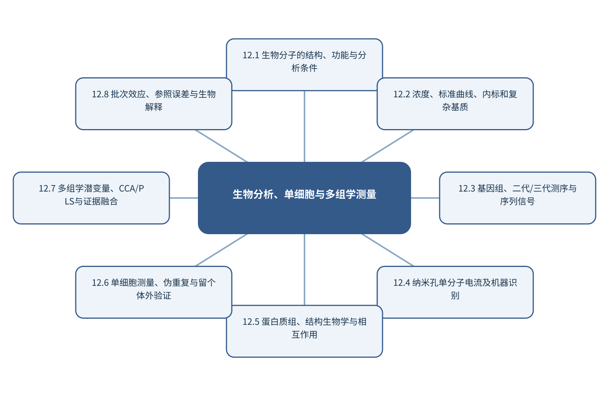

# 第12章 生物分析、单细胞与多组学测量

> 第3篇 智能仪器分析与复杂分析对象

## 章首导引

高维、小样本、批次显著的生物数据怎样产生可信而非伪独立的证据？ 本章的回答是：保留测序、纳米孔、蛋白质和单细胞内容，突出层级重复与多模态参照。全章以序列、单细胞、组学和空间表型为对象，坚持“尊重生物层级、批次和参照测量误差”，并通过“用质谱参照连接单细胞拉曼与组学表型”把概念、计算和分析决策连为一体。

## 学习目标

- 能够说明序列、单细胞、组学和空间表型在本章中的数据结构与主要信息来源。
- 能够解释本章关键方法的输入、输出、参数、假设和失效条件。
- 能够以“尊重生物层级、批次和参照测量误差”设计训练、验证和独立测试。
- 能够完成“用质谱参照连接单细胞拉曼与组学表型”的最小代码实验并分析失败样本。

## 本章知识图谱

## 12.1 生物分子的结构、功能与分析条件

本节围绕“生物分子的结构、功能与分析条件”展开。分析对象是序列、单细胞、组学和空间表型，核心不是罗列名词，而是说明核酸、蛋白质、脂质、糖和小分子、结构—功能关系、pH、温度、溶剂和稳定性、生物标志物与复杂基质怎样进入同一条测量与推断链。读者首先要辨认哪些量来自真实样品，哪些量由仪器转换得到，哪些量由算法估计；三类量若混在一起，模型精度就很难被解释。

在“生物分子的结构、功能与分析条件”中，技术路线遵循“尊重生物层级、批次和参照测量误差”。具体计算从可诊断的经典基线开始，再增加本节所需的非线性、结构先验或不确定度组件。新增组件必须回答一个明确问题，并在相同数据边界下与基线比较；只有平均分提高而误差结构没有改善，不能构成采用复杂模型的充分理由。

本节把“用质谱参照连接单细胞拉曼与组学表型”落实到生物标志物与复杂基质这一检查点。验证时保留与未来使用条件一致的独立对象，检查坐标轴、单位、样品身份、批次、参数来源和失败样本。由此得到的结论才可用于下一步测量或实验，而不是停留在一张看似分离良好的图上。

### 12.1.1 核酸、蛋白质、脂质、糖和小分子

就“核酸、蛋白质、脂质、糖和小分子”而言，在“生物分子的结构、功能与分析条件”中，核酸、蛋白质、脂质、糖和小分子具体限定了序列、单细胞、组学和空间表型的一个技术接口。它必须被写成可检查的输入、变换和输出：输入保留样品与仪器条件，变换说明参数从何处估计，输出对应可观察量或候选判断；缺少任何一层，概念就无法进入实验和代码。

把“核酸、蛋白质、脂质、糖和小分子”用于“生物分子的结构、功能与分析条件”时，本书用“用质谱参照连接单细胞拉曼与组学表型”检验核酸、蛋白质、脂质、糖和小分子。实现时遵循“尊重生物层级、批次和参照测量误差”，先建立经典基线，再对参数敏感性、独立样品和失败对象进行检查。若结果只能在同批数据或单次划分中成立，应把它视为探索性现象而非稳定规律。读图或读指标时应返回原始数据抽查，避免把表示空间中的几何关系直接当成化学机制。

### 12.1.2 结构—功能关系

就“结构—功能关系”而言，结构—功能关系属于从观测反推对象的逆问题，常存在多解性。同一峰可由多个结构片段贡献，同一空间热点也可能受厚度、照明或离子抑制影响；因此模型输出首先是候选解释，而不是自动成立的机制。

把“结构—功能关系”用于“生物分子的结构、功能与分析条件”时，可信解释需要至少一条独立证据链：改变实验条件观察可预测响应、使用互补仪器验证候选，或以标准物质复现特征。显著性图、注意力和SHAP可定位模型依赖，却不能替代干预和机理实验。最终报告需要给出适用范围和拒绝条件，使方法在证据不足时能够停止输出。

### 12.1.3 pH、温度、溶剂和稳定性

就“pH、温度、溶剂和稳定性”而言，pH、温度、溶剂和稳定性的目标是判断样品中存在什么，而不是仅把信号分到一个已知类别。可靠识别至少需要选择性响应、参照物或谱库、相似干扰物以及库外样品；若候选集合不完整，最高匹配分只能表示‘在当前库中最相似’，不能等同于身份确认。

把“pH、温度、溶剂和稳定性”用于“生物分子的结构、功能与分析条件”时，定性流程应把检出、候选筛选和确证分开。检出阶段控制空白和假阳性，筛选阶段报告Top-k候选及分数差，确证阶段依靠保留信息、互补谱学或标准物质。模型还应设置拒识阈值，避免对训练分布之外的样品强行命名。教学上应把该概念落实为可观察变量、可运行程序和可反驳检验三层。

### 12.1.4 生物标志物与复杂基质

就“生物标志物与复杂基质”而言，在“生物分子的结构、功能与分析条件”中，生物标志物与复杂基质具体限定了序列、单细胞、组学和空间表型的一个技术接口。它必须被写成可检查的输入、变换和输出：输入保留样品与仪器条件，变换说明参数从何处估计，输出对应可观察量或候选判断；缺少任何一层，概念就无法进入实验和代码。

把“生物标志物与复杂基质”用于“生物分子的结构、功能与分析条件”时，本书用“用质谱参照连接单细胞拉曼与组学表型”检验生物标志物与复杂基质。实现时遵循“尊重生物层级、批次和参照测量误差”，先建立经典基线，再对参数敏感性、独立样品和失败对象进行检查。若结果只能在同批数据或单次划分中成立，应把它视为探索性现象而非稳定规律。在真实项目中，还应保存参数、软件版本和输入校验结果，以便定位变化来自样品还是计算。

## 12.2 浓度、标准曲线、内标和复杂基质

本节围绕“浓度、标准曲线、内标和复杂基质”展开。分析对象是序列、单细胞、组学和空间表型，核心不是罗列名词，而是说明质量、体积、摩尔和浓度、标准曲线、内标和加标回收、样品前处理和基质效应、检测限、定量限和动态范围怎样进入同一条测量与推断链。读者首先要辨认哪些量来自真实样品，哪些量由仪器转换得到，哪些量由算法估计；三类量若混在一起，模型精度就很难被解释。

在“浓度、标准曲线、内标和复杂基质”中，技术路线遵循“尊重生物层级、批次和参照测量误差”。具体计算从可诊断的经典基线开始，再增加本节所需的非线性、结构先验或不确定度组件。新增组件必须回答一个明确问题，并在相同数据边界下与基线比较；只有平均分提高而误差结构没有改善，不能构成采用复杂模型的充分理由。

本节把“用质谱参照连接单细胞拉曼与组学表型”落实到检测限、定量限和动态范围这一检查点。验证时保留与未来使用条件一致的独立对象，检查坐标轴、单位、样品身份、批次、参数来源和失败样本。由此得到的结论才可用于下一步测量或实验，而不是停留在一张看似分离良好的图上。

### 12.2.1 质量、体积、摩尔和浓度

就“质量、体积、摩尔和浓度”而言，质量、体积、摩尔和浓度要求把仪器响应连接到可溯源的量值。校准曲线不仅是一条拟合线，还隐含标准物质、基质、量程、样品前处理和响应稳定性；斜率反映灵敏度，截距与残差可暴露空白、背景和模型失配。

把“质量、体积、摩尔和浓度”用于“浓度、标准曲线、内标和复杂基质”时，定量结果至少同时检查偏差、精密度、线性或适用范围、检出限、定量限和回收率。多元模型同样要用独立样品验证，并报告浓度外推、基质变化和仪器漂移下的误差；小数位不能超过参照值和不确定度所支持的精度。读图或读指标时应返回原始数据抽查，避免把表示空间中的几何关系直接当成化学机制。

### 12.2.2 标准曲线、内标和加标回收

就“标准曲线、内标和加标回收”而言，在“浓度、标准曲线、内标和复杂基质”中，标准曲线、内标和加标回收具体限定了序列、单细胞、组学和空间表型的一个技术接口。它必须被写成可检查的输入、变换和输出：输入保留样品与仪器条件，变换说明参数从何处估计，输出对应可观察量或候选判断；缺少任何一层，概念就无法进入实验和代码。

把“标准曲线、内标和加标回收”用于“浓度、标准曲线、内标和复杂基质”时，本书用“用质谱参照连接单细胞拉曼与组学表型”检验标准曲线、内标和加标回收。实现时遵循“尊重生物层级、批次和参照测量误差”，先建立经典基线，再对参数敏感性、独立样品和失败对象进行检查。若结果只能在同批数据或单次划分中成立，应把它视为探索性现象而非稳定规律。最终报告需要给出适用范围和拒绝条件，使方法在证据不足时能够停止输出。

### 12.2.3 样品前处理和基质效应

就“样品前处理和基质效应”而言，在“浓度、标准曲线、内标和复杂基质”中，样品前处理和基质效应具体限定了序列、单细胞、组学和空间表型的一个技术接口。它必须被写成可检查的输入、变换和输出：输入保留样品与仪器条件，变换说明参数从何处估计，输出对应可观察量或候选判断；缺少任何一层，概念就无法进入实验和代码。

把“样品前处理和基质效应”用于“浓度、标准曲线、内标和复杂基质”时，本书用“用质谱参照连接单细胞拉曼与组学表型”检验样品前处理和基质效应。实现时遵循“尊重生物层级、批次和参照测量误差”，先建立经典基线，再对参数敏感性、独立样品和失败对象进行检查。若结果只能在同批数据或单次划分中成立，应把它视为探索性现象而非稳定规律。教学上应把该概念落实为可观察变量、可运行程序和可反驳检验三层。

### 12.2.4 检测限、定量限和动态范围

就“检测限、定量限和动态范围”而言，检测限、定量限和动态范围要求把仪器响应连接到可溯源的量值。校准曲线不仅是一条拟合线，还隐含标准物质、基质、量程、样品前处理和响应稳定性；斜率反映灵敏度，截距与残差可暴露空白、背景和模型失配。

把“检测限、定量限和动态范围”用于“浓度、标准曲线、内标和复杂基质”时，定量结果至少同时检查偏差、精密度、线性或适用范围、检出限、定量限和回收率。多元模型同样要用独立样品验证，并报告浓度外推、基质变化和仪器漂移下的误差；小数位不能超过参照值和不确定度所支持的精度。在真实项目中，还应保存参数、软件版本和输入校验结果，以便定位变化来自样品还是计算。

## 12.3 基因组、二代/三代测序与序列信号

本节围绕“基因组、二代/三代测序与序列信号”展开。分析对象是序列、单细胞、组学和空间表型，核心不是罗列名词，而是说明中心法则和序列信息、Sanger测序、二代高通量测序、三代单分子测序怎样进入同一条测量与推断链。读者首先要辨认哪些量来自真实样品，哪些量由仪器转换得到，哪些量由算法估计；三类量若混在一起，模型精度就很难被解释。

在“基因组、二代/三代测序与序列信号”中，技术路线遵循“尊重生物层级、批次和参照测量误差”。具体计算从可诊断的经典基线开始，再增加本节所需的非线性、结构先验或不确定度组件。新增组件必须回答一个明确问题，并在相同数据边界下与基线比较；只有平均分提高而误差结构没有改善，不能构成采用复杂模型的充分理由。

本节把“用质谱参照连接单细胞拉曼与组学表型”落实到测序误差和AI碱基识别这一检查点。验证时保留与未来使用条件一致的独立对象，检查坐标轴、单位、样品身份、批次、参数来源和失败样本。由此得到的结论才可用于下一步测量或实验，而不是停留在一张看似分离良好的图上。

### 12.3.1 中心法则和序列信息

就“中心法则和序列信息”而言，在“基因组、二代/三代测序与序列信号”中，中心法则和序列信息具体限定了序列、单细胞、组学和空间表型的一个技术接口。它必须被写成可检查的输入、变换和输出：输入保留样品与仪器条件，变换说明参数从何处估计，输出对应可观察量或候选判断；缺少任何一层，概念就无法进入实验和代码。

把“中心法则和序列信息”用于“基因组、二代/三代测序与序列信号”时，本书用“用质谱参照连接单细胞拉曼与组学表型”检验中心法则和序列信息。实现时遵循“尊重生物层级、批次和参照测量误差”，先建立经典基线，再对参数敏感性、独立样品和失败对象进行检查。若结果只能在同批数据或单次划分中成立，应把它视为探索性现象而非稳定规律。读图或读指标时应返回原始数据抽查，避免把表示空间中的几何关系直接当成化学机制。

### 12.3.2 Sanger测序

就“Sanger测序”而言，在“基因组、二代/三代测序与序列信号”中，Sanger测序具体限定了序列、单细胞、组学和空间表型的一个技术接口。它必须被写成可检查的输入、变换和输出：输入保留样品与仪器条件，变换说明参数从何处估计，输出对应可观察量或候选判断；缺少任何一层，概念就无法进入实验和代码。

把“Sanger测序”用于“基因组、二代/三代测序与序列信号”时，本书用“用质谱参照连接单细胞拉曼与组学表型”检验Sanger测序。实现时遵循“尊重生物层级、批次和参照测量误差”，先建立经典基线，再对参数敏感性、独立样品和失败对象进行检查。若结果只能在同批数据或单次划分中成立，应把它视为探索性现象而非稳定规律。最终报告需要给出适用范围和拒绝条件，使方法在证据不足时能够停止输出。

### 12.3.3 二代高通量测序

就“二代高通量测序”而言，在“基因组、二代/三代测序与序列信号”中，二代高通量测序具体限定了序列、单细胞、组学和空间表型的一个技术接口。它必须被写成可检查的输入、变换和输出：输入保留样品与仪器条件，变换说明参数从何处估计，输出对应可观察量或候选判断；缺少任何一层，概念就无法进入实验和代码。

把“二代高通量测序”用于“基因组、二代/三代测序与序列信号”时，本书用“用质谱参照连接单细胞拉曼与组学表型”检验二代高通量测序。实现时遵循“尊重生物层级、批次和参照测量误差”，先建立经典基线，再对参数敏感性、独立样品和失败对象进行检查。若结果只能在同批数据或单次划分中成立，应把它视为探索性现象而非稳定规律。教学上应把该概念落实为可观察变量、可运行程序和可反驳检验三层。

### 12.3.4 三代单分子测序

就“三代单分子测序”而言，在“基因组、二代/三代测序与序列信号”中，三代单分子测序具体限定了序列、单细胞、组学和空间表型的一个技术接口。它必须被写成可检查的输入、变换和输出：输入保留样品与仪器条件，变换说明参数从何处估计，输出对应可观察量或候选判断；缺少任何一层，概念就无法进入实验和代码。

把“三代单分子测序”用于“基因组、二代/三代测序与序列信号”时，本书用“用质谱参照连接单细胞拉曼与组学表型”检验三代单分子测序。实现时遵循“尊重生物层级、批次和参照测量误差”，先建立经典基线，再对参数敏感性、独立样品和失败对象进行检查。若结果只能在同批数据或单次划分中成立，应把它视为探索性现象而非稳定规律。在真实项目中，还应保存参数、软件版本和输入校验结果，以便定位变化来自样品还是计算。

### 12.3.5 测序误差和AI碱基识别

就“测序误差和AI碱基识别”而言，围绕“测序误差和AI碱基识别”，随机误差反映重复测量的波动，系统偏差使结果稳定地偏离参照，不确定度则量化在现有知识下结果可能处于的范围。三者属于不同概念。高重复性不代表无偏，模型测试误差很低也不代表参照标签准确。

把“测序误差和AI碱基识别”用于“基因组、二代/三代测序与序列信号”时，在“基因组、二代/三代测序与序列信号”的语境下，不确定度应沿采样、制样、校准、仪器、预处理和模型逐步传播。对于线性关系可使用一阶误差传播，对于明显非线性或参数相关的系统可使用蒙特卡洛抽样。报告时应给出覆盖概率、区间构造方法和适用条件，而不是只给一个小数位很多的点估计。若该步骤改变了样品单位、统计独立性或物理峰形，必须在独立数据上重新证明其有效性。

## 12.4 纳米孔单分子电流及机器识别

本节围绕“纳米孔单分子电流及机器识别”展开。分析对象是序列、单细胞、组学和空间表型，核心不是罗列名词，而是说明纳米孔限域和易位、pA级电流和时间分辨、DNA/RNA及修饰识别、蛋白、糖和氨基酸检测怎样进入同一条测量与推断链。读者首先要辨认哪些量来自真实样品，哪些量由仪器转换得到，哪些量由算法估计；三类量若混在一起，模型精度就很难被解释。

在“纳米孔单分子电流及机器识别”中，技术路线遵循“尊重生物层级、批次和参照测量误差”。具体计算从可诊断的经典基线开始，再增加本节所需的非线性、结构先验或不确定度组件。新增组件必须回答一个明确问题，并在相同数据边界下与基线比较；只有平均分提高而误差结构没有改善，不能构成采用复杂模型的充分理由。

本节把“用质谱参照连接单细胞拉曼与组学表型”落实到电流信号分类和序列模型这一检查点。验证时保留与未来使用条件一致的独立对象，检查坐标轴、单位、样品身份、批次、参数来源和失败样本。由此得到的结论才可用于下一步测量或实验，而不是停留在一张看似分离良好的图上。

### 12.4.1 纳米孔限域和易位

就“纳米孔限域和易位”而言，在“纳米孔单分子电流及机器识别”中，纳米孔限域和易位具体限定了序列、单细胞、组学和空间表型的一个技术接口。它必须被写成可检查的输入、变换和输出：输入保留样品与仪器条件，变换说明参数从何处估计，输出对应可观察量或候选判断；缺少任何一层，概念就无法进入实验和代码。

把“纳米孔限域和易位”用于“纳米孔单分子电流及机器识别”时，本书用“用质谱参照连接单细胞拉曼与组学表型”检验纳米孔限域和易位。实现时遵循“尊重生物层级、批次和参照测量误差”，先建立经典基线，再对参数敏感性、独立样品和失败对象进行检查。若结果只能在同批数据或单次划分中成立，应把它视为探索性现象而非稳定规律。读图或读指标时应返回原始数据抽查，避免把表示空间中的几何关系直接当成化学机制。

### 12.4.2 pA级电流和时间分辨

就“pA级电流和时间分辨”而言，pA级电流和时间分辨要求测量时间尺度快于被研究过程的关键变化。采样、传质、仪器响应和数据处理都可能造成时间延迟；若响应时间与反应时间相当，记录到的曲线是系统动力学与仪器核的卷积。

把“pA级电流和时间分辨”用于“纳米孔单分子电流及机器识别”时，建模时应保存真实时间戳、同步误差和操作事件，避免把等间隔文件序号当作真实时间。对于在线控制，还要区分毫秒级设备反馈与分钟级科学决策，并用状态估计处理不可直接观察的化学状态。最终报告需要给出适用范围和拒绝条件，使方法在证据不足时能够停止输出。

### 12.4.3 DNA/RNA及修饰识别

就“DNA/RNA及修饰识别”而言，DNA/RNA及修饰识别的目标是判断样品中存在什么，而不是仅把信号分到一个已知类别。可靠识别至少需要选择性响应、参照物或谱库、相似干扰物以及库外样品；若候选集合不完整，最高匹配分只能表示‘在当前库中最相似’，不能等同于身份确认。

把“DNA/RNA及修饰识别”用于“纳米孔单分子电流及机器识别”时，定性流程应把检出、候选筛选和确证分开。检出阶段控制空白和假阳性，筛选阶段报告Top-k候选及分数差，确证阶段依靠保留信息、互补谱学或标准物质。模型还应设置拒识阈值，避免对训练分布之外的样品强行命名。教学上应把该概念落实为可观察变量、可运行程序和可反驳检验三层。

### 12.4.4 蛋白、糖和氨基酸检测

就“蛋白、糖和氨基酸检测”而言，在“纳米孔单分子电流及机器识别”中，蛋白、糖和氨基酸检测具体限定了序列、单细胞、组学和空间表型的一个技术接口。它必须被写成可检查的输入、变换和输出：输入保留样品与仪器条件，变换说明参数从何处估计，输出对应可观察量或候选判断；缺少任何一层，概念就无法进入实验和代码。

把“蛋白、糖和氨基酸检测”用于“纳米孔单分子电流及机器识别”时，本书用“用质谱参照连接单细胞拉曼与组学表型”检验蛋白、糖和氨基酸检测。实现时遵循“尊重生物层级、批次和参照测量误差”，先建立经典基线，再对参数敏感性、独立样品和失败对象进行检查。若结果只能在同批数据或单次划分中成立，应把它视为探索性现象而非稳定规律。在真实项目中，还应保存参数、软件版本和输入校验结果，以便定位变化来自样品还是计算。

### 12.4.5 电流信号分类和序列模型

就“电流信号分类和序列模型”而言，在“纳米孔单分子电流及机器识别”中，电流信号分类和序列模型具体限定了序列、单细胞、组学和空间表型的一个技术接口。它必须被写成可检查的输入、变换和输出：输入保留样品与仪器条件，变换说明参数从何处估计，输出对应可观察量或候选判断；缺少任何一层，概念就无法进入实验和代码。

把“电流信号分类和序列模型”用于“纳米孔单分子电流及机器识别”时，本书用“用质谱参照连接单细胞拉曼与组学表型”检验电流信号分类和序列模型。实现时遵循“尊重生物层级、批次和参照测量误差”，先建立经典基线，再对参数敏感性、独立样品和失败对象进行检查。若结果只能在同批数据或单次划分中成立，应把它视为探索性现象而非稳定规律。若该步骤改变了样品单位、统计独立性或物理峰形，必须在独立数据上重新证明其有效性。

## 12.5 蛋白质组、结构生物学与相互作用

本节围绕“蛋白质组、结构生物学与相互作用”展开。分析对象是序列、单细胞、组学和空间表型，核心不是罗列名词，而是说明蛋白质序列、结构和功能、质谱蛋白组学、蛋白相互作用、结构预测与生成模型怎样进入同一条测量与推断链。读者首先要辨认哪些量来自真实样品，哪些量由仪器转换得到，哪些量由算法估计；三类量若混在一起，模型精度就很难被解释。

在“蛋白质组、结构生物学与相互作用”中，技术路线遵循“尊重生物层级、批次和参照测量误差”。具体计算从可诊断的经典基线开始，再增加本节所需的非线性、结构先验或不确定度组件。新增组件必须回答一个明确问题，并在相同数据边界下与基线比较；只有平均分提高而误差结构没有改善，不能构成采用复杂模型的充分理由。

本节把“用质谱参照连接单细胞拉曼与组学表型”落实到参照结构和实验验证这一检查点。验证时保留与未来使用条件一致的独立对象，检查坐标轴、单位、样品身份、批次、参数来源和失败样本。由此得到的结论才可用于下一步测量或实验，而不是停留在一张看似分离良好的图上。

### 12.5.1 蛋白质序列、结构和功能

就“蛋白质序列、结构和功能”而言，蛋白质序列、结构和功能属于从观测反推对象的逆问题，常存在多解性。同一峰可由多个结构片段贡献，同一空间热点也可能受厚度、照明或离子抑制影响；因此模型输出首先是候选解释，而不是自动成立的机制。

把“蛋白质序列、结构和功能”用于“蛋白质组、结构生物学与相互作用”时，可信解释需要至少一条独立证据链：改变实验条件观察可预测响应、使用互补仪器验证候选，或以标准物质复现特征。显著性图、注意力和SHAP可定位模型依赖，却不能替代干预和机理实验。读图或读指标时应返回原始数据抽查，避免把表示空间中的几何关系直接当成化学机制。

### 12.5.2 质谱蛋白组学

就“质谱蛋白组学”而言，在“蛋白质组、结构生物学与相互作用”中，质谱蛋白组学具体限定了序列、单细胞、组学和空间表型的一个技术接口。它必须被写成可检查的输入、变换和输出：输入保留样品与仪器条件，变换说明参数从何处估计，输出对应可观察量或候选判断；缺少任何一层，概念就无法进入实验和代码。

把“质谱蛋白组学”用于“蛋白质组、结构生物学与相互作用”时，本书用“用质谱参照连接单细胞拉曼与组学表型”检验质谱蛋白组学。实现时遵循“尊重生物层级、批次和参照测量误差”，先建立经典基线，再对参数敏感性、独立样品和失败对象进行检查。若结果只能在同批数据或单次划分中成立，应把它视为探索性现象而非稳定规律。最终报告需要给出适用范围和拒绝条件，使方法在证据不足时能够停止输出。

### 12.5.3 蛋白相互作用

就“蛋白相互作用”而言，在“蛋白质组、结构生物学与相互作用”中，蛋白相互作用具体限定了序列、单细胞、组学和空间表型的一个技术接口。它必须被写成可检查的输入、变换和输出：输入保留样品与仪器条件，变换说明参数从何处估计，输出对应可观察量或候选判断；缺少任何一层，概念就无法进入实验和代码。

把“蛋白相互作用”用于“蛋白质组、结构生物学与相互作用”时，本书用“用质谱参照连接单细胞拉曼与组学表型”检验蛋白相互作用。实现时遵循“尊重生物层级、批次和参照测量误差”，先建立经典基线，再对参数敏感性、独立样品和失败对象进行检查。若结果只能在同批数据或单次划分中成立，应把它视为探索性现象而非稳定规律。教学上应把该概念落实为可观察变量、可运行程序和可反驳检验三层。

### 12.5.4 结构预测与生成模型

就“结构预测与生成模型”而言，结构预测与生成模型属于从观测反推对象的逆问题，常存在多解性。同一峰可由多个结构片段贡献，同一空间热点也可能受厚度、照明或离子抑制影响；因此模型输出首先是候选解释，而不是自动成立的机制。

把“结构预测与生成模型”用于“蛋白质组、结构生物学与相互作用”时，可信解释需要至少一条独立证据链：改变实验条件观察可预测响应、使用互补仪器验证候选，或以标准物质复现特征。显著性图、注意力和SHAP可定位模型依赖，却不能替代干预和机理实验。在真实项目中，还应保存参数、软件版本和输入校验结果，以便定位变化来自样品还是计算。

### 12.5.5 参照结构和实验验证

就“参照结构和实验验证”而言，参照结构和实验验证属于从观测反推对象的逆问题，常存在多解性。同一峰可由多个结构片段贡献，同一空间热点也可能受厚度、照明或离子抑制影响；因此模型输出首先是候选解释，而不是自动成立的机制。

把“参照结构和实验验证”用于“蛋白质组、结构生物学与相互作用”时，可信解释需要至少一条独立证据链：改变实验条件观察可预测响应、使用互补仪器验证候选，或以标准物质复现特征。显著性图、注意力和SHAP可定位模型依赖，却不能替代干预和机理实验。若该步骤改变了样品单位、统计独立性或物理峰形，必须在独立数据上重新证明其有效性。

## 12.6 单细胞测量、伪重复与留个体外验证

本节围绕“单细胞测量、伪重复与留个体外验证”展开。分析对象是序列、单细胞、组学和空间表型，核心不是罗列名词，而是说明生物重复与技术重复、细胞不等于独立个体、单细胞组学与表型、留个体外验证怎样进入同一条测量与推断链。读者首先要辨认哪些量来自真实样品，哪些量由仪器转换得到，哪些量由算法估计；三类量若混在一起，模型精度就很难被解释。

在“单细胞测量、伪重复与留个体外验证”中，技术路线遵循“尊重生物层级、批次和参照测量误差”。具体计算从可诊断的经典基线开始，再增加本节所需的非线性、结构先验或不确定度组件。新增组件必须回答一个明确问题，并在相同数据边界下与基线比较；只有平均分提高而误差结构没有改善，不能构成采用复杂模型的充分理由。

本节把“用质谱参照连接单细胞拉曼与组学表型”落实到ground truth不确定性这一检查点。验证时保留与未来使用条件一致的独立对象，检查坐标轴、单位、样品身份、批次、参数来源和失败样本。由此得到的结论才可用于下一步测量或实验，而不是停留在一张看似分离良好的图上。

### 12.6.1 生物重复与技术重复

就“生物重复与技术重复”而言，围绕“生物重复与技术重复”，生物重复代表独立个体或独立生物过程，技术重复代表同一样品的重复测量。把数千个细胞当作数千个独立个体会严重低估不确定性。统计检验、交叉验证和测试划分必须以生物重复为基本单位。

把“生物重复与技术重复”用于“单细胞测量、伪重复与留个体外验证”时，在“单细胞测量、伪重复与留个体外验证”的语境下，批次效应来自制样、试剂、仪器、操作者和时间。校正算法只能处理被数据支持的结构，若处理组与批次完全混杂，就无法从算法上区分。所谓ground truth也可能由另一种有误差的测量提供，应把参照误差纳入讨论。读图或读指标时应返回原始数据抽查，避免把表示空间中的几何关系直接当成化学机制。

### 12.6.2 细胞不等于独立个体

就“细胞不等于独立个体”而言，在“单细胞测量、伪重复与留个体外验证”中，细胞不等于独立个体具体限定了序列、单细胞、组学和空间表型的一个技术接口。它必须被写成可检查的输入、变换和输出：输入保留样品与仪器条件，变换说明参数从何处估计，输出对应可观察量或候选判断；缺少任何一层，概念就无法进入实验和代码。

把“细胞不等于独立个体”用于“单细胞测量、伪重复与留个体外验证”时，本书用“用质谱参照连接单细胞拉曼与组学表型”检验细胞不等于独立个体。实现时遵循“尊重生物层级、批次和参照测量误差”，先建立经典基线，再对参数敏感性、独立样品和失败对象进行检查。若结果只能在同批数据或单次划分中成立，应把它视为探索性现象而非稳定规律。最终报告需要给出适用范围和拒绝条件，使方法在证据不足时能够停止输出。

### 12.6.3 单细胞组学与表型

就“单细胞组学与表型”而言，在“单细胞测量、伪重复与留个体外验证”中，单细胞组学与表型具体限定了序列、单细胞、组学和空间表型的一个技术接口。它必须被写成可检查的输入、变换和输出：输入保留样品与仪器条件，变换说明参数从何处估计，输出对应可观察量或候选判断；缺少任何一层，概念就无法进入实验和代码。

把“单细胞组学与表型”用于“单细胞测量、伪重复与留个体外验证”时，本书用“用质谱参照连接单细胞拉曼与组学表型”检验单细胞组学与表型。实现时遵循“尊重生物层级、批次和参照测量误差”，先建立经典基线，再对参数敏感性、独立样品和失败对象进行检查。若结果只能在同批数据或单次划分中成立，应把它视为探索性现象而非稳定规律。教学上应把该概念落实为可观察变量、可运行程序和可反驳检验三层。

### 12.6.4 留个体外验证

就“留个体外验证”而言，在“单细胞测量、伪重复与留个体外验证”中，留个体外验证具体限定了序列、单细胞、组学和空间表型的一个技术接口。它必须被写成可检查的输入、变换和输出：输入保留样品与仪器条件，变换说明参数从何处估计，输出对应可观察量或候选判断；缺少任何一层，概念就无法进入实验和代码。

把“留个体外验证”用于“单细胞测量、伪重复与留个体外验证”时，本书用“用质谱参照连接单细胞拉曼与组学表型”检验留个体外验证。实现时遵循“尊重生物层级、批次和参照测量误差”，先建立经典基线，再对参数敏感性、独立样品和失败对象进行检查。若结果只能在同批数据或单次划分中成立，应把它视为探索性现象而非稳定规律。在真实项目中，还应保存参数、软件版本和输入校验结果，以便定位变化来自样品还是计算。

### 12.6.5 ground truth不确定性

就“ground truth不确定性”而言，围绕“ground truth不确定性”，随机误差反映重复测量的波动，系统偏差使结果稳定地偏离参照，不确定度则量化在现有知识下结果可能处于的范围。三者属于不同概念。高重复性不代表无偏，模型测试误差很低也不代表参照标签准确。

把“ground truth不确定性”用于“单细胞测量、伪重复与留个体外验证”时，在“单细胞测量、伪重复与留个体外验证”的语境下，不确定度应沿采样、制样、校准、仪器、预处理和模型逐步传播。对于线性关系可使用一阶误差传播，对于明显非线性或参数相关的系统可使用蒙特卡洛抽样。报告时应给出覆盖概率、区间构造方法和适用条件，而不是只给一个小数位很多的点估计。若该步骤改变了样品单位、统计独立性或物理峰形，必须在独立数据上重新证明其有效性。

## 12.7 多组学潜变量、CCA/PLS与证据融合

本节围绕“多组学潜变量、CCA/PLS与证据融合”展开。分析对象是序列、单细胞、组学和空间表型，核心不是罗列名词，而是说明早/中/晚期多模态融合、CCA和多块PLS、共享潜变量、组学—图像—谱图对齐怎样进入同一条测量与推断链。读者首先要辨认哪些量来自真实样品，哪些量由仪器转换得到，哪些量由算法估计；三类量若混在一起，模型精度就很难被解释。

在“多组学潜变量、CCA/PLS与证据融合”中，技术路线遵循“尊重生物层级、批次和参照测量误差”。具体计算从可诊断的经典基线开始，再增加本节所需的非线性、结构先验或不确定度组件。新增组件必须回答一个明确问题，并在相同数据边界下与基线比较；只有平均分提高而误差结构没有改善，不能构成采用复杂模型的充分理由。

本节把“用质谱参照连接单细胞拉曼与组学表型”落实到缺失模态和置换检验这一检查点。验证时保留与未来使用条件一致的独立对象，检查坐标轴、单位、样品身份、批次、参数来源和失败样本。由此得到的结论才可用于下一步测量或实验，而不是停留在一张看似分离良好的图上。

### 12.7.1 早/中/晚期多模态融合

就“早/中/晚期多模态融合”而言，围绕“早/中/晚期多模态融合”，多模态学习把结构、谱图、图像、文本和实验条件作为互补观测。早期融合在输入或浅层表示处拼接，要求严格对齐；晚期融合组合独立模型输出，更容易处理缺失模态；联合表示学习则直接优化跨模态对应关系。

把“早/中/晚期多模态融合”用于“多组学潜变量、CCA/PLS与证据融合”时，在“多组学潜变量、CCA/PLS与证据融合”的语境下，对比学习拉近匹配样本的表示并推远不匹配样本。负样本若包含实际相似或同一对象的不同观测，会向模型提供错误监督。评价除下游性能外，还应检查检索、缺失模态稳健性和批次独立性。读图或读指标时应返回原始数据抽查，避免把表示空间中的几何关系直接当成化学机制。

### 12.7.2 CCA和多块PLS

就“CCA和多块PLS”而言，围绕“CCA和多块PLS”，PCR先对X进行PCA，再用选定主成分预测y；PLS则在构造潜变量时同时考虑X的变化和X与y的协方差。因此，当与y有关的方向并非X中方差最大的方向时，PLS可能使用更少潜变量获得较好预测。

把“CCA和多块PLS”用于“多组学潜变量、CCA/PLS与证据融合”时，在“多组学潜变量、CCA/PLS与证据融合”的语境下，潜变量数必须通过交叉验证选择。数量不足会遗漏有效关系，数量过多会把噪声和批次差异吸收进模型。报告时应区分校准误差、交叉验证误差和独立预测误差，并检查载荷和回归系数是否具有稳定的化学含义。最终报告需要给出适用范围和拒绝条件，使方法在证据不足时能够停止输出。

### 12.7.3 共享潜变量

就“共享潜变量”而言，在“多组学潜变量、CCA/PLS与证据融合”中，共享潜变量具体限定了序列、单细胞、组学和空间表型的一个技术接口。它必须被写成可检查的输入、变换和输出：输入保留样品与仪器条件，变换说明参数从何处估计，输出对应可观察量或候选判断；缺少任何一层，概念就无法进入实验和代码。

把“共享潜变量”用于“多组学潜变量、CCA/PLS与证据融合”时，本书用“用质谱参照连接单细胞拉曼与组学表型”检验共享潜变量。实现时遵循“尊重生物层级、批次和参照测量误差”，先建立经典基线，再对参数敏感性、独立样品和失败对象进行检查。若结果只能在同批数据或单次划分中成立，应把它视为探索性现象而非稳定规律。教学上应把该概念落实为可观察变量、可运行程序和可反驳检验三层。

### 12.7.4 组学—图像—谱图对齐

就“组学—图像—谱图对齐”而言，围绕“组学—图像—谱图对齐”，分子图以原子为节点、化学键为空间关系。消息传递网络在每一层聚合邻居信息并更新节点表示，多层传播扩大感受野。全局池化把节点表示汇总为分子级向量。

把“组学—图像—谱图对齐”用于“多组学潜变量、CCA/PLS与证据融合”时，在“多组学潜变量、CCA/PLS与证据融合”的语境下，二维图不能完整表达构象和空间相互作用。使用距离、角度或等变网络可以处理三维几何；SE(3)等变性要求模型输出随旋转和平移按物理规律变化。构象生成、温度和质子化态仍是输入不确定性的来源。在真实项目中，还应保存参数、软件版本和输入校验结果，以便定位变化来自样品还是计算。

### 12.7.5 缺失模态和置换检验

就“缺失模态和置换检验”而言，在“多组学潜变量、CCA/PLS与证据融合”中，缺失模态和置换检验具体限定了序列、单细胞、组学和空间表型的一个技术接口。它必须被写成可检查的输入、变换和输出：输入保留样品与仪器条件，变换说明参数从何处估计，输出对应可观察量或候选判断；缺少任何一层，概念就无法进入实验和代码。

把“缺失模态和置换检验”用于“多组学潜变量、CCA/PLS与证据融合”时，本书用“用质谱参照连接单细胞拉曼与组学表型”检验缺失模态和置换检验。实现时遵循“尊重生物层级、批次和参照测量误差”，先建立经典基线，再对参数敏感性、独立样品和失败对象进行检查。若结果只能在同批数据或单次划分中成立，应把它视为探索性现象而非稳定规律。若该步骤改变了样品单位、统计独立性或物理峰形，必须在独立数据上重新证明其有效性。

## 12.8 批次效应、参照误差与生物解释

本节围绕“批次效应、参照误差与生物解释”展开。分析对象是序列、单细胞、组学和空间表型，核心不是罗列名词，而是说明批次来源和完全混杂、批次校正的可识别性、高维小样本和多重检验、生物解释与外部队列复现怎样进入同一条测量与推断链。读者首先要辨认哪些量来自真实样品，哪些量由仪器转换得到，哪些量由算法估计；三类量若混在一起，模型精度就很难被解释。

在“批次效应、参照误差与生物解释”中，技术路线遵循“尊重生物层级、批次和参照测量误差”。具体计算从可诊断的经典基线开始，再增加本节所需的非线性、结构先验或不确定度组件。新增组件必须回答一个明确问题，并在相同数据边界下与基线比较；只有平均分提高而误差结构没有改善，不能构成采用复杂模型的充分理由。

本节把“用质谱参照连接单细胞拉曼与组学表型”落实到生物解释与外部队列复现这一检查点。验证时保留与未来使用条件一致的独立对象，检查坐标轴、单位、样品身份、批次、参数来源和失败样本。由此得到的结论才可用于下一步测量或实验，而不是停留在一张看似分离良好的图上。

### 12.8.1 批次来源和完全混杂

就“批次来源和完全混杂”而言，在“批次效应、参照误差与生物解释”中，批次来源和完全混杂具体限定了序列、单细胞、组学和空间表型的一个技术接口。它必须被写成可检查的输入、变换和输出：输入保留样品与仪器条件，变换说明参数从何处估计，输出对应可观察量或候选判断；缺少任何一层，概念就无法进入实验和代码。

把“批次来源和完全混杂”用于“批次效应、参照误差与生物解释”时，本书用“用质谱参照连接单细胞拉曼与组学表型”检验批次来源和完全混杂。实现时遵循“尊重生物层级、批次和参照测量误差”，先建立经典基线，再对参数敏感性、独立样品和失败对象进行检查。若结果只能在同批数据或单次划分中成立，应把它视为探索性现象而非稳定规律。读图或读指标时应返回原始数据抽查，避免把表示空间中的几何关系直接当成化学机制。

### 12.8.2 批次校正的可识别性

就“批次校正的可识别性”而言，批次校正的可识别性的目标是判断样品中存在什么，而不是仅把信号分到一个已知类别。可靠识别至少需要选择性响应、参照物或谱库、相似干扰物以及库外样品；若候选集合不完整，最高匹配分只能表示‘在当前库中最相似’，不能等同于身份确认。

把“批次校正的可识别性”用于“批次效应、参照误差与生物解释”时，定性流程应把检出、候选筛选和确证分开。检出阶段控制空白和假阳性，筛选阶段报告Top-k候选及分数差，确证阶段依靠保留信息、互补谱学或标准物质。模型还应设置拒识阈值，避免对训练分布之外的样品强行命名。最终报告需要给出适用范围和拒绝条件，使方法在证据不足时能够停止输出。

### 12.8.3 高维小样本和多重检验

就“高维小样本和多重检验”而言，在“批次效应、参照误差与生物解释”中，高维小样本和多重检验具体限定了序列、单细胞、组学和空间表型的一个技术接口。它必须被写成可检查的输入、变换和输出：输入保留样品与仪器条件，变换说明参数从何处估计，输出对应可观察量或候选判断；缺少任何一层，概念就无法进入实验和代码。

把“高维小样本和多重检验”用于“批次效应、参照误差与生物解释”时，本书用“用质谱参照连接单细胞拉曼与组学表型”检验高维小样本和多重检验。实现时遵循“尊重生物层级、批次和参照测量误差”，先建立经典基线，再对参数敏感性、独立样品和失败对象进行检查。若结果只能在同批数据或单次划分中成立，应把它视为探索性现象而非稳定规律。教学上应把该概念落实为可观察变量、可运行程序和可反驳检验三层。

### 12.8.4 生物解释与外部队列复现

就“生物解释与外部队列复现”而言，在“批次效应、参照误差与生物解释”中，生物解释与外部队列复现具体限定了序列、单细胞、组学和空间表型的一个技术接口。它必须被写成可检查的输入、变换和输出：输入保留样品与仪器条件，变换说明参数从何处估计，输出对应可观察量或候选判断；缺少任何一层，概念就无法进入实验和代码。

把“生物解释与外部队列复现”用于“批次效应、参照误差与生物解释”时，本书用“用质谱参照连接单细胞拉曼与组学表型”检验生物解释与外部队列复现。实现时遵循“尊重生物层级、批次和参照测量误差”，先建立经典基线，再对参数敏感性、独立样品和失败对象进行检查。若结果只能在同批数据或单次划分中成立，应把它视为探索性现象而非稳定规律。在真实项目中，还应保存参数、软件版本和输入校验结果，以便定位变化来自样品还是计算。

## 关键关系与计算抓手

- `X≈T_xP_xᵀ+E_x；Y≈T_yP_yᵀ+E_y`

- `回收率=(测得增量/加入量)×100%`

## 本章综合案例

本章案例：用质谱参照连接单细胞拉曼与组学表型。先明确样品单位、测量协议和数据结构，建立最简单且可诊断的基线；再加入本章核心方法，并在同一独立测试边界下比较。结果至少按批次、信号强弱和适用域分层，给出错误对象而非只报告总体平均数。

完成案例时，应提交问题卡、数据字典、运行日志、关键图表、失败样本清单和可运行程序。任何由模型提出的解释都要能被互补测量或后续实验检验。

## 代码实践

- 任务：模拟共享潜变量的两组学数据，用CCA对齐并比较随机与留个体外验证。
- 代码：[chapter_exercise.py](../code/ch12.py)

## 本章小结

本章以序列、单细胞、组学和空间表型为对象，把“生物分析、单细胞与多组学测量”组织为测量、表示、推断和行动的连续过程。复习时应能解释数据如何生成、方法为何适用、性能如何验证，以及证据不足时何时拒绝输出。

## 思考题与计算题

1. 为“用质谱参照连接单细胞拉曼与组学表型”画出样品—仪器—数据—模型—结论链，并标出三处可能失真位置。
2. 从本章选择一个方法，写出输入、输出、关键参数、基本假设和至少两个失效条件。
3. 建立一个经典基线，并说明复杂模型必须在哪些独立指标上超过它。
4. 把随机划分改为符合未来使用条件的分组或外推划分，比较结果并解释差异。
5. 完成配套代码，增加一个单元测试和一个失败样本可视化。
6. 设计一个能够区分“模型学到化学信息”和“模型学到批次捷径”的对照实验。

## 下载本章资源

<a href="./downloads/word/ch12.docx" download>Word出版稿</a>　·　<a href="./code/ch12.py" download>Python代码</a>　·　<a href="./assets/graphs/ch12.svg" download>SVG知识图谱</a>

## 年度课程资源、传承题与更新引文

本章的稳定教材内容与逐年更新的教学资源分开维护。维护组须在年度归档中同步补入课件链接、可传承的题目和有来源链接的前沿引文。

- [本学年课程 PPT（PDF）](#/resources/annual/2026-2027/ppt/README?id=ch12)
- [留给下一届的本章传承题](#/resources/annual/2026-2027/questions/README?id=ch12)

### 本章首批可点击引文

- Jumper, J. *et al.* [Highly accurate protein structure prediction with AlphaFold](https://doi.org/10.1038/s41586-021-03819-2). *Nature* **596**, 583–589 (2021).
- [查看本章 2026–2027 学年完整引文与后续更新](#/resources/annual/2026-2027/references/README?id=ch12)

---

## 本章共建记录与致谢

| 学年 | 贡献者 | 工作内容 | 关联PR |
|---|---|---|---|
| 待本学年维护组补充 | — | — | — |
