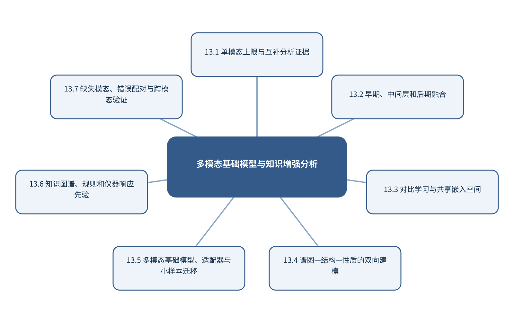

# 第13章 多模态基础模型与知识增强分析

> 第4篇 跨模态、标准化与可信智能分析　·　建议出版篇幅：24页

## 章首导引

怎样把谱图、结构、图像、文本和实验条件放进同一化学语义空间？ 本章的回答是：把分散在各应用章的融合方法上升为统一表示和知识增强框架。全章以谱图、结构、图像、文本和实验条件为对象，坚持“先证明模态互补，再学习共同化学语义空间”，并通过“建立谱图—结构对比学习和跨模态检索基线”把概念、计算和分析决策连为一体。

## 学习目标

- 能够说明谱图、结构、图像、文本和实验条件在本章中的数据结构与主要信息来源。
- 能够解释本章关键方法的输入、输出、参数、假设和失效条件。
- 能够以“先证明模态互补，再学习共同化学语义空间”设计训练、验证和独立测试。
- 能够完成“建立谱图—结构对比学习和跨模态检索基线”的最小代码实验并分析失败样本。

## 本章知识图谱

## 13.1 单模态上限与互补分析证据

本节围绕“单模态上限与互补分析证据”展开。分析对象是谱图、结构、图像、文本和实验条件，核心不是罗列名词，而是说明单一仪器的信息上限、分子—细胞—组织多尺度、光谱、质谱、图像和文本互补、数据融合与知识融合怎样进入同一条测量与推断链。读者首先要辨认哪些量来自真实样品，哪些量由仪器转换得到，哪些量由算法估计；三类量若混在一起，模型精度就很难被解释。

在“单模态上限与互补分析证据”中，技术路线遵循“先证明模态互补，再学习共同化学语义空间”。具体计算从可诊断的经典基线开始，再增加本节所需的非线性、结构先验或不确定度组件。新增组件必须回答一个明确问题，并在相同数据边界下与基线比较；只有平均分提高而误差结构没有改善，不能构成采用复杂模型的充分理由。

本节把“建立谱图—结构对比学习和跨模态检索基线”落实到数据融合与知识融合这一检查点。验证时保留与未来使用条件一致的独立对象，检查坐标轴、单位、样品身份、批次、参数来源和失败样本。由此得到的结论才可用于下一步测量或实验，而不是停留在一张看似分离良好的图上。

### 13.1.1 单一仪器的信息上限

就“单一仪器的信息上限”而言，在“单模态上限与互补分析证据”中，单一仪器的信息上限具体限定了谱图、结构、图像、文本和实验条件的一个技术接口。它必须被写成可检查的输入、变换和输出：输入保留样品与仪器条件，变换说明参数从何处估计，输出对应可观察量或候选判断；缺少任何一层，概念就无法进入实验和代码。

把“单一仪器的信息上限”用于“单模态上限与互补分析证据”时，本书用“建立谱图—结构对比学习和跨模态检索基线”检验单一仪器的信息上限。实现时遵循“先证明模态互补，再学习共同化学语义空间”，先建立经典基线，再对参数敏感性、独立样品和失败对象进行检查。若结果只能在同批数据或单次划分中成立，应把它视为探索性现象而非稳定规律。最终报告需要给出适用范围和拒绝条件，使方法在证据不足时能够停止输出。

### 13.1.2 分子—细胞—组织多尺度

就“分子—细胞—组织多尺度”而言，在“单模态上限与互补分析证据”中，分子—细胞—组织多尺度具体限定了谱图、结构、图像、文本和实验条件的一个技术接口。它必须被写成可检查的输入、变换和输出：输入保留样品与仪器条件，变换说明参数从何处估计，输出对应可观察量或候选判断；缺少任何一层，概念就无法进入实验和代码。

把“分子—细胞—组织多尺度”用于“单模态上限与互补分析证据”时，本书用“建立谱图—结构对比学习和跨模态检索基线”检验分子—细胞—组织多尺度。实现时遵循“先证明模态互补，再学习共同化学语义空间”，先建立经典基线，再对参数敏感性、独立样品和失败对象进行检查。若结果只能在同批数据或单次划分中成立，应把它视为探索性现象而非稳定规律。教学上应把该概念落实为可观察变量、可运行程序和可反驳检验三层。

### 13.1.3 光谱、质谱、图像和文本互补

就“光谱、质谱、图像和文本互补”而言，围绕“光谱、质谱、图像和文本互补”，分子图以原子为节点、化学键为空间关系。消息传递网络在每一层聚合邻居信息并更新节点表示，多层传播扩大感受野。全局池化把节点表示汇总为分子级向量。

把“光谱、质谱、图像和文本互补”用于“单模态上限与互补分析证据”时，在“单模态上限与互补分析证据”的语境下，二维图不能完整表达构象和空间相互作用。使用距离、角度或等变网络可以处理三维几何；SE(3)等变性要求模型输出随旋转和平移按物理规律变化。构象生成、温度和质子化态仍是输入不确定性的来源。在真实项目中，还应保存参数、软件版本和输入校验结果，以便定位变化来自样品还是计算。

### 13.1.4 数据融合与知识融合

就“数据融合与知识融合”而言，围绕“数据融合与知识融合”，多模态学习把结构、谱图、图像、文本和实验条件作为互补观测。早期融合在输入或浅层表示处拼接，要求严格对齐；晚期融合组合独立模型输出，更容易处理缺失模态；联合表示学习则直接优化跨模态对应关系。

把“数据融合与知识融合”用于“单模态上限与互补分析证据”时，在“单模态上限与互补分析证据”的语境下，对比学习拉近匹配样本的表示并推远不匹配样本。负样本若包含实际相似或同一对象的不同观测，会向模型提供错误监督。评价除下游性能外，还应检查检索、缺失模态稳健性和批次独立性。若该步骤改变了样品单位、统计独立性或物理峰形，必须在独立数据上重新证明其有效性。

## 13.2 早期、中间层和后期融合

本节围绕“早期、中间层和后期融合”展开。分析对象是谱图、结构、图像、文本和实验条件，核心不是罗列名词，而是说明输入级早期融合、表示级中间融合、决策级晚期融合、融合位置与样品对齐怎样进入同一条测量与推断链。读者首先要辨认哪些量来自真实样品，哪些量由仪器转换得到，哪些量由算法估计；三类量若混在一起，模型精度就很难被解释。

在“早期、中间层和后期融合”中，技术路线遵循“先证明模态互补，再学习共同化学语义空间”。具体计算从可诊断的经典基线开始，再增加本节所需的非线性、结构先验或不确定度组件。新增组件必须回答一个明确问题，并在相同数据边界下与基线比较；只有平均分提高而误差结构没有改善，不能构成采用复杂模型的充分理由。

本节把“建立谱图—结构对比学习和跨模态检索基线”落实到缺失模态处理这一检查点。验证时保留与未来使用条件一致的独立对象，检查坐标轴、单位、样品身份、批次、参数来源和失败样本。由此得到的结论才可用于下一步测量或实验，而不是停留在一张看似分离良好的图上。

### 13.2.1 输入级早期融合

就“输入级早期融合”而言，围绕“输入级早期融合”，多模态学习把结构、谱图、图像、文本和实验条件作为互补观测。早期融合在输入或浅层表示处拼接，要求严格对齐；晚期融合组合独立模型输出，更容易处理缺失模态；联合表示学习则直接优化跨模态对应关系。

把“输入级早期融合”用于“早期、中间层和后期融合”时，在“早期、中间层和后期融合”的语境下，对比学习拉近匹配样本的表示并推远不匹配样本。负样本若包含实际相似或同一对象的不同观测，会向模型提供错误监督。评价除下游性能外，还应检查检索、缺失模态稳健性和批次独立性。最终报告需要给出适用范围和拒绝条件，使方法在证据不足时能够停止输出。

### 13.2.2 表示级中间融合

就“表示级中间融合”而言，围绕“表示级中间融合”，多模态学习把结构、谱图、图像、文本和实验条件作为互补观测。早期融合在输入或浅层表示处拼接，要求严格对齐；晚期融合组合独立模型输出，更容易处理缺失模态；联合表示学习则直接优化跨模态对应关系。

把“表示级中间融合”用于“早期、中间层和后期融合”时，在“早期、中间层和后期融合”的语境下，对比学习拉近匹配样本的表示并推远不匹配样本。负样本若包含实际相似或同一对象的不同观测，会向模型提供错误监督。评价除下游性能外，还应检查检索、缺失模态稳健性和批次独立性。教学上应把该概念落实为可观察变量、可运行程序和可反驳检验三层。

### 13.2.3 决策级晚期融合

就“决策级晚期融合”而言，围绕“决策级晚期融合”，多模态学习把结构、谱图、图像、文本和实验条件作为互补观测。早期融合在输入或浅层表示处拼接，要求严格对齐；晚期融合组合独立模型输出，更容易处理缺失模态；联合表示学习则直接优化跨模态对应关系。

把“决策级晚期融合”用于“早期、中间层和后期融合”时，在“早期、中间层和后期融合”的语境下，对比学习拉近匹配样本的表示并推远不匹配样本。负样本若包含实际相似或同一对象的不同观测，会向模型提供错误监督。评价除下游性能外，还应检查检索、缺失模态稳健性和批次独立性。在真实项目中，还应保存参数、软件版本和输入校验结果，以便定位变化来自样品还是计算。

### 13.2.4 融合位置与样品对齐

就“融合位置与样品对齐”而言，围绕“融合位置与样品对齐”，多模态学习把结构、谱图、图像、文本和实验条件作为互补观测。早期融合在输入或浅层表示处拼接，要求严格对齐；晚期融合组合独立模型输出，更容易处理缺失模态；联合表示学习则直接优化跨模态对应关系。

把“融合位置与样品对齐”用于“早期、中间层和后期融合”时，在“早期、中间层和后期融合”的语境下，对比学习拉近匹配样本的表示并推远不匹配样本。负样本若包含实际相似或同一对象的不同观测，会向模型提供错误监督。评价除下游性能外，还应检查检索、缺失模态稳健性和批次独立性。若该步骤改变了样品单位、统计独立性或物理峰形，必须在独立数据上重新证明其有效性。

### 13.2.5 缺失模态处理

就“缺失模态处理”而言，在“早期、中间层和后期融合”中，缺失模态处理具体限定了谱图、结构、图像、文本和实验条件的一个技术接口。它必须被写成可检查的输入、变换和输出：输入保留样品与仪器条件，变换说明参数从何处估计，输出对应可观察量或候选判断；缺少任何一层，概念就无法进入实验和代码。

把“缺失模态处理”用于“早期、中间层和后期融合”时，本书用“建立谱图—结构对比学习和跨模态检索基线”检验缺失模态处理。实现时遵循“先证明模态互补，再学习共同化学语义空间”，先建立经典基线，再对参数敏感性、独立样品和失败对象进行检查。若结果只能在同批数据或单次划分中成立，应把它视为探索性现象而非稳定规律。读图或读指标时应返回原始数据抽查，避免把表示空间中的几何关系直接当成化学机制。

## 13.3 对比学习与共享嵌入空间

本节围绕“对比学习与共享嵌入空间”展开。分析对象是谱图、结构、图像、文本和实验条件，核心不是罗列名词，而是说明正样本、负样本和配对质量、InfoNCE类目标、谱图—结构共同嵌入、跨模态检索怎样进入同一条测量与推断链。读者首先要辨认哪些量来自真实样品，哪些量由仪器转换得到，哪些量由算法估计；三类量若混在一起，模型精度就很难被解释。

在“对比学习与共享嵌入空间”中，技术路线遵循“先证明模态互补，再学习共同化学语义空间”。具体计算从可诊断的经典基线开始，再增加本节所需的非线性、结构先验或不确定度组件。新增组件必须回答一个明确问题，并在相同数据边界下与基线比较；只有平均分提高而误差结构没有改善，不能构成采用复杂模型的充分理由。

本节把“建立谱图—结构对比学习和跨模态检索基线”落实到假负样本和批次捷径这一检查点。验证时保留与未来使用条件一致的独立对象，检查坐标轴、单位、样品身份、批次、参数来源和失败样本。由此得到的结论才可用于下一步测量或实验，而不是停留在一张看似分离良好的图上。

### 13.3.1 正样本、负样本和配对质量

就“正样本、负样本和配对质量”而言，在“对比学习与共享嵌入空间”中，正样本、负样本和配对质量具体限定了谱图、结构、图像、文本和实验条件的一个技术接口。它必须被写成可检查的输入、变换和输出：输入保留样品与仪器条件，变换说明参数从何处估计，输出对应可观察量或候选判断；缺少任何一层，概念就无法进入实验和代码。

把“正样本、负样本和配对质量”用于“对比学习与共享嵌入空间”时，本书用“建立谱图—结构对比学习和跨模态检索基线”检验正样本、负样本和配对质量。实现时遵循“先证明模态互补，再学习共同化学语义空间”，先建立经典基线，再对参数敏感性、独立样品和失败对象进行检查。若结果只能在同批数据或单次划分中成立，应把它视为探索性现象而非稳定规律。最终报告需要给出适用范围和拒绝条件，使方法在证据不足时能够停止输出。

### 13.3.2 InfoNCE类目标

就“InfoNCE类目标”而言，在“对比学习与共享嵌入空间”中，InfoNCE类目标具体限定了谱图、结构、图像、文本和实验条件的一个技术接口。它必须被写成可检查的输入、变换和输出：输入保留样品与仪器条件，变换说明参数从何处估计，输出对应可观察量或候选判断；缺少任何一层，概念就无法进入实验和代码。

把“InfoNCE类目标”用于“对比学习与共享嵌入空间”时，本书用“建立谱图—结构对比学习和跨模态检索基线”检验InfoNCE类目标。实现时遵循“先证明模态互补，再学习共同化学语义空间”，先建立经典基线，再对参数敏感性、独立样品和失败对象进行检查。若结果只能在同批数据或单次划分中成立，应把它视为探索性现象而非稳定规律。教学上应把该概念落实为可观察变量、可运行程序和可反驳检验三层。

### 13.3.3 谱图—结构共同嵌入

就“谱图—结构共同嵌入”而言，围绕“谱图—结构共同嵌入”，分子图以原子为节点、化学键为空间关系。消息传递网络在每一层聚合邻居信息并更新节点表示，多层传播扩大感受野。全局池化把节点表示汇总为分子级向量。

把“谱图—结构共同嵌入”用于“对比学习与共享嵌入空间”时，在“对比学习与共享嵌入空间”的语境下，二维图不能完整表达构象和空间相互作用。使用距离、角度或等变网络可以处理三维几何；SE(3)等变性要求模型输出随旋转和平移按物理规律变化。构象生成、温度和质子化态仍是输入不确定性的来源。在真实项目中，还应保存参数、软件版本和输入校验结果，以便定位变化来自样品还是计算。

### 13.3.4 跨模态检索

就“跨模态检索”而言，在“对比学习与共享嵌入空间”中，跨模态检索具体限定了谱图、结构、图像、文本和实验条件的一个技术接口。它必须被写成可检查的输入、变换和输出：输入保留样品与仪器条件，变换说明参数从何处估计，输出对应可观察量或候选判断；缺少任何一层，概念就无法进入实验和代码。

把“跨模态检索”用于“对比学习与共享嵌入空间”时，本书用“建立谱图—结构对比学习和跨模态检索基线”检验跨模态检索。实现时遵循“先证明模态互补，再学习共同化学语义空间”，先建立经典基线，再对参数敏感性、独立样品和失败对象进行检查。若结果只能在同批数据或单次划分中成立，应把它视为探索性现象而非稳定规律。若该步骤改变了样品单位、统计独立性或物理峰形，必须在独立数据上重新证明其有效性。

### 13.3.5 假负样本和批次捷径

就“假负样本和批次捷径”而言，在“对比学习与共享嵌入空间”中，假负样本和批次捷径具体限定了谱图、结构、图像、文本和实验条件的一个技术接口。它必须被写成可检查的输入、变换和输出：输入保留样品与仪器条件，变换说明参数从何处估计，输出对应可观察量或候选判断；缺少任何一层，概念就无法进入实验和代码。

把“假负样本和批次捷径”用于“对比学习与共享嵌入空间”时，本书用“建立谱图—结构对比学习和跨模态检索基线”检验假负样本和批次捷径。实现时遵循“先证明模态互补，再学习共同化学语义空间”，先建立经典基线，再对参数敏感性、独立样品和失败对象进行检查。若结果只能在同批数据或单次划分中成立，应把它视为探索性现象而非稳定规律。读图或读指标时应返回原始数据抽查，避免把表示空间中的几何关系直接当成化学机制。

## 13.4 谱图—结构—性质的双向建模

本节围绕“谱图—结构—性质的双向建模”展开。分析对象是谱图、结构、图像、文本和实验条件，核心不是罗列名词，而是说明结构到谱图、谱图到结构、谱图/结构到性质、多任务学习怎样进入同一条测量与推断链。读者首先要辨认哪些量来自真实样品，哪些量由仪器转换得到，哪些量由算法估计；三类量若混在一起，模型精度就很难被解释。

在“谱图—结构—性质的双向建模”中，技术路线遵循“先证明模态互补，再学习共同化学语义空间”。具体计算从可诊断的经典基线开始，再增加本节所需的非线性、结构先验或不确定度组件。新增组件必须回答一个明确问题，并在相同数据边界下与基线比较；只有平均分提高而误差结构没有改善，不能构成采用复杂模型的充分理由。

本节把“建立谱图—结构对比学习和跨模态检索基线”落实到双向一致性和循环验证这一检查点。验证时保留与未来使用条件一致的独立对象，检查坐标轴、单位、样品身份、批次、参数来源和失败样本。由此得到的结论才可用于下一步测量或实验，而不是停留在一张看似分离良好的图上。

### 13.4.1 结构到谱图

就“结构到谱图”而言，围绕“结构到谱图”，分子图以原子为节点、化学键为空间关系。消息传递网络在每一层聚合邻居信息并更新节点表示，多层传播扩大感受野。全局池化把节点表示汇总为分子级向量。

把“结构到谱图”用于“谱图—结构—性质的双向建模”时，在“谱图—结构—性质的双向建模”的语境下，二维图不能完整表达构象和空间相互作用。使用距离、角度或等变网络可以处理三维几何；SE(3)等变性要求模型输出随旋转和平移按物理规律变化。构象生成、温度和质子化态仍是输入不确定性的来源。最终报告需要给出适用范围和拒绝条件，使方法在证据不足时能够停止输出。

### 13.4.2 谱图到结构

就“谱图到结构”而言，围绕“谱图到结构”，分子图以原子为节点、化学键为空间关系。消息传递网络在每一层聚合邻居信息并更新节点表示，多层传播扩大感受野。全局池化把节点表示汇总为分子级向量。

把“谱图到结构”用于“谱图—结构—性质的双向建模”时，在“谱图—结构—性质的双向建模”的语境下，二维图不能完整表达构象和空间相互作用。使用距离、角度或等变网络可以处理三维几何；SE(3)等变性要求模型输出随旋转和平移按物理规律变化。构象生成、温度和质子化态仍是输入不确定性的来源。教学上应把该概念落实为可观察变量、可运行程序和可反驳检验三层。

### 13.4.3 谱图/结构到性质

就“谱图/结构到性质”而言，围绕“谱图/结构到性质”，分子图以原子为节点、化学键为空间关系。消息传递网络在每一层聚合邻居信息并更新节点表示，多层传播扩大感受野。全局池化把节点表示汇总为分子级向量。

把“谱图/结构到性质”用于“谱图—结构—性质的双向建模”时，在“谱图—结构—性质的双向建模”的语境下，二维图不能完整表达构象和空间相互作用。使用距离、角度或等变网络可以处理三维几何；SE(3)等变性要求模型输出随旋转和平移按物理规律变化。构象生成、温度和质子化态仍是输入不确定性的来源。在真实项目中，还应保存参数、软件版本和输入校验结果，以便定位变化来自样品还是计算。

### 13.4.4 多任务学习

就“多任务学习”而言，在“谱图—结构—性质的双向建模”中，多任务学习具体限定了谱图、结构、图像、文本和实验条件的一个技术接口。它必须被写成可检查的输入、变换和输出：输入保留样品与仪器条件，变换说明参数从何处估计，输出对应可观察量或候选判断；缺少任何一层，概念就无法进入实验和代码。

把“多任务学习”用于“谱图—结构—性质的双向建模”时，本书用“建立谱图—结构对比学习和跨模态检索基线”检验多任务学习。实现时遵循“先证明模态互补，再学习共同化学语义空间”，先建立经典基线，再对参数敏感性、独立样品和失败对象进行检查。若结果只能在同批数据或单次划分中成立，应把它视为探索性现象而非稳定规律。若该步骤改变了样品单位、统计独立性或物理峰形，必须在独立数据上重新证明其有效性。

### 13.4.5 双向一致性和循环验证

就“双向一致性和循环验证”而言，在“谱图—结构—性质的双向建模”中，双向一致性和循环验证具体限定了谱图、结构、图像、文本和实验条件的一个技术接口。它必须被写成可检查的输入、变换和输出：输入保留样品与仪器条件，变换说明参数从何处估计，输出对应可观察量或候选判断；缺少任何一层，概念就无法进入实验和代码。

把“双向一致性和循环验证”用于“谱图—结构—性质的双向建模”时，本书用“建立谱图—结构对比学习和跨模态检索基线”检验双向一致性和循环验证。实现时遵循“先证明模态互补，再学习共同化学语义空间”，先建立经典基线，再对参数敏感性、独立样品和失败对象进行检查。若结果只能在同批数据或单次划分中成立，应把它视为探索性现象而非稳定规律。读图或读指标时应返回原始数据抽查，避免把表示空间中的几何关系直接当成化学机制。

## 13.5 多模态基础模型、适配器与小样本迁移

本节围绕“多模态基础模型、适配器与小样本迁移”展开。分析对象是谱图、结构、图像、文本和实验条件，核心不是罗列名词，而是说明分子、谱学、图像和序列基础模型、提示、微调、Adapter和LoRA、任务头和线性探针、小样本迁移和灾难性遗忘怎样进入同一条测量与推断链。读者首先要辨认哪些量来自真实样品，哪些量由仪器转换得到，哪些量由算法估计；三类量若混在一起，模型精度就很难被解释。

在“多模态基础模型、适配器与小样本迁移”中，技术路线遵循“先证明模态互补，再学习共同化学语义空间”。具体计算从可诊断的经典基线开始，再增加本节所需的非线性、结构先验或不确定度组件。新增组件必须回答一个明确问题，并在相同数据边界下与基线比较；只有平均分提高而误差结构没有改善，不能构成采用复杂模型的充分理由。

本节把“建立谱图—结构对比学习和跨模态检索基线”落实到小样本迁移和灾难性遗忘这一检查点。验证时保留与未来使用条件一致的独立对象，检查坐标轴、单位、样品身份、批次、参数来源和失败样本。由此得到的结论才可用于下一步测量或实验，而不是停留在一张看似分离良好的图上。

### 13.5.1 分子、谱学、图像和序列基础模型

就“分子、谱学、图像和序列基础模型”而言，围绕“分子、谱学、图像和序列基础模型”，分子图以原子为节点、化学键为空间关系。消息传递网络在每一层聚合邻居信息并更新节点表示，多层传播扩大感受野。全局池化把节点表示汇总为分子级向量。

把“分子、谱学、图像和序列基础模型”用于“多模态基础模型、适配器与小样本迁移”时，在“多模态基础模型、适配器与小样本迁移”的语境下，二维图不能完整表达构象和空间相互作用。使用距离、角度或等变网络可以处理三维几何；SE(3)等变性要求模型输出随旋转和平移按物理规律变化。构象生成、温度和质子化态仍是输入不确定性的来源。最终报告需要给出适用范围和拒绝条件，使方法在证据不足时能够停止输出。

### 13.5.2 提示、微调、Adapter和LoRA

就“提示、微调、Adapter和LoRA”而言，在“多模态基础模型、适配器与小样本迁移”中，提示、微调、Adapter和LoRA具体限定了谱图、结构、图像、文本和实验条件的一个技术接口。它必须被写成可检查的输入、变换和输出：输入保留样品与仪器条件，变换说明参数从何处估计，输出对应可观察量或候选判断；缺少任何一层，概念就无法进入实验和代码。

把“提示、微调、Adapter和LoRA”用于“多模态基础模型、适配器与小样本迁移”时，本书用“建立谱图—结构对比学习和跨模态检索基线”检验提示、微调、Adapter和LoRA。实现时遵循“先证明模态互补，再学习共同化学语义空间”，先建立经典基线，再对参数敏感性、独立样品和失败对象进行检查。若结果只能在同批数据或单次划分中成立，应把它视为探索性现象而非稳定规律。教学上应把该概念落实为可观察变量、可运行程序和可反驳检验三层。

### 13.5.3 任务头和线性探针

就“任务头和线性探针”而言，在“多模态基础模型、适配器与小样本迁移”中，任务头和线性探针具体限定了谱图、结构、图像、文本和实验条件的一个技术接口。它必须被写成可检查的输入、变换和输出：输入保留样品与仪器条件，变换说明参数从何处估计，输出对应可观察量或候选判断；缺少任何一层，概念就无法进入实验和代码。

把“任务头和线性探针”用于“多模态基础模型、适配器与小样本迁移”时，本书用“建立谱图—结构对比学习和跨模态检索基线”检验任务头和线性探针。实现时遵循“先证明模态互补，再学习共同化学语义空间”，先建立经典基线，再对参数敏感性、独立样品和失败对象进行检查。若结果只能在同批数据或单次划分中成立，应把它视为探索性现象而非稳定规律。在真实项目中，还应保存参数、软件版本和输入校验结果，以便定位变化来自样品还是计算。

### 13.5.4 小样本迁移和灾难性遗忘

就“小样本迁移和灾难性遗忘”而言，在“多模态基础模型、适配器与小样本迁移”中，小样本迁移和灾难性遗忘具体限定了谱图、结构、图像、文本和实验条件的一个技术接口。它必须被写成可检查的输入、变换和输出：输入保留样品与仪器条件，变换说明参数从何处估计，输出对应可观察量或候选判断；缺少任何一层，概念就无法进入实验和代码。

把“小样本迁移和灾难性遗忘”用于“多模态基础模型、适配器与小样本迁移”时，本书用“建立谱图—结构对比学习和跨模态检索基线”检验小样本迁移和灾难性遗忘。实现时遵循“先证明模态互补，再学习共同化学语义空间”，先建立经典基线，再对参数敏感性、独立样品和失败对象进行检查。若结果只能在同批数据或单次划分中成立，应把它视为探索性现象而非稳定规律。若该步骤改变了样品单位、统计独立性或物理峰形，必须在独立数据上重新证明其有效性。

## 13.6 知识图谱、规则和仪器响应先验

本节围绕“知识图谱、规则和仪器响应先验”展开。分析对象是谱图、结构、图像、文本和实验条件，核心不是罗列名词，而是说明化学规则和反应机理、仪器响应和选择定则、本体、知识图谱和语义对齐、知识约束检索与生成怎样进入同一条测量与推断链。读者首先要辨认哪些量来自真实样品，哪些量由仪器转换得到，哪些量由算法估计；三类量若混在一起，模型精度就很难被解释。

在“知识图谱、规则和仪器响应先验”中，技术路线遵循“先证明模态互补，再学习共同化学语义空间”。具体计算从可诊断的经典基线开始，再增加本节所需的非线性、结构先验或不确定度组件。新增组件必须回答一个明确问题，并在相同数据边界下与基线比较；只有平均分提高而误差结构没有改善，不能构成采用复杂模型的充分理由。

本节把“建立谱图—结构对比学习和跨模态检索基线”落实到知识错误和冲突处理这一检查点。验证时保留与未来使用条件一致的独立对象，检查坐标轴、单位、样品身份、批次、参数来源和失败样本。由此得到的结论才可用于下一步测量或实验，而不是停留在一张看似分离良好的图上。

### 13.6.1 化学规则和反应机理

就“化学规则和反应机理”而言，在“知识图谱、规则和仪器响应先验”中，化学规则和反应机理具体限定了谱图、结构、图像、文本和实验条件的一个技术接口。它必须被写成可检查的输入、变换和输出：输入保留样品与仪器条件，变换说明参数从何处估计，输出对应可观察量或候选判断；缺少任何一层，概念就无法进入实验和代码。

把“化学规则和反应机理”用于“知识图谱、规则和仪器响应先验”时，本书用“建立谱图—结构对比学习和跨模态检索基线”检验化学规则和反应机理。实现时遵循“先证明模态互补，再学习共同化学语义空间”，先建立经典基线，再对参数敏感性、独立样品和失败对象进行检查。若结果只能在同批数据或单次划分中成立，应把它视为探索性现象而非稳定规律。最终报告需要给出适用范围和拒绝条件，使方法在证据不足时能够停止输出。

### 13.6.2 仪器响应和选择定则

就“仪器响应和选择定则”而言，在“知识图谱、规则和仪器响应先验”中，仪器响应和选择定则具体限定了谱图、结构、图像、文本和实验条件的一个技术接口。它必须被写成可检查的输入、变换和输出：输入保留样品与仪器条件，变换说明参数从何处估计，输出对应可观察量或候选判断；缺少任何一层，概念就无法进入实验和代码。

把“仪器响应和选择定则”用于“知识图谱、规则和仪器响应先验”时，本书用“建立谱图—结构对比学习和跨模态检索基线”检验仪器响应和选择定则。实现时遵循“先证明模态互补，再学习共同化学语义空间”，先建立经典基线，再对参数敏感性、独立样品和失败对象进行检查。若结果只能在同批数据或单次划分中成立，应把它视为探索性现象而非稳定规律。教学上应把该概念落实为可观察变量、可运行程序和可反驳检验三层。

### 13.6.3 本体、知识图谱和语义对齐

就“本体、知识图谱和语义对齐”而言，围绕“本体、知识图谱和语义对齐”，分子图以原子为节点、化学键为空间关系。消息传递网络在每一层聚合邻居信息并更新节点表示，多层传播扩大感受野。全局池化把节点表示汇总为分子级向量。

把“本体、知识图谱和语义对齐”用于“知识图谱、规则和仪器响应先验”时，在“知识图谱、规则和仪器响应先验”的语境下，二维图不能完整表达构象和空间相互作用。使用距离、角度或等变网络可以处理三维几何；SE(3)等变性要求模型输出随旋转和平移按物理规律变化。构象生成、温度和质子化态仍是输入不确定性的来源。在真实项目中，还应保存参数、软件版本和输入校验结果，以便定位变化来自样品还是计算。

### 13.6.4 知识约束检索与生成

就“知识约束检索与生成”而言，在“知识图谱、规则和仪器响应先验”中，知识约束检索与生成具体限定了谱图、结构、图像、文本和实验条件的一个技术接口。它必须被写成可检查的输入、变换和输出：输入保留样品与仪器条件，变换说明参数从何处估计，输出对应可观察量或候选判断；缺少任何一层，概念就无法进入实验和代码。

把“知识约束检索与生成”用于“知识图谱、规则和仪器响应先验”时，本书用“建立谱图—结构对比学习和跨模态检索基线”检验知识约束检索与生成。实现时遵循“先证明模态互补，再学习共同化学语义空间”，先建立经典基线，再对参数敏感性、独立样品和失败对象进行检查。若结果只能在同批数据或单次划分中成立，应把它视为探索性现象而非稳定规律。若该步骤改变了样品单位、统计独立性或物理峰形，必须在独立数据上重新证明其有效性。

### 13.6.5 知识错误和冲突处理

就“知识错误和冲突处理”而言，在“知识图谱、规则和仪器响应先验”中，知识错误和冲突处理具体限定了谱图、结构、图像、文本和实验条件的一个技术接口。它必须被写成可检查的输入、变换和输出：输入保留样品与仪器条件，变换说明参数从何处估计，输出对应可观察量或候选判断；缺少任何一层，概念就无法进入实验和代码。

把“知识错误和冲突处理”用于“知识图谱、规则和仪器响应先验”时，本书用“建立谱图—结构对比学习和跨模态检索基线”检验知识错误和冲突处理。实现时遵循“先证明模态互补，再学习共同化学语义空间”，先建立经典基线，再对参数敏感性、独立样品和失败对象进行检查。若结果只能在同批数据或单次划分中成立，应把它视为探索性现象而非稳定规律。读图或读指标时应返回原始数据抽查，避免把表示空间中的几何关系直接当成化学机制。

## 13.7 缺失模态、错误配对与跨模态验证

本节围绕“缺失模态、错误配对与跨模态验证”展开。分析对象是谱图、结构、图像、文本和实验条件，核心不是罗列名词，而是说明跨模态独立测试、错误配对和缺失模态压力测试、单模态基线与融合增益、可解释性和互补证据判定怎样进入同一条测量与推断链。读者首先要辨认哪些量来自真实样品，哪些量由仪器转换得到，哪些量由算法估计；三类量若混在一起，模型精度就很难被解释。

在“缺失模态、错误配对与跨模态验证”中，技术路线遵循“先证明模态互补，再学习共同化学语义空间”。具体计算从可诊断的经典基线开始，再增加本节所需的非线性、结构先验或不确定度组件。新增组件必须回答一个明确问题，并在相同数据边界下与基线比较；只有平均分提高而误差结构没有改善，不能构成采用复杂模型的充分理由。

本节把“建立谱图—结构对比学习和跨模态检索基线”落实到可解释性和互补证据判定这一检查点。验证时保留与未来使用条件一致的独立对象，检查坐标轴、单位、样品身份、批次、参数来源和失败样本。由此得到的结论才可用于下一步测量或实验，而不是停留在一张看似分离良好的图上。

### 13.7.1 跨模态独立测试

就“跨模态独立测试”而言，在“缺失模态、错误配对与跨模态验证”中，跨模态独立测试具体限定了谱图、结构、图像、文本和实验条件的一个技术接口。它必须被写成可检查的输入、变换和输出：输入保留样品与仪器条件，变换说明参数从何处估计，输出对应可观察量或候选判断；缺少任何一层，概念就无法进入实验和代码。

把“跨模态独立测试”用于“缺失模态、错误配对与跨模态验证”时，本书用“建立谱图—结构对比学习和跨模态检索基线”检验跨模态独立测试。实现时遵循“先证明模态互补，再学习共同化学语义空间”，先建立经典基线，再对参数敏感性、独立样品和失败对象进行检查。若结果只能在同批数据或单次划分中成立，应把它视为探索性现象而非稳定规律。最终报告需要给出适用范围和拒绝条件，使方法在证据不足时能够停止输出。

### 13.7.2 错误配对和缺失模态压力测试

就“错误配对和缺失模态压力测试”而言，在“缺失模态、错误配对与跨模态验证”中，错误配对和缺失模态压力测试具体限定了谱图、结构、图像、文本和实验条件的一个技术接口。它必须被写成可检查的输入、变换和输出：输入保留样品与仪器条件，变换说明参数从何处估计，输出对应可观察量或候选判断；缺少任何一层，概念就无法进入实验和代码。

把“错误配对和缺失模态压力测试”用于“缺失模态、错误配对与跨模态验证”时，本书用“建立谱图—结构对比学习和跨模态检索基线”检验错误配对和缺失模态压力测试。实现时遵循“先证明模态互补，再学习共同化学语义空间”，先建立经典基线，再对参数敏感性、独立样品和失败对象进行检查。若结果只能在同批数据或单次划分中成立，应把它视为探索性现象而非稳定规律。教学上应把该概念落实为可观察变量、可运行程序和可反驳检验三层。

### 13.7.3 单模态基线与融合增益

就“单模态基线与融合增益”而言，围绕“单模态基线与融合增益”，Savitzky-Golay方法在滑动窗口内拟合低阶多项式，可同时实现平滑和导数估计。窗口过短会保留噪声，过长会压低窄峰；多项式阶数过高则增加振荡。参数应根据仪器分辨率、最窄有效峰宽和下游任务共同确定。

把“单模态基线与融合增益”用于“缺失模态、错误配对与跨模态验证”时，在“缺失模态、错误配对与跨模态验证”的语境下，基线校正实质上是在区分慢变化背景与分析信号。多项式、非对称最小二乘和形态学方法对应不同的背景假设。校正后不仅要看曲线是否平直，还要比较峰位、峰宽、峰面积、空白残差和定量偏差。在真实项目中，还应保存参数、软件版本和输入校验结果，以便定位变化来自样品还是计算。

### 13.7.4 可解释性和互补证据判定

就“可解释性和互补证据判定”而言，在“缺失模态、错误配对与跨模态验证”中，可解释性和互补证据判定具体限定了谱图、结构、图像、文本和实验条件的一个技术接口。它必须被写成可检查的输入、变换和输出：输入保留样品与仪器条件，变换说明参数从何处估计，输出对应可观察量或候选判断；缺少任何一层，概念就无法进入实验和代码。

把“可解释性和互补证据判定”用于“缺失模态、错误配对与跨模态验证”时，本书用“建立谱图—结构对比学习和跨模态检索基线”检验可解释性和互补证据判定。实现时遵循“先证明模态互补，再学习共同化学语义空间”，先建立经典基线，再对参数敏感性、独立样品和失败对象进行检查。若结果只能在同批数据或单次划分中成立，应把它视为探索性现象而非稳定规律。若该步骤改变了样品单位、统计独立性或物理峰形，必须在独立数据上重新证明其有效性。

## 关键关系与计算抓手

- `L_InfoNCE=−log exp(sim+/τ)/Σexp(sim/τ)`

- `z_shared=g_m(x_m)`

## 本章综合案例

本章案例：建立谱图—结构对比学习和跨模态检索基线。先明确样品单位、测量协议和数据结构，建立最简单且可诊断的基线；再加入本章核心方法，并在同一独立测试边界下比较。结果至少按批次、信号强弱和适用域分层，给出错误对象而非只报告总体平均数。

完成案例时，应提交问题卡、数据字典、运行日志、关键图表、失败样本清单和可运行程序。任何由模型提出的解释都要能被互补测量或后续实验检验。

## 代码实践

- 任务：构造谱图—结构配对数据，训练简化对比表示并测试错误配对敏感性。
- 代码：[chapter_exercise.py](../code/ch13.py)

## 本章小结

本章以谱图、结构、图像、文本和实验条件为对象，把“多模态基础模型与知识增强分析”组织为测量、表示、推断和行动的连续过程。复习时应能解释数据如何生成、方法为何适用、性能如何验证，以及证据不足时何时拒绝输出。

## 思考题与计算题

1. 为“建立谱图—结构对比学习和跨模态检索基线”画出样品—仪器—数据—模型—结论链，并标出三处可能失真位置。
2. 从本章选择一个方法，写出输入、输出、关键参数、基本假设和至少两个失效条件。
3. 建立一个经典基线，并说明复杂模型必须在哪些独立指标上超过它。
4. 把随机划分改为符合未来使用条件的分组或外推划分，比较结果并解释差异。
5. 完成配套代码，增加一个单元测试和一个失败样本可视化。
6. 设计一个能够区分“模型学到化学信息”和“模型学到批次捷径”的对照实验。

## 下载本章资源

<a href="./downloads/word/ch13.docx" download>Word出版稿</a>　·　<a href="./code/ch13.py" download>Python代码</a>　·　<a href="./assets/graphs/ch13.svg" download>SVG知识图谱</a>

---

## 本章共建记录与致谢

| 学年 | 贡献者 | 工作内容 | 关联PR |
|---|---|---|---|
| 待本学年维护组补充 | — | — | — |
