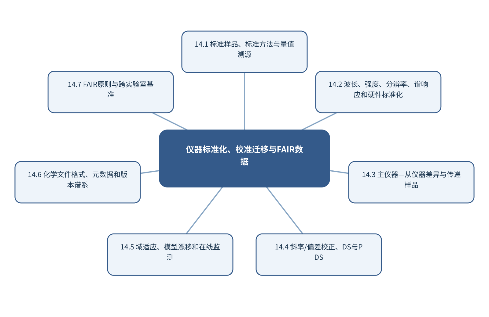

# 第14章 仪器标准化、校准迁移与FAIR数据

> 第4篇 跨模态、标准化与可信智能分析

## 章首导引

怎样使不同仪器、批次和实验室产生的数据可比、模型可迁移、过程可追溯？ 本章的回答是：集中处理仪器一致性、校准转移、数据格式和跨实验室复用，避免各章重复。全章以跨仪器、跨批次和跨实验室测量为对象，坚持“先校准硬件和量值链，再讨论模型迁移”，并通过“把近红外定量模型从主仪器传递到从仪器”把概念、计算和分析决策连为一体。

## 学习目标

- 能够说明跨仪器、跨批次和跨实验室测量在本章中的数据结构与主要信息来源。
- 能够解释本章关键方法的输入、输出、参数、假设和失效条件。
- 能够以“先校准硬件和量值链，再讨论模型迁移”设计训练、验证和独立测试。
- 能够完成“把近红外定量模型从主仪器传递到从仪器”的最小代码实验并分析失败样本。

## 本章知识图谱

## 14.1 标准样品、标准方法与量值溯源

本节围绕“标准样品、标准方法与量值溯源”展开。分析对象是跨仪器、跨批次和跨实验室测量，核心不是罗列名词，而是说明标准样品和标准物质、标准方法和参考方法、量值溯源和不确定度链、可比性、重复性和再现性怎样进入同一条测量与推断链。读者首先要辨认哪些量来自真实样品，哪些量由仪器转换得到，哪些量由算法估计；三类量若混在一起，模型精度就很难被解释。

在“标准样品、标准方法与量值溯源”中，技术路线遵循“先校准硬件和量值链，再讨论模型迁移”。具体计算从可诊断的经典基线开始，再增加本节所需的非线性、结构先验或不确定度组件。新增组件必须回答一个明确问题，并在相同数据边界下与基线比较；只有平均分提高而误差结构没有改善，不能构成采用复杂模型的充分理由。

本节把“把近红外定量模型从主仪器传递到从仪器”落实到可比性、重复性和再现性这一检查点。验证时保留与未来使用条件一致的独立对象，检查坐标轴、单位、样品身份、批次、参数来源和失败样本。由此得到的结论才可用于下一步测量或实验，而不是停留在一张看似分离良好的图上。

### 14.1.1 标准样品和标准物质

就“标准样品和标准物质”而言，在“标准样品、标准方法与量值溯源”中，标准样品和标准物质具体限定了跨仪器、跨批次和跨实验室测量的一个技术接口。它必须被写成可检查的输入、变换和输出：输入保留样品与仪器条件，变换说明参数从何处估计，输出对应可观察量或候选判断；缺少任何一层，概念就无法进入实验和代码。

把“标准样品和标准物质”用于“标准样品、标准方法与量值溯源”时，本书用“把近红外定量模型从主仪器传递到从仪器”检验标准样品和标准物质。实现时遵循“先校准硬件和量值链，再讨论模型迁移”，先建立经典基线，再对参数敏感性、独立样品和失败对象进行检查。若结果只能在同批数据或单次划分中成立，应把它视为探索性现象而非稳定规律。教学上应把该概念落实为可观察变量、可运行程序和可反驳检验三层。

### 14.1.2 标准方法和参考方法

就“标准方法和参考方法”而言，在“标准样品、标准方法与量值溯源”中，标准方法和参考方法具体限定了跨仪器、跨批次和跨实验室测量的一个技术接口。它必须被写成可检查的输入、变换和输出：输入保留样品与仪器条件，变换说明参数从何处估计，输出对应可观察量或候选判断；缺少任何一层，概念就无法进入实验和代码。

把“标准方法和参考方法”用于“标准样品、标准方法与量值溯源”时，本书用“把近红外定量模型从主仪器传递到从仪器”检验标准方法和参考方法。实现时遵循“先校准硬件和量值链，再讨论模型迁移”，先建立经典基线，再对参数敏感性、独立样品和失败对象进行检查。若结果只能在同批数据或单次划分中成立，应把它视为探索性现象而非稳定规律。在真实项目中，还应保存参数、软件版本和输入校验结果，以便定位变化来自样品还是计算。

### 14.1.3 量值溯源和不确定度链

就“量值溯源和不确定度链”而言，围绕“量值溯源和不确定度链”，随机误差反映重复测量的波动，系统偏差使结果稳定地偏离参照，不确定度则量化在现有知识下结果可能处于的范围。三者属于不同概念。高重复性不代表无偏，模型测试误差很低也不代表参照标签准确。

把“量值溯源和不确定度链”用于“标准样品、标准方法与量值溯源”时，在“标准样品、标准方法与量值溯源”的语境下，不确定度应沿采样、制样、校准、仪器、预处理和模型逐步传播。对于线性关系可使用一阶误差传播，对于明显非线性或参数相关的系统可使用蒙特卡洛抽样。报告时应给出覆盖概率、区间构造方法和适用条件，而不是只给一个小数位很多的点估计。若该步骤改变了样品单位、统计独立性或物理峰形，必须在独立数据上重新证明其有效性。

### 14.1.4 可比性、重复性和再现性

就“可比性、重复性和再现性”而言，在“标准样品、标准方法与量值溯源”中，可比性、重复性和再现性具体限定了跨仪器、跨批次和跨实验室测量的一个技术接口。它必须被写成可检查的输入、变换和输出：输入保留样品与仪器条件，变换说明参数从何处估计，输出对应可观察量或候选判断；缺少任何一层，概念就无法进入实验和代码。

把“可比性、重复性和再现性”用于“标准样品、标准方法与量值溯源”时，本书用“把近红外定量模型从主仪器传递到从仪器”检验可比性、重复性和再现性。实现时遵循“先校准硬件和量值链，再讨论模型迁移”，先建立经典基线，再对参数敏感性、独立样品和失败对象进行检查。若结果只能在同批数据或单次划分中成立，应把它视为探索性现象而非稳定规律。读图或读指标时应返回原始数据抽查，避免把表示空间中的几何关系直接当成化学机制。

## 14.2 波长、强度、分辨率、谱响应和硬件标准化

本节围绕“波长、强度、分辨率、谱响应和硬件标准化”展开。分析对象是跨仪器、跨批次和跨实验室测量，核心不是罗列名词，而是说明波长/波数准确度、吸光度/强度准确度、分辨率和仪器线形、检测器响应、对称性和漂移怎样进入同一条测量与推断链。读者首先要辨认哪些量来自真实样品，哪些量由仪器转换得到，哪些量由算法估计；三类量若混在一起，模型精度就很难被解释。

在“波长、强度、分辨率、谱响应和硬件标准化”中，技术路线遵循“先校准硬件和量值链，再讨论模型迁移”。具体计算从可诊断的经典基线开始，再增加本节所需的非线性、结构先验或不确定度组件。新增组件必须回答一个明确问题，并在相同数据边界下与基线比较；只有平均分提高而误差结构没有改善，不能构成采用复杂模型的充分理由。

本节把“把近红外定量模型从主仪器传递到从仪器”落实到日常校准和性能确认这一检查点。验证时保留与未来使用条件一致的独立对象，检查坐标轴、单位、样品身份、批次、参数来源和失败样本。由此得到的结论才可用于下一步测量或实验，而不是停留在一张看似分离良好的图上。

### 14.2.1 波长/波数准确度

就“波长/波数准确度”而言，在“波长、强度、分辨率、谱响应和硬件标准化”中，波长/波数准确度具体限定了跨仪器、跨批次和跨实验室测量的一个技术接口。它必须被写成可检查的输入、变换和输出：输入保留样品与仪器条件，变换说明参数从何处估计，输出对应可观察量或候选判断；缺少任何一层，概念就无法进入实验和代码。

把“波长/波数准确度”用于“波长、强度、分辨率、谱响应和硬件标准化”时，本书用“把近红外定量模型从主仪器传递到从仪器”检验波长/波数准确度。实现时遵循“先校准硬件和量值链，再讨论模型迁移”，先建立经典基线，再对参数敏感性、独立样品和失败对象进行检查。若结果只能在同批数据或单次划分中成立，应把它视为探索性现象而非稳定规律。教学上应把该概念落实为可观察变量、可运行程序和可反驳检验三层。

### 14.2.2 吸光度/强度准确度

就“吸光度/强度准确度”而言，在“波长、强度、分辨率、谱响应和硬件标准化”中，吸光度/强度准确度具体限定了跨仪器、跨批次和跨实验室测量的一个技术接口。它必须被写成可检查的输入、变换和输出：输入保留样品与仪器条件，变换说明参数从何处估计，输出对应可观察量或候选判断；缺少任何一层，概念就无法进入实验和代码。

把“吸光度/强度准确度”用于“波长、强度、分辨率、谱响应和硬件标准化”时，本书用“把近红外定量模型从主仪器传递到从仪器”检验吸光度/强度准确度。实现时遵循“先校准硬件和量值链，再讨论模型迁移”，先建立经典基线，再对参数敏感性、独立样品和失败对象进行检查。若结果只能在同批数据或单次划分中成立，应把它视为探索性现象而非稳定规律。在真实项目中，还应保存参数、软件版本和输入校验结果，以便定位变化来自样品还是计算。

### 14.2.3 分辨率和仪器线形

就“分辨率和仪器线形”而言，围绕“分辨率和仪器线形”，Beer-Lambert定律在理想条件下给出吸光度与浓度、光程和摩尔吸光系数的线性关系。高浓度、化学平衡变化、散射、杂散光和仪器带宽都会破坏线性。机器学习可以拟合非线性，但仍需说明非线性来自化学还是仪器。

把“分辨率和仪器线形”用于“波长、强度、分辨率、谱响应和硬件标准化”时，在“波长、强度、分辨率、谱响应和硬件标准化”的语境下，实际谱图是真实光谱与仪器线形的卷积，并叠加采样和噪声。不同分辨率仪器得到的峰宽和峰高不可直接比较。跨仪器建模前应统一谱轴、分辨率和响应，或显式建立迁移模型。若该步骤改变了样品单位、统计独立性或物理峰形，必须在独立数据上重新证明其有效性。

### 14.2.4 检测器响应、对称性和漂移

就“检测器响应、对称性和漂移”而言，在“波长、强度、分辨率、谱响应和硬件标准化”中，检测器响应、对称性和漂移具体限定了跨仪器、跨批次和跨实验室测量的一个技术接口。它必须被写成可检查的输入、变换和输出：输入保留样品与仪器条件，变换说明参数从何处估计，输出对应可观察量或候选判断；缺少任何一层，概念就无法进入实验和代码。

把“检测器响应、对称性和漂移”用于“波长、强度、分辨率、谱响应和硬件标准化”时，本书用“把近红外定量模型从主仪器传递到从仪器”检验检测器响应、对称性和漂移。实现时遵循“先校准硬件和量值链，再讨论模型迁移”，先建立经典基线，再对参数敏感性、独立样品和失败对象进行检查。若结果只能在同批数据或单次划分中成立，应把它视为探索性现象而非稳定规律。读图或读指标时应返回原始数据抽查，避免把表示空间中的几何关系直接当成化学机制。

### 14.2.5 日常校准和性能确认

就“日常校准和性能确认”而言，围绕“日常校准和性能确认”，精确率关注预测为阳性的样品中有多少真正阳性，召回率关注真正阳性中有多少被检出，F1是二者的调和平均。类别极不平衡时，PR曲线比ROC曲线更能反映少数类识别的实际难度。

把“日常校准和性能确认”用于“波长、强度、分辨率、谱响应和硬件标准化”时，在“波长、强度、分辨率、谱响应和硬件标准化”的语境下，概率校准回答预测概率是否与实际发生率一致。Brier分数同时受到判别和校准影响；可靠性图可显示模型过度自信或过度保守。阈值应根据漏检和误报代价确定，而不是固定在0.5。最终报告需要给出适用范围和拒绝条件，使方法在证据不足时能够停止输出。

## 14.3 主仪器—从仪器差异与传递样品

本节围绕“主仪器—从仪器差异与传递样品”展开。分析对象是跨仪器、跨批次和跨实验室测量，核心不是罗列名词，而是说明主仪器和从仪器、峰位、峰强和峰宽差异、传递样品的代表性、仪器差异与样品域差异怎样进入同一条测量与推断链。读者首先要辨认哪些量来自真实样品，哪些量由仪器转换得到，哪些量由算法估计；三类量若混在一起，模型精度就很难被解释。

在“主仪器—从仪器差异与传递样品”中，技术路线遵循“先校准硬件和量值链，再讨论模型迁移”。具体计算从可诊断的经典基线开始，再增加本节所需的非线性、结构先验或不确定度组件。新增组件必须回答一个明确问题，并在相同数据边界下与基线比较；只有平均分提高而误差结构没有改善，不能构成采用复杂模型的充分理由。

本节把“把近红外定量模型从主仪器传递到从仪器”落实到仪器差异与样品域差异这一检查点。验证时保留与未来使用条件一致的独立对象，检查坐标轴、单位、样品身份、批次、参数来源和失败样本。由此得到的结论才可用于下一步测量或实验，而不是停留在一张看似分离良好的图上。

### 14.3.1 主仪器和从仪器

就“主仪器和从仪器”而言，在“主仪器—从仪器差异与传递样品”中，主仪器和从仪器具体限定了跨仪器、跨批次和跨实验室测量的一个技术接口。它必须被写成可检查的输入、变换和输出：输入保留样品与仪器条件，变换说明参数从何处估计，输出对应可观察量或候选判断；缺少任何一层，概念就无法进入实验和代码。

把“主仪器和从仪器”用于“主仪器—从仪器差异与传递样品”时，本书用“把近红外定量模型从主仪器传递到从仪器”检验主仪器和从仪器。实现时遵循“先校准硬件和量值链，再讨论模型迁移”，先建立经典基线，再对参数敏感性、独立样品和失败对象进行检查。若结果只能在同批数据或单次划分中成立，应把它视为探索性现象而非稳定规律。教学上应把该概念落实为可观察变量、可运行程序和可反驳检验三层。

### 14.3.2 峰位、峰强和峰宽差异

就“峰位、峰强和峰宽差异”而言，在“主仪器—从仪器差异与传递样品”中，峰位、峰强和峰宽差异具体限定了跨仪器、跨批次和跨实验室测量的一个技术接口。它必须被写成可检查的输入、变换和输出：输入保留样品与仪器条件，变换说明参数从何处估计，输出对应可观察量或候选判断；缺少任何一层，概念就无法进入实验和代码。

把“峰位、峰强和峰宽差异”用于“主仪器—从仪器差异与传递样品”时，本书用“把近红外定量模型从主仪器传递到从仪器”检验峰位、峰强和峰宽差异。实现时遵循“先校准硬件和量值链，再讨论模型迁移”，先建立经典基线，再对参数敏感性、独立样品和失败对象进行检查。若结果只能在同批数据或单次划分中成立，应把它视为探索性现象而非稳定规律。在真实项目中，还应保存参数、软件版本和输入校验结果，以便定位变化来自样品还是计算。

### 14.3.3 传递样品的代表性

就“传递样品的代表性”而言，传递样品的代表性决定数据能否代表待回答的总体。分析试份通常只占原始对象极小比例，空间异质、颗粒尺寸、相分布和批次结构会使制样误差大于仪器重复误差；增加同一试份的重复扫描不能弥补缺乏独立取样。

把“传递样品的代表性”用于“主仪器—从仪器差异与传递样品”时，应先定义总体、初级采样单元、实验样品和分析试份，再配置分层或随机取样、混匀和独立重复。训练/测试划分也必须以真正独立的样品单位为边界，否则模型会因伪重复获得虚高性能。若该步骤改变了样品单位、统计独立性或物理峰形，必须在独立数据上重新证明其有效性。

### 14.3.4 仪器差异与样品域差异

就“仪器差异与样品域差异”而言，在“主仪器—从仪器差异与传递样品”中，仪器差异与样品域差异具体限定了跨仪器、跨批次和跨实验室测量的一个技术接口。它必须被写成可检查的输入、变换和输出：输入保留样品与仪器条件，变换说明参数从何处估计，输出对应可观察量或候选判断；缺少任何一层，概念就无法进入实验和代码。

把“仪器差异与样品域差异”用于“主仪器—从仪器差异与传递样品”时，本书用“把近红外定量模型从主仪器传递到从仪器”检验仪器差异与样品域差异。实现时遵循“先校准硬件和量值链，再讨论模型迁移”，先建立经典基线，再对参数敏感性、独立样品和失败对象进行检查。若结果只能在同批数据或单次划分中成立，应把它视为探索性现象而非稳定规律。读图或读指标时应返回原始数据抽查，避免把表示空间中的几何关系直接当成化学机制。

## 14.4 斜率/偏差校正、DS与PDS

本节围绕“斜率/偏差校正、DS与PDS”展开。分析对象是跨仪器、跨批次和跨实验室测量，核心不是罗列名词，而是说明斜率—偏差校正、直接标准化DS、分段直接标准化PDS、回归系数转换怎样进入同一条测量与推断链。读者首先要辨认哪些量来自真实样品，哪些量由仪器转换得到，哪些量由算法估计；三类量若混在一起，模型精度就很难被解释。

在“斜率/偏差校正、DS与PDS”中，技术路线遵循“先校准硬件和量值链，再讨论模型迁移”。具体计算从可诊断的经典基线开始，再增加本节所需的非线性、结构先验或不确定度组件。新增组件必须回答一个明确问题，并在相同数据边界下与基线比较；只有平均分提高而误差结构没有改善，不能构成采用复杂模型的充分理由。

本节把“把近红外定量模型从主仪器传递到从仪器”落实到传递前后独立目标域验证这一检查点。验证时保留与未来使用条件一致的独立对象，检查坐标轴、单位、样品身份、批次、参数来源和失败样本。由此得到的结论才可用于下一步测量或实验，而不是停留在一张看似分离良好的图上。

### 14.4.1 斜率—偏差校正

就“斜率—偏差校正”而言，围绕“斜率—偏差校正”，随机误差反映重复测量的波动，系统偏差使结果稳定地偏离参照，不确定度则量化在现有知识下结果可能处于的范围。三者属于不同概念。高重复性不代表无偏，模型测试误差很低也不代表参照标签准确。

把“斜率—偏差校正”用于“斜率/偏差校正、DS与PDS”时，在“斜率/偏差校正、DS与PDS”的语境下，不确定度应沿采样、制样、校准、仪器、预处理和模型逐步传播。对于线性关系可使用一阶误差传播，对于明显非线性或参数相关的系统可使用蒙特卡洛抽样。报告时应给出覆盖概率、区间构造方法和适用条件，而不是只给一个小数位很多的点估计。教学上应把该概念落实为可观察变量、可运行程序和可反驳检验三层。

### 14.4.2 直接标准化DS

就“直接标准化DS”而言，围绕“直接标准化DS”，中心化和尺度变换改变变量在距离、协方差和损失函数中的权重。标准化适合量纲和方差差异显著的变量；SNV对每条光谱独立中心化并按其标准差缩放；MSC则用参照光谱估计加性和乘性散射。它们解决的问题不同，不能作为无条件的默认步骤。

把“直接标准化DS”用于“斜率/偏差校正、DS与PDS”时，在“斜率/偏差校正、DS与PDS”的语境下，所有缩放参数必须只在训练数据上估计，再应用到验证和测试数据。否则测试集均值、方差或参照谱会进入训练过程，造成信息泄漏。处理效果应同时检查模型误差、峰形变化和跨批次稳定性。在真实项目中，还应保存参数、软件版本和输入校验结果，以便定位变化来自样品还是计算。

### 14.4.3 分段直接标准化PDS

就“分段直接标准化PDS”而言，围绕“分段直接标准化PDS”，中心化和尺度变换改变变量在距离、协方差和损失函数中的权重。标准化适合量纲和方差差异显著的变量；SNV对每条光谱独立中心化并按其标准差缩放；MSC则用参照光谱估计加性和乘性散射。它们解决的问题不同，不能作为无条件的默认步骤。

把“分段直接标准化PDS”用于“斜率/偏差校正、DS与PDS”时，在“斜率/偏差校正、DS与PDS”的语境下，所有缩放参数必须只在训练数据上估计，再应用到验证和测试数据。否则测试集均值、方差或参照谱会进入训练过程，造成信息泄漏。处理效果应同时检查模型误差、峰形变化和跨批次稳定性。若该步骤改变了样品单位、统计独立性或物理峰形，必须在独立数据上重新证明其有效性。

### 14.4.4 回归系数转换

就“回归系数转换”而言，在“斜率/偏差校正、DS与PDS”中，回归系数转换具体限定了跨仪器、跨批次和跨实验室测量的一个技术接口。它必须被写成可检查的输入、变换和输出：输入保留样品与仪器条件，变换说明参数从何处估计，输出对应可观察量或候选判断；缺少任何一层，概念就无法进入实验和代码。

把“回归系数转换”用于“斜率/偏差校正、DS与PDS”时，本书用“把近红外定量模型从主仪器传递到从仪器”检验回归系数转换。实现时遵循“先校准硬件和量值链，再讨论模型迁移”，先建立经典基线，再对参数敏感性、独立样品和失败对象进行检查。若结果只能在同批数据或单次划分中成立，应把它视为探索性现象而非稳定规律。读图或读指标时应返回原始数据抽查，避免把表示空间中的几何关系直接当成化学机制。

### 14.4.5 传递前后独立目标域验证

就“传递前后独立目标域验证”而言，在“斜率/偏差校正、DS与PDS”中，传递前后独立目标域验证具体限定了跨仪器、跨批次和跨实验室测量的一个技术接口。它必须被写成可检查的输入、变换和输出：输入保留样品与仪器条件，变换说明参数从何处估计，输出对应可观察量或候选判断；缺少任何一层，概念就无法进入实验和代码。

把“传递前后独立目标域验证”用于“斜率/偏差校正、DS与PDS”时，本书用“把近红外定量模型从主仪器传递到从仪器”检验传递前后独立目标域验证。实现时遵循“先校准硬件和量值链，再讨论模型迁移”，先建立经典基线，再对参数敏感性、独立样品和失败对象进行检查。若结果只能在同批数据或单次划分中成立，应把它视为探索性现象而非稳定规律。最终报告需要给出适用范围和拒绝条件，使方法在证据不足时能够停止输出。

## 14.5 域适应、模型漂移和在线监测

本节围绕“域适应、模型漂移和在线监测”展开。分析对象是跨仪器、跨批次和跨实验室测量，核心不是罗列名词，而是说明协变量偏移和概念漂移、域适应与MMD、迁移学习和联邦学习、在线监测、触发更新和版本回退怎样进入同一条测量与推断链。读者首先要辨认哪些量来自真实样品，哪些量由仪器转换得到，哪些量由算法估计；三类量若混在一起，模型精度就很难被解释。

在“域适应、模型漂移和在线监测”中，技术路线遵循“先校准硬件和量值链，再讨论模型迁移”。具体计算从可诊断的经典基线开始，再增加本节所需的非线性、结构先验或不确定度组件。新增组件必须回答一个明确问题，并在相同数据边界下与基线比较；只有平均分提高而误差结构没有改善，不能构成采用复杂模型的充分理由。

本节把“把近红外定量模型从主仪器传递到从仪器”落实到在线监测、触发更新和版本回退这一检查点。验证时保留与未来使用条件一致的独立对象，检查坐标轴、单位、样品身份、批次、参数来源和失败样本。由此得到的结论才可用于下一步测量或实验，而不是停留在一张看似分离良好的图上。

### 14.5.1 协变量偏移和概念漂移

就“协变量偏移和概念漂移”而言，在“域适应、模型漂移和在线监测”中，协变量偏移和概念漂移具体限定了跨仪器、跨批次和跨实验室测量的一个技术接口。它必须被写成可检查的输入、变换和输出：输入保留样品与仪器条件，变换说明参数从何处估计，输出对应可观察量或候选判断；缺少任何一层，概念就无法进入实验和代码。

把“协变量偏移和概念漂移”用于“域适应、模型漂移和在线监测”时，本书用“把近红外定量模型从主仪器传递到从仪器”检验协变量偏移和概念漂移。实现时遵循“先校准硬件和量值链，再讨论模型迁移”，先建立经典基线，再对参数敏感性、独立样品和失败对象进行检查。若结果只能在同批数据或单次划分中成立，应把它视为探索性现象而非稳定规律。教学上应把该概念落实为可观察变量、可运行程序和可反驳检验三层。

### 14.5.2 域适应与MMD

就“域适应与MMD”而言，围绕“域适应与MMD”，直接标准化学习从从仪器到主仪器的线性映射，使同一标准样品在两个设备上的响应可比较。PDS在局部变量窗口内学习映射，更适合波长相关的差异。传递样品必须覆盖未来样品空间。

把“域适应与MMD”用于“域适应、模型漂移和在线监测”时，在“域适应、模型漂移和在线监测”的语境下，域适应处理训练域与部署域分布不同的问题。MMD比较两个分布在核特征空间中的均值差异，但减小分布距离不保证目标关系保持不变。迁移后必须用独立目标域样品检验定量偏差和失效区域。在真实项目中，还应保存参数、软件版本和输入校验结果，以便定位变化来自样品还是计算。

### 14.5.3 迁移学习和联邦学习

就“迁移学习和联邦学习”而言，在“域适应、模型漂移和在线监测”中，迁移学习和联邦学习具体限定了跨仪器、跨批次和跨实验室测量的一个技术接口。它必须被写成可检查的输入、变换和输出：输入保留样品与仪器条件，变换说明参数从何处估计，输出对应可观察量或候选判断；缺少任何一层，概念就无法进入实验和代码。

把“迁移学习和联邦学习”用于“域适应、模型漂移和在线监测”时，本书用“把近红外定量模型从主仪器传递到从仪器”检验迁移学习和联邦学习。实现时遵循“先校准硬件和量值链，再讨论模型迁移”，先建立经典基线，再对参数敏感性、独立样品和失败对象进行检查。若结果只能在同批数据或单次划分中成立，应把它视为探索性现象而非稳定规律。若该步骤改变了样品单位、统计独立性或物理峰形，必须在独立数据上重新证明其有效性。

### 14.5.4 在线监测、触发更新和版本回退

就“在线监测、触发更新和版本回退”而言，在线监测、触发更新和版本回退要求测量时间尺度快于被研究过程的关键变化。采样、传质、仪器响应和数据处理都可能造成时间延迟；若响应时间与反应时间相当，记录到的曲线是系统动力学与仪器核的卷积。

把“在线监测、触发更新和版本回退”用于“域适应、模型漂移和在线监测”时，建模时应保存真实时间戳、同步误差和操作事件，避免把等间隔文件序号当作真实时间。对于在线控制，还要区分毫秒级设备反馈与分钟级科学决策，并用状态估计处理不可直接观察的化学状态。读图或读指标时应返回原始数据抽查，避免把表示空间中的几何关系直接当成化学机制。

## 14.6 化学文件格式、元数据和版本谱系

本节围绕“化学文件格式、元数据和版本谱系”展开。分析对象是跨仪器、跨批次和跨实验室测量，核心不是罗列名词，而是说明JCAMP-DX、mzML与图像格式、单位、术语和机器可读元数据、样品—仪器—处理—模型谱系、校验码、持久标识符和版本怎样进入同一条测量与推断链。读者首先要辨认哪些量来自真实样品，哪些量由仪器转换得到，哪些量由算法估计；三类量若混在一起，模型精度就很难被解释。

在“化学文件格式、元数据和版本谱系”中，技术路线遵循“先校准硬件和量值链，再讨论模型迁移”。具体计算从可诊断的经典基线开始，再增加本节所需的非线性、结构先验或不确定度组件。新增组件必须回答一个明确问题，并在相同数据边界下与基线比较；只有平均分提高而误差结构没有改善，不能构成采用复杂模型的充分理由。

本节把“把近红外定量模型从主仪器传递到从仪器”落实到校验码、持久标识符和版本这一检查点。验证时保留与未来使用条件一致的独立对象，检查坐标轴、单位、样品身份、批次、参数来源和失败样本。由此得到的结论才可用于下一步测量或实验，而不是停留在一张看似分离良好的图上。

### 14.6.1 JCAMP-DX、mzML与图像格式

就“JCAMP-DX、mzML与图像格式”而言，围绕“JCAMP-DX、mzML与图像格式”，分子图以原子为节点、化学键为空间关系。消息传递网络在每一层聚合邻居信息并更新节点表示，多层传播扩大感受野。全局池化把节点表示汇总为分子级向量。

把“JCAMP-DX、mzML与图像格式”用于“化学文件格式、元数据和版本谱系”时，在“化学文件格式、元数据和版本谱系”的语境下，二维图不能完整表达构象和空间相互作用。使用距离、角度或等变网络可以处理三维几何；SE(3)等变性要求模型输出随旋转和平移按物理规律变化。构象生成、温度和质子化态仍是输入不确定性的来源。教学上应把该概念落实为可观察变量、可运行程序和可反驳检验三层。

### 14.6.2 单位、术语和机器可读元数据

就“单位、术语和机器可读元数据”而言，单位、术语和机器可读元数据决定数字能否被重新解释。仅保存强度矩阵会丢失坐标轴、单位、采样间隔、样品身份、仪器参数和校准状态；这些信息一旦脱离原始信号，后续很难判断变化来自化学对象还是采集条件。

把“单位、术语和机器可读元数据”用于“化学文件格式、元数据和版本谱系”时，推荐把原始文件设为只读，以持久样品标识连接实验表和信号文件，并为每次转换记录脚本版本、参数和校验码。单位转换、重采样与轴反向属于会改变数值含义的操作，必须在数据进入模型前自动检查。在真实项目中，还应保存参数、软件版本和输入校验结果，以便定位变化来自样品还是计算。

### 14.6.3 样品—仪器—处理—模型谱系

就“样品—仪器—处理—模型谱系”而言，围绕“样品—仪器—处理—模型谱系”，FAIR强调数据及其元数据能够被机器发现、访问、互操作和复用。FAIR不等于完全公开：受限数据仍可通过持久标识符、清楚的访问条件和机器可读元数据实现可发现和可治理。

把“样品—仪器—处理—模型谱系”用于“化学文件格式、元数据和版本谱系”时，在“化学文件格式、元数据和版本谱系”的语境下，化学数据的复用依赖样品身份、单位、仪器、方法、校准和处理历史。文件格式只解决语法交换，术语表和本体解决语义。原始文件、转换脚本、训练划分和模型版本应以校验码连接成数据谱系。若该步骤改变了样品单位、统计独立性或物理峰形，必须在独立数据上重新证明其有效性。

### 14.6.4 校验码、持久标识符和版本

就“校验码、持久标识符和版本”而言，围绕“校验码、持久标识符和版本”，FAIR强调数据及其元数据能够被机器发现、访问、互操作和复用。FAIR不等于完全公开：受限数据仍可通过持久标识符、清楚的访问条件和机器可读元数据实现可发现和可治理。

把“校验码、持久标识符和版本”用于“化学文件格式、元数据和版本谱系”时，在“化学文件格式、元数据和版本谱系”的语境下，化学数据的复用依赖样品身份、单位、仪器、方法、校准和处理历史。文件格式只解决语法交换，术语表和本体解决语义。原始文件、转换脚本、训练划分和模型版本应以校验码连接成数据谱系。读图或读指标时应返回原始数据抽查，避免把表示空间中的几何关系直接当成化学机制。

## 14.7 FAIR原则与跨实验室基准

本节围绕“FAIR原则与跨实验室基准”展开。分析对象是跨仪器、跨批次和跨实验室测量，核心不是罗列名词，而是说明可发现、可访问、可互操作、可复用、FAIR不等于完全公开、跨仪器和跨实验室benchmark、共享数据、模型和评价协议怎样进入同一条测量与推断链。读者首先要辨认哪些量来自真实样品，哪些量由仪器转换得到，哪些量由算法估计；三类量若混在一起，模型精度就很难被解释。

在“FAIR原则与跨实验室基准”中，技术路线遵循“先校准硬件和量值链，再讨论模型迁移”。具体计算从可诊断的经典基线开始，再增加本节所需的非线性、结构先验或不确定度组件。新增组件必须回答一个明确问题，并在相同数据边界下与基线比较；只有平均分提高而误差结构没有改善，不能构成采用复杂模型的充分理由。

本节把“把近红外定量模型从主仪器传递到从仪器”落实到共享数据、模型和评价协议这一检查点。验证时保留与未来使用条件一致的独立对象，检查坐标轴、单位、样品身份、批次、参数来源和失败样本。由此得到的结论才可用于下一步测量或实验，而不是停留在一张看似分离良好的图上。

### 14.7.1 可发现、可访问、可互操作、可复用

就“可发现、可访问、可互操作、可复用”而言，在“FAIR原则与跨实验室基准”中，可发现、可访问、可互操作、可复用具体限定了跨仪器、跨批次和跨实验室测量的一个技术接口。它必须被写成可检查的输入、变换和输出：输入保留样品与仪器条件，变换说明参数从何处估计，输出对应可观察量或候选判断；缺少任何一层，概念就无法进入实验和代码。

把“可发现、可访问、可互操作、可复用”用于“FAIR原则与跨实验室基准”时，本书用“把近红外定量模型从主仪器传递到从仪器”检验可发现、可访问、可互操作、可复用。实现时遵循“先校准硬件和量值链，再讨论模型迁移”，先建立经典基线，再对参数敏感性、独立样品和失败对象进行检查。若结果只能在同批数据或单次划分中成立，应把它视为探索性现象而非稳定规律。教学上应把该概念落实为可观察变量、可运行程序和可反驳检验三层。

### 14.7.2 FAIR不等于完全公开

就“FAIR不等于完全公开”而言，围绕“FAIR不等于完全公开”，FAIR强调数据及其元数据能够被机器发现、访问、互操作和复用。FAIR不等于完全公开：受限数据仍可通过持久标识符、清楚的访问条件和机器可读元数据实现可发现和可治理。

把“FAIR不等于完全公开”用于“FAIR原则与跨实验室基准”时，在“FAIR原则与跨实验室基准”的语境下，化学数据的复用依赖样品身份、单位、仪器、方法、校准和处理历史。文件格式只解决语法交换，术语表和本体解决语义。原始文件、转换脚本、训练划分和模型版本应以校验码连接成数据谱系。在真实项目中，还应保存参数、软件版本和输入校验结果，以便定位变化来自样品还是计算。

### 14.7.3 跨仪器和跨实验室benchmark

就“跨仪器和跨实验室benchmark”而言，在“FAIR原则与跨实验室基准”中，跨仪器和跨实验室benchmark具体限定了跨仪器、跨批次和跨实验室测量的一个技术接口。它必须被写成可检查的输入、变换和输出：输入保留样品与仪器条件，变换说明参数从何处估计，输出对应可观察量或候选判断；缺少任何一层，概念就无法进入实验和代码。

把“跨仪器和跨实验室benchmark”用于“FAIR原则与跨实验室基准”时，本书用“把近红外定量模型从主仪器传递到从仪器”检验跨仪器和跨实验室benchmark。实现时遵循“先校准硬件和量值链，再讨论模型迁移”，先建立经典基线，再对参数敏感性、独立样品和失败对象进行检查。若结果只能在同批数据或单次划分中成立，应把它视为探索性现象而非稳定规律。若该步骤改变了样品单位、统计独立性或物理峰形，必须在独立数据上重新证明其有效性。

### 14.7.4 共享数据、模型和评价协议

就“共享数据、模型和评价协议”而言，共享数据、模型和评价协议决定数字能否被重新解释。仅保存强度矩阵会丢失坐标轴、单位、采样间隔、样品身份、仪器参数和校准状态；这些信息一旦脱离原始信号，后续很难判断变化来自化学对象还是采集条件。

把“共享数据、模型和评价协议”用于“FAIR原则与跨实验室基准”时，推荐把原始文件设为只读，以持久样品标识连接实验表和信号文件，并为每次转换记录脚本版本、参数和校验码。单位转换、重采样与轴反向属于会改变数值含义的操作，必须在数据进入模型前自动检查。读图或读指标时应返回原始数据抽查，避免把表示空间中的几何关系直接当成化学机制。

## 关键关系与计算抓手

- `X_master≈X_slaveF`

- `MMD²=||Eφ(X_s)−Eφ(X_t)||²`

## 本章综合案例

本章案例：把近红外定量模型从主仪器传递到从仪器。先明确样品单位、测量协议和数据结构，建立最简单且可诊断的基线；再加入本章核心方法，并在同一独立测试边界下比较。结果至少按批次、信号强弱和适用域分层，给出错误对象而非只报告总体平均数。

完成案例时，应提交问题卡、数据字典、运行日志、关键图表、失败样本清单和可运行程序。任何由模型提出的解释都要能被互补测量或后续实验检验。

## 代码实践

- 任务：实现DS/PDS校准迁移和样品—仪器—处理—模型元数据检查器。
- 代码：[chapter_exercise.py](../code/ch14.py)

## 本章小结

本章以跨仪器、跨批次和跨实验室测量为对象，把“仪器标准化、校准迁移与FAIR数据”组织为测量、表示、推断和行动的连续过程。复习时应能解释数据如何生成、方法为何适用、性能如何验证，以及证据不足时何时拒绝输出。

## 思考题与计算题

1. 为“把近红外定量模型从主仪器传递到从仪器”画出样品—仪器—数据—模型—结论链，并标出三处可能失真位置。
2. 从本章选择一个方法，写出输入、输出、关键参数、基本假设和至少两个失效条件。
3. 建立一个经典基线，并说明复杂模型必须在哪些独立指标上超过它。
4. 把随机划分改为符合未来使用条件的分组或外推划分，比较结果并解释差异。
5. 完成配套代码，增加一个单元测试和一个失败样本可视化。
6. 设计一个能够区分“模型学到化学信息”和“模型学到批次捷径”的对照实验。

## 下载本章资源

<a href="./downloads/word/ch14.docx" download>Word出版稿</a>　·　<a href="./code/ch14.py" download>Python代码</a>　·　<a href="./assets/graphs/ch14.svg" download>SVG知识图谱</a>

## 年度课程资源、传承题与更新引文

本章的稳定教材内容与逐年更新的教学资源分开维护。维护组须在年度归档中同步补入课件链接、可传承的题目和有来源链接的前沿引文。

- [本学年课程 PPT（PDF）](#/resources/annual/2026-2027/ppt/README?id=ch14)
- [留给下一届的本章传承题](#/resources/annual/2026-2027/questions/README?id=ch14)
- [本章年度新增与修订引文](#/resources/annual/2026-2027/references/README?id=ch14)

---

## 本章共建记录与致谢

| 学年 | 贡献者 | 工作内容 | 关联PR |
|---|---|---|---|
| 待本学年维护组补充 | — | — | — |
