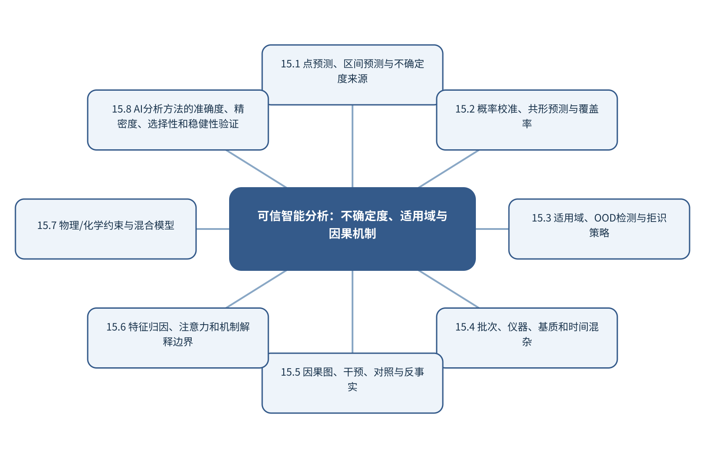

# 第15章 可信智能分析：不确定度、适用域与因果机制

> 第4篇 跨模态、标准化与可信智能分析　·　建议出版篇幅：24页

## 章首导引

模型什么时候知道自己不知道，预测关系又何时能支持化学解释和方法决策？ 本章的回答是：将可信性集中成章，替代各章重复的泛化‘安全/伦理/责任’小节。全章以带概率、区间、解释和行动代价的预测为对象，坚持“让模型能够拒绝域外样品并接受因果反驳”，并通过“为分类器建立概率校准、OOD拒识和失败分层”把概念、计算和分析决策连为一体。

## 学习目标

- 能够说明带概率、区间、解释和行动代价的预测在本章中的数据结构与主要信息来源。
- 能够解释本章关键方法的输入、输出、参数、假设和失效条件。
- 能够以“让模型能够拒绝域外样品并接受因果反驳”设计训练、验证和独立测试。
- 能够完成“为分类器建立概率校准、OOD拒识和失败分层”的最小代码实验并分析失败样本。

## 本章知识图谱

## 15.1 点预测、区间预测与不确定度来源

本节围绕“点预测、区间预测与不确定度来源”展开。分析对象是带概率、区间、解释和行动代价的预测，核心不是罗列名词，而是说明采样、测量、标签和模型不确定度、偶然不确定度与认知不确定度、点估计、区间和预测分布、误差传播和蒙特卡洛怎样进入同一条测量与推断链。读者首先要辨认哪些量来自真实样品，哪些量由仪器转换得到，哪些量由算法估计；三类量若混在一起，模型精度就很难被解释。

在“点预测、区间预测与不确定度来源”中，技术路线遵循“让模型能够拒绝域外样品并接受因果反驳”。具体计算从可诊断的经典基线开始，再增加本节所需的非线性、结构先验或不确定度组件。新增组件必须回答一个明确问题，并在相同数据边界下与基线比较；只有平均分提高而误差结构没有改善，不能构成采用复杂模型的充分理由。

本节把“为分类器建立概率校准、OOD拒识和失败分层”落实到误差传播和蒙特卡洛这一检查点。验证时保留与未来使用条件一致的独立对象，检查坐标轴、单位、样品身份、批次、参数来源和失败样本。由此得到的结论才可用于下一步测量或实验，而不是停留在一张看似分离良好的图上。

### 15.1.1 采样、测量、标签和模型不确定度

就“采样、测量、标签和模型不确定度”而言，围绕“采样、测量、标签和模型不确定度”，随机误差反映重复测量的波动，系统偏差使结果稳定地偏离参照，不确定度则量化在现有知识下结果可能处于的范围。三者属于不同概念。高重复性不代表无偏，模型测试误差很低也不代表参照标签准确。

把“采样、测量、标签和模型不确定度”用于“点预测、区间预测与不确定度来源”时，在“点预测、区间预测与不确定度来源”的语境下，不确定度应沿采样、制样、校准、仪器、预处理和模型逐步传播。对于线性关系可使用一阶误差传播，对于明显非线性或参数相关的系统可使用蒙特卡洛抽样。报告时应给出覆盖概率、区间构造方法和适用条件，而不是只给一个小数位很多的点估计。在真实项目中，还应保存参数、软件版本和输入校验结果，以便定位变化来自样品还是计算。

### 15.1.2 偶然不确定度与认知不确定度

就“偶然不确定度与认知不确定度”而言，围绕“偶然不确定度与认知不确定度”，随机误差反映重复测量的波动，系统偏差使结果稳定地偏离参照，不确定度则量化在现有知识下结果可能处于的范围。三者属于不同概念。高重复性不代表无偏，模型测试误差很低也不代表参照标签准确。

把“偶然不确定度与认知不确定度”用于“点预测、区间预测与不确定度来源”时，在“点预测、区间预测与不确定度来源”的语境下，不确定度应沿采样、制样、校准、仪器、预处理和模型逐步传播。对于线性关系可使用一阶误差传播，对于明显非线性或参数相关的系统可使用蒙特卡洛抽样。报告时应给出覆盖概率、区间构造方法和适用条件，而不是只给一个小数位很多的点估计。若该步骤改变了样品单位、统计独立性或物理峰形，必须在独立数据上重新证明其有效性。

### 15.1.3 点估计、区间和预测分布

就“点估计、区间和预测分布”而言，在“点预测、区间预测与不确定度来源”中，点估计、区间和预测分布具体限定了带概率、区间、解释和行动代价的预测的一个技术接口。它必须被写成可检查的输入、变换和输出：输入保留样品与仪器条件，变换说明参数从何处估计，输出对应可观察量或候选判断；缺少任何一层，概念就无法进入实验和代码。

把“点估计、区间和预测分布”用于“点预测、区间预测与不确定度来源”时，本书用“为分类器建立概率校准、OOD拒识和失败分层”检验点估计、区间和预测分布。实现时遵循“让模型能够拒绝域外样品并接受因果反驳”，先建立经典基线，再对参数敏感性、独立样品和失败对象进行检查。若结果只能在同批数据或单次划分中成立，应把它视为探索性现象而非稳定规律。读图或读指标时应返回原始数据抽查，避免把表示空间中的几何关系直接当成化学机制。

### 15.1.4 误差传播和蒙特卡洛

就“误差传播和蒙特卡洛”而言，围绕“误差传播和蒙特卡洛”，随机误差反映重复测量的波动，系统偏差使结果稳定地偏离参照，不确定度则量化在现有知识下结果可能处于的范围。三者属于不同概念。高重复性不代表无偏，模型测试误差很低也不代表参照标签准确。

把“误差传播和蒙特卡洛”用于“点预测、区间预测与不确定度来源”时，在“点预测、区间预测与不确定度来源”的语境下，不确定度应沿采样、制样、校准、仪器、预处理和模型逐步传播。对于线性关系可使用一阶误差传播，对于明显非线性或参数相关的系统可使用蒙特卡洛抽样。报告时应给出覆盖概率、区间构造方法和适用条件，而不是只给一个小数位很多的点估计。最终报告需要给出适用范围和拒绝条件，使方法在证据不足时能够停止输出。

## 15.2 概率校准、共形预测与覆盖率

本节围绕“概率校准、共形预测与覆盖率”展开。分析对象是带概率、区间、解释和行动代价的预测，核心不是罗列名词，而是说明置信度与真实频率、温度缩放和概率校准、Brier分数与可靠性图、共形预测和有限样本覆盖怎样进入同一条测量与推断链。读者首先要辨认哪些量来自真实样品，哪些量由仪器转换得到，哪些量由算法估计；三类量若混在一起，模型精度就很难被解释。

在“概率校准、共形预测与覆盖率”中，技术路线遵循“让模型能够拒绝域外样品并接受因果反驳”。具体计算从可诊断的经典基线开始，再增加本节所需的非线性、结构先验或不确定度组件。新增组件必须回答一个明确问题，并在相同数据边界下与基线比较；只有平均分提高而误差结构没有改善，不能构成采用复杂模型的充分理由。

本节把“为分类器建立概率校准、OOD拒识和失败分层”落实到区间宽度与有效性这一检查点。验证时保留与未来使用条件一致的独立对象，检查坐标轴、单位、样品身份、批次、参数来源和失败样本。由此得到的结论才可用于下一步测量或实验，而不是停留在一张看似分离良好的图上。

### 15.2.1 置信度与真实频率

就“置信度与真实频率”而言，在“概率校准、共形预测与覆盖率”中，置信度与真实频率具体限定了带概率、区间、解释和行动代价的预测的一个技术接口。它必须被写成可检查的输入、变换和输出：输入保留样品与仪器条件，变换说明参数从何处估计，输出对应可观察量或候选判断；缺少任何一层，概念就无法进入实验和代码。

把“置信度与真实频率”用于“概率校准、共形预测与覆盖率”时，本书用“为分类器建立概率校准、OOD拒识和失败分层”检验置信度与真实频率。实现时遵循“让模型能够拒绝域外样品并接受因果反驳”，先建立经典基线，再对参数敏感性、独立样品和失败对象进行检查。若结果只能在同批数据或单次划分中成立，应把它视为探索性现象而非稳定规律。在真实项目中，还应保存参数、软件版本和输入校验结果，以便定位变化来自样品还是计算。

### 15.2.2 温度缩放和概率校准

就“温度缩放和概率校准”而言，围绕“温度缩放和概率校准”，精确率关注预测为阳性的样品中有多少真正阳性，召回率关注真正阳性中有多少被检出，F1是二者的调和平均。类别极不平衡时，PR曲线比ROC曲线更能反映少数类识别的实际难度。

把“温度缩放和概率校准”用于“概率校准、共形预测与覆盖率”时，在“概率校准、共形预测与覆盖率”的语境下，概率校准回答预测概率是否与实际发生率一致。Brier分数同时受到判别和校准影响；可靠性图可显示模型过度自信或过度保守。阈值应根据漏检和误报代价确定，而不是固定在0.5。若该步骤改变了样品单位、统计独立性或物理峰形，必须在独立数据上重新证明其有效性。

### 15.2.3 Brier分数与可靠性图

就“Brier分数与可靠性图”而言，围绕“Brier分数与可靠性图”，精确率关注预测为阳性的样品中有多少真正阳性，召回率关注真正阳性中有多少被检出，F1是二者的调和平均。类别极不平衡时，PR曲线比ROC曲线更能反映少数类识别的实际难度。

把“Brier分数与可靠性图”用于“概率校准、共形预测与覆盖率”时，在“概率校准、共形预测与覆盖率”的语境下，概率校准回答预测概率是否与实际发生率一致。Brier分数同时受到判别和校准影响；可靠性图可显示模型过度自信或过度保守。阈值应根据漏检和误报代价确定，而不是固定在0.5。读图或读指标时应返回原始数据抽查，避免把表示空间中的几何关系直接当成化学机制。

### 15.2.4 共形预测和有限样本覆盖

就“共形预测和有限样本覆盖”而言，在“概率校准、共形预测与覆盖率”中，共形预测和有限样本覆盖具体限定了带概率、区间、解释和行动代价的预测的一个技术接口。它必须被写成可检查的输入、变换和输出：输入保留样品与仪器条件，变换说明参数从何处估计，输出对应可观察量或候选判断；缺少任何一层，概念就无法进入实验和代码。

把“共形预测和有限样本覆盖”用于“概率校准、共形预测与覆盖率”时，本书用“为分类器建立概率校准、OOD拒识和失败分层”检验共形预测和有限样本覆盖。实现时遵循“让模型能够拒绝域外样品并接受因果反驳”，先建立经典基线，再对参数敏感性、独立样品和失败对象进行检查。若结果只能在同批数据或单次划分中成立，应把它视为探索性现象而非稳定规律。最终报告需要给出适用范围和拒绝条件，使方法在证据不足时能够停止输出。

### 15.2.5 区间宽度与有效性

就“区间宽度与有效性”而言，在“概率校准、共形预测与覆盖率”中，区间宽度与有效性具体限定了带概率、区间、解释和行动代价的预测的一个技术接口。它必须被写成可检查的输入、变换和输出：输入保留样品与仪器条件，变换说明参数从何处估计，输出对应可观察量或候选判断；缺少任何一层，概念就无法进入实验和代码。

把“区间宽度与有效性”用于“概率校准、共形预测与覆盖率”时，本书用“为分类器建立概率校准、OOD拒识和失败分层”检验区间宽度与有效性。实现时遵循“让模型能够拒绝域外样品并接受因果反驳”，先建立经典基线，再对参数敏感性、独立样品和失败对象进行检查。若结果只能在同批数据或单次划分中成立，应把它视为探索性现象而非稳定规律。教学上应把该概念落实为可观察变量、可运行程序和可反驳检验三层。

## 15.3 适用域、OOD检测与拒识策略

本节围绕“适用域、OOD检测与拒识策略”展开。分析对象是带概率、区间、解释和行动代价的预测，核心不是罗列名词，而是说明传统杠杆和马氏距离、Hotelling T²与Q残差、现代密度/能量/OOD方法、开放集识别和拒识阈值怎样进入同一条测量与推断链。读者首先要辨认哪些量来自真实样品，哪些量由仪器转换得到，哪些量由算法估计；三类量若混在一起，模型精度就很难被解释。

在“适用域、OOD检测与拒识策略”中，技术路线遵循“让模型能够拒绝域外样品并接受因果反驳”。具体计算从可诊断的经典基线开始，再增加本节所需的非线性、结构先验或不确定度组件。新增组件必须回答一个明确问题，并在相同数据边界下与基线比较；只有平均分提高而误差结构没有改善，不能构成采用复杂模型的充分理由。

本节把“为分类器建立概率校准、OOD拒识和失败分层”落实到域外检测的失效这一检查点。验证时保留与未来使用条件一致的独立对象，检查坐标轴、单位、样品身份、批次、参数来源和失败样本。由此得到的结论才可用于下一步测量或实验，而不是停留在一张看似分离良好的图上。

### 15.3.1 传统杠杆和马氏距离

就“传统杠杆和马氏距离”而言，在“适用域、OOD检测与拒识策略”中，传统杠杆和马氏距离具体限定了带概率、区间、解释和行动代价的预测的一个技术接口。它必须被写成可检查的输入、变换和输出：输入保留样品与仪器条件，变换说明参数从何处估计，输出对应可观察量或候选判断；缺少任何一层，概念就无法进入实验和代码。

把“传统杠杆和马氏距离”用于“适用域、OOD检测与拒识策略”时，本书用“为分类器建立概率校准、OOD拒识和失败分层”检验传统杠杆和马氏距离。实现时遵循“让模型能够拒绝域外样品并接受因果反驳”，先建立经典基线，再对参数敏感性、独立样品和失败对象进行检查。若结果只能在同批数据或单次划分中成立，应把它视为探索性现象而非稳定规律。在真实项目中，还应保存参数、软件版本和输入校验结果，以便定位变化来自样品还是计算。

### 15.3.2 Hotelling T²与Q残差

就“Hotelling T²与Q残差”而言，围绕“Hotelling T²与Q残差”，RMSE对大误差更敏感，MAE更接近典型绝对偏差；偏差则显示预测是否系统性高估或低估。单一指标会隐藏误差结构，因此还需绘制预测—参照图、残差—浓度图，并按批次、浓度和样品类型分层。

把“Hotelling T²与Q残差”用于“适用域、OOD检测与拒识策略”时，在“适用域、OOD检测与拒识策略”的语境下，Hotelling T²描述样品在模型潜空间内的杠杆程度，Q残差描述样品不能被模型子空间解释的部分。二者结合可区分“位于已知方向的极端样品”和“具有新型结构的样品”，是建立适用域和异常诊断的重要工具。若该步骤改变了样品单位、统计独立性或物理峰形，必须在独立数据上重新证明其有效性。

### 15.3.3 现代密度/能量/OOD方法

就“现代密度/能量/OOD方法”而言，在“适用域、OOD检测与拒识策略”中，现代密度/能量/OOD方法具体限定了带概率、区间、解释和行动代价的预测的一个技术接口。它必须被写成可检查的输入、变换和输出：输入保留样品与仪器条件，变换说明参数从何处估计，输出对应可观察量或候选判断；缺少任何一层，概念就无法进入实验和代码。

把“现代密度/能量/OOD方法”用于“适用域、OOD检测与拒识策略”时，本书用“为分类器建立概率校准、OOD拒识和失败分层”检验现代密度/能量/OOD方法。实现时遵循“让模型能够拒绝域外样品并接受因果反驳”，先建立经典基线，再对参数敏感性、独立样品和失败对象进行检查。若结果只能在同批数据或单次划分中成立，应把它视为探索性现象而非稳定规律。读图或读指标时应返回原始数据抽查，避免把表示空间中的几何关系直接当成化学机制。

### 15.3.4 开放集识别和拒识阈值

就“开放集识别和拒识阈值”而言，开放集识别和拒识阈值的目标是判断样品中存在什么，而不是仅把信号分到一个已知类别。可靠识别至少需要选择性响应、参照物或谱库、相似干扰物以及库外样品；若候选集合不完整，最高匹配分只能表示‘在当前库中最相似’，不能等同于身份确认。

把“开放集识别和拒识阈值”用于“适用域、OOD检测与拒识策略”时，定性流程应把检出、候选筛选和确证分开。检出阶段控制空白和假阳性，筛选阶段报告Top-k候选及分数差，确证阶段依靠保留信息、互补谱学或标准物质。模型还应设置拒识阈值，避免对训练分布之外的样品强行命名。最终报告需要给出适用范围和拒绝条件，使方法在证据不足时能够停止输出。

### 15.3.5 域外检测的失效

就“域外检测的失效”而言，在“适用域、OOD检测与拒识策略”中，域外检测的失效具体限定了带概率、区间、解释和行动代价的预测的一个技术接口。它必须被写成可检查的输入、变换和输出：输入保留样品与仪器条件，变换说明参数从何处估计，输出对应可观察量或候选判断；缺少任何一层，概念就无法进入实验和代码。

把“域外检测的失效”用于“适用域、OOD检测与拒识策略”时，本书用“为分类器建立概率校准、OOD拒识和失败分层”检验域外检测的失效。实现时遵循“让模型能够拒绝域外样品并接受因果反驳”，先建立经典基线，再对参数敏感性、独立样品和失败对象进行检查。若结果只能在同批数据或单次划分中成立，应把它视为探索性现象而非稳定规律。教学上应把该概念落实为可观察变量、可运行程序和可反驳检验三层。

## 15.4 批次、仪器、基质和时间混杂

本节围绕“批次、仪器、基质和时间混杂”展开。分析对象是带概率、区间、解释和行动代价的预测，核心不是罗列名词，而是说明批次、仪器、基质和采样顺序、处理组与批次完全混杂、捷径学习和数据泄漏、分层评价和对照实验怎样进入同一条测量与推断链。读者首先要辨认哪些量来自真实样品，哪些量由仪器转换得到，哪些量由算法估计；三类量若混在一起，模型精度就很难被解释。

在“批次、仪器、基质和时间混杂”中，技术路线遵循“让模型能够拒绝域外样品并接受因果反驳”。具体计算从可诊断的经典基线开始，再增加本节所需的非线性、结构先验或不确定度组件。新增组件必须回答一个明确问题，并在相同数据边界下与基线比较；只有平均分提高而误差结构没有改善，不能构成采用复杂模型的充分理由。

本节把“为分类器建立概率校准、OOD拒识和失败分层”落实到分层评价和对照实验这一检查点。验证时保留与未来使用条件一致的独立对象，检查坐标轴、单位、样品身份、批次、参数来源和失败样本。由此得到的结论才可用于下一步测量或实验，而不是停留在一张看似分离良好的图上。

### 15.4.1 批次、仪器、基质和采样顺序

就“批次、仪器、基质和采样顺序”而言，批次、仪器、基质和采样顺序决定数据能否代表待回答的总体。分析试份通常只占原始对象极小比例，空间异质、颗粒尺寸、相分布和批次结构会使制样误差大于仪器重复误差；增加同一试份的重复扫描不能弥补缺乏独立取样。

把“批次、仪器、基质和采样顺序”用于“批次、仪器、基质和时间混杂”时，应先定义总体、初级采样单元、实验样品和分析试份，再配置分层或随机取样、混匀和独立重复。训练/测试划分也必须以真正独立的样品单位为边界，否则模型会因伪重复获得虚高性能。在真实项目中，还应保存参数、软件版本和输入校验结果，以便定位变化来自样品还是计算。

### 15.4.2 处理组与批次完全混杂

就“处理组与批次完全混杂”而言，在“批次、仪器、基质和时间混杂”中，处理组与批次完全混杂具体限定了带概率、区间、解释和行动代价的预测的一个技术接口。它必须被写成可检查的输入、变换和输出：输入保留样品与仪器条件，变换说明参数从何处估计，输出对应可观察量或候选判断；缺少任何一层，概念就无法进入实验和代码。

把“处理组与批次完全混杂”用于“批次、仪器、基质和时间混杂”时，本书用“为分类器建立概率校准、OOD拒识和失败分层”检验处理组与批次完全混杂。实现时遵循“让模型能够拒绝域外样品并接受因果反驳”，先建立经典基线，再对参数敏感性、独立样品和失败对象进行检查。若结果只能在同批数据或单次划分中成立，应把它视为探索性现象而非稳定规律。若该步骤改变了样品单位、统计独立性或物理峰形，必须在独立数据上重新证明其有效性。

### 15.4.3 捷径学习和数据泄漏

就“捷径学习和数据泄漏”而言，捷径学习和数据泄漏决定数字能否被重新解释。仅保存强度矩阵会丢失坐标轴、单位、采样间隔、样品身份、仪器参数和校准状态；这些信息一旦脱离原始信号，后续很难判断变化来自化学对象还是采集条件。

把“捷径学习和数据泄漏”用于“批次、仪器、基质和时间混杂”时，推荐把原始文件设为只读，以持久样品标识连接实验表和信号文件，并为每次转换记录脚本版本、参数和校验码。单位转换、重采样与轴反向属于会改变数值含义的操作，必须在数据进入模型前自动检查。读图或读指标时应返回原始数据抽查，避免把表示空间中的几何关系直接当成化学机制。

### 15.4.4 分层评价和对照实验

就“分层评价和对照实验”而言，在“批次、仪器、基质和时间混杂”中，分层评价和对照实验具体限定了带概率、区间、解释和行动代价的预测的一个技术接口。它必须被写成可检查的输入、变换和输出：输入保留样品与仪器条件，变换说明参数从何处估计，输出对应可观察量或候选判断；缺少任何一层，概念就无法进入实验和代码。

把“分层评价和对照实验”用于“批次、仪器、基质和时间混杂”时，本书用“为分类器建立概率校准、OOD拒识和失败分层”检验分层评价和对照实验。实现时遵循“让模型能够拒绝域外样品并接受因果反驳”，先建立经典基线，再对参数敏感性、独立样品和失败对象进行检查。若结果只能在同批数据或单次划分中成立，应把它视为探索性现象而非稳定规律。最终报告需要给出适用范围和拒绝条件，使方法在证据不足时能够停止输出。

## 15.5 因果图、干预、对照与反事实

本节围绕“因果图、干预、对照与反事实”展开。分析对象是带概率、区间、解释和行动代价的预测，核心不是罗列名词，而是说明相关、预测和因果、因果图、共同原因和碰撞点、随机化、干预和自然实验、反事实问题怎样进入同一条测量与推断链。读者首先要辨认哪些量来自真实样品，哪些量由仪器转换得到，哪些量由算法估计；三类量若混在一起，模型精度就很难被解释。

在“因果图、干预、对照与反事实”中，技术路线遵循“让模型能够拒绝域外样品并接受因果反驳”。具体计算从可诊断的经典基线开始，再增加本节所需的非线性、结构先验或不确定度组件。新增组件必须回答一个明确问题，并在相同数据边界下与基线比较；只有平均分提高而误差结构没有改善，不能构成采用复杂模型的充分理由。

本节把“为分类器建立概率校准、OOD拒识和失败分层”落实到实验设计与因果识别这一检查点。验证时保留与未来使用条件一致的独立对象，检查坐标轴、单位、样品身份、批次、参数来源和失败样本。由此得到的结论才可用于下一步测量或实验，而不是停留在一张看似分离良好的图上。

### 15.5.1 相关、预测和因果

就“相关、预测和因果”而言，在“因果图、干预、对照与反事实”中，相关、预测和因果具体限定了带概率、区间、解释和行动代价的预测的一个技术接口。它必须被写成可检查的输入、变换和输出：输入保留样品与仪器条件，变换说明参数从何处估计，输出对应可观察量或候选判断；缺少任何一层，概念就无法进入实验和代码。

把“相关、预测和因果”用于“因果图、干预、对照与反事实”时，本书用“为分类器建立概率校准、OOD拒识和失败分层”检验相关、预测和因果。实现时遵循“让模型能够拒绝域外样品并接受因果反驳”，先建立经典基线，再对参数敏感性、独立样品和失败对象进行检查。若结果只能在同批数据或单次划分中成立，应把它视为探索性现象而非稳定规律。在真实项目中，还应保存参数、软件版本和输入校验结果，以便定位变化来自样品还是计算。

### 15.5.2 因果图、共同原因和碰撞点

就“因果图、共同原因和碰撞点”而言，围绕“因果图、共同原因和碰撞点”，分子图以原子为节点、化学键为空间关系。消息传递网络在每一层聚合邻居信息并更新节点表示，多层传播扩大感受野。全局池化把节点表示汇总为分子级向量。

把“因果图、共同原因和碰撞点”用于“因果图、干预、对照与反事实”时，在“因果图、干预、对照与反事实”的语境下，二维图不能完整表达构象和空间相互作用。使用距离、角度或等变网络可以处理三维几何；SE(3)等变性要求模型输出随旋转和平移按物理规律变化。构象生成、温度和质子化态仍是输入不确定性的来源。若该步骤改变了样品单位、统计独立性或物理峰形，必须在独立数据上重新证明其有效性。

### 15.5.3 随机化、干预和自然实验

就“随机化、干预和自然实验”而言，在“因果图、干预、对照与反事实”中，随机化、干预和自然实验具体限定了带概率、区间、解释和行动代价的预测的一个技术接口。它必须被写成可检查的输入、变换和输出：输入保留样品与仪器条件，变换说明参数从何处估计，输出对应可观察量或候选判断；缺少任何一层，概念就无法进入实验和代码。

把“随机化、干预和自然实验”用于“因果图、干预、对照与反事实”时，本书用“为分类器建立概率校准、OOD拒识和失败分层”检验随机化、干预和自然实验。实现时遵循“让模型能够拒绝域外样品并接受因果反驳”，先建立经典基线，再对参数敏感性、独立样品和失败对象进行检查。若结果只能在同批数据或单次划分中成立，应把它视为探索性现象而非稳定规律。读图或读指标时应返回原始数据抽查，避免把表示空间中的几何关系直接当成化学机制。

### 15.5.4 反事实问题

就“反事实问题”而言，在“因果图、干预、对照与反事实”中，反事实问题具体限定了带概率、区间、解释和行动代价的预测的一个技术接口。它必须被写成可检查的输入、变换和输出：输入保留样品与仪器条件，变换说明参数从何处估计，输出对应可观察量或候选判断；缺少任何一层，概念就无法进入实验和代码。

把“反事实问题”用于“因果图、干预、对照与反事实”时，本书用“为分类器建立概率校准、OOD拒识和失败分层”检验反事实问题。实现时遵循“让模型能够拒绝域外样品并接受因果反驳”，先建立经典基线，再对参数敏感性、独立样品和失败对象进行检查。若结果只能在同批数据或单次划分中成立，应把它视为探索性现象而非稳定规律。最终报告需要给出适用范围和拒绝条件，使方法在证据不足时能够停止输出。

### 15.5.5 实验设计与因果识别

就“实验设计与因果识别”而言，实验设计与因果识别的目标是判断样品中存在什么，而不是仅把信号分到一个已知类别。可靠识别至少需要选择性响应、参照物或谱库、相似干扰物以及库外样品；若候选集合不完整，最高匹配分只能表示‘在当前库中最相似’，不能等同于身份确认。

把“实验设计与因果识别”用于“因果图、干预、对照与反事实”时，定性流程应把检出、候选筛选和确证分开。检出阶段控制空白和假阳性，筛选阶段报告Top-k候选及分数差，确证阶段依靠保留信息、互补谱学或标准物质。模型还应设置拒识阈值，避免对训练分布之外的样品强行命名。教学上应把该概念落实为可观察变量、可运行程序和可反驳检验三层。

## 15.6 特征归因、注意力和机制解释边界

本节围绕“特征归因、注意力和机制解释边界”展开。分析对象是带概率、区间、解释和行动代价的预测，核心不是罗列名词，而是说明系数、载荷和敏感度、SHAP、显著图和注意力、解释稳定性和相关特征、解释不等于机制怎样进入同一条测量与推断链。读者首先要辨认哪些量来自真实样品，哪些量由仪器转换得到，哪些量由算法估计；三类量若混在一起，模型精度就很难被解释。

在“特征归因、注意力和机制解释边界”中，技术路线遵循“让模型能够拒绝域外样品并接受因果反驳”。具体计算从可诊断的经典基线开始，再增加本节所需的非线性、结构先验或不确定度组件。新增组件必须回答一个明确问题，并在相同数据边界下与基线比较；只有平均分提高而误差结构没有改善，不能构成采用复杂模型的充分理由。

本节把“为分类器建立概率校准、OOD拒识和失败分层”落实到机制需要的互补实验这一检查点。验证时保留与未来使用条件一致的独立对象，检查坐标轴、单位、样品身份、批次、参数来源和失败样本。由此得到的结论才可用于下一步测量或实验，而不是停留在一张看似分离良好的图上。

### 15.6.1 系数、载荷和敏感度

就“系数、载荷和敏感度”而言，在“特征归因、注意力和机制解释边界”中，系数、载荷和敏感度具体限定了带概率、区间、解释和行动代价的预测的一个技术接口。它必须被写成可检查的输入、变换和输出：输入保留样品与仪器条件，变换说明参数从何处估计，输出对应可观察量或候选判断；缺少任何一层，概念就无法进入实验和代码。

把“系数、载荷和敏感度”用于“特征归因、注意力和机制解释边界”时，本书用“为分类器建立概率校准、OOD拒识和失败分层”检验系数、载荷和敏感度。实现时遵循“让模型能够拒绝域外样品并接受因果反驳”，先建立经典基线，再对参数敏感性、独立样品和失败对象进行检查。若结果只能在同批数据或单次划分中成立，应把它视为探索性现象而非稳定规律。在真实项目中，还应保存参数、软件版本和输入校验结果，以便定位变化来自样品还是计算。

### 15.6.2 SHAP、显著图和注意力

就“SHAP、显著图和注意力”而言，围绕“SHAP、显著图和注意力”，分子图以原子为节点、化学键为空间关系。消息传递网络在每一层聚合邻居信息并更新节点表示，多层传播扩大感受野。全局池化把节点表示汇总为分子级向量。

把“SHAP、显著图和注意力”用于“特征归因、注意力和机制解释边界”时，在“特征归因、注意力和机制解释边界”的语境下，二维图不能完整表达构象和空间相互作用。使用距离、角度或等变网络可以处理三维几何；SE(3)等变性要求模型输出随旋转和平移按物理规律变化。构象生成、温度和质子化态仍是输入不确定性的来源。若该步骤改变了样品单位、统计独立性或物理峰形，必须在独立数据上重新证明其有效性。

### 15.6.3 解释稳定性和相关特征

就“解释稳定性和相关特征”而言，解释稳定性和相关特征的目标是判断样品中存在什么，而不是仅把信号分到一个已知类别。可靠识别至少需要选择性响应、参照物或谱库、相似干扰物以及库外样品；若候选集合不完整，最高匹配分只能表示‘在当前库中最相似’，不能等同于身份确认。

把“解释稳定性和相关特征”用于“特征归因、注意力和机制解释边界”时，定性流程应把检出、候选筛选和确证分开。检出阶段控制空白和假阳性，筛选阶段报告Top-k候选及分数差，确证阶段依靠保留信息、互补谱学或标准物质。模型还应设置拒识阈值，避免对训练分布之外的样品强行命名。读图或读指标时应返回原始数据抽查，避免把表示空间中的几何关系直接当成化学机制。

### 15.6.4 解释不等于机制

就“解释不等于机制”而言，解释不等于机制属于从观测反推对象的逆问题，常存在多解性。同一峰可由多个结构片段贡献，同一空间热点也可能受厚度、照明或离子抑制影响；因此模型输出首先是候选解释，而不是自动成立的机制。

把“解释不等于机制”用于“特征归因、注意力和机制解释边界”时，可信解释需要至少一条独立证据链：改变实验条件观察可预测响应、使用互补仪器验证候选，或以标准物质复现特征。显著性图、注意力和SHAP可定位模型依赖，却不能替代干预和机理实验。最终报告需要给出适用范围和拒绝条件，使方法在证据不足时能够停止输出。

### 15.6.5 机制需要的互补实验

就“机制需要的互补实验”而言，机制需要的互补实验属于从观测反推对象的逆问题，常存在多解性。同一峰可由多个结构片段贡献，同一空间热点也可能受厚度、照明或离子抑制影响；因此模型输出首先是候选解释，而不是自动成立的机制。

把“机制需要的互补实验”用于“特征归因、注意力和机制解释边界”时，可信解释需要至少一条独立证据链：改变实验条件观察可预测响应、使用互补仪器验证候选，或以标准物质复现特征。显著性图、注意力和SHAP可定位模型依赖，却不能替代干预和机理实验。教学上应把该概念落实为可观察变量、可运行程序和可反驳检验三层。

## 15.7 物理/化学约束与混合模型

本节围绕“物理/化学约束与混合模型”展开。分析对象是带概率、区间、解释和行动代价的预测，核心不是罗列名词，而是说明守恒、非负和单调约束、选择定则、峰位和仪器响应、物理信息神经网络、机理—数据混合模型怎样进入同一条测量与推断链。读者首先要辨认哪些量来自真实样品，哪些量由仪器转换得到，哪些量由算法估计；三类量若混在一起，模型精度就很难被解释。

在“物理/化学约束与混合模型”中，技术路线遵循“让模型能够拒绝域外样品并接受因果反驳”。具体计算从可诊断的经典基线开始，再增加本节所需的非线性、结构先验或不确定度组件。新增组件必须回答一个明确问题，并在相同数据边界下与基线比较；只有平均分提高而误差结构没有改善，不能构成采用复杂模型的充分理由。

本节把“为分类器建立概率校准、OOD拒识和失败分层”落实到约束错误与模型偏差这一检查点。验证时保留与未来使用条件一致的独立对象，检查坐标轴、单位、样品身份、批次、参数来源和失败样本。由此得到的结论才可用于下一步测量或实验，而不是停留在一张看似分离良好的图上。

### 15.7.1 守恒、非负和单调约束

就“守恒、非负和单调约束”而言，在“物理/化学约束与混合模型”中，守恒、非负和单调约束具体限定了带概率、区间、解释和行动代价的预测的一个技术接口。它必须被写成可检查的输入、变换和输出：输入保留样品与仪器条件，变换说明参数从何处估计，输出对应可观察量或候选判断；缺少任何一层，概念就无法进入实验和代码。

把“守恒、非负和单调约束”用于“物理/化学约束与混合模型”时，本书用“为分类器建立概率校准、OOD拒识和失败分层”检验守恒、非负和单调约束。实现时遵循“让模型能够拒绝域外样品并接受因果反驳”，先建立经典基线，再对参数敏感性、独立样品和失败对象进行检查。若结果只能在同批数据或单次划分中成立，应把它视为探索性现象而非稳定规律。在真实项目中，还应保存参数、软件版本和输入校验结果，以便定位变化来自样品还是计算。

### 15.7.2 选择定则、峰位和仪器响应

就“选择定则、峰位和仪器响应”而言，在“物理/化学约束与混合模型”中，选择定则、峰位和仪器响应具体限定了带概率、区间、解释和行动代价的预测的一个技术接口。它必须被写成可检查的输入、变换和输出：输入保留样品与仪器条件，变换说明参数从何处估计，输出对应可观察量或候选判断；缺少任何一层，概念就无法进入实验和代码。

把“选择定则、峰位和仪器响应”用于“物理/化学约束与混合模型”时，本书用“为分类器建立概率校准、OOD拒识和失败分层”检验选择定则、峰位和仪器响应。实现时遵循“让模型能够拒绝域外样品并接受因果反驳”，先建立经典基线，再对参数敏感性、独立样品和失败对象进行检查。若结果只能在同批数据或单次划分中成立，应把它视为探索性现象而非稳定规律。若该步骤改变了样品单位、统计独立性或物理峰形，必须在独立数据上重新证明其有效性。

### 15.7.3 物理信息神经网络

就“物理信息神经网络”而言，在“物理/化学约束与混合模型”中，物理信息神经网络具体限定了带概率、区间、解释和行动代价的预测的一个技术接口。它必须被写成可检查的输入、变换和输出：输入保留样品与仪器条件，变换说明参数从何处估计，输出对应可观察量或候选判断；缺少任何一层，概念就无法进入实验和代码。

把“物理信息神经网络”用于“物理/化学约束与混合模型”时，本书用“为分类器建立概率校准、OOD拒识和失败分层”检验物理信息神经网络。实现时遵循“让模型能够拒绝域外样品并接受因果反驳”，先建立经典基线，再对参数敏感性、独立样品和失败对象进行检查。若结果只能在同批数据或单次划分中成立，应把它视为探索性现象而非稳定规律。读图或读指标时应返回原始数据抽查，避免把表示空间中的几何关系直接当成化学机制。

### 15.7.4 机理—数据混合模型

就“机理—数据混合模型”而言，机理—数据混合模型决定数字能否被重新解释。仅保存强度矩阵会丢失坐标轴、单位、采样间隔、样品身份、仪器参数和校准状态；这些信息一旦脱离原始信号，后续很难判断变化来自化学对象还是采集条件。

把“机理—数据混合模型”用于“物理/化学约束与混合模型”时，推荐把原始文件设为只读，以持久样品标识连接实验表和信号文件，并为每次转换记录脚本版本、参数和校验码。单位转换、重采样与轴反向属于会改变数值含义的操作，必须在数据进入模型前自动检查。最终报告需要给出适用范围和拒绝条件，使方法在证据不足时能够停止输出。

### 15.7.5 约束错误与模型偏差

就“约束错误与模型偏差”而言，围绕“约束错误与模型偏差”，随机误差反映重复测量的波动，系统偏差使结果稳定地偏离参照，不确定度则量化在现有知识下结果可能处于的范围。三者属于不同概念。高重复性不代表无偏，模型测试误差很低也不代表参照标签准确。

把“约束错误与模型偏差”用于“物理/化学约束与混合模型”时，在“物理/化学约束与混合模型”的语境下，不确定度应沿采样、制样、校准、仪器、预处理和模型逐步传播。对于线性关系可使用一阶误差传播，对于明显非线性或参数相关的系统可使用蒙特卡洛抽样。报告时应给出覆盖概率、区间构造方法和适用条件，而不是只给一个小数位很多的点估计。教学上应把该概念落实为可观察变量、可运行程序和可反驳检验三层。

## 15.8 AI分析方法的准确度、精密度、选择性和稳健性验证

本节围绕“AI分析方法的准确度、精密度、选择性和稳健性验证”展开。分析对象是带概率、区间、解释和行动代价的预测，核心不是罗列名词，而是说明准确度、精密度和偏差、线性范围、LOD与LOQ、选择性、鲁棒性和稳健性、跨仪器/跨实验室验证怎样进入同一条测量与推断链。读者首先要辨认哪些量来自真实样品，哪些量由仪器转换得到，哪些量由算法估计；三类量若混在一起，模型精度就很难被解释。

在“AI分析方法的准确度、精密度、选择性和稳健性验证”中，技术路线遵循“让模型能够拒绝域外样品并接受因果反驳”。具体计算从可诊断的经典基线开始，再增加本节所需的非线性、结构先验或不确定度组件。新增组件必须回答一个明确问题，并在相同数据边界下与基线比较；只有平均分提高而误差结构没有改善，不能构成采用复杂模型的充分理由。

本节把“为分类器建立概率校准、OOD拒识和失败分层”落实到模型卡、适用域和变更控制这一检查点。验证时保留与未来使用条件一致的独立对象，检查坐标轴、单位、样品身份、批次、参数来源和失败样本。由此得到的结论才可用于下一步测量或实验，而不是停留在一张看似分离良好的图上。

### 15.8.1 准确度、精密度和偏差

就“准确度、精密度和偏差”而言，围绕“准确度、精密度和偏差”，随机误差反映重复测量的波动，系统偏差使结果稳定地偏离参照，不确定度则量化在现有知识下结果可能处于的范围。三者属于不同概念。高重复性不代表无偏，模型测试误差很低也不代表参照标签准确。

把“准确度、精密度和偏差”用于“AI分析方法的准确度、精密度、选择性和稳健性验证”时，在“AI分析方法的准确度、精密度、选择性和稳健性验证”的语境下，不确定度应沿采样、制样、校准、仪器、预处理和模型逐步传播。对于线性关系可使用一阶误差传播，对于明显非线性或参数相关的系统可使用蒙特卡洛抽样。报告时应给出覆盖概率、区间构造方法和适用条件，而不是只给一个小数位很多的点估计。在真实项目中，还应保存参数、软件版本和输入校验结果，以便定位变化来自样品还是计算。

### 15.8.2 线性范围、LOD与LOQ

就“线性范围、LOD与LOQ”而言，在“AI分析方法的准确度、精密度、选择性和稳健性验证”中，线性范围、LOD与LOQ具体限定了带概率、区间、解释和行动代价的预测的一个技术接口。它必须被写成可检查的输入、变换和输出：输入保留样品与仪器条件，变换说明参数从何处估计，输出对应可观察量或候选判断；缺少任何一层，概念就无法进入实验和代码。

把“线性范围、LOD与LOQ”用于“AI分析方法的准确度、精密度、选择性和稳健性验证”时，本书用“为分类器建立概率校准、OOD拒识和失败分层”检验线性范围、LOD与LOQ。实现时遵循“让模型能够拒绝域外样品并接受因果反驳”，先建立经典基线，再对参数敏感性、独立样品和失败对象进行检查。若结果只能在同批数据或单次划分中成立，应把它视为探索性现象而非稳定规律。若该步骤改变了样品单位、统计独立性或物理峰形，必须在独立数据上重新证明其有效性。

### 15.8.3 选择性、鲁棒性和稳健性

就“选择性、鲁棒性和稳健性”而言，在“AI分析方法的准确度、精密度、选择性和稳健性验证”中，选择性、鲁棒性和稳健性具体限定了带概率、区间、解释和行动代价的预测的一个技术接口。它必须被写成可检查的输入、变换和输出：输入保留样品与仪器条件，变换说明参数从何处估计，输出对应可观察量或候选判断；缺少任何一层，概念就无法进入实验和代码。

把“选择性、鲁棒性和稳健性”用于“AI分析方法的准确度、精密度、选择性和稳健性验证”时，本书用“为分类器建立概率校准、OOD拒识和失败分层”检验选择性、鲁棒性和稳健性。实现时遵循“让模型能够拒绝域外样品并接受因果反驳”，先建立经典基线，再对参数敏感性、独立样品和失败对象进行检查。若结果只能在同批数据或单次划分中成立，应把它视为探索性现象而非稳定规律。读图或读指标时应返回原始数据抽查，避免把表示空间中的几何关系直接当成化学机制。

### 15.8.4 跨仪器/跨实验室验证

就“跨仪器/跨实验室验证”而言，在“AI分析方法的准确度、精密度、选择性和稳健性验证”中，跨仪器/跨实验室验证具体限定了带概率、区间、解释和行动代价的预测的一个技术接口。它必须被写成可检查的输入、变换和输出：输入保留样品与仪器条件，变换说明参数从何处估计，输出对应可观察量或候选判断；缺少任何一层，概念就无法进入实验和代码。

把“跨仪器/跨实验室验证”用于“AI分析方法的准确度、精密度、选择性和稳健性验证”时，本书用“为分类器建立概率校准、OOD拒识和失败分层”检验跨仪器/跨实验室验证。实现时遵循“让模型能够拒绝域外样品并接受因果反驳”，先建立经典基线，再对参数敏感性、独立样品和失败对象进行检查。若结果只能在同批数据或单次划分中成立，应把它视为探索性现象而非稳定规律。最终报告需要给出适用范围和拒绝条件，使方法在证据不足时能够停止输出。

### 15.8.5 模型卡、适用域和变更控制

就“模型卡、适用域和变更控制”而言，围绕“模型卡、适用域和变更控制”，RMSE对大误差更敏感，MAE更接近典型绝对偏差；偏差则显示预测是否系统性高估或低估。单一指标会隐藏误差结构，因此还需绘制预测—参照图、残差—浓度图，并按批次、浓度和样品类型分层。

把“模型卡、适用域和变更控制”用于“AI分析方法的准确度、精密度、选择性和稳健性验证”时，在“AI分析方法的准确度、精密度、选择性和稳健性验证”的语境下，Hotelling T²描述样品在模型潜空间内的杠杆程度，Q残差描述样品不能被模型子空间解释的部分。二者结合可区分“位于已知方向的极端样品”和“具有新型结构的样品”，是建立适用域和异常诊断的重要工具。教学上应把该概念落实为可观察变量、可运行程序和可反驳检验三层。

## 关键关系与计算抓手

- `P(Y∈C(X))≥1−α`

- `p(y|do(x))≠p(y|x)`

## 本章综合案例

本章案例：为分类器建立概率校准、OOD拒识和失败分层。先明确样品单位、测量协议和数据结构，建立最简单且可诊断的基线；再加入本章核心方法，并在同一独立测试边界下比较。结果至少按批次、信号强弱和适用域分层，给出错误对象而非只报告总体平均数。

完成案例时，应提交问题卡、数据字典、运行日志、关键图表、失败样本清单和可运行程序。任何由模型提出的解释都要能被互补测量或后续实验检验。

## 代码实践

- 任务：为光谱分类器加入概率校准、OOD拒识和按批次/浓度分层的失败分析。
- 代码：[chapter_exercise.py](../code/ch15.py)

## 本章小结

本章以带概率、区间、解释和行动代价的预测为对象，把“可信智能分析：不确定度、适用域与因果机制”组织为测量、表示、推断和行动的连续过程。复习时应能解释数据如何生成、方法为何适用、性能如何验证，以及证据不足时何时拒绝输出。

## 思考题与计算题

1. 为“为分类器建立概率校准、OOD拒识和失败分层”画出样品—仪器—数据—模型—结论链，并标出三处可能失真位置。
2. 从本章选择一个方法，写出输入、输出、关键参数、基本假设和至少两个失效条件。
3. 建立一个经典基线，并说明复杂模型必须在哪些独立指标上超过它。
4. 把随机划分改为符合未来使用条件的分组或外推划分，比较结果并解释差异。
5. 完成配套代码，增加一个单元测试和一个失败样本可视化。
6. 设计一个能够区分“模型学到化学信息”和“模型学到批次捷径”的对照实验。

## 下载本章资源

<a href="./downloads/word/ch15.docx" download>Word出版稿</a>　·　<a href="./code/ch15.py" download>Python代码</a>　·　<a href="./assets/graphs/ch15.svg" download>SVG知识图谱</a>
