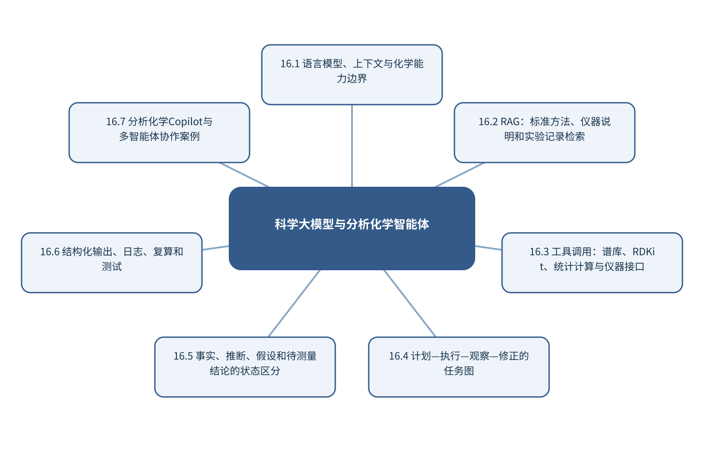

# 第16章 科学大模型与分析化学智能体

> 第5篇 科学智能体与自主分析系统　·　建议出版篇幅：20页

## 章首导引

大模型怎样调用可靠工具完成分析任务，同时不把语言流畅误当成科学正确？ 本章的回答是：把LLM定位为任务编排和人机接口，数值计算、事实和实验仍由可验证工具承担。全章以标准方法、数据工具、代码和仪器接口为对象，坚持“让大模型负责编排，让确定性工具负责事实和计算”，并通过“构建具有检索、拟合、复算和审计日志的分析Copilot”把概念、计算和分析决策连为一体。

## 学习目标

- 能够说明标准方法、数据工具、代码和仪器接口在本章中的数据结构与主要信息来源。
- 能够解释本章关键方法的输入、输出、参数、假设和失效条件。
- 能够以“让大模型负责编排，让确定性工具负责事实和计算”设计训练、验证和独立测试。
- 能够完成“构建具有检索、拟合、复算和审计日志的分析Copilot”的最小代码实验并分析失败样本。

## 本章知识图谱

## 16.1 语言模型、上下文与化学能力边界

本节围绕“语言模型、上下文与化学能力边界”展开。分析对象是标准方法、数据工具、代码和仪器接口，核心不是罗列名词，而是说明token、上下文和生成机制、预训练与指令对齐、化学知识与推理能力、幻觉、过时知识和数值弱点怎样进入同一条测量与推断链。读者首先要辨认哪些量来自真实样品，哪些量由仪器转换得到，哪些量由算法估计；三类量若混在一起，模型精度就很难被解释。

在“语言模型、上下文与化学能力边界”中，技术路线遵循“让大模型负责编排，让确定性工具负责事实和计算”。具体计算从可诊断的经典基线开始，再增加本节所需的非线性、结构先验或不确定度组件。新增组件必须回答一个明确问题，并在相同数据边界下与基线比较；只有平均分提高而误差结构没有改善，不能构成采用复杂模型的充分理由。

本节把“构建具有检索、拟合、复算和审计日志的分析Copilot”落实到LLM作为编排器而非测量事实源这一检查点。验证时保留与未来使用条件一致的独立对象，检查坐标轴、单位、样品身份、批次、参数来源和失败样本。由此得到的结论才可用于下一步测量或实验，而不是停留在一张看似分离良好的图上。

### 16.1.1 token、上下文和生成机制

就“token、上下文和生成机制”而言，token、上下文和生成机制属于从观测反推对象的逆问题，常存在多解性。同一峰可由多个结构片段贡献，同一空间热点也可能受厚度、照明或离子抑制影响；因此模型输出首先是候选解释，而不是自动成立的机制。

把“token、上下文和生成机制”用于“语言模型、上下文与化学能力边界”时，可信解释需要至少一条独立证据链：改变实验条件观察可预测响应、使用互补仪器验证候选，或以标准物质复现特征。显著性图、注意力和SHAP可定位模型依赖，却不能替代干预和机理实验。若该步骤改变了样品单位、统计独立性或物理峰形，必须在独立数据上重新证明其有效性。

### 16.1.2 预训练与指令对齐

就“预训练与指令对齐”而言，在“语言模型、上下文与化学能力边界”中，预训练与指令对齐具体限定了标准方法、数据工具、代码和仪器接口的一个技术接口。它必须被写成可检查的输入、变换和输出：输入保留样品与仪器条件，变换说明参数从何处估计，输出对应可观察量或候选判断；缺少任何一层，概念就无法进入实验和代码。

把“预训练与指令对齐”用于“语言模型、上下文与化学能力边界”时，本书用“构建具有检索、拟合、复算和审计日志的分析Copilot”检验预训练与指令对齐。实现时遵循“让大模型负责编排，让确定性工具负责事实和计算”，先建立经典基线，再对参数敏感性、独立样品和失败对象进行检查。若结果只能在同批数据或单次划分中成立，应把它视为探索性现象而非稳定规律。读图或读指标时应返回原始数据抽查，避免把表示空间中的几何关系直接当成化学机制。

### 16.1.3 化学知识与推理能力

就“化学知识与推理能力”而言，在“语言模型、上下文与化学能力边界”中，化学知识与推理能力具体限定了标准方法、数据工具、代码和仪器接口的一个技术接口。它必须被写成可检查的输入、变换和输出：输入保留样品与仪器条件，变换说明参数从何处估计，输出对应可观察量或候选判断；缺少任何一层，概念就无法进入实验和代码。

把“化学知识与推理能力”用于“语言模型、上下文与化学能力边界”时，本书用“构建具有检索、拟合、复算和审计日志的分析Copilot”检验化学知识与推理能力。实现时遵循“让大模型负责编排，让确定性工具负责事实和计算”，先建立经典基线，再对参数敏感性、独立样品和失败对象进行检查。若结果只能在同批数据或单次划分中成立，应把它视为探索性现象而非稳定规律。最终报告需要给出适用范围和拒绝条件，使方法在证据不足时能够停止输出。

### 16.1.4 幻觉、过时知识和数值弱点

就“幻觉、过时知识和数值弱点”而言，在“语言模型、上下文与化学能力边界”中，幻觉、过时知识和数值弱点具体限定了标准方法、数据工具、代码和仪器接口的一个技术接口。它必须被写成可检查的输入、变换和输出：输入保留样品与仪器条件，变换说明参数从何处估计，输出对应可观察量或候选判断；缺少任何一层，概念就无法进入实验和代码。

把“幻觉、过时知识和数值弱点”用于“语言模型、上下文与化学能力边界”时，本书用“构建具有检索、拟合、复算和审计日志的分析Copilot”检验幻觉、过时知识和数值弱点。实现时遵循“让大模型负责编排，让确定性工具负责事实和计算”，先建立经典基线，再对参数敏感性、独立样品和失败对象进行检查。若结果只能在同批数据或单次划分中成立，应把它视为探索性现象而非稳定规律。教学上应把该概念落实为可观察变量、可运行程序和可反驳检验三层。

### 16.1.5 LLM作为编排器而非测量事实源

就“LLM作为编排器而非测量事实源”而言，在“语言模型、上下文与化学能力边界”中，LLM作为编排器而非测量事实源具体限定了标准方法、数据工具、代码和仪器接口的一个技术接口。它必须被写成可检查的输入、变换和输出：输入保留样品与仪器条件，变换说明参数从何处估计，输出对应可观察量或候选判断；缺少任何一层，概念就无法进入实验和代码。

把“LLM作为编排器而非测量事实源”用于“语言模型、上下文与化学能力边界”时，本书用“构建具有检索、拟合、复算和审计日志的分析Copilot”检验LLM作为编排器而非测量事实源。实现时遵循“让大模型负责编排，让确定性工具负责事实和计算”，先建立经典基线，再对参数敏感性、独立样品和失败对象进行检查。若结果只能在同批数据或单次划分中成立，应把它视为探索性现象而非稳定规律。在真实项目中，还应保存参数、软件版本和输入校验结果，以便定位变化来自样品还是计算。

## 16.2 RAG：标准方法、仪器说明和实验记录检索

本节围绕“RAG：标准方法、仪器说明和实验记录检索”展开。分析对象是标准方法、数据工具、代码和仪器接口，核心不是罗列名词，而是说明检索、重排和生成、标准方法和仪器说明书、实验记录和内部知识库、来源锚点、版本和冲突怎样进入同一条测量与推断链。读者首先要辨认哪些量来自真实样品，哪些量由仪器转换得到，哪些量由算法估计；三类量若混在一起，模型精度就很难被解释。

在“RAG：标准方法、仪器说明和实验记录检索”中，技术路线遵循“让大模型负责编排，让确定性工具负责事实和计算”。具体计算从可诊断的经典基线开始，再增加本节所需的非线性、结构先验或不确定度组件。新增组件必须回答一个明确问题，并在相同数据边界下与基线比较；只有平均分提高而误差结构没有改善，不能构成采用复杂模型的充分理由。

本节把“构建具有检索、拟合、复算和审计日志的分析Copilot”落实到RAG评价这一检查点。验证时保留与未来使用条件一致的独立对象，检查坐标轴、单位、样品身份、批次、参数来源和失败样本。由此得到的结论才可用于下一步测量或实验，而不是停留在一张看似分离良好的图上。

### 16.2.1 检索、重排和生成

就“检索、重排和生成”而言，在“RAG：标准方法、仪器说明和实验记录检索”中，检索、重排和生成具体限定了标准方法、数据工具、代码和仪器接口的一个技术接口。它必须被写成可检查的输入、变换和输出：输入保留样品与仪器条件，变换说明参数从何处估计，输出对应可观察量或候选判断；缺少任何一层，概念就无法进入实验和代码。

把“检索、重排和生成”用于“RAG：标准方法、仪器说明和实验记录检索”时，本书用“构建具有检索、拟合、复算和审计日志的分析Copilot”检验检索、重排和生成。实现时遵循“让大模型负责编排，让确定性工具负责事实和计算”，先建立经典基线，再对参数敏感性、独立样品和失败对象进行检查。若结果只能在同批数据或单次划分中成立，应把它视为探索性现象而非稳定规律。若该步骤改变了样品单位、统计独立性或物理峰形，必须在独立数据上重新证明其有效性。

### 16.2.2 标准方法和仪器说明书

就“标准方法和仪器说明书”而言，在“RAG：标准方法、仪器说明和实验记录检索”中，标准方法和仪器说明书具体限定了标准方法、数据工具、代码和仪器接口的一个技术接口。它必须被写成可检查的输入、变换和输出：输入保留样品与仪器条件，变换说明参数从何处估计，输出对应可观察量或候选判断；缺少任何一层，概念就无法进入实验和代码。

把“标准方法和仪器说明书”用于“RAG：标准方法、仪器说明和实验记录检索”时，本书用“构建具有检索、拟合、复算和审计日志的分析Copilot”检验标准方法和仪器说明书。实现时遵循“让大模型负责编排，让确定性工具负责事实和计算”，先建立经典基线，再对参数敏感性、独立样品和失败对象进行检查。若结果只能在同批数据或单次划分中成立，应把它视为探索性现象而非稳定规律。读图或读指标时应返回原始数据抽查，避免把表示空间中的几何关系直接当成化学机制。

### 16.2.3 实验记录和内部知识库

就“实验记录和内部知识库”而言，实验记录和内部知识库决定数字能否被重新解释。仅保存强度矩阵会丢失坐标轴、单位、采样间隔、样品身份、仪器参数和校准状态；这些信息一旦脱离原始信号，后续很难判断变化来自化学对象还是采集条件。

把“实验记录和内部知识库”用于“RAG：标准方法、仪器说明和实验记录检索”时，推荐把原始文件设为只读，以持久样品标识连接实验表和信号文件，并为每次转换记录脚本版本、参数和校验码。单位转换、重采样与轴反向属于会改变数值含义的操作，必须在数据进入模型前自动检查。最终报告需要给出适用范围和拒绝条件，使方法在证据不足时能够停止输出。

### 16.2.4 来源锚点、版本和冲突

就“来源锚点、版本和冲突”而言，在“RAG：标准方法、仪器说明和实验记录检索”中，来源锚点、版本和冲突具体限定了标准方法、数据工具、代码和仪器接口的一个技术接口。它必须被写成可检查的输入、变换和输出：输入保留样品与仪器条件，变换说明参数从何处估计，输出对应可观察量或候选判断；缺少任何一层，概念就无法进入实验和代码。

把“来源锚点、版本和冲突”用于“RAG：标准方法、仪器说明和实验记录检索”时，本书用“构建具有检索、拟合、复算和审计日志的分析Copilot”检验来源锚点、版本和冲突。实现时遵循“让大模型负责编排，让确定性工具负责事实和计算”，先建立经典基线，再对参数敏感性、独立样品和失败对象进行检查。若结果只能在同批数据或单次划分中成立，应把它视为探索性现象而非稳定规律。教学上应把该概念落实为可观察变量、可运行程序和可反驳检验三层。

### 16.2.5 RAG评价

就“RAG评价”而言，围绕“RAG评价”，科学智能体把语言模型与检索、代码、数据库和仪器接口连接。RAG提供可追溯资料，工具调用执行确定性计算，状态记录保存中间结果。语言模型负责计划和接口，不应替代数值计算或实验事实。

把“RAG评价”用于“RAG：标准方法、仪器说明和实验记录检索”时，在“RAG：标准方法、仪器说明和实验记录检索”的语境下，可靠工作流把输出分为来源事实、模型推断和待验证假设。每个工具具有明确函数签名、权限和返回结构；关键数值通过复算或测试核验；危险动作必须经过人工批准。日志保存查询、工具版本、输入和输出。在真实项目中，还应保存参数、软件版本和输入校验结果，以便定位变化来自样品还是计算。

## 16.3 工具调用：谱库、RDKit、统计计算与仪器接口

本节围绕“工具调用：谱库、RDKit、统计计算与仪器接口”展开。分析对象是标准方法、数据工具、代码和仪器接口，核心不是罗列名词，而是说明函数签名和结构化参数、谱库、RDKit和数据库、统计拟合和绘图工具、代码执行和单元测试怎样进入同一条测量与推断链。读者首先要辨认哪些量来自真实样品，哪些量由仪器转换得到，哪些量由算法估计；三类量若混在一起，模型精度就很难被解释。

在“工具调用：谱库、RDKit、统计计算与仪器接口”中，技术路线遵循“让大模型负责编排，让确定性工具负责事实和计算”。具体计算从可诊断的经典基线开始，再增加本节所需的非线性、结构先验或不确定度组件。新增组件必须回答一个明确问题，并在相同数据边界下与基线比较；只有平均分提高而误差结构没有改善，不能构成采用复杂模型的充分理由。

本节把“构建具有检索、拟合、复算和审计日志的分析Copilot”落实到仪器API和权限边界这一检查点。验证时保留与未来使用条件一致的独立对象，检查坐标轴、单位、样品身份、批次、参数来源和失败样本。由此得到的结论才可用于下一步测量或实验，而不是停留在一张看似分离良好的图上。

### 16.3.1 函数签名和结构化参数

就“函数签名和结构化参数”而言，函数签名和结构化参数属于从观测反推对象的逆问题，常存在多解性。同一峰可由多个结构片段贡献，同一空间热点也可能受厚度、照明或离子抑制影响；因此模型输出首先是候选解释，而不是自动成立的机制。

把“函数签名和结构化参数”用于“工具调用：谱库、RDKit、统计计算与仪器接口”时，可信解释需要至少一条独立证据链：改变实验条件观察可预测响应、使用互补仪器验证候选，或以标准物质复现特征。显著性图、注意力和SHAP可定位模型依赖，却不能替代干预和机理实验。若该步骤改变了样品单位、统计独立性或物理峰形，必须在独立数据上重新证明其有效性。

### 16.3.2 谱库、RDKit和数据库

就“谱库、RDKit和数据库”而言，谱库、RDKit和数据库决定数字能否被重新解释。仅保存强度矩阵会丢失坐标轴、单位、采样间隔、样品身份、仪器参数和校准状态；这些信息一旦脱离原始信号，后续很难判断变化来自化学对象还是采集条件。

把“谱库、RDKit和数据库”用于“工具调用：谱库、RDKit、统计计算与仪器接口”时，推荐把原始文件设为只读，以持久样品标识连接实验表和信号文件，并为每次转换记录脚本版本、参数和校验码。单位转换、重采样与轴反向属于会改变数值含义的操作，必须在数据进入模型前自动检查。读图或读指标时应返回原始数据抽查，避免把表示空间中的几何关系直接当成化学机制。

### 16.3.3 统计拟合和绘图工具

就“统计拟合和绘图工具”而言，围绕“统计拟合和绘图工具”，分子图以原子为节点、化学键为空间关系。消息传递网络在每一层聚合邻居信息并更新节点表示，多层传播扩大感受野。全局池化把节点表示汇总为分子级向量。

把“统计拟合和绘图工具”用于“工具调用：谱库、RDKit、统计计算与仪器接口”时，在“工具调用：谱库、RDKit、统计计算与仪器接口”的语境下，二维图不能完整表达构象和空间相互作用。使用距离、角度或等变网络可以处理三维几何；SE(3)等变性要求模型输出随旋转和平移按物理规律变化。构象生成、温度和质子化态仍是输入不确定性的来源。最终报告需要给出适用范围和拒绝条件，使方法在证据不足时能够停止输出。

### 16.3.4 代码执行和单元测试

就“代码执行和单元测试”而言，在“工具调用：谱库、RDKit、统计计算与仪器接口”中，代码执行和单元测试具体限定了标准方法、数据工具、代码和仪器接口的一个技术接口。它必须被写成可检查的输入、变换和输出：输入保留样品与仪器条件，变换说明参数从何处估计，输出对应可观察量或候选判断；缺少任何一层，概念就无法进入实验和代码。

把“代码执行和单元测试”用于“工具调用：谱库、RDKit、统计计算与仪器接口”时，本书用“构建具有检索、拟合、复算和审计日志的分析Copilot”检验代码执行和单元测试。实现时遵循“让大模型负责编排，让确定性工具负责事实和计算”，先建立经典基线，再对参数敏感性、独立样品和失败对象进行检查。若结果只能在同批数据或单次划分中成立，应把它视为探索性现象而非稳定规律。教学上应把该概念落实为可观察变量、可运行程序和可反驳检验三层。

### 16.3.5 仪器API和权限边界

就“仪器API和权限边界”而言，在“工具调用：谱库、RDKit、统计计算与仪器接口”中，仪器API和权限边界具体限定了标准方法、数据工具、代码和仪器接口的一个技术接口。它必须被写成可检查的输入、变换和输出：输入保留样品与仪器条件，变换说明参数从何处估计，输出对应可观察量或候选判断；缺少任何一层，概念就无法进入实验和代码。

把“仪器API和权限边界”用于“工具调用：谱库、RDKit、统计计算与仪器接口”时，本书用“构建具有检索、拟合、复算和审计日志的分析Copilot”检验仪器API和权限边界。实现时遵循“让大模型负责编排，让确定性工具负责事实和计算”，先建立经典基线，再对参数敏感性、独立样品和失败对象进行检查。若结果只能在同批数据或单次划分中成立，应把它视为探索性现象而非稳定规律。在真实项目中，还应保存参数、软件版本和输入校验结果，以便定位变化来自样品还是计算。

## 16.4 计划—执行—观察—修正的任务图

本节围绕“计划—执行—观察—修正的任务图”展开。分析对象是标准方法、数据工具、代码和仪器接口，核心不是罗列名词，而是说明任务分解和计划、工具选择和执行、观察、反思和修正、状态机、任务图和终止条件怎样进入同一条测量与推断链。读者首先要辨认哪些量来自真实样品，哪些量由仪器转换得到，哪些量由算法估计；三类量若混在一起，模型精度就很难被解释。

在“计划—执行—观察—修正的任务图”中，技术路线遵循“让大模型负责编排，让确定性工具负责事实和计算”。具体计算从可诊断的经典基线开始，再增加本节所需的非线性、结构先验或不确定度组件。新增组件必须回答一个明确问题，并在相同数据边界下与基线比较；只有平均分提高而误差结构没有改善，不能构成采用复杂模型的充分理由。

本节把“构建具有检索、拟合、复算和审计日志的分析Copilot”落实到单智能体与多智能体这一检查点。验证时保留与未来使用条件一致的独立对象，检查坐标轴、单位、样品身份、批次、参数来源和失败样本。由此得到的结论才可用于下一步测量或实验，而不是停留在一张看似分离良好的图上。

### 16.4.1 任务分解和计划

就“任务分解和计划”而言，在“计划—执行—观察—修正的任务图”中，任务分解和计划具体限定了标准方法、数据工具、代码和仪器接口的一个技术接口。它必须被写成可检查的输入、变换和输出：输入保留样品与仪器条件，变换说明参数从何处估计，输出对应可观察量或候选判断；缺少任何一层，概念就无法进入实验和代码。

把“任务分解和计划”用于“计划—执行—观察—修正的任务图”时，本书用“构建具有检索、拟合、复算和审计日志的分析Copilot”检验任务分解和计划。实现时遵循“让大模型负责编排，让确定性工具负责事实和计算”，先建立经典基线，再对参数敏感性、独立样品和失败对象进行检查。若结果只能在同批数据或单次划分中成立，应把它视为探索性现象而非稳定规律。若该步骤改变了样品单位、统计独立性或物理峰形，必须在独立数据上重新证明其有效性。

### 16.4.2 工具选择和执行

就“工具选择和执行”而言，围绕“工具选择和执行”，科学智能体把语言模型与检索、代码、数据库和仪器接口连接。RAG提供可追溯资料，工具调用执行确定性计算，状态记录保存中间结果。语言模型负责计划和接口，不应替代数值计算或实验事实。

把“工具选择和执行”用于“计划—执行—观察—修正的任务图”时，在“计划—执行—观察—修正的任务图”的语境下，可靠工作流把输出分为来源事实、模型推断和待验证假设。每个工具具有明确函数签名、权限和返回结构；关键数值通过复算或测试核验；危险动作必须经过人工批准。日志保存查询、工具版本、输入和输出。读图或读指标时应返回原始数据抽查，避免把表示空间中的几何关系直接当成化学机制。

### 16.4.3 观察、反思和修正

就“观察、反思和修正”而言，在“计划—执行—观察—修正的任务图”中，观察、反思和修正具体限定了标准方法、数据工具、代码和仪器接口的一个技术接口。它必须被写成可检查的输入、变换和输出：输入保留样品与仪器条件，变换说明参数从何处估计，输出对应可观察量或候选判断；缺少任何一层，概念就无法进入实验和代码。

把“观察、反思和修正”用于“计划—执行—观察—修正的任务图”时，本书用“构建具有检索、拟合、复算和审计日志的分析Copilot”检验观察、反思和修正。实现时遵循“让大模型负责编排，让确定性工具负责事实和计算”，先建立经典基线，再对参数敏感性、独立样品和失败对象进行检查。若结果只能在同批数据或单次划分中成立，应把它视为探索性现象而非稳定规律。最终报告需要给出适用范围和拒绝条件，使方法在证据不足时能够停止输出。

### 16.4.4 状态机、任务图和终止条件

就“状态机、任务图和终止条件”而言，围绕“状态机、任务图和终止条件”，分子图以原子为节点、化学键为空间关系。消息传递网络在每一层聚合邻居信息并更新节点表示，多层传播扩大感受野。全局池化把节点表示汇总为分子级向量。

把“状态机、任务图和终止条件”用于“计划—执行—观察—修正的任务图”时，在“计划—执行—观察—修正的任务图”的语境下，二维图不能完整表达构象和空间相互作用。使用距离、角度或等变网络可以处理三维几何；SE(3)等变性要求模型输出随旋转和平移按物理规律变化。构象生成、温度和质子化态仍是输入不确定性的来源。教学上应把该概念落实为可观察变量、可运行程序和可反驳检验三层。

### 16.4.5 单智能体与多智能体

就“单智能体与多智能体”而言，单智能体与多智能体适合处理跨文档、跨工具的任务分解，但语言生成概率不等于化学事实。标准方法和仪器说明书应通过检索提供来源，数值拟合交给确定性程序，谱库和分子操作交给专用工具，模型只负责组织步骤和解释返回状态。

把“单智能体与多智能体”用于“计划—执行—观察—修正的任务图”时，一个可用工作流需要结构化参数、工具白名单、异常返回、关键数值复算和完整日志。输出应明确区分来源事实、计算结果、模型推断与待验证假设；涉及设备动作时还需权限、审批点和可恢复终止条件。在真实项目中，还应保存参数、软件版本和输入校验结果，以便定位变化来自样品还是计算。

## 16.5 事实、推断、假设和待测量结论的状态区分

本节围绕“事实、推断、假设和待测量结论的状态区分”展开。分析对象是标准方法、数据工具、代码和仪器接口，核心不是罗列名词，而是说明来源事实、数值计算结果、模型推断、待验证假设怎样进入同一条测量与推断链。读者首先要辨认哪些量来自真实样品，哪些量由仪器转换得到，哪些量由算法估计；三类量若混在一起，模型精度就很难被解释。

在“事实、推断、假设和待测量结论的状态区分”中，技术路线遵循“让大模型负责编排，让确定性工具负责事实和计算”。具体计算从可诊断的经典基线开始，再增加本节所需的非线性、结构先验或不确定度组件。新增组件必须回答一个明确问题，并在相同数据边界下与基线比较；只有平均分提高而误差结构没有改善，不能构成采用复杂模型的充分理由。

本节把“构建具有检索、拟合、复算和审计日志的分析Copilot”落实到不确定或冲突状态这一检查点。验证时保留与未来使用条件一致的独立对象，检查坐标轴、单位、样品身份、批次、参数来源和失败样本。由此得到的结论才可用于下一步测量或实验，而不是停留在一张看似分离良好的图上。

### 16.5.1 来源事实

就“来源事实”而言，在“事实、推断、假设和待测量结论的状态区分”中，来源事实具体限定了标准方法、数据工具、代码和仪器接口的一个技术接口。它必须被写成可检查的输入、变换和输出：输入保留样品与仪器条件，变换说明参数从何处估计，输出对应可观察量或候选判断；缺少任何一层，概念就无法进入实验和代码。

把“来源事实”用于“事实、推断、假设和待测量结论的状态区分”时，本书用“构建具有检索、拟合、复算和审计日志的分析Copilot”检验来源事实。实现时遵循“让大模型负责编排，让确定性工具负责事实和计算”，先建立经典基线，再对参数敏感性、独立样品和失败对象进行检查。若结果只能在同批数据或单次划分中成立，应把它视为探索性现象而非稳定规律。若该步骤改变了样品单位、统计独立性或物理峰形，必须在独立数据上重新证明其有效性。

### 16.5.2 数值计算结果

就“数值计算结果”而言，在“事实、推断、假设和待测量结论的状态区分”中，数值计算结果具体限定了标准方法、数据工具、代码和仪器接口的一个技术接口。它必须被写成可检查的输入、变换和输出：输入保留样品与仪器条件，变换说明参数从何处估计，输出对应可观察量或候选判断；缺少任何一层，概念就无法进入实验和代码。

把“数值计算结果”用于“事实、推断、假设和待测量结论的状态区分”时，本书用“构建具有检索、拟合、复算和审计日志的分析Copilot”检验数值计算结果。实现时遵循“让大模型负责编排，让确定性工具负责事实和计算”，先建立经典基线，再对参数敏感性、独立样品和失败对象进行检查。若结果只能在同批数据或单次划分中成立，应把它视为探索性现象而非稳定规律。读图或读指标时应返回原始数据抽查，避免把表示空间中的几何关系直接当成化学机制。

### 16.5.3 模型推断

就“模型推断”而言，在“事实、推断、假设和待测量结论的状态区分”中，模型推断具体限定了标准方法、数据工具、代码和仪器接口的一个技术接口。它必须被写成可检查的输入、变换和输出：输入保留样品与仪器条件，变换说明参数从何处估计，输出对应可观察量或候选判断；缺少任何一层，概念就无法进入实验和代码。

把“模型推断”用于“事实、推断、假设和待测量结论的状态区分”时，本书用“构建具有检索、拟合、复算和审计日志的分析Copilot”检验模型推断。实现时遵循“让大模型负责编排，让确定性工具负责事实和计算”，先建立经典基线，再对参数敏感性、独立样品和失败对象进行检查。若结果只能在同批数据或单次划分中成立，应把它视为探索性现象而非稳定规律。最终报告需要给出适用范围和拒绝条件，使方法在证据不足时能够停止输出。

### 16.5.4 待验证假设

就“待验证假设”而言，在“事实、推断、假设和待测量结论的状态区分”中，待验证假设具体限定了标准方法、数据工具、代码和仪器接口的一个技术接口。它必须被写成可检查的输入、变换和输出：输入保留样品与仪器条件，变换说明参数从何处估计，输出对应可观察量或候选判断；缺少任何一层，概念就无法进入实验和代码。

把“待验证假设”用于“事实、推断、假设和待测量结论的状态区分”时，本书用“构建具有检索、拟合、复算和审计日志的分析Copilot”检验待验证假设。实现时遵循“让大模型负责编排，让确定性工具负责事实和计算”，先建立经典基线，再对参数敏感性、独立样品和失败对象进行检查。若结果只能在同批数据或单次划分中成立，应把它视为探索性现象而非稳定规律。教学上应把该概念落实为可观察变量、可运行程序和可反驳检验三层。

### 16.5.5 不确定或冲突状态

就“不确定或冲突状态”而言，围绕“不确定或冲突状态”，随机误差反映重复测量的波动，系统偏差使结果稳定地偏离参照，不确定度则量化在现有知识下结果可能处于的范围。三者属于不同概念。高重复性不代表无偏，模型测试误差很低也不代表参照标签准确。

把“不确定或冲突状态”用于“事实、推断、假设和待测量结论的状态区分”时，在“事实、推断、假设和待测量结论的状态区分”的语境下，不确定度应沿采样、制样、校准、仪器、预处理和模型逐步传播。对于线性关系可使用一阶误差传播，对于明显非线性或参数相关的系统可使用蒙特卡洛抽样。报告时应给出覆盖概率、区间构造方法和适用条件，而不是只给一个小数位很多的点估计。在真实项目中，还应保存参数、软件版本和输入校验结果，以便定位变化来自样品还是计算。

## 16.6 结构化输出、日志、复算和测试

本节围绕“结构化输出、日志、复算和测试”展开。分析对象是标准方法、数据工具、代码和仪器接口，核心不是罗列名词，而是说明JSON/表格等结构化输出、输入、输出和工具版本日志、关键数值复算、异常路径和审批点怎样进入同一条测量与推断链。读者首先要辨认哪些量来自真实样品，哪些量由仪器转换得到，哪些量由算法估计；三类量若混在一起，模型精度就很难被解释。

在“结构化输出、日志、复算和测试”中，技术路线遵循“让大模型负责编排，让确定性工具负责事实和计算”。具体计算从可诊断的经典基线开始，再增加本节所需的非线性、结构先验或不确定度组件。新增组件必须回答一个明确问题，并在相同数据边界下与基线比较；只有平均分提高而误差结构没有改善，不能构成采用复杂模型的充分理由。

本节把“构建具有检索、拟合、复算和审计日志的分析Copilot”落实到可重放任务记录这一检查点。验证时保留与未来使用条件一致的独立对象，检查坐标轴、单位、样品身份、批次、参数来源和失败样本。由此得到的结论才可用于下一步测量或实验，而不是停留在一张看似分离良好的图上。

### 16.6.1 JSON/表格等结构化输出

就“JSON/表格等结构化输出”而言，JSON/表格等结构化输出属于从观测反推对象的逆问题，常存在多解性。同一峰可由多个结构片段贡献，同一空间热点也可能受厚度、照明或离子抑制影响；因此模型输出首先是候选解释，而不是自动成立的机制。

把“JSON/表格等结构化输出”用于“结构化输出、日志、复算和测试”时，可信解释需要至少一条独立证据链：改变实验条件观察可预测响应、使用互补仪器验证候选，或以标准物质复现特征。显著性图、注意力和SHAP可定位模型依赖，却不能替代干预和机理实验。若该步骤改变了样品单位、统计独立性或物理峰形，必须在独立数据上重新证明其有效性。

### 16.6.2 输入、输出和工具版本日志

就“输入、输出和工具版本日志”而言，围绕“输入、输出和工具版本日志”，科学智能体把语言模型与检索、代码、数据库和仪器接口连接。RAG提供可追溯资料，工具调用执行确定性计算，状态记录保存中间结果。语言模型负责计划和接口，不应替代数值计算或实验事实。

把“输入、输出和工具版本日志”用于“结构化输出、日志、复算和测试”时，在“结构化输出、日志、复算和测试”的语境下，可靠工作流把输出分为来源事实、模型推断和待验证假设。每个工具具有明确函数签名、权限和返回结构；关键数值通过复算或测试核验；危险动作必须经过人工批准。日志保存查询、工具版本、输入和输出。读图或读指标时应返回原始数据抽查，避免把表示空间中的几何关系直接当成化学机制。

### 16.6.3 关键数值复算

就“关键数值复算”而言，在“结构化输出、日志、复算和测试”中，关键数值复算具体限定了标准方法、数据工具、代码和仪器接口的一个技术接口。它必须被写成可检查的输入、变换和输出：输入保留样品与仪器条件，变换说明参数从何处估计，输出对应可观察量或候选判断；缺少任何一层，概念就无法进入实验和代码。

把“关键数值复算”用于“结构化输出、日志、复算和测试”时，本书用“构建具有检索、拟合、复算和审计日志的分析Copilot”检验关键数值复算。实现时遵循“让大模型负责编排，让确定性工具负责事实和计算”，先建立经典基线，再对参数敏感性、独立样品和失败对象进行检查。若结果只能在同批数据或单次划分中成立，应把它视为探索性现象而非稳定规律。最终报告需要给出适用范围和拒绝条件，使方法在证据不足时能够停止输出。

### 16.6.4 异常路径和审批点

就“异常路径和审批点”而言，在“结构化输出、日志、复算和测试”中，异常路径和审批点具体限定了标准方法、数据工具、代码和仪器接口的一个技术接口。它必须被写成可检查的输入、变换和输出：输入保留样品与仪器条件，变换说明参数从何处估计，输出对应可观察量或候选判断；缺少任何一层，概念就无法进入实验和代码。

把“异常路径和审批点”用于“结构化输出、日志、复算和测试”时，本书用“构建具有检索、拟合、复算和审计日志的分析Copilot”检验异常路径和审批点。实现时遵循“让大模型负责编排，让确定性工具负责事实和计算”，先建立经典基线，再对参数敏感性、独立样品和失败对象进行检查。若结果只能在同批数据或单次划分中成立，应把它视为探索性现象而非稳定规律。教学上应把该概念落实为可观察变量、可运行程序和可反驳检验三层。

### 16.6.5 可重放任务记录

就“可重放任务记录”而言，可重放任务记录决定数字能否被重新解释。仅保存强度矩阵会丢失坐标轴、单位、采样间隔、样品身份、仪器参数和校准状态；这些信息一旦脱离原始信号，后续很难判断变化来自化学对象还是采集条件。

把“可重放任务记录”用于“结构化输出、日志、复算和测试”时，推荐把原始文件设为只读，以持久样品标识连接实验表和信号文件，并为每次转换记录脚本版本、参数和校验码。单位转换、重采样与轴反向属于会改变数值含义的操作，必须在数据进入模型前自动检查。在真实项目中，还应保存参数、软件版本和输入校验结果，以便定位变化来自样品还是计算。

## 16.7 分析化学Copilot与多智能体协作案例

本节围绕“分析化学Copilot与多智能体协作案例”展开。分析对象是标准方法、数据工具、代码和仪器接口，核心不是罗列名词，而是说明分析数据Copilot、谱库和方法问答、自动拟合与残差诊断、实验建议和可证伪预测怎样进入同一条测量与推断链。读者首先要辨认哪些量来自真实样品，哪些量由仪器转换得到，哪些量由算法估计；三类量若混在一起，模型精度就很难被解释。

在“分析化学Copilot与多智能体协作案例”中，技术路线遵循“让大模型负责编排，让确定性工具负责事实和计算”。具体计算从可诊断的经典基线开始，再增加本节所需的非线性、结构先验或不确定度组件。新增组件必须回答一个明确问题，并在相同数据边界下与基线比较；只有平均分提高而误差结构没有改善，不能构成采用复杂模型的充分理由。

本节把“构建具有检索、拟合、复算和审计日志的分析Copilot”落实到规划—执行—验证—审计协作这一检查点。验证时保留与未来使用条件一致的独立对象，检查坐标轴、单位、样品身份、批次、参数来源和失败样本。由此得到的结论才可用于下一步测量或实验，而不是停留在一张看似分离良好的图上。

### 16.7.1 分析数据Copilot

就“分析数据Copilot”而言，分析数据Copilot决定数字能否被重新解释。仅保存强度矩阵会丢失坐标轴、单位、采样间隔、样品身份、仪器参数和校准状态；这些信息一旦脱离原始信号，后续很难判断变化来自化学对象还是采集条件。

把“分析数据Copilot”用于“分析化学Copilot与多智能体协作案例”时，推荐把原始文件设为只读，以持久样品标识连接实验表和信号文件，并为每次转换记录脚本版本、参数和校验码。单位转换、重采样与轴反向属于会改变数值含义的操作，必须在数据进入模型前自动检查。若该步骤改变了样品单位、统计独立性或物理峰形，必须在独立数据上重新证明其有效性。

### 16.7.2 谱库和方法问答

就“谱库和方法问答”而言，在“分析化学Copilot与多智能体协作案例”中，谱库和方法问答具体限定了标准方法、数据工具、代码和仪器接口的一个技术接口。它必须被写成可检查的输入、变换和输出：输入保留样品与仪器条件，变换说明参数从何处估计，输出对应可观察量或候选判断；缺少任何一层，概念就无法进入实验和代码。

把“谱库和方法问答”用于“分析化学Copilot与多智能体协作案例”时，本书用“构建具有检索、拟合、复算和审计日志的分析Copilot”检验谱库和方法问答。实现时遵循“让大模型负责编排，让确定性工具负责事实和计算”，先建立经典基线，再对参数敏感性、独立样品和失败对象进行检查。若结果只能在同批数据或单次划分中成立，应把它视为探索性现象而非稳定规律。读图或读指标时应返回原始数据抽查，避免把表示空间中的几何关系直接当成化学机制。

### 16.7.3 自动拟合与残差诊断

就“自动拟合与残差诊断”而言，在“分析化学Copilot与多智能体协作案例”中，自动拟合与残差诊断具体限定了标准方法、数据工具、代码和仪器接口的一个技术接口。它必须被写成可检查的输入、变换和输出：输入保留样品与仪器条件，变换说明参数从何处估计，输出对应可观察量或候选判断；缺少任何一层，概念就无法进入实验和代码。

把“自动拟合与残差诊断”用于“分析化学Copilot与多智能体协作案例”时，本书用“构建具有检索、拟合、复算和审计日志的分析Copilot”检验自动拟合与残差诊断。实现时遵循“让大模型负责编排，让确定性工具负责事实和计算”，先建立经典基线，再对参数敏感性、独立样品和失败对象进行检查。若结果只能在同批数据或单次划分中成立，应把它视为探索性现象而非稳定规律。最终报告需要给出适用范围和拒绝条件，使方法在证据不足时能够停止输出。

### 16.7.4 实验建议和可证伪预测

就“实验建议和可证伪预测”而言，在“分析化学Copilot与多智能体协作案例”中，实验建议和可证伪预测具体限定了标准方法、数据工具、代码和仪器接口的一个技术接口。它必须被写成可检查的输入、变换和输出：输入保留样品与仪器条件，变换说明参数从何处估计，输出对应可观察量或候选判断；缺少任何一层，概念就无法进入实验和代码。

把“实验建议和可证伪预测”用于“分析化学Copilot与多智能体协作案例”时，本书用“构建具有检索、拟合、复算和审计日志的分析Copilot”检验实验建议和可证伪预测。实现时遵循“让大模型负责编排，让确定性工具负责事实和计算”，先建立经典基线，再对参数敏感性、独立样品和失败对象进行检查。若结果只能在同批数据或单次划分中成立，应把它视为探索性现象而非稳定规律。教学上应把该概念落实为可观察变量、可运行程序和可反驳检验三层。

### 16.7.5 规划—执行—验证—审计协作

就“规划—执行—验证—审计协作”而言，在“分析化学Copilot与多智能体协作案例”中，规划—执行—验证—审计协作具体限定了标准方法、数据工具、代码和仪器接口的一个技术接口。它必须被写成可检查的输入、变换和输出：输入保留样品与仪器条件，变换说明参数从何处估计，输出对应可观察量或候选判断；缺少任何一层，概念就无法进入实验和代码。

把“规划—执行—验证—审计协作”用于“分析化学Copilot与多智能体协作案例”时，本书用“构建具有检索、拟合、复算和审计日志的分析Copilot”检验规划—执行—验证—审计协作。实现时遵循“让大模型负责编排，让确定性工具负责事实和计算”，先建立经典基线，再对参数敏感性、独立样品和失败对象进行检查。若结果只能在同批数据或单次划分中成立，应把它视为探索性现象而非稳定规律。在真实项目中，还应保存参数、软件版本和输入校验结果，以便定位变化来自样品还是计算。

## 关键关系与计算抓手

- `答案=检索证据+工具结果+受限推断`

- `状态=(计划,工具输出,证据级别,审批点)`

## 本章综合案例

本章案例：构建具有检索、拟合、复算和审计日志的分析Copilot。先明确样品单位、测量协议和数据结构，建立最简单且可诊断的基线；再加入本章核心方法，并在同一独立测试边界下比较。结果至少按批次、信号强弱和适用域分层，给出错误对象而非只报告总体平均数。

完成案例时，应提交问题卡、数据字典、运行日志、关键图表、失败样本清单和可运行程序。任何由模型提出的解释都要能被互补测量或后续实验检验。

## 代码实践

- 任务：实现带白名单工具、结构化返回、日志和复算检查的分析智能体骨架。
- 代码：[chapter_exercise.py](../code/ch16.py)

## 本章小结

本章以标准方法、数据工具、代码和仪器接口为对象，把“科学大模型与分析化学智能体”组织为测量、表示、推断和行动的连续过程。复习时应能解释数据如何生成、方法为何适用、性能如何验证，以及证据不足时何时拒绝输出。

## 思考题与计算题

1. 为“构建具有检索、拟合、复算和审计日志的分析Copilot”画出样品—仪器—数据—模型—结论链，并标出三处可能失真位置。
2. 从本章选择一个方法，写出输入、输出、关键参数、基本假设和至少两个失效条件。
3. 建立一个经典基线，并说明复杂模型必须在哪些独立指标上超过它。
4. 把随机划分改为符合未来使用条件的分组或外推划分，比较结果并解释差异。
5. 完成配套代码，增加一个单元测试和一个失败样本可视化。
6. 设计一个能够区分“模型学到化学信息”和“模型学到批次捷径”的对照实验。

## 下载本章资源

<a href="./downloads/word/ch16.docx" download>Word出版稿</a>　·　<a href="./code/ch16.py" download>Python代码</a>　·　<a href="./assets/graphs/ch16.svg" download>SVG知识图谱</a>

---

## 本章共建记录与致谢

| 学年 | 贡献者 | 工作内容 | 关联PR |
|---|---|---|---|
| 待本学年维护组补充 | — | — | — |
