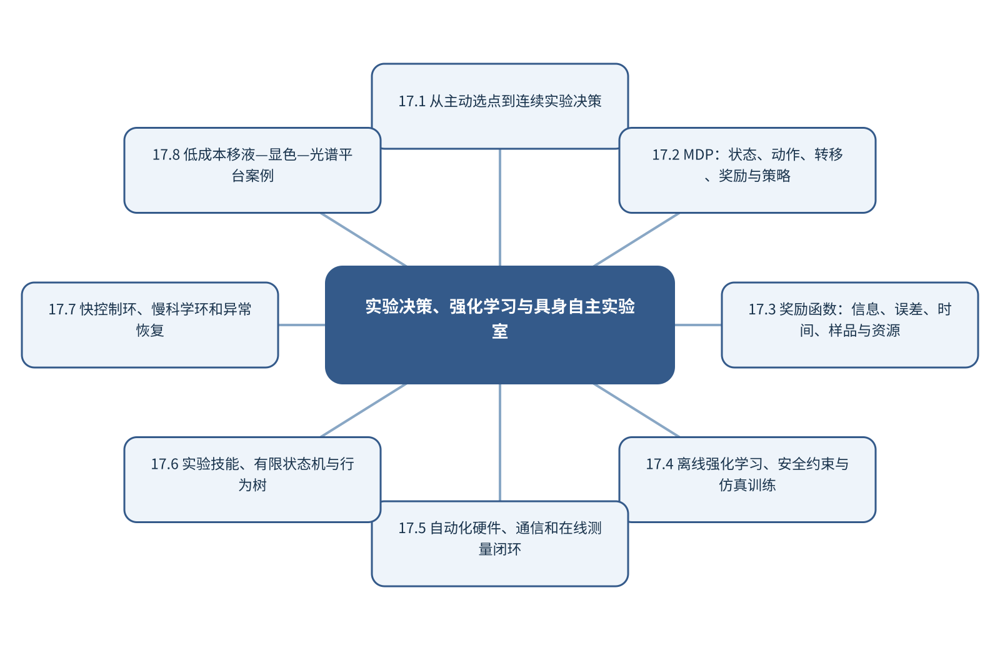

# 第17章 实验决策、强化学习与具身自主实验室

> 第5篇 科学智能体与自主分析系统

## 章首导引

怎样让智能系统连续选择测什么、如何操作，并在真实物理约束下恢复失败？ 本章的回答是：把强化学习放进具身实验闭环，承接第5章的单步选点但处理多步控制。全章以传感器、执行器、实验技能和连续决策为对象，坚持“区分慢速科学决策与快速安全控制”，并通过“搭建移液—显色—光谱闭环并进行故障注入”把概念、计算和分析决策连为一体。

## 学习目标

- 能够说明传感器、执行器、实验技能和连续决策在本章中的数据结构与主要信息来源。
- 能够解释本章关键方法的输入、输出、参数、假设和失效条件。
- 能够以“区分慢速科学决策与快速安全控制”设计训练、验证和独立测试。
- 能够完成“搭建移液—显色—光谱闭环并进行故障注入”的最小代码实验并分析失败样本。

## 本章知识图谱

## 17.1 从主动选点到连续实验决策

本节围绕“从主动选点到连续实验决策”展开。分析对象是传感器、执行器、实验技能和连续决策，核心不是罗列名词，而是说明单次预测、选点和连续控制、主动学习与贝叶斯优化回顾、状态依赖和长期后果、从自动化到自主化怎样进入同一条测量与推断链。读者首先要辨认哪些量来自真实样品，哪些量由仪器转换得到，哪些量由算法估计；三类量若混在一起，模型精度就很难被解释。

在“从主动选点到连续实验决策”中，技术路线遵循“区分慢速科学决策与快速安全控制”。具体计算从可诊断的经典基线开始，再增加本节所需的非线性、结构先验或不确定度组件。新增组件必须回答一个明确问题，并在相同数据边界下与基线比较；只有平均分提高而误差结构没有改善，不能构成采用复杂模型的充分理由。

本节把“搭建移液—显色—光谱闭环并进行故障注入”落实到从自动化到自主化这一检查点。验证时保留与未来使用条件一致的独立对象，检查坐标轴、单位、样品身份、批次、参数来源和失败样本。由此得到的结论才可用于下一步测量或实验，而不是停留在一张看似分离良好的图上。

### 17.1.1 单次预测、选点和连续控制

就“单次预测、选点和连续控制”而言，在“从主动选点到连续实验决策”中，单次预测、选点和连续控制具体限定了传感器、执行器、实验技能和连续决策的一个技术接口。它必须被写成可检查的输入、变换和输出：输入保留样品与仪器条件，变换说明参数从何处估计，输出对应可观察量或候选判断；缺少任何一层，概念就无法进入实验和代码。

把“单次预测、选点和连续控制”用于“从主动选点到连续实验决策”时，本书用“搭建移液—显色—光谱闭环并进行故障注入”检验单次预测、选点和连续控制。实现时遵循“区分慢速科学决策与快速安全控制”，先建立经典基线，再对参数敏感性、独立样品和失败对象进行检查。若结果只能在同批数据或单次划分中成立，应把它视为探索性现象而非稳定规律。读图或读指标时应返回原始数据抽查，避免把表示空间中的几何关系直接当成化学机制。

### 17.1.2 主动学习与贝叶斯优化回顾

就“主动学习与贝叶斯优化回顾”而言，围绕“主动学习与贝叶斯优化回顾”，贝叶斯公式描述证据如何更新对假设的信念。先验p(H)表示观察数据前的知识，似然p(D|H)表示假设成立时数据出现的概率，证据p(D)负责归一化，后验p(H|D)则是数据到来后的判断。分析化学中的峰位变化、碎片匹配或阳性检测均是间接证据，必须与基准发生率共同解释。

把“主动学习与贝叶斯优化回顾”用于“从主动选点到连续实验决策”时，在“从主动选点到连续实验决策”的语境下，贝叶斯推断的关键不是给每个结论强行标一个精确概率，而是保持推理方向正确：数据增强或削弱某个假设，而不是自动证明机制。先验应来自明确的文献、历史数据或物理约束，并进行敏感性分析；当后验强烈依赖先验时，应诚实报告数据仍不足。最终报告需要给出适用范围和拒绝条件，使方法在证据不足时能够停止输出。

### 17.1.3 状态依赖和长期后果

就“状态依赖和长期后果”而言，在“从主动选点到连续实验决策”中，状态依赖和长期后果具体限定了传感器、执行器、实验技能和连续决策的一个技术接口。它必须被写成可检查的输入、变换和输出：输入保留样品与仪器条件，变换说明参数从何处估计，输出对应可观察量或候选判断；缺少任何一层，概念就无法进入实验和代码。

把“状态依赖和长期后果”用于“从主动选点到连续实验决策”时，本书用“搭建移液—显色—光谱闭环并进行故障注入”检验状态依赖和长期后果。实现时遵循“区分慢速科学决策与快速安全控制”，先建立经典基线，再对参数敏感性、独立样品和失败对象进行检查。若结果只能在同批数据或单次划分中成立，应把它视为探索性现象而非稳定规律。教学上应把该概念落实为可观察变量、可运行程序和可反驳检验三层。

### 17.1.4 从自动化到自主化

就“从自动化到自主化”而言，在“从主动选点到连续实验决策”中，从自动化到自主化具体限定了传感器、执行器、实验技能和连续决策的一个技术接口。它必须被写成可检查的输入、变换和输出：输入保留样品与仪器条件，变换说明参数从何处估计，输出对应可观察量或候选判断；缺少任何一层，概念就无法进入实验和代码。

把“从自动化到自主化”用于“从主动选点到连续实验决策”时，本书用“搭建移液—显色—光谱闭环并进行故障注入”检验从自动化到自主化。实现时遵循“区分慢速科学决策与快速安全控制”，先建立经典基线，再对参数敏感性、独立样品和失败对象进行检查。若结果只能在同批数据或单次划分中成立，应把它视为探索性现象而非稳定规律。在真实项目中，还应保存参数、软件版本和输入校验结果，以便定位变化来自样品还是计算。

## 17.2 MDP：状态、动作、转移、奖励与策略

本节围绕“MDP：状态、动作、转移、奖励与策略”展开。分析对象是传感器、执行器、实验技能和连续决策，核心不是罗列名词，而是说明状态、动作、转移和观测、奖励与折扣因子、策略和价值函数、部分可观测MDP怎样进入同一条测量与推断链。读者首先要辨认哪些量来自真实样品，哪些量由仪器转换得到，哪些量由算法估计；三类量若混在一起，模型精度就很难被解释。

在“MDP：状态、动作、转移、奖励与策略”中，技术路线遵循“区分慢速科学决策与快速安全控制”。具体计算从可诊断的经典基线开始，再增加本节所需的非线性、结构先验或不确定度组件。新增组件必须回答一个明确问题，并在相同数据边界下与基线比较；只有平均分提高而误差结构没有改善，不能构成采用复杂模型的充分理由。

本节把“搭建移液—显色—光谱闭环并进行故障注入”落实到终止和失败状态这一检查点。验证时保留与未来使用条件一致的独立对象，检查坐标轴、单位、样品身份、批次、参数来源和失败样本。由此得到的结论才可用于下一步测量或实验，而不是停留在一张看似分离良好的图上。

### 17.2.1 状态、动作、转移和观测

就“状态、动作、转移和观测”而言，在“MDP：状态、动作、转移、奖励与策略”中，状态、动作、转移和观测具体限定了传感器、执行器、实验技能和连续决策的一个技术接口。它必须被写成可检查的输入、变换和输出：输入保留样品与仪器条件，变换说明参数从何处估计，输出对应可观察量或候选判断；缺少任何一层，概念就无法进入实验和代码。

把“状态、动作、转移和观测”用于“MDP：状态、动作、转移、奖励与策略”时，本书用“搭建移液—显色—光谱闭环并进行故障注入”检验状态、动作、转移和观测。实现时遵循“区分慢速科学决策与快速安全控制”，先建立经典基线，再对参数敏感性、独立样品和失败对象进行检查。若结果只能在同批数据或单次划分中成立，应把它视为探索性现象而非稳定规律。读图或读指标时应返回原始数据抽查，避免把表示空间中的几何关系直接当成化学机制。

### 17.2.2 奖励与折扣因子

就“奖励与折扣因子”而言，围绕“奖励与折扣因子”，实验设计通过有结构地选择因子组合，使主效应、交互作用和曲率可被估计。随机化抵御时间漂移，重复估计实验误差，区组隔离已知批次。筛选设计适合找出重要因素，响应面设计则用于局部优化。

把“奖励与折扣因子”用于“MDP：状态、动作、转移、奖励与策略”时，在“MDP：状态、动作、转移、奖励与策略”的语境下，二次响应面包含线性项、交互项和平方项。因子范围过窄无法识别曲率，过宽则可能跨越不同机理或安全区域。模型得到的数学最优点还需通过确认实验和稳健性试验验证。最终报告需要给出适用范围和拒绝条件，使方法在证据不足时能够停止输出。

### 17.2.3 策略和价值函数

就“策略和价值函数”而言，在“MDP：状态、动作、转移、奖励与策略”中，策略和价值函数具体限定了传感器、执行器、实验技能和连续决策的一个技术接口。它必须被写成可检查的输入、变换和输出：输入保留样品与仪器条件，变换说明参数从何处估计，输出对应可观察量或候选判断；缺少任何一层，概念就无法进入实验和代码。

把“策略和价值函数”用于“MDP：状态、动作、转移、奖励与策略”时，本书用“搭建移液—显色—光谱闭环并进行故障注入”检验策略和价值函数。实现时遵循“区分慢速科学决策与快速安全控制”，先建立经典基线，再对参数敏感性、独立样品和失败对象进行检查。若结果只能在同批数据或单次划分中成立，应把它视为探索性现象而非稳定规律。教学上应把该概念落实为可观察变量、可运行程序和可反驳检验三层。

### 17.2.4 部分可观测MDP

就“部分可观测MDP”而言，围绕“部分可观测MDP”，马尔可夫决策过程由状态、动作、转移、奖励和折扣因子构成。策略选择动作，环境返回新状态和奖励。强化学习优化长期累计回报，因此奖励函数实际定义了系统追求的目标。

把“部分可观测MDP”用于“MDP：状态、动作、转移、奖励与策略”时，在“MDP：状态、动作、转移、奖励与策略”的语境下，奖励设计不完整会产生奖励投机。例如只奖励预测产率可能诱导不可合成或不安全条件。化学任务应把硬安全约束放在动作空间和执行层，把成本、信息量和质量作为多目标评价，并保留人工审批。在真实项目中，还应保存参数、软件版本和输入校验结果，以便定位变化来自样品还是计算。

### 17.2.5 终止和失败状态

就“终止和失败状态”而言，在“MDP：状态、动作、转移、奖励与策略”中，终止和失败状态具体限定了传感器、执行器、实验技能和连续决策的一个技术接口。它必须被写成可检查的输入、变换和输出：输入保留样品与仪器条件，变换说明参数从何处估计，输出对应可观察量或候选判断；缺少任何一层，概念就无法进入实验和代码。

把“终止和失败状态”用于“MDP：状态、动作、转移、奖励与策略”时，本书用“搭建移液—显色—光谱闭环并进行故障注入”检验终止和失败状态。实现时遵循“区分慢速科学决策与快速安全控制”，先建立经典基线，再对参数敏感性、独立样品和失败对象进行检查。若结果只能在同批数据或单次划分中成立，应把它视为探索性现象而非稳定规律。若该步骤改变了样品单位、统计独立性或物理峰形，必须在独立数据上重新证明其有效性。

## 17.3 奖励函数：信息、误差、时间、样品与资源

本节围绕“奖励函数：信息、误差、时间、样品与资源”展开。分析对象是传感器、执行器、实验技能和连续决策，核心不是罗列名词，而是说明信息增益和定量误差、SNR、分离度和检测限、时间、样品和试剂消耗、多目标权衡怎样进入同一条测量与推断链。读者首先要辨认哪些量来自真实样品，哪些量由仪器转换得到，哪些量由算法估计；三类量若混在一起，模型精度就很难被解释。

在“奖励函数：信息、误差、时间、样品与资源”中，技术路线遵循“区分慢速科学决策与快速安全控制”。具体计算从可诊断的经典基线开始，再增加本节所需的非线性、结构先验或不确定度组件。新增组件必须回答一个明确问题，并在相同数据边界下与基线比较；只有平均分提高而误差结构没有改善，不能构成采用复杂模型的充分理由。

本节把“搭建移液—显色—光谱闭环并进行故障注入”落实到奖励投机这一检查点。验证时保留与未来使用条件一致的独立对象，检查坐标轴、单位、样品身份、批次、参数来源和失败样本。由此得到的结论才可用于下一步测量或实验，而不是停留在一张看似分离良好的图上。

### 17.3.1 信息增益和定量误差

就“信息增益和定量误差”而言，围绕“信息增益和定量误差”，随机误差反映重复测量的波动，系统偏差使结果稳定地偏离参照，不确定度则量化在现有知识下结果可能处于的范围。三者属于不同概念。高重复性不代表无偏，模型测试误差很低也不代表参照标签准确。

把“信息增益和定量误差”用于“奖励函数：信息、误差、时间、样品与资源”时，在“奖励函数：信息、误差、时间、样品与资源”的语境下，不确定度应沿采样、制样、校准、仪器、预处理和模型逐步传播。对于线性关系可使用一阶误差传播，对于明显非线性或参数相关的系统可使用蒙特卡洛抽样。报告时应给出覆盖概率、区间构造方法和适用条件，而不是只给一个小数位很多的点估计。读图或读指标时应返回原始数据抽查，避免把表示空间中的几何关系直接当成化学机制。

### 17.3.2 SNR、分离度和检测限

就“SNR、分离度和检测限”而言，围绕“SNR、分离度和检测限”，信噪比必须连同信号和噪声的定义给出。以峰高、峰面积或均值作为信号，以空白标准差、基线残差或重复测量波动作为噪声，会得到不同数值。只有定义与分析任务一致，SNR才具有比较意义。

把“SNR、分离度和检测限”用于“奖励函数：信息、误差、时间、样品与资源”时，在“奖励函数：信息、误差、时间、样品与资源”的语境下，重复平均可降低独立随机噪声，但不能消除系统漂移；平滑可压低高频波动，却可能同时改变窄峰。提高SNR的优先顺序通常是改进采样与仪器、使用参比和内标、优化制样，最后才是数字滤波。最终报告需要给出适用范围和拒绝条件，使方法在证据不足时能够停止输出。

### 17.3.3 时间、样品和试剂消耗

就“时间、样品和试剂消耗”而言，时间、样品和试剂消耗要求测量时间尺度快于被研究过程的关键变化。采样、传质、仪器响应和数据处理都可能造成时间延迟；若响应时间与反应时间相当，记录到的曲线是系统动力学与仪器核的卷积。

把“时间、样品和试剂消耗”用于“奖励函数：信息、误差、时间、样品与资源”时，建模时应保存真实时间戳、同步误差和操作事件，避免把等间隔文件序号当作真实时间。对于在线控制，还要区分毫秒级设备反馈与分钟级科学决策，并用状态估计处理不可直接观察的化学状态。教学上应把该概念落实为可观察变量、可运行程序和可反驳检验三层。

### 17.3.4 多目标权衡

就“多目标权衡”而言，在“奖励函数：信息、误差、时间、样品与资源”中，多目标权衡具体限定了传感器、执行器、实验技能和连续决策的一个技术接口。它必须被写成可检查的输入、变换和输出：输入保留样品与仪器条件，变换说明参数从何处估计，输出对应可观察量或候选判断；缺少任何一层，概念就无法进入实验和代码。

把“多目标权衡”用于“奖励函数：信息、误差、时间、样品与资源”时，本书用“搭建移液—显色—光谱闭环并进行故障注入”检验多目标权衡。实现时遵循“区分慢速科学决策与快速安全控制”，先建立经典基线，再对参数敏感性、独立样品和失败对象进行检查。若结果只能在同批数据或单次划分中成立，应把它视为探索性现象而非稳定规律。在真实项目中，还应保存参数、软件版本和输入校验结果，以便定位变化来自样品还是计算。

### 17.3.5 奖励投机

就“奖励投机”而言，围绕“奖励投机”，马尔可夫决策过程由状态、动作、转移、奖励和折扣因子构成。策略选择动作，环境返回新状态和奖励。强化学习优化长期累计回报，因此奖励函数实际定义了系统追求的目标。

把“奖励投机”用于“奖励函数：信息、误差、时间、样品与资源”时，在“奖励函数：信息、误差、时间、样品与资源”的语境下，奖励设计不完整会产生奖励投机。例如只奖励预测产率可能诱导不可合成或不安全条件。化学任务应把硬安全约束放在动作空间和执行层，把成本、信息量和质量作为多目标评价，并保留人工审批。若该步骤改变了样品单位、统计独立性或物理峰形，必须在独立数据上重新证明其有效性。

## 17.4 离线强化学习、安全约束与仿真训练

本节围绕“离线强化学习、安全约束与仿真训练”展开。分析对象是传感器、执行器、实验技能和连续决策，核心不是罗列名词，而是说明真实实验中的探索风险、约束动作空间和屏蔽器、离线强化学习、仿真训练与策略评估怎样进入同一条测量与推断链。读者首先要辨认哪些量来自真实样品，哪些量由仪器转换得到，哪些量由算法估计；三类量若混在一起，模型精度就很难被解释。

在“离线强化学习、安全约束与仿真训练”中，技术路线遵循“区分慢速科学决策与快速安全控制”。具体计算从可诊断的经典基线开始，再增加本节所需的非线性、结构先验或不确定度组件。新增组件必须回答一个明确问题，并在相同数据边界下与基线比较；只有平均分提高而误差结构没有改善，不能构成采用复杂模型的充分理由。

本节把“搭建移液—显色—光谱闭环并进行故障注入”落实到人工接管和停止条件这一检查点。验证时保留与未来使用条件一致的独立对象，检查坐标轴、单位、样品身份、批次、参数来源和失败样本。由此得到的结论才可用于下一步测量或实验，而不是停留在一张看似分离良好的图上。

### 17.4.1 真实实验中的探索风险

就“真实实验中的探索风险”而言，围绕“真实实验中的探索风险”，经验风险最小化在有限训练样本上优化平均损失。模型容量过高时，训练风险可以继续下降而真实风险上升。正则化通过限制参数、特征或函数复杂度，换取更稳定的外部性能。

把“真实实验中的探索风险”用于“离线强化学习、安全约束与仿真训练”时，在“离线强化学习、安全约束与仿真训练”的语境下，L1正则倾向产生稀疏系数，L2正则平滑地收缩全部系数。正则化强度属于超参数，必须在训练折内部选择。化学解释不能简单等同于非零系数，因为相关变量之间的权重可能不稳定。读图或读指标时应返回原始数据抽查，避免把表示空间中的几何关系直接当成化学机制。

### 17.4.2 约束动作空间和屏蔽器

就“约束动作空间和屏蔽器”而言，约束动作空间和屏蔽器属于从观测反推对象的逆问题，常存在多解性。同一峰可由多个结构片段贡献，同一空间热点也可能受厚度、照明或离子抑制影响；因此模型输出首先是候选解释，而不是自动成立的机制。

把“约束动作空间和屏蔽器”用于“离线强化学习、安全约束与仿真训练”时，可信解释需要至少一条独立证据链：改变实验条件观察可预测响应、使用互补仪器验证候选，或以标准物质复现特征。显著性图、注意力和SHAP可定位模型依赖，却不能替代干预和机理实验。最终报告需要给出适用范围和拒绝条件，使方法在证据不足时能够停止输出。

### 17.4.3 离线强化学习

就“离线强化学习”而言，在“离线强化学习、安全约束与仿真训练”中，离线强化学习具体限定了传感器、执行器、实验技能和连续决策的一个技术接口。它必须被写成可检查的输入、变换和输出：输入保留样品与仪器条件，变换说明参数从何处估计，输出对应可观察量或候选判断；缺少任何一层，概念就无法进入实验和代码。

把“离线强化学习”用于“离线强化学习、安全约束与仿真训练”时，本书用“搭建移液—显色—光谱闭环并进行故障注入”检验离线强化学习。实现时遵循“区分慢速科学决策与快速安全控制”，先建立经典基线，再对参数敏感性、独立样品和失败对象进行检查。若结果只能在同批数据或单次划分中成立，应把它视为探索性现象而非稳定规律。教学上应把该概念落实为可观察变量、可运行程序和可反驳检验三层。

### 17.4.4 仿真训练与策略评估

就“仿真训练与策略评估”而言，在“离线强化学习、安全约束与仿真训练”中，仿真训练与策略评估具体限定了传感器、执行器、实验技能和连续决策的一个技术接口。它必须被写成可检查的输入、变换和输出：输入保留样品与仪器条件，变换说明参数从何处估计，输出对应可观察量或候选判断；缺少任何一层，概念就无法进入实验和代码。

把“仿真训练与策略评估”用于“离线强化学习、安全约束与仿真训练”时，本书用“搭建移液—显色—光谱闭环并进行故障注入”检验仿真训练与策略评估。实现时遵循“区分慢速科学决策与快速安全控制”，先建立经典基线，再对参数敏感性、独立样品和失败对象进行检查。若结果只能在同批数据或单次划分中成立，应把它视为探索性现象而非稳定规律。在真实项目中，还应保存参数、软件版本和输入校验结果，以便定位变化来自样品还是计算。

### 17.4.5 人工接管和停止条件

就“人工接管和停止条件”而言，在“离线强化学习、安全约束与仿真训练”中，人工接管和停止条件具体限定了传感器、执行器、实验技能和连续决策的一个技术接口。它必须被写成可检查的输入、变换和输出：输入保留样品与仪器条件，变换说明参数从何处估计，输出对应可观察量或候选判断；缺少任何一层，概念就无法进入实验和代码。

把“人工接管和停止条件”用于“离线强化学习、安全约束与仿真训练”时，本书用“搭建移液—显色—光谱闭环并进行故障注入”检验人工接管和停止条件。实现时遵循“区分慢速科学决策与快速安全控制”，先建立经典基线，再对参数敏感性、独立样品和失败对象进行检查。若结果只能在同批数据或单次划分中成立，应把它视为探索性现象而非稳定规律。若该步骤改变了样品单位、统计独立性或物理峰形，必须在独立数据上重新证明其有效性。

## 17.5 自动化硬件、通信和在线测量闭环

本节围绕“自动化硬件、通信和在线测量闭环”展开。分析对象是传感器、执行器、实验技能和连续决策，核心不是罗列名词，而是说明机器人、泵阀和移液、光谱、电化学和色谱接口、通信协议、时间同步和数据回传、在线质量控制和设备健康怎样进入同一条测量与推断链。读者首先要辨认哪些量来自真实样品，哪些量由仪器转换得到，哪些量由算法估计；三类量若混在一起，模型精度就很难被解释。

在“自动化硬件、通信和在线测量闭环”中，技术路线遵循“区分慢速科学决策与快速安全控制”。具体计算从可诊断的经典基线开始，再增加本节所需的非线性、结构先验或不确定度组件。新增组件必须回答一个明确问题，并在相同数据边界下与基线比较；只有平均分提高而误差结构没有改善，不能构成采用复杂模型的充分理由。

本节把“搭建移液—显色—光谱闭环并进行故障注入”落实到在线质量控制和设备健康这一检查点。验证时保留与未来使用条件一致的独立对象，检查坐标轴、单位、样品身份、批次、参数来源和失败样本。由此得到的结论才可用于下一步测量或实验，而不是停留在一张看似分离良好的图上。

### 17.5.1 机器人、泵阀和移液

就“机器人、泵阀和移液”而言，在“自动化硬件、通信和在线测量闭环”中，机器人、泵阀和移液具体限定了传感器、执行器、实验技能和连续决策的一个技术接口。它必须被写成可检查的输入、变换和输出：输入保留样品与仪器条件，变换说明参数从何处估计，输出对应可观察量或候选判断；缺少任何一层，概念就无法进入实验和代码。

把“机器人、泵阀和移液”用于“自动化硬件、通信和在线测量闭环”时，本书用“搭建移液—显色—光谱闭环并进行故障注入”检验机器人、泵阀和移液。实现时遵循“区分慢速科学决策与快速安全控制”，先建立经典基线，再对参数敏感性、独立样品和失败对象进行检查。若结果只能在同批数据或单次划分中成立，应把它视为探索性现象而非稳定规律。读图或读指标时应返回原始数据抽查，避免把表示空间中的几何关系直接当成化学机制。

### 17.5.2 光谱、电化学和色谱接口

就“光谱、电化学和色谱接口”而言，在“自动化硬件、通信和在线测量闭环”中，光谱、电化学和色谱接口具体限定了传感器、执行器、实验技能和连续决策的一个技术接口。它必须被写成可检查的输入、变换和输出：输入保留样品与仪器条件，变换说明参数从何处估计，输出对应可观察量或候选判断；缺少任何一层，概念就无法进入实验和代码。

把“光谱、电化学和色谱接口”用于“自动化硬件、通信和在线测量闭环”时，本书用“搭建移液—显色—光谱闭环并进行故障注入”检验光谱、电化学和色谱接口。实现时遵循“区分慢速科学决策与快速安全控制”，先建立经典基线，再对参数敏感性、独立样品和失败对象进行检查。若结果只能在同批数据或单次划分中成立，应把它视为探索性现象而非稳定规律。最终报告需要给出适用范围和拒绝条件，使方法在证据不足时能够停止输出。

### 17.5.3 通信协议、时间同步和数据回传

就“通信协议、时间同步和数据回传”而言，通信协议、时间同步和数据回传要求测量时间尺度快于被研究过程的关键变化。采样、传质、仪器响应和数据处理都可能造成时间延迟；若响应时间与反应时间相当，记录到的曲线是系统动力学与仪器核的卷积。

把“通信协议、时间同步和数据回传”用于“自动化硬件、通信和在线测量闭环”时，建模时应保存真实时间戳、同步误差和操作事件，避免把等间隔文件序号当作真实时间。对于在线控制，还要区分毫秒级设备反馈与分钟级科学决策，并用状态估计处理不可直接观察的化学状态。教学上应把该概念落实为可观察变量、可运行程序和可反驳检验三层。

### 17.5.4 在线质量控制和设备健康

就“在线质量控制和设备健康”而言，在线质量控制和设备健康要求测量时间尺度快于被研究过程的关键变化。采样、传质、仪器响应和数据处理都可能造成时间延迟；若响应时间与反应时间相当，记录到的曲线是系统动力学与仪器核的卷积。

把“在线质量控制和设备健康”用于“自动化硬件、通信和在线测量闭环”时，建模时应保存真实时间戳、同步误差和操作事件，避免把等间隔文件序号当作真实时间。对于在线控制，还要区分毫秒级设备反馈与分钟级科学决策，并用状态估计处理不可直接观察的化学状态。在真实项目中，还应保存参数、软件版本和输入校验结果，以便定位变化来自样品还是计算。

## 17.6 实验技能、有限状态机与行为树

本节围绕“实验技能、有限状态机与行为树”展开。分析对象是传感器、执行器、实验技能和连续决策，核心不是罗列名词，而是说明技能前置条件和后置条件、有限状态机、行为树与技能组合、幂等重试、超时和恢复怎样进入同一条测量与推断链。读者首先要辨认哪些量来自真实样品，哪些量由仪器转换得到，哪些量由算法估计；三类量若混在一起，模型精度就很难被解释。

在“实验技能、有限状态机与行为树”中，技术路线遵循“区分慢速科学决策与快速安全控制”。具体计算从可诊断的经典基线开始，再增加本节所需的非线性、结构先验或不确定度组件。新增组件必须回答一个明确问题，并在相同数据边界下与基线比较；只有平均分提高而误差结构没有改善，不能构成采用复杂模型的充分理由。

本节把“搭建移液—显色—光谱闭环并进行故障注入”落实到安全状态这一检查点。验证时保留与未来使用条件一致的独立对象，检查坐标轴、单位、样品身份、批次、参数来源和失败样本。由此得到的结论才可用于下一步测量或实验，而不是停留在一张看似分离良好的图上。

### 17.6.1 技能前置条件和后置条件

就“技能前置条件和后置条件”而言，围绕“技能前置条件和后置条件”，实验技能应声明前置条件、动作、传感反馈、成功标准和失败恢复。有限状态机适合明确流程，行为树便于组合可重用技能。高层规划选择做什么，低层控制器负责轨迹、时延和快速反馈。

把“技能前置条件和后置条件”用于“实验技能、有限状态机与行为树”时，在“实验技能、有限状态机与行为树”的语境下，机器人控制可能以毫秒更新，反应优化可能持续数小时。快环必须本地、确定和安全；慢环可以使用贝叶斯优化或大模型规划。自主实验室的评价包括实验通量、自治时间、优化效率、复现率、故障恢复和资源消耗。读图或读指标时应返回原始数据抽查，避免把表示空间中的几何关系直接当成化学机制。

### 17.6.2 有限状态机

就“有限状态机”而言，围绕“有限状态机”，科学智能体把语言模型与检索、代码、数据库和仪器接口连接。RAG提供可追溯资料，工具调用执行确定性计算，状态记录保存中间结果。语言模型负责计划和接口，不应替代数值计算或实验事实。

把“有限状态机”用于“实验技能、有限状态机与行为树”时，在“实验技能、有限状态机与行为树”的语境下，可靠工作流把输出分为来源事实、模型推断和待验证假设。每个工具具有明确函数签名、权限和返回结构；关键数值通过复算或测试核验；危险动作必须经过人工批准。日志保存查询、工具版本、输入和输出。最终报告需要给出适用范围和拒绝条件，使方法在证据不足时能够停止输出。

### 17.6.3 行为树与技能组合

就“行为树与技能组合”而言，围绕“行为树与技能组合”，实验技能应声明前置条件、动作、传感反馈、成功标准和失败恢复。有限状态机适合明确流程，行为树便于组合可重用技能。高层规划选择做什么，低层控制器负责轨迹、时延和快速反馈。

把“行为树与技能组合”用于“实验技能、有限状态机与行为树”时，在“实验技能、有限状态机与行为树”的语境下，机器人控制可能以毫秒更新，反应优化可能持续数小时。快环必须本地、确定和安全；慢环可以使用贝叶斯优化或大模型规划。自主实验室的评价包括实验通量、自治时间、优化效率、复现率、故障恢复和资源消耗。教学上应把该概念落实为可观察变量、可运行程序和可反驳检验三层。

### 17.6.4 幂等重试、超时和恢复

就“幂等重试、超时和恢复”而言，在“实验技能、有限状态机与行为树”中，幂等重试、超时和恢复具体限定了传感器、执行器、实验技能和连续决策的一个技术接口。它必须被写成可检查的输入、变换和输出：输入保留样品与仪器条件，变换说明参数从何处估计，输出对应可观察量或候选判断；缺少任何一层，概念就无法进入实验和代码。

把“幂等重试、超时和恢复”用于“实验技能、有限状态机与行为树”时，本书用“搭建移液—显色—光谱闭环并进行故障注入”检验幂等重试、超时和恢复。实现时遵循“区分慢速科学决策与快速安全控制”，先建立经典基线，再对参数敏感性、独立样品和失败对象进行检查。若结果只能在同批数据或单次划分中成立，应把它视为探索性现象而非稳定规律。在真实项目中，还应保存参数、软件版本和输入校验结果，以便定位变化来自样品还是计算。

### 17.6.5 安全状态

就“安全状态”而言，在“实验技能、有限状态机与行为树”中，安全状态具体限定了传感器、执行器、实验技能和连续决策的一个技术接口。它必须被写成可检查的输入、变换和输出：输入保留样品与仪器条件，变换说明参数从何处估计，输出对应可观察量或候选判断；缺少任何一层，概念就无法进入实验和代码。

把“安全状态”用于“实验技能、有限状态机与行为树”时，本书用“搭建移液—显色—光谱闭环并进行故障注入”检验安全状态。实现时遵循“区分慢速科学决策与快速安全控制”，先建立经典基线，再对参数敏感性、独立样品和失败对象进行检查。若结果只能在同批数据或单次划分中成立，应把它视为探索性现象而非稳定规律。若该步骤改变了样品单位、统计独立性或物理峰形，必须在独立数据上重新证明其有效性。

## 17.7 快控制环、慢科学环和异常恢复

本节围绕“快控制环、慢科学环和异常恢复”展开。分析对象是传感器、执行器、实验技能和连续决策，核心不是罗列名词，而是说明毫秒级控制环、分钟/小时级科学决策环、高层规划和低层控制、异步测量和资源调度怎样进入同一条测量与推断链。读者首先要辨认哪些量来自真实样品，哪些量由仪器转换得到，哪些量由算法估计；三类量若混在一起，模型精度就很难被解释。

在“快控制环、慢科学环和异常恢复”中，技术路线遵循“区分慢速科学决策与快速安全控制”。具体计算从可诊断的经典基线开始，再增加本节所需的非线性、结构先验或不确定度组件。新增组件必须回答一个明确问题，并在相同数据边界下与基线比较；只有平均分提高而误差结构没有改善，不能构成采用复杂模型的充分理由。

本节把“搭建移液—显色—光谱闭环并进行故障注入”落实到异步测量和资源调度这一检查点。验证时保留与未来使用条件一致的独立对象，检查坐标轴、单位、样品身份、批次、参数来源和失败样本。由此得到的结论才可用于下一步测量或实验，而不是停留在一张看似分离良好的图上。

### 17.7.1 毫秒级控制环

就“毫秒级控制环”而言，在“快控制环、慢科学环和异常恢复”中，毫秒级控制环具体限定了传感器、执行器、实验技能和连续决策的一个技术接口。它必须被写成可检查的输入、变换和输出：输入保留样品与仪器条件，变换说明参数从何处估计，输出对应可观察量或候选判断；缺少任何一层，概念就无法进入实验和代码。

把“毫秒级控制环”用于“快控制环、慢科学环和异常恢复”时，本书用“搭建移液—显色—光谱闭环并进行故障注入”检验毫秒级控制环。实现时遵循“区分慢速科学决策与快速安全控制”，先建立经典基线，再对参数敏感性、独立样品和失败对象进行检查。若结果只能在同批数据或单次划分中成立，应把它视为探索性现象而非稳定规律。读图或读指标时应返回原始数据抽查，避免把表示空间中的几何关系直接当成化学机制。

### 17.7.2 分钟/小时级科学决策环

就“分钟/小时级科学决策环”而言，分钟/小时级科学决策环把分析结果转成实际行动。阈值不是模型内部的固定常数，而应由漏检、误报、复检成本和样品基准发生率共同确定；同一预测概率在筛查与确证场景中可对应不同决策。

把“分钟/小时级科学决策环”用于“快控制环、慢科学环和异常恢复”时，决策系统应允许三种输出：接受、拒绝和请求补充测量。每次行动保留输入版本、置信区间、适用域状态和人工复核点；若信息价值不足以抵消额外实验成本，系统也应能够停止。最终报告需要给出适用范围和拒绝条件，使方法在证据不足时能够停止输出。

### 17.7.3 高层规划和低层控制

就“高层规划和低层控制”而言，在“快控制环、慢科学环和异常恢复”中，高层规划和低层控制具体限定了传感器、执行器、实验技能和连续决策的一个技术接口。它必须被写成可检查的输入、变换和输出：输入保留样品与仪器条件，变换说明参数从何处估计，输出对应可观察量或候选判断；缺少任何一层，概念就无法进入实验和代码。

把“高层规划和低层控制”用于“快控制环、慢科学环和异常恢复”时，本书用“搭建移液—显色—光谱闭环并进行故障注入”检验高层规划和低层控制。实现时遵循“区分慢速科学决策与快速安全控制”，先建立经典基线，再对参数敏感性、独立样品和失败对象进行检查。若结果只能在同批数据或单次划分中成立，应把它视为探索性现象而非稳定规律。教学上应把该概念落实为可观察变量、可运行程序和可反驳检验三层。

### 17.7.4 异步测量和资源调度

就“异步测量和资源调度”而言，在“快控制环、慢科学环和异常恢复”中，异步测量和资源调度具体限定了传感器、执行器、实验技能和连续决策的一个技术接口。它必须被写成可检查的输入、变换和输出：输入保留样品与仪器条件，变换说明参数从何处估计，输出对应可观察量或候选判断；缺少任何一层，概念就无法进入实验和代码。

把“异步测量和资源调度”用于“快控制环、慢科学环和异常恢复”时，本书用“搭建移液—显色—光谱闭环并进行故障注入”检验异步测量和资源调度。实现时遵循“区分慢速科学决策与快速安全控制”，先建立经典基线，再对参数敏感性、独立样品和失败对象进行检查。若结果只能在同批数据或单次划分中成立，应把它视为探索性现象而非稳定规律。在真实项目中，还应保存参数、软件版本和输入校验结果，以便定位变化来自样品还是计算。

## 17.8 低成本移液—显色—光谱平台案例

本节围绕“低成本移液—显色—光谱平台案例”展开。分析对象是传感器、执行器、实验技能和连续决策，核心不是罗列名词，而是说明低成本移液—显色—光谱平台、故障注入和恢复测试、吞吐、自治时间和复现率、闭环优化与人工对照怎样进入同一条测量与推断链。读者首先要辨认哪些量来自真实样品，哪些量由仪器转换得到，哪些量由算法估计；三类量若混在一起，模型精度就很难被解释。

在“低成本移液—显色—光谱平台案例”中，技术路线遵循“区分慢速科学决策与快速安全控制”。具体计算从可诊断的经典基线开始，再增加本节所需的非线性、结构先验或不确定度组件。新增组件必须回答一个明确问题，并在相同数据边界下与基线比较；只有平均分提高而误差结构没有改善，不能构成采用复杂模型的充分理由。

本节把“搭建移液—显色—光谱闭环并进行故障注入”落实到闭环优化与人工对照这一检查点。验证时保留与未来使用条件一致的独立对象，检查坐标轴、单位、样品身份、批次、参数来源和失败样本。由此得到的结论才可用于下一步测量或实验，而不是停留在一张看似分离良好的图上。

### 17.8.1 低成本移液—显色—光谱平台

就“低成本移液—显色—光谱平台”而言，在“低成本移液—显色—光谱平台案例”中，低成本移液—显色—光谱平台具体限定了传感器、执行器、实验技能和连续决策的一个技术接口。它必须被写成可检查的输入、变换和输出：输入保留样品与仪器条件，变换说明参数从何处估计，输出对应可观察量或候选判断；缺少任何一层，概念就无法进入实验和代码。

把“低成本移液—显色—光谱平台”用于“低成本移液—显色—光谱平台案例”时，本书用“搭建移液—显色—光谱闭环并进行故障注入”检验低成本移液—显色—光谱平台。实现时遵循“区分慢速科学决策与快速安全控制”，先建立经典基线，再对参数敏感性、独立样品和失败对象进行检查。若结果只能在同批数据或单次划分中成立，应把它视为探索性现象而非稳定规律。读图或读指标时应返回原始数据抽查，避免把表示空间中的几何关系直接当成化学机制。

### 17.8.2 故障注入和恢复测试

就“故障注入和恢复测试”而言，在“低成本移液—显色—光谱平台案例”中，故障注入和恢复测试具体限定了传感器、执行器、实验技能和连续决策的一个技术接口。它必须被写成可检查的输入、变换和输出：输入保留样品与仪器条件，变换说明参数从何处估计，输出对应可观察量或候选判断；缺少任何一层，概念就无法进入实验和代码。

把“故障注入和恢复测试”用于“低成本移液—显色—光谱平台案例”时，本书用“搭建移液—显色—光谱闭环并进行故障注入”检验故障注入和恢复测试。实现时遵循“区分慢速科学决策与快速安全控制”，先建立经典基线，再对参数敏感性、独立样品和失败对象进行检查。若结果只能在同批数据或单次划分中成立，应把它视为探索性现象而非稳定规律。最终报告需要给出适用范围和拒绝条件，使方法在证据不足时能够停止输出。

### 17.8.3 吞吐、自治时间和复现率

就“吞吐、自治时间和复现率”而言，围绕“吞吐、自治时间和复现率”，实验技能应声明前置条件、动作、传感反馈、成功标准和失败恢复。有限状态机适合明确流程，行为树便于组合可重用技能。高层规划选择做什么，低层控制器负责轨迹、时延和快速反馈。

把“吞吐、自治时间和复现率”用于“低成本移液—显色—光谱平台案例”时，在“低成本移液—显色—光谱平台案例”的语境下，机器人控制可能以毫秒更新，反应优化可能持续数小时。快环必须本地、确定和安全；慢环可以使用贝叶斯优化或大模型规划。自主实验室的评价包括实验通量、自治时间、优化效率、复现率、故障恢复和资源消耗。教学上应把该概念落实为可观察变量、可运行程序和可反驳检验三层。

### 17.8.4 闭环优化与人工对照

就“闭环优化与人工对照”而言，在“低成本移液—显色—光谱平台案例”中，闭环优化与人工对照具体限定了传感器、执行器、实验技能和连续决策的一个技术接口。它必须被写成可检查的输入、变换和输出：输入保留样品与仪器条件，变换说明参数从何处估计，输出对应可观察量或候选判断；缺少任何一层，概念就无法进入实验和代码。

把“闭环优化与人工对照”用于“低成本移液—显色—光谱平台案例”时，本书用“搭建移液—显色—光谱闭环并进行故障注入”检验闭环优化与人工对照。实现时遵循“区分慢速科学决策与快速安全控制”，先建立经典基线，再对参数敏感性、独立样品和失败对象进行检查。若结果只能在同批数据或单次划分中成立，应把它视为探索性现象而非稳定规律。在真实项目中，还应保存参数、软件版本和输入校验结果，以便定位变化来自样品还是计算。

## 关键关系与计算抓手

- `MDP=(S,A,P,R,γ)`

- `Q*(s,a)=E[r+γmax Q*(s′,a′)]`

## 本章综合案例

本章案例：搭建移液—显色—光谱闭环并进行故障注入。先明确样品单位、测量协议和数据结构，建立最简单且可诊断的基线；再加入本章核心方法，并在同一独立测试边界下比较。结果至少按批次、信号强弱和适用域分层，给出错误对象而非只报告总体平均数。

完成案例时，应提交问题卡、数据字典、运行日志、关键图表、失败样本清单和可运行程序。任何由模型提出的解释都要能被互补测量或后续实验检验。

## 代码实践

- 任务：用有限状态机和模拟仪器实现闭环实验，注入故障并验证恢复路径。
- 代码：[chapter_exercise.py](../code/ch17.py)

## 本章小结

本章以传感器、执行器、实验技能和连续决策为对象，把“实验决策、强化学习与具身自主实验室”组织为测量、表示、推断和行动的连续过程。复习时应能解释数据如何生成、方法为何适用、性能如何验证，以及证据不足时何时拒绝输出。

## 思考题与计算题

1. 为“搭建移液—显色—光谱闭环并进行故障注入”画出样品—仪器—数据—模型—结论链，并标出三处可能失真位置。
2. 从本章选择一个方法，写出输入、输出、关键参数、基本假设和至少两个失效条件。
3. 建立一个经典基线，并说明复杂模型必须在哪些独立指标上超过它。
4. 把随机划分改为符合未来使用条件的分组或外推划分，比较结果并解释差异。
5. 完成配套代码，增加一个单元测试和一个失败样本可视化。
6. 设计一个能够区分“模型学到化学信息”和“模型学到批次捷径”的对照实验。

## 下载本章资源

<a href="./downloads/word/ch17.docx" download>Word出版稿</a>　·　<a href="./code/ch17.py" download>Python代码</a>　·　<a href="./assets/graphs/ch17.svg" download>SVG知识图谱</a>

## 年度课程资源、传承题与更新引文

本章的稳定教材内容与逐年更新的教学资源分开维护。维护组须在年度归档中同步补入课件链接、可传承的题目和有来源链接的前沿引文。

- [本学年课程 PPT（PDF）](#/resources/annual/2026-2027/ppt/README?id=ch17)
- [留给下一届的本章传承题](#/resources/annual/2026-2027/questions/README?id=ch17)

### 本章首批可点击引文

- Shields, B. J. *et al.* [Bayesian reaction optimization as a tool for chemical synthesis](https://doi.org/10.1038/s41586-021-03213-y). *Nature* **590**, 89–96 (2021).
- Burger, B. *et al.* [A mobile robotic chemist](https://doi.org/10.1038/s41586-020-2442-2). *Nature* **583**, 237–241 (2020).
- [查看本章 2026–2027 学年完整引文与后续更新](#/resources/annual/2026-2027/references/README?id=ch17)

---

## 本章共建记录与致谢

| 学年 | 贡献者 | 工作内容 | 关联PR |
|---|---|---|---|
| 待本学年维护组补充 | — | — | — |
