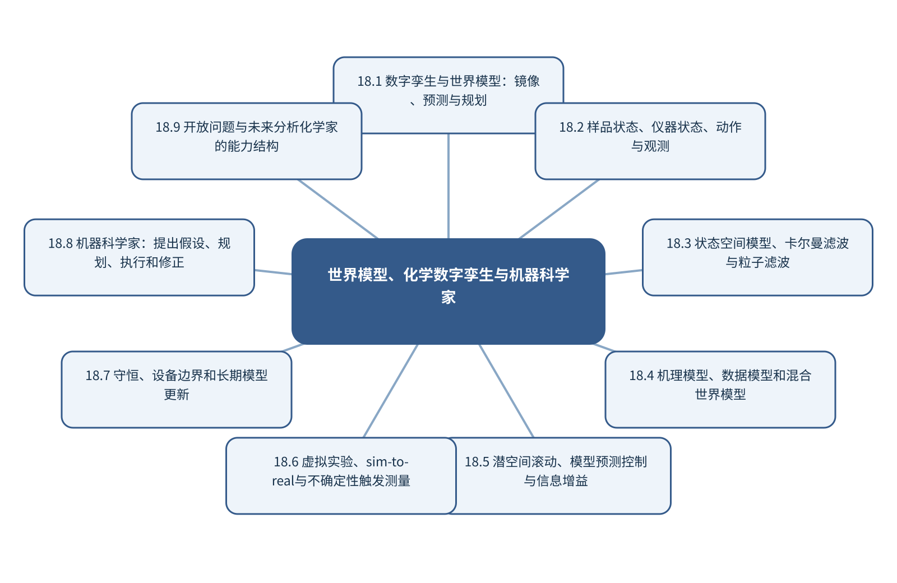

# 第18章 世界模型、化学数字孪生与机器科学家

> 第5篇 科学智能体与自主分析系统　·　建议出版篇幅：24页

## 章首导引

一个系统怎样在内部预测‘如果这样操作，下一步会发生什么’，并据此规划实验？ 本章的回答是：以状态转移模型收束全书，将测量、生成、控制和科学发现统一到可规划模型中。全章以样品状态、仪器状态、动作与观测为对象，坚持“以机理—数据混合模型预测操作后果”，并通过“为连续流反应器建立状态估计和滚动规划”把概念、计算和分析决策连为一体。

## 学习目标

- 能够说明样品状态、仪器状态、动作与观测在本章中的数据结构与主要信息来源。
- 能够解释本章关键方法的输入、输出、参数、假设和失效条件。
- 能够以“以机理—数据混合模型预测操作后果”设计训练、验证和独立测试。
- 能够完成“为连续流反应器建立状态估计和滚动规划”的最小代码实验并分析失败样本。

## 本章知识图谱

## 18.1 数字孪生与世界模型：镜像、预测与规划

本节围绕“数字孪生与世界模型：镜像、预测与规划”展开。分析对象是样品状态、仪器状态、动作与观测，核心不是罗列名词，而是说明仪器仿真和过程仿真、数字孪生的实时镜像、世界模型的动作条件预测、从状态描述到可规划模型怎样进入同一条测量与推断链。读者首先要辨认哪些量来自真实样品，哪些量由仪器转换得到，哪些量由算法估计；三类量若混在一起，模型精度就很难被解释。

在“数字孪生与世界模型：镜像、预测与规划”中，技术路线遵循“以机理—数据混合模型预测操作后果”。具体计算从可诊断的经典基线开始，再增加本节所需的非线性、结构先验或不确定度组件。新增组件必须回答一个明确问题，并在相同数据边界下与基线比较；只有平均分提高而误差结构没有改善，不能构成采用复杂模型的充分理由。

本节把“为连续流反应器建立状态估计和滚动规划”落实到从状态描述到可规划模型这一检查点。验证时保留与未来使用条件一致的独立对象，检查坐标轴、单位、样品身份、批次、参数来源和失败样本。由此得到的结论才可用于下一步测量或实验，而不是停留在一张看似分离良好的图上。

### 18.1.1 仪器仿真和过程仿真

就“仪器仿真和过程仿真”而言，在“数字孪生与世界模型：镜像、预测与规划”中，仪器仿真和过程仿真具体限定了样品状态、仪器状态、动作与观测的一个技术接口。它必须被写成可检查的输入、变换和输出：输入保留样品与仪器条件，变换说明参数从何处估计，输出对应可观察量或候选判断；缺少任何一层，概念就无法进入实验和代码。

把“仪器仿真和过程仿真”用于“数字孪生与世界模型：镜像、预测与规划”时，本书用“为连续流反应器建立状态估计和滚动规划”检验仪器仿真和过程仿真。实现时遵循“以机理—数据混合模型预测操作后果”，先建立经典基线，再对参数敏感性、独立样品和失败对象进行检查。若结果只能在同批数据或单次划分中成立，应把它视为探索性现象而非稳定规律。最终报告需要给出适用范围和拒绝条件，使方法在证据不足时能够停止输出。

### 18.1.2 数字孪生的实时镜像

就“数字孪生的实时镜像”而言，在“数字孪生与世界模型：镜像、预测与规划”中，数字孪生的实时镜像具体限定了样品状态、仪器状态、动作与观测的一个技术接口。它必须被写成可检查的输入、变换和输出：输入保留样品与仪器条件，变换说明参数从何处估计，输出对应可观察量或候选判断；缺少任何一层，概念就无法进入实验和代码。

把“数字孪生的实时镜像”用于“数字孪生与世界模型：镜像、预测与规划”时，本书用“为连续流反应器建立状态估计和滚动规划”检验数字孪生的实时镜像。实现时遵循“以机理—数据混合模型预测操作后果”，先建立经典基线，再对参数敏感性、独立样品和失败对象进行检查。若结果只能在同批数据或单次划分中成立，应把它视为探索性现象而非稳定规律。教学上应把该概念落实为可观察变量、可运行程序和可反驳检验三层。

### 18.1.3 世界模型的动作条件预测

就“世界模型的动作条件预测”而言，在“数字孪生与世界模型：镜像、预测与规划”中，世界模型的动作条件预测具体限定了样品状态、仪器状态、动作与观测的一个技术接口。它必须被写成可检查的输入、变换和输出：输入保留样品与仪器条件，变换说明参数从何处估计，输出对应可观察量或候选判断；缺少任何一层，概念就无法进入实验和代码。

把“世界模型的动作条件预测”用于“数字孪生与世界模型：镜像、预测与规划”时，本书用“为连续流反应器建立状态估计和滚动规划”检验世界模型的动作条件预测。实现时遵循“以机理—数据混合模型预测操作后果”，先建立经典基线，再对参数敏感性、独立样品和失败对象进行检查。若结果只能在同批数据或单次划分中成立，应把它视为探索性现象而非稳定规律。在真实项目中，还应保存参数、软件版本和输入校验结果，以便定位变化来自样品还是计算。

### 18.1.4 从状态描述到可规划模型

就“从状态描述到可规划模型”而言，在“数字孪生与世界模型：镜像、预测与规划”中，从状态描述到可规划模型具体限定了样品状态、仪器状态、动作与观测的一个技术接口。它必须被写成可检查的输入、变换和输出：输入保留样品与仪器条件，变换说明参数从何处估计，输出对应可观察量或候选判断；缺少任何一层，概念就无法进入实验和代码。

把“从状态描述到可规划模型”用于“数字孪生与世界模型：镜像、预测与规划”时，本书用“为连续流反应器建立状态估计和滚动规划”检验从状态描述到可规划模型。实现时遵循“以机理—数据混合模型预测操作后果”，先建立经典基线，再对参数敏感性、独立样品和失败对象进行检查。若结果只能在同批数据或单次划分中成立，应把它视为探索性现象而非稳定规律。若该步骤改变了样品单位、统计独立性或物理峰形，必须在独立数据上重新证明其有效性。

## 18.2 样品状态、仪器状态、动作与观测

本节围绕“样品状态、仪器状态、动作与观测”展开。分析对象是样品状态、仪器状态、动作与观测，核心不是罗列名词，而是说明样品组成、基质和反应状态、仪器、环境和设备状态、动作：功率、时间、流速、电位和位置、观测：谱图、图像、电流和峰表怎样进入同一条测量与推断链。读者首先要辨认哪些量来自真实样品，哪些量由仪器转换得到，哪些量由算法估计；三类量若混在一起，模型精度就很难被解释。

在“样品状态、仪器状态、动作与观测”中，技术路线遵循“以机理—数据混合模型预测操作后果”。具体计算从可诊断的经典基线开始，再增加本节所需的非线性、结构先验或不确定度组件。新增组件必须回答一个明确问题，并在相同数据边界下与基线比较；只有平均分提高而误差结构没有改善，不能构成采用复杂模型的充分理由。

本节把“为连续流反应器建立状态估计和滚动规划”落实到代价和奖励这一检查点。验证时保留与未来使用条件一致的独立对象，检查坐标轴、单位、样品身份、批次、参数来源和失败样本。由此得到的结论才可用于下一步测量或实验，而不是停留在一张看似分离良好的图上。

### 18.2.1 样品组成、基质和反应状态

就“样品组成、基质和反应状态”而言，样品组成、基质和反应状态的目标是判断样品中存在什么，而不是仅把信号分到一个已知类别。可靠识别至少需要选择性响应、参照物或谱库、相似干扰物以及库外样品；若候选集合不完整，最高匹配分只能表示‘在当前库中最相似’，不能等同于身份确认。

把“样品组成、基质和反应状态”用于“样品状态、仪器状态、动作与观测”时，定性流程应把检出、候选筛选和确证分开。检出阶段控制空白和假阳性，筛选阶段报告Top-k候选及分数差，确证阶段依靠保留信息、互补谱学或标准物质。模型还应设置拒识阈值，避免对训练分布之外的样品强行命名。最终报告需要给出适用范围和拒绝条件，使方法在证据不足时能够停止输出。

### 18.2.2 仪器、环境和设备状态

就“仪器、环境和设备状态”而言，在“样品状态、仪器状态、动作与观测”中，仪器、环境和设备状态具体限定了样品状态、仪器状态、动作与观测的一个技术接口。它必须被写成可检查的输入、变换和输出：输入保留样品与仪器条件，变换说明参数从何处估计，输出对应可观察量或候选判断；缺少任何一层，概念就无法进入实验和代码。

把“仪器、环境和设备状态”用于“样品状态、仪器状态、动作与观测”时，本书用“为连续流反应器建立状态估计和滚动规划”检验仪器、环境和设备状态。实现时遵循“以机理—数据混合模型预测操作后果”，先建立经典基线，再对参数敏感性、独立样品和失败对象进行检查。若结果只能在同批数据或单次划分中成立，应把它视为探索性现象而非稳定规律。教学上应把该概念落实为可观察变量、可运行程序和可反驳检验三层。

### 18.2.3 动作：功率、时间、流速、电位和位置

就“动作：功率、时间、流速、电位和位置”而言，动作：功率、时间、流速、电位和位置要求测量时间尺度快于被研究过程的关键变化。采样、传质、仪器响应和数据处理都可能造成时间延迟；若响应时间与反应时间相当，记录到的曲线是系统动力学与仪器核的卷积。

把“动作：功率、时间、流速、电位和位置”用于“样品状态、仪器状态、动作与观测”时，建模时应保存真实时间戳、同步误差和操作事件，避免把等间隔文件序号当作真实时间。对于在线控制，还要区分毫秒级设备反馈与分钟级科学决策，并用状态估计处理不可直接观察的化学状态。在真实项目中，还应保存参数、软件版本和输入校验结果，以便定位变化来自样品还是计算。

### 18.2.4 观测：谱图、图像、电流和峰表

就“观测：谱图、图像、电流和峰表”而言，围绕“观测：谱图、图像、电流和峰表”，分子图以原子为节点、化学键为空间关系。消息传递网络在每一层聚合邻居信息并更新节点表示，多层传播扩大感受野。全局池化把节点表示汇总为分子级向量。

把“观测：谱图、图像、电流和峰表”用于“样品状态、仪器状态、动作与观测”时，在“样品状态、仪器状态、动作与观测”的语境下，二维图不能完整表达构象和空间相互作用。使用距离、角度或等变网络可以处理三维几何；SE(3)等变性要求模型输出随旋转和平移按物理规律变化。构象生成、温度和质子化态仍是输入不确定性的来源。若该步骤改变了样品单位、统计独立性或物理峰形，必须在独立数据上重新证明其有效性。

### 18.2.5 代价和奖励

就“代价和奖励”而言，围绕“代价和奖励”，马尔可夫决策过程由状态、动作、转移、奖励和折扣因子构成。策略选择动作，环境返回新状态和奖励。强化学习优化长期累计回报，因此奖励函数实际定义了系统追求的目标。

把“代价和奖励”用于“样品状态、仪器状态、动作与观测”时，在“样品状态、仪器状态、动作与观测”的语境下，奖励设计不完整会产生奖励投机。例如只奖励预测产率可能诱导不可合成或不安全条件。化学任务应把硬安全约束放在动作空间和执行层，把成本、信息量和质量作为多目标评价，并保留人工审批。读图或读指标时应返回原始数据抽查，避免把表示空间中的几何关系直接当成化学机制。

## 18.3 状态空间模型、卡尔曼滤波与粒子滤波

本节围绕“状态空间模型、卡尔曼滤波与粒子滤波”展开。分析对象是样品状态、仪器状态、动作与观测，核心不是罗列名词，而是说明隐藏状态和观测模型、状态转移模型、卡尔曼滤波、扩展/无迹卡尔曼滤波怎样进入同一条测量与推断链。读者首先要辨认哪些量来自真实样品，哪些量由仪器转换得到，哪些量由算法估计；三类量若混在一起，模型精度就很难被解释。

在“状态空间模型、卡尔曼滤波与粒子滤波”中，技术路线遵循“以机理—数据混合模型预测操作后果”。具体计算从可诊断的经典基线开始，再增加本节所需的非线性、结构先验或不确定度组件。新增组件必须回答一个明确问题，并在相同数据边界下与基线比较；只有平均分提高而误差结构没有改善，不能构成采用复杂模型的充分理由。

本节把“为连续流反应器建立状态估计和滚动规划”落实到粒子滤波和多峰状态这一检查点。验证时保留与未来使用条件一致的独立对象，检查坐标轴、单位、样品身份、批次、参数来源和失败样本。由此得到的结论才可用于下一步测量或实验，而不是停留在一张看似分离良好的图上。

### 18.3.1 隐藏状态和观测模型

就“隐藏状态和观测模型”而言，在“状态空间模型、卡尔曼滤波与粒子滤波”中，隐藏状态和观测模型具体限定了样品状态、仪器状态、动作与观测的一个技术接口。它必须被写成可检查的输入、变换和输出：输入保留样品与仪器条件，变换说明参数从何处估计，输出对应可观察量或候选判断；缺少任何一层，概念就无法进入实验和代码。

把“隐藏状态和观测模型”用于“状态空间模型、卡尔曼滤波与粒子滤波”时，本书用“为连续流反应器建立状态估计和滚动规划”检验隐藏状态和观测模型。实现时遵循“以机理—数据混合模型预测操作后果”，先建立经典基线，再对参数敏感性、独立样品和失败对象进行检查。若结果只能在同批数据或单次划分中成立，应把它视为探索性现象而非稳定规律。最终报告需要给出适用范围和拒绝条件，使方法在证据不足时能够停止输出。

### 18.3.2 状态转移模型

就“状态转移模型”而言，在“状态空间模型、卡尔曼滤波与粒子滤波”中，状态转移模型具体限定了样品状态、仪器状态、动作与观测的一个技术接口。它必须被写成可检查的输入、变换和输出：输入保留样品与仪器条件，变换说明参数从何处估计，输出对应可观察量或候选判断；缺少任何一层，概念就无法进入实验和代码。

把“状态转移模型”用于“状态空间模型、卡尔曼滤波与粒子滤波”时，本书用“为连续流反应器建立状态估计和滚动规划”检验状态转移模型。实现时遵循“以机理—数据混合模型预测操作后果”，先建立经典基线，再对参数敏感性、独立样品和失败对象进行检查。若结果只能在同批数据或单次划分中成立，应把它视为探索性现象而非稳定规律。教学上应把该概念落实为可观察变量、可运行程序和可反驳检验三层。

### 18.3.3 卡尔曼滤波

就“卡尔曼滤波”而言，围绕“卡尔曼滤波”，世界模型区分隐藏状态s、观测o、动作a和状态转移。观测只是状态经传感器投影后的结果，智能体需要根据历史观测估计当前状态，再预测候选动作的后果。卡尔曼滤波适合近似线性高斯系统，粒子滤波可表示非线性和多峰分布。

把“卡尔曼滤波”用于“状态空间模型、卡尔曼滤波与粒子滤波”时，在“状态空间模型、卡尔曼滤波与粒子滤波”的语境下，MPC在模型中滚动多个动作序列，优化有限时域目标，只执行第一步后便用新观测重新规划。这样可限制长时预测误差。化学世界模型还应满足非负浓度、质量守恒、温压边界和设备约束，并在不确定性过高时请求真实测量。在真实项目中，还应保存参数、软件版本和输入校验结果，以便定位变化来自样品还是计算。

### 18.3.4 扩展/无迹卡尔曼滤波

就“扩展/无迹卡尔曼滤波”而言，围绕“扩展/无迹卡尔曼滤波”，世界模型区分隐藏状态s、观测o、动作a和状态转移。观测只是状态经传感器投影后的结果，智能体需要根据历史观测估计当前状态，再预测候选动作的后果。卡尔曼滤波适合近似线性高斯系统，粒子滤波可表示非线性和多峰分布。

把“扩展/无迹卡尔曼滤波”用于“状态空间模型、卡尔曼滤波与粒子滤波”时，在“状态空间模型、卡尔曼滤波与粒子滤波”的语境下，MPC在模型中滚动多个动作序列，优化有限时域目标，只执行第一步后便用新观测重新规划。这样可限制长时预测误差。化学世界模型还应满足非负浓度、质量守恒、温压边界和设备约束，并在不确定性过高时请求真实测量。若该步骤改变了样品单位、统计独立性或物理峰形，必须在独立数据上重新证明其有效性。

### 18.3.5 粒子滤波和多峰状态

就“粒子滤波和多峰状态”而言，围绕“粒子滤波和多峰状态”，世界模型区分隐藏状态s、观测o、动作a和状态转移。观测只是状态经传感器投影后的结果，智能体需要根据历史观测估计当前状态，再预测候选动作的后果。卡尔曼滤波适合近似线性高斯系统，粒子滤波可表示非线性和多峰分布。

把“粒子滤波和多峰状态”用于“状态空间模型、卡尔曼滤波与粒子滤波”时，在“状态空间模型、卡尔曼滤波与粒子滤波”的语境下，MPC在模型中滚动多个动作序列，优化有限时域目标，只执行第一步后便用新观测重新规划。这样可限制长时预测误差。化学世界模型还应满足非负浓度、质量守恒、温压边界和设备约束，并在不确定性过高时请求真实测量。读图或读指标时应返回原始数据抽查，避免把表示空间中的几何关系直接当成化学机制。

## 18.4 机理模型、数据模型和混合世界模型

本节围绕“机理模型、数据模型和混合世界模型”展开。分析对象是样品状态、仪器状态、动作与观测，核心不是罗列名词，而是说明质量守恒和动力学模型、数据驱动残差模型、参数辨识和结构误差、机理—数据混合世界模型怎样进入同一条测量与推断链。读者首先要辨认哪些量来自真实样品，哪些量由仪器转换得到，哪些量由算法估计；三类量若混在一起，模型精度就很难被解释。

在“机理模型、数据模型和混合世界模型”中，技术路线遵循“以机理—数据混合模型预测操作后果”。具体计算从可诊断的经典基线开始，再增加本节所需的非线性、结构先验或不确定度组件。新增组件必须回答一个明确问题，并在相同数据边界下与基线比较；只有平均分提高而误差结构没有改善，不能构成采用复杂模型的充分理由。

本节把“为连续流反应器建立状态估计和滚动规划”落实到不确定度分解这一检查点。验证时保留与未来使用条件一致的独立对象，检查坐标轴、单位、样品身份、批次、参数来源和失败样本。由此得到的结论才可用于下一步测量或实验，而不是停留在一张看似分离良好的图上。

### 18.4.1 质量守恒和动力学模型

就“质量守恒和动力学模型”而言，在“机理模型、数据模型和混合世界模型”中，质量守恒和动力学模型具体限定了样品状态、仪器状态、动作与观测的一个技术接口。它必须被写成可检查的输入、变换和输出：输入保留样品与仪器条件，变换说明参数从何处估计，输出对应可观察量或候选判断；缺少任何一层，概念就无法进入实验和代码。

把“质量守恒和动力学模型”用于“机理模型、数据模型和混合世界模型”时，本书用“为连续流反应器建立状态估计和滚动规划”检验质量守恒和动力学模型。实现时遵循“以机理—数据混合模型预测操作后果”，先建立经典基线，再对参数敏感性、独立样品和失败对象进行检查。若结果只能在同批数据或单次划分中成立，应把它视为探索性现象而非稳定规律。最终报告需要给出适用范围和拒绝条件，使方法在证据不足时能够停止输出。

### 18.4.2 数据驱动残差模型

就“数据驱动残差模型”而言，数据驱动残差模型决定数字能否被重新解释。仅保存强度矩阵会丢失坐标轴、单位、采样间隔、样品身份、仪器参数和校准状态；这些信息一旦脱离原始信号，后续很难判断变化来自化学对象还是采集条件。

把“数据驱动残差模型”用于“机理模型、数据模型和混合世界模型”时，推荐把原始文件设为只读，以持久样品标识连接实验表和信号文件，并为每次转换记录脚本版本、参数和校验码。单位转换、重采样与轴反向属于会改变数值含义的操作，必须在数据进入模型前自动检查。教学上应把该概念落实为可观察变量、可运行程序和可反驳检验三层。

### 18.4.3 参数辨识和结构误差

就“参数辨识和结构误差”而言，围绕“参数辨识和结构误差”，随机误差反映重复测量的波动，系统偏差使结果稳定地偏离参照，不确定度则量化在现有知识下结果可能处于的范围。三者属于不同概念。高重复性不代表无偏，模型测试误差很低也不代表参照标签准确。

把“参数辨识和结构误差”用于“机理模型、数据模型和混合世界模型”时，在“机理模型、数据模型和混合世界模型”的语境下，不确定度应沿采样、制样、校准、仪器、预处理和模型逐步传播。对于线性关系可使用一阶误差传播，对于明显非线性或参数相关的系统可使用蒙特卡洛抽样。报告时应给出覆盖概率、区间构造方法和适用条件，而不是只给一个小数位很多的点估计。在真实项目中，还应保存参数、软件版本和输入校验结果，以便定位变化来自样品还是计算。

### 18.4.4 机理—数据混合世界模型

就“机理—数据混合世界模型”而言，机理—数据混合世界模型决定数字能否被重新解释。仅保存强度矩阵会丢失坐标轴、单位、采样间隔、样品身份、仪器参数和校准状态；这些信息一旦脱离原始信号，后续很难判断变化来自化学对象还是采集条件。

把“机理—数据混合世界模型”用于“机理模型、数据模型和混合世界模型”时，推荐把原始文件设为只读，以持久样品标识连接实验表和信号文件，并为每次转换记录脚本版本、参数和校验码。单位转换、重采样与轴反向属于会改变数值含义的操作，必须在数据进入模型前自动检查。若该步骤改变了样品单位、统计独立性或物理峰形，必须在独立数据上重新证明其有效性。

### 18.4.5 不确定度分解

就“不确定度分解”而言，围绕“不确定度分解”，随机误差反映重复测量的波动，系统偏差使结果稳定地偏离参照，不确定度则量化在现有知识下结果可能处于的范围。三者属于不同概念。高重复性不代表无偏，模型测试误差很低也不代表参照标签准确。

把“不确定度分解”用于“机理模型、数据模型和混合世界模型”时，在“机理模型、数据模型和混合世界模型”的语境下，不确定度应沿采样、制样、校准、仪器、预处理和模型逐步传播。对于线性关系可使用一阶误差传播，对于明显非线性或参数相关的系统可使用蒙特卡洛抽样。报告时应给出覆盖概率、区间构造方法和适用条件，而不是只给一个小数位很多的点估计。读图或读指标时应返回原始数据抽查，避免把表示空间中的几何关系直接当成化学机制。

## 18.5 潜空间滚动、模型预测控制与信息增益

本节围绕“潜空间滚动、模型预测控制与信息增益”展开。分析对象是样品状态、仪器状态、动作与观测，核心不是罗列名词，而是说明候选动作序列、有限时域目标和约束、模型预测控制MPC、潜空间滚动怎样进入同一条测量与推断链。读者首先要辨认哪些量来自真实样品，哪些量由仪器转换得到，哪些量由算法估计；三类量若混在一起，模型精度就很难被解释。

在“潜空间滚动、模型预测控制与信息增益”中，技术路线遵循“以机理—数据混合模型预测操作后果”。具体计算从可诊断的经典基线开始，再增加本节所需的非线性、结构先验或不确定度组件。新增组件必须回答一个明确问题，并在相同数据边界下与基线比较；只有平均分提高而误差结构没有改善，不能构成采用复杂模型的充分理由。

本节把“为连续流反应器建立状态估计和滚动规划”落实到信息增益型实验规划这一检查点。验证时保留与未来使用条件一致的独立对象，检查坐标轴、单位、样品身份、批次、参数来源和失败样本。由此得到的结论才可用于下一步测量或实验，而不是停留在一张看似分离良好的图上。

### 18.5.1 候选动作序列

就“候选动作序列”而言，在“潜空间滚动、模型预测控制与信息增益”中，候选动作序列具体限定了样品状态、仪器状态、动作与观测的一个技术接口。它必须被写成可检查的输入、变换和输出：输入保留样品与仪器条件，变换说明参数从何处估计，输出对应可观察量或候选判断；缺少任何一层，概念就无法进入实验和代码。

把“候选动作序列”用于“潜空间滚动、模型预测控制与信息增益”时，本书用“为连续流反应器建立状态估计和滚动规划”检验候选动作序列。实现时遵循“以机理—数据混合模型预测操作后果”，先建立经典基线，再对参数敏感性、独立样品和失败对象进行检查。若结果只能在同批数据或单次划分中成立，应把它视为探索性现象而非稳定规律。最终报告需要给出适用范围和拒绝条件，使方法在证据不足时能够停止输出。

### 18.5.2 有限时域目标和约束

就“有限时域目标和约束”而言，在“潜空间滚动、模型预测控制与信息增益”中，有限时域目标和约束具体限定了样品状态、仪器状态、动作与观测的一个技术接口。它必须被写成可检查的输入、变换和输出：输入保留样品与仪器条件，变换说明参数从何处估计，输出对应可观察量或候选判断；缺少任何一层，概念就无法进入实验和代码。

把“有限时域目标和约束”用于“潜空间滚动、模型预测控制与信息增益”时，本书用“为连续流反应器建立状态估计和滚动规划”检验有限时域目标和约束。实现时遵循“以机理—数据混合模型预测操作后果”，先建立经典基线，再对参数敏感性、独立样品和失败对象进行检查。若结果只能在同批数据或单次划分中成立，应把它视为探索性现象而非稳定规律。教学上应把该概念落实为可观察变量、可运行程序和可反驳检验三层。

### 18.5.3 模型预测控制MPC

就“模型预测控制MPC”而言，围绕“模型预测控制MPC”，世界模型区分隐藏状态s、观测o、动作a和状态转移。观测只是状态经传感器投影后的结果，智能体需要根据历史观测估计当前状态，再预测候选动作的后果。卡尔曼滤波适合近似线性高斯系统，粒子滤波可表示非线性和多峰分布。

把“模型预测控制MPC”用于“潜空间滚动、模型预测控制与信息增益”时，在“潜空间滚动、模型预测控制与信息增益”的语境下，MPC在模型中滚动多个动作序列，优化有限时域目标，只执行第一步后便用新观测重新规划。这样可限制长时预测误差。化学世界模型还应满足非负浓度、质量守恒、温压边界和设备约束，并在不确定性过高时请求真实测量。在真实项目中，还应保存参数、软件版本和输入校验结果，以便定位变化来自样品还是计算。

### 18.5.4 潜空间滚动

就“潜空间滚动”而言，围绕“潜空间滚动”，世界模型区分隐藏状态s、观测o、动作a和状态转移。观测只是状态经传感器投影后的结果，智能体需要根据历史观测估计当前状态，再预测候选动作的后果。卡尔曼滤波适合近似线性高斯系统，粒子滤波可表示非线性和多峰分布。

把“潜空间滚动”用于“潜空间滚动、模型预测控制与信息增益”时，在“潜空间滚动、模型预测控制与信息增益”的语境下，MPC在模型中滚动多个动作序列，优化有限时域目标，只执行第一步后便用新观测重新规划。这样可限制长时预测误差。化学世界模型还应满足非负浓度、质量守恒、温压边界和设备约束，并在不确定性过高时请求真实测量。若该步骤改变了样品单位、统计独立性或物理峰形，必须在独立数据上重新证明其有效性。

### 18.5.5 只执行首步与重新规划

就“只执行首步与重新规划”而言，在“潜空间滚动、模型预测控制与信息增益”中，只执行首步与重新规划具体限定了样品状态、仪器状态、动作与观测的一个技术接口。它必须被写成可检查的输入、变换和输出：输入保留样品与仪器条件，变换说明参数从何处估计，输出对应可观察量或候选判断；缺少任何一层，概念就无法进入实验和代码。

把“只执行首步与重新规划”用于“潜空间滚动、模型预测控制与信息增益”时，本书用“为连续流反应器建立状态估计和滚动规划”检验只执行首步与重新规划。实现时遵循“以机理—数据混合模型预测操作后果”，先建立经典基线，再对参数敏感性、独立样品和失败对象进行检查。若结果只能在同批数据或单次划分中成立，应把它视为探索性现象而非稳定规律。读图或读指标时应返回原始数据抽查，避免把表示空间中的几何关系直接当成化学机制。

### 18.5.6 信息增益型实验规划

就“信息增益型实验规划”而言，在“潜空间滚动、模型预测控制与信息增益”中，信息增益型实验规划具体限定了样品状态、仪器状态、动作与观测的一个技术接口。它必须被写成可检查的输入、变换和输出：输入保留样品与仪器条件，变换说明参数从何处估计，输出对应可观察量或候选判断；缺少任何一层，概念就无法进入实验和代码。

把“信息增益型实验规划”用于“潜空间滚动、模型预测控制与信息增益”时，本书用“为连续流反应器建立状态估计和滚动规划”检验信息增益型实验规划。实现时遵循“以机理—数据混合模型预测操作后果”，先建立经典基线，再对参数敏感性、独立样品和失败对象进行检查。若结果只能在同批数据或单次划分中成立，应把它视为探索性现象而非稳定规律。最终报告需要给出适用范围和拒绝条件，使方法在证据不足时能够停止输出。

## 18.6 虚拟实验、sim-to-real与不确定性触发测量

本节围绕“虚拟实验、sim-to-real与不确定性触发测量”展开。分析对象是样品状态、仪器状态、动作与观测，核心不是罗列名词，而是说明虚拟实验和大规模筛选、仿真器偏差、域随机化和系统辨识、sim-to-real迁移怎样进入同一条测量与推断链。读者首先要辨认哪些量来自真实样品，哪些量由仪器转换得到，哪些量由算法估计；三类量若混在一起，模型精度就很难被解释。

在“虚拟实验、sim-to-real与不确定性触发测量”中，技术路线遵循“以机理—数据混合模型预测操作后果”。具体计算从可诊断的经典基线开始，再增加本节所需的非线性、结构先验或不确定度组件。新增组件必须回答一个明确问题，并在相同数据边界下与基线比较；只有平均分提高而误差结构没有改善，不能构成采用复杂模型的充分理由。

本节把“为连续流反应器建立状态估计和滚动规划”落实到现实测量触发条件这一检查点。验证时保留与未来使用条件一致的独立对象，检查坐标轴、单位、样品身份、批次、参数来源和失败样本。由此得到的结论才可用于下一步测量或实验，而不是停留在一张看似分离良好的图上。

### 18.6.1 虚拟实验和大规模筛选

就“虚拟实验和大规模筛选”而言，在“虚拟实验、sim-to-real与不确定性触发测量”中，虚拟实验和大规模筛选具体限定了样品状态、仪器状态、动作与观测的一个技术接口。它必须被写成可检查的输入、变换和输出：输入保留样品与仪器条件，变换说明参数从何处估计，输出对应可观察量或候选判断；缺少任何一层，概念就无法进入实验和代码。

把“虚拟实验和大规模筛选”用于“虚拟实验、sim-to-real与不确定性触发测量”时，本书用“为连续流反应器建立状态估计和滚动规划”检验虚拟实验和大规模筛选。实现时遵循“以机理—数据混合模型预测操作后果”，先建立经典基线，再对参数敏感性、独立样品和失败对象进行检查。若结果只能在同批数据或单次划分中成立，应把它视为探索性现象而非稳定规律。最终报告需要给出适用范围和拒绝条件，使方法在证据不足时能够停止输出。

### 18.6.2 仿真器偏差

就“仿真器偏差”而言，围绕“仿真器偏差”，随机误差反映重复测量的波动，系统偏差使结果稳定地偏离参照，不确定度则量化在现有知识下结果可能处于的范围。三者属于不同概念。高重复性不代表无偏，模型测试误差很低也不代表参照标签准确。

把“仿真器偏差”用于“虚拟实验、sim-to-real与不确定性触发测量”时，在“虚拟实验、sim-to-real与不确定性触发测量”的语境下，不确定度应沿采样、制样、校准、仪器、预处理和模型逐步传播。对于线性关系可使用一阶误差传播，对于明显非线性或参数相关的系统可使用蒙特卡洛抽样。报告时应给出覆盖概率、区间构造方法和适用条件，而不是只给一个小数位很多的点估计。教学上应把该概念落实为可观察变量、可运行程序和可反驳检验三层。

### 18.6.3 域随机化和系统辨识

就“域随机化和系统辨识”而言，在“虚拟实验、sim-to-real与不确定性触发测量”中，域随机化和系统辨识具体限定了样品状态、仪器状态、动作与观测的一个技术接口。它必须被写成可检查的输入、变换和输出：输入保留样品与仪器条件，变换说明参数从何处估计，输出对应可观察量或候选判断；缺少任何一层，概念就无法进入实验和代码。

把“域随机化和系统辨识”用于“虚拟实验、sim-to-real与不确定性触发测量”时，本书用“为连续流反应器建立状态估计和滚动规划”检验域随机化和系统辨识。实现时遵循“以机理—数据混合模型预测操作后果”，先建立经典基线，再对参数敏感性、独立样品和失败对象进行检查。若结果只能在同批数据或单次划分中成立，应把它视为探索性现象而非稳定规律。在真实项目中，还应保存参数、软件版本和输入校验结果，以便定位变化来自样品还是计算。

### 18.6.4 sim-to-real迁移

就“sim-to-real迁移”而言，在“虚拟实验、sim-to-real与不确定性触发测量”中，sim-to-real迁移具体限定了样品状态、仪器状态、动作与观测的一个技术接口。它必须被写成可检查的输入、变换和输出：输入保留样品与仪器条件，变换说明参数从何处估计，输出对应可观察量或候选判断；缺少任何一层，概念就无法进入实验和代码。

把“sim-to-real迁移”用于“虚拟实验、sim-to-real与不确定性触发测量”时，本书用“为连续流反应器建立状态估计和滚动规划”检验sim-to-real迁移。实现时遵循“以机理—数据混合模型预测操作后果”，先建立经典基线，再对参数敏感性、独立样品和失败对象进行检查。若结果只能在同批数据或单次划分中成立，应把它视为探索性现象而非稳定规律。若该步骤改变了样品单位、统计独立性或物理峰形，必须在独立数据上重新证明其有效性。

### 18.6.5 现实测量触发条件

就“现实测量触发条件”而言，在“虚拟实验、sim-to-real与不确定性触发测量”中，现实测量触发条件具体限定了样品状态、仪器状态、动作与观测的一个技术接口。它必须被写成可检查的输入、变换和输出：输入保留样品与仪器条件，变换说明参数从何处估计，输出对应可观察量或候选判断；缺少任何一层，概念就无法进入实验和代码。

把“现实测量触发条件”用于“虚拟实验、sim-to-real与不确定性触发测量”时，本书用“为连续流反应器建立状态估计和滚动规划”检验现实测量触发条件。实现时遵循“以机理—数据混合模型预测操作后果”，先建立经典基线，再对参数敏感性、独立样品和失败对象进行检查。若结果只能在同批数据或单次划分中成立，应把它视为探索性现象而非稳定规律。读图或读指标时应返回原始数据抽查，避免把表示空间中的几何关系直接当成化学机制。

## 18.7 守恒、设备边界和长期模型更新

本节围绕“守恒、设备边界和长期模型更新”展开。分析对象是样品状态、仪器状态、动作与观测，核心不是罗列名词，而是说明非负、守恒和设备边界、长时滚动误差、漂移监测和在线更新、模型版本、回退和再校准怎样进入同一条测量与推断链。读者首先要辨认哪些量来自真实样品，哪些量由仪器转换得到，哪些量由算法估计；三类量若混在一起，模型精度就很难被解释。

在“守恒、设备边界和长期模型更新”中，技术路线遵循“以机理—数据混合模型预测操作后果”。具体计算从可诊断的经典基线开始，再增加本节所需的非线性、结构先验或不确定度组件。新增组件必须回答一个明确问题，并在相同数据边界下与基线比较；只有平均分提高而误差结构没有改善，不能构成采用复杂模型的充分理由。

本节把“为连续流反应器建立状态估计和滚动规划”落实到跨实验室数字孪生这一检查点。验证时保留与未来使用条件一致的独立对象，检查坐标轴、单位、样品身份、批次、参数来源和失败样本。由此得到的结论才可用于下一步测量或实验，而不是停留在一张看似分离良好的图上。

### 18.7.1 非负、守恒和设备边界

就“非负、守恒和设备边界”而言，在“守恒、设备边界和长期模型更新”中，非负、守恒和设备边界具体限定了样品状态、仪器状态、动作与观测的一个技术接口。它必须被写成可检查的输入、变换和输出：输入保留样品与仪器条件，变换说明参数从何处估计，输出对应可观察量或候选判断；缺少任何一层，概念就无法进入实验和代码。

把“非负、守恒和设备边界”用于“守恒、设备边界和长期模型更新”时，本书用“为连续流反应器建立状态估计和滚动规划”检验非负、守恒和设备边界。实现时遵循“以机理—数据混合模型预测操作后果”，先建立经典基线，再对参数敏感性、独立样品和失败对象进行检查。若结果只能在同批数据或单次划分中成立，应把它视为探索性现象而非稳定规律。最终报告需要给出适用范围和拒绝条件，使方法在证据不足时能够停止输出。

### 18.7.2 长时滚动误差

就“长时滚动误差”而言，围绕“长时滚动误差”，随机误差反映重复测量的波动，系统偏差使结果稳定地偏离参照，不确定度则量化在现有知识下结果可能处于的范围。三者属于不同概念。高重复性不代表无偏，模型测试误差很低也不代表参照标签准确。

把“长时滚动误差”用于“守恒、设备边界和长期模型更新”时，在“守恒、设备边界和长期模型更新”的语境下，不确定度应沿采样、制样、校准、仪器、预处理和模型逐步传播。对于线性关系可使用一阶误差传播，对于明显非线性或参数相关的系统可使用蒙特卡洛抽样。报告时应给出覆盖概率、区间构造方法和适用条件，而不是只给一个小数位很多的点估计。教学上应把该概念落实为可观察变量、可运行程序和可反驳检验三层。

### 18.7.3 漂移监测和在线更新

就“漂移监测和在线更新”而言，漂移监测和在线更新要求测量时间尺度快于被研究过程的关键变化。采样、传质、仪器响应和数据处理都可能造成时间延迟；若响应时间与反应时间相当，记录到的曲线是系统动力学与仪器核的卷积。

把“漂移监测和在线更新”用于“守恒、设备边界和长期模型更新”时，建模时应保存真实时间戳、同步误差和操作事件，避免把等间隔文件序号当作真实时间。对于在线控制，还要区分毫秒级设备反馈与分钟级科学决策，并用状态估计处理不可直接观察的化学状态。在真实项目中，还应保存参数、软件版本和输入校验结果，以便定位变化来自样品还是计算。

### 18.7.4 模型版本、回退和再校准

就“模型版本、回退和再校准”而言，围绕“模型版本、回退和再校准”，精确率关注预测为阳性的样品中有多少真正阳性，召回率关注真正阳性中有多少被检出，F1是二者的调和平均。类别极不平衡时，PR曲线比ROC曲线更能反映少数类识别的实际难度。

把“模型版本、回退和再校准”用于“守恒、设备边界和长期模型更新”时，在“守恒、设备边界和长期模型更新”的语境下，概率校准回答预测概率是否与实际发生率一致。Brier分数同时受到判别和校准影响；可靠性图可显示模型过度自信或过度保守。阈值应根据漏检和误报代价确定，而不是固定在0.5。若该步骤改变了样品单位、统计独立性或物理峰形，必须在独立数据上重新证明其有效性。

### 18.7.5 跨实验室数字孪生

就“跨实验室数字孪生”而言，在“守恒、设备边界和长期模型更新”中，跨实验室数字孪生具体限定了样品状态、仪器状态、动作与观测的一个技术接口。它必须被写成可检查的输入、变换和输出：输入保留样品与仪器条件，变换说明参数从何处估计，输出对应可观察量或候选判断；缺少任何一层，概念就无法进入实验和代码。

把“跨实验室数字孪生”用于“守恒、设备边界和长期模型更新”时，本书用“为连续流反应器建立状态估计和滚动规划”检验跨实验室数字孪生。实现时遵循“以机理—数据混合模型预测操作后果”，先建立经典基线，再对参数敏感性、独立样品和失败对象进行检查。若结果只能在同批数据或单次划分中成立，应把它视为探索性现象而非稳定规律。读图或读指标时应返回原始数据抽查，避免把表示空间中的几何关系直接当成化学机制。

## 18.8 机器科学家：提出假设、规划、执行和修正

本节围绕“机器科学家：提出假设、规划、执行和修正”展开。分析对象是样品状态、仪器状态、动作与观测，核心不是罗列名词，而是说明假设生成与候选机制、判别实验规划、自动执行和证据更新、否定结果和模型修正怎样进入同一条测量与推断链。读者首先要辨认哪些量来自真实样品，哪些量由仪器转换得到，哪些量由算法估计；三类量若混在一起，模型精度就很难被解释。

在“机器科学家：提出假设、规划、执行和修正”中，技术路线遵循“以机理—数据混合模型预测操作后果”。具体计算从可诊断的经典基线开始，再增加本节所需的非线性、结构先验或不确定度组件。新增组件必须回答一个明确问题，并在相同数据边界下与基线比较；只有平均分提高而误差结构没有改善，不能构成采用复杂模型的充分理由。

本节把“为连续流反应器建立状态估计和滚动规划”落实到人机共同定义科学问题这一检查点。验证时保留与未来使用条件一致的独立对象，检查坐标轴、单位、样品身份、批次、参数来源和失败样本。由此得到的结论才可用于下一步测量或实验，而不是停留在一张看似分离良好的图上。

### 18.8.1 假设生成与候选机制

就“假设生成与候选机制”而言，假设生成与候选机制属于从观测反推对象的逆问题，常存在多解性。同一峰可由多个结构片段贡献，同一空间热点也可能受厚度、照明或离子抑制影响；因此模型输出首先是候选解释，而不是自动成立的机制。

把“假设生成与候选机制”用于“机器科学家：提出假设、规划、执行和修正”时，可信解释需要至少一条独立证据链：改变实验条件观察可预测响应、使用互补仪器验证候选，或以标准物质复现特征。显著性图、注意力和SHAP可定位模型依赖，却不能替代干预和机理实验。最终报告需要给出适用范围和拒绝条件，使方法在证据不足时能够停止输出。

### 18.8.2 判别实验规划

就“判别实验规划”而言，在“机器科学家：提出假设、规划、执行和修正”中，判别实验规划具体限定了样品状态、仪器状态、动作与观测的一个技术接口。它必须被写成可检查的输入、变换和输出：输入保留样品与仪器条件，变换说明参数从何处估计，输出对应可观察量或候选判断；缺少任何一层，概念就无法进入实验和代码。

把“判别实验规划”用于“机器科学家：提出假设、规划、执行和修正”时，本书用“为连续流反应器建立状态估计和滚动规划”检验判别实验规划。实现时遵循“以机理—数据混合模型预测操作后果”，先建立经典基线，再对参数敏感性、独立样品和失败对象进行检查。若结果只能在同批数据或单次划分中成立，应把它视为探索性现象而非稳定规律。教学上应把该概念落实为可观察变量、可运行程序和可反驳检验三层。

### 18.8.3 自动执行和证据更新

就“自动执行和证据更新”而言，在“机器科学家：提出假设、规划、执行和修正”中，自动执行和证据更新具体限定了样品状态、仪器状态、动作与观测的一个技术接口。它必须被写成可检查的输入、变换和输出：输入保留样品与仪器条件，变换说明参数从何处估计，输出对应可观察量或候选判断；缺少任何一层，概念就无法进入实验和代码。

把“自动执行和证据更新”用于“机器科学家：提出假设、规划、执行和修正”时，本书用“为连续流反应器建立状态估计和滚动规划”检验自动执行和证据更新。实现时遵循“以机理—数据混合模型预测操作后果”，先建立经典基线，再对参数敏感性、独立样品和失败对象进行检查。若结果只能在同批数据或单次划分中成立，应把它视为探索性现象而非稳定规律。在真实项目中，还应保存参数、软件版本和输入校验结果，以便定位变化来自样品还是计算。

### 18.8.4 否定结果和模型修正

就“否定结果和模型修正”而言，在“机器科学家：提出假设、规划、执行和修正”中，否定结果和模型修正具体限定了样品状态、仪器状态、动作与观测的一个技术接口。它必须被写成可检查的输入、变换和输出：输入保留样品与仪器条件，变换说明参数从何处估计，输出对应可观察量或候选判断；缺少任何一层，概念就无法进入实验和代码。

把“否定结果和模型修正”用于“机器科学家：提出假设、规划、执行和修正”时，本书用“为连续流反应器建立状态估计和滚动规划”检验否定结果和模型修正。实现时遵循“以机理—数据混合模型预测操作后果”，先建立经典基线，再对参数敏感性、独立样品和失败对象进行检查。若结果只能在同批数据或单次划分中成立，应把它视为探索性现象而非稳定规律。若该步骤改变了样品单位、统计独立性或物理峰形，必须在独立数据上重新证明其有效性。

### 18.8.5 人机共同定义科学问题

就“人机共同定义科学问题”而言，在“机器科学家：提出假设、规划、执行和修正”中，人机共同定义科学问题具体限定了样品状态、仪器状态、动作与观测的一个技术接口。它必须被写成可检查的输入、变换和输出：输入保留样品与仪器条件，变换说明参数从何处估计，输出对应可观察量或候选判断；缺少任何一层，概念就无法进入实验和代码。

把“人机共同定义科学问题”用于“机器科学家：提出假设、规划、执行和修正”时，本书用“为连续流反应器建立状态估计和滚动规划”检验人机共同定义科学问题。实现时遵循“以机理—数据混合模型预测操作后果”，先建立经典基线，再对参数敏感性、独立样品和失败对象进行检查。若结果只能在同批数据或单次划分中成立，应把它视为探索性现象而非稳定规律。读图或读指标时应返回原始数据抽查，避免把表示空间中的几何关系直接当成化学机制。

## 18.9 开放问题与未来分析化学家的能力结构

本节围绕“开放问题与未来分析化学家的能力结构”展开。分析对象是样品状态、仪器状态、动作与观测，核心不是罗列名词，而是说明智能仪器与自适应测量、多实验室协同世界模型、因果世界模型和机制发现、分析化学家的未来能力怎样进入同一条测量与推断链。读者首先要辨认哪些量来自真实样品，哪些量由仪器转换得到，哪些量由算法估计；三类量若混在一起，模型精度就很难被解释。

在“开放问题与未来分析化学家的能力结构”中，技术路线遵循“以机理—数据混合模型预测操作后果”。具体计算从可诊断的经典基线开始，再增加本节所需的非线性、结构先验或不确定度组件。新增组件必须回答一个明确问题，并在相同数据边界下与基线比较；只有平均分提高而误差结构没有改善，不能构成采用复杂模型的充分理由。

本节把“为连续流反应器建立状态估计和滚动规划”落实到仍未解决的科学与工程问题这一检查点。验证时保留与未来使用条件一致的独立对象，检查坐标轴、单位、样品身份、批次、参数来源和失败样本。由此得到的结论才可用于下一步测量或实验，而不是停留在一张看似分离良好的图上。

### 18.9.1 智能仪器与自适应测量

就“智能仪器与自适应测量”而言，在“开放问题与未来分析化学家的能力结构”中，智能仪器与自适应测量具体限定了样品状态、仪器状态、动作与观测的一个技术接口。它必须被写成可检查的输入、变换和输出：输入保留样品与仪器条件，变换说明参数从何处估计，输出对应可观察量或候选判断；缺少任何一层，概念就无法进入实验和代码。

把“智能仪器与自适应测量”用于“开放问题与未来分析化学家的能力结构”时，本书用“为连续流反应器建立状态估计和滚动规划”检验智能仪器与自适应测量。实现时遵循“以机理—数据混合模型预测操作后果”，先建立经典基线，再对参数敏感性、独立样品和失败对象进行检查。若结果只能在同批数据或单次划分中成立，应把它视为探索性现象而非稳定规律。最终报告需要给出适用范围和拒绝条件，使方法在证据不足时能够停止输出。

### 18.9.2 多实验室协同世界模型

就“多实验室协同世界模型”而言，在“开放问题与未来分析化学家的能力结构”中，多实验室协同世界模型具体限定了样品状态、仪器状态、动作与观测的一个技术接口。它必须被写成可检查的输入、变换和输出：输入保留样品与仪器条件，变换说明参数从何处估计，输出对应可观察量或候选判断；缺少任何一层，概念就无法进入实验和代码。

把“多实验室协同世界模型”用于“开放问题与未来分析化学家的能力结构”时，本书用“为连续流反应器建立状态估计和滚动规划”检验多实验室协同世界模型。实现时遵循“以机理—数据混合模型预测操作后果”，先建立经典基线，再对参数敏感性、独立样品和失败对象进行检查。若结果只能在同批数据或单次划分中成立，应把它视为探索性现象而非稳定规律。教学上应把该概念落实为可观察变量、可运行程序和可反驳检验三层。

### 18.9.3 因果世界模型和机制发现

就“因果世界模型和机制发现”而言，因果世界模型和机制发现属于从观测反推对象的逆问题，常存在多解性。同一峰可由多个结构片段贡献，同一空间热点也可能受厚度、照明或离子抑制影响；因此模型输出首先是候选解释，而不是自动成立的机制。

把“因果世界模型和机制发现”用于“开放问题与未来分析化学家的能力结构”时，可信解释需要至少一条独立证据链：改变实验条件观察可预测响应、使用互补仪器验证候选，或以标准物质复现特征。显著性图、注意力和SHAP可定位模型依赖，却不能替代干预和机理实验。在真实项目中，还应保存参数、软件版本和输入校验结果，以便定位变化来自样品还是计算。

### 18.9.4 分析化学家的未来能力

就“分析化学家的未来能力”而言，在“开放问题与未来分析化学家的能力结构”中，分析化学家的未来能力具体限定了样品状态、仪器状态、动作与观测的一个技术接口。它必须被写成可检查的输入、变换和输出：输入保留样品与仪器条件，变换说明参数从何处估计，输出对应可观察量或候选判断；缺少任何一层，概念就无法进入实验和代码。

把“分析化学家的未来能力”用于“开放问题与未来分析化学家的能力结构”时，本书用“为连续流反应器建立状态估计和滚动规划”检验分析化学家的未来能力。实现时遵循“以机理—数据混合模型预测操作后果”，先建立经典基线，再对参数敏感性、独立样品和失败对象进行检查。若结果只能在同批数据或单次划分中成立，应把它视为探索性现象而非稳定规律。若该步骤改变了样品单位、统计独立性或物理峰形，必须在独立数据上重新证明其有效性。

### 18.9.5 仍未解决的科学与工程问题

就“仍未解决的科学与工程问题”而言，在“开放问题与未来分析化学家的能力结构”中，仍未解决的科学与工程问题具体限定了样品状态、仪器状态、动作与观测的一个技术接口。它必须被写成可检查的输入、变换和输出：输入保留样品与仪器条件，变换说明参数从何处估计，输出对应可观察量或候选判断；缺少任何一层，概念就无法进入实验和代码。

把“仍未解决的科学与工程问题”用于“开放问题与未来分析化学家的能力结构”时，本书用“为连续流反应器建立状态估计和滚动规划”检验仍未解决的科学与工程问题。实现时遵循“以机理—数据混合模型预测操作后果”，先建立经典基线，再对参数敏感性、独立样品和失败对象进行检查。若结果只能在同批数据或单次划分中成立，应把它视为探索性现象而非稳定规律。读图或读指标时应返回原始数据抽查，避免把表示空间中的几何关系直接当成化学机制。

## 关键关系与计算抓手

- `p(s_{t+1}|s_t,a_t)`

- `a*_{t:t+H}=argmin ΣJ(s,a)`

## 本章综合案例

本章案例：为连续流反应器建立状态估计和滚动规划。先明确样品单位、测量协议和数据结构，建立最简单且可诊断的基线；再加入本章核心方法，并在同一独立测试边界下比较。结果至少按批次、信号强弱和适用域分层，给出错误对象而非只报告总体平均数。

完成案例时，应提交问题卡、数据字典、运行日志、关键图表、失败样本清单和可运行程序。任何由模型提出的解释都要能被互补测量或后续实验检验。

## 代码实践

- 任务：建立连续流反应器简化世界模型，完成状态估计和滚动时域规划。
- 代码：[chapter_exercise.py](../code/ch18.py)

## 本章小结

本章以样品状态、仪器状态、动作与观测为对象，把“世界模型、化学数字孪生与机器科学家”组织为测量、表示、推断和行动的连续过程。复习时应能解释数据如何生成、方法为何适用、性能如何验证，以及证据不足时何时拒绝输出。

## 思考题与计算题

1. 为“为连续流反应器建立状态估计和滚动规划”画出样品—仪器—数据—模型—结论链，并标出三处可能失真位置。
2. 从本章选择一个方法，写出输入、输出、关键参数、基本假设和至少两个失效条件。
3. 建立一个经典基线，并说明复杂模型必须在哪些独立指标上超过它。
4. 把随机划分改为符合未来使用条件的分组或外推划分，比较结果并解释差异。
5. 完成配套代码，增加一个单元测试和一个失败样本可视化。
6. 设计一个能够区分“模型学到化学信息”和“模型学到批次捷径”的对照实验。

## 下载本章资源

<a href="./downloads/word/ch18.docx" download>Word出版稿</a>　·　<a href="./code/ch18.py" download>Python代码</a>　·　<a href="./assets/graphs/ch18.svg" download>SVG知识图谱</a>
